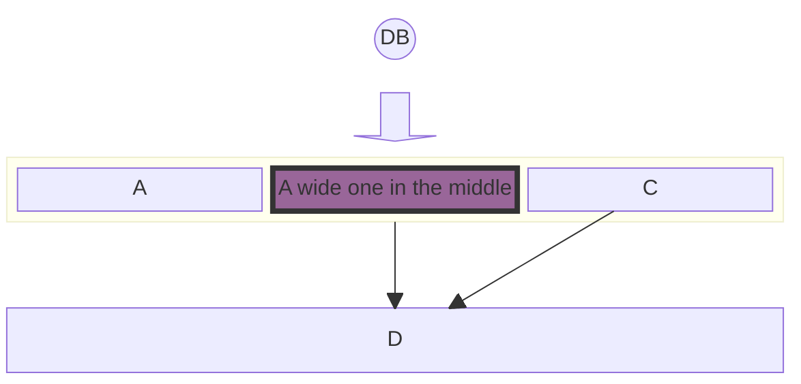
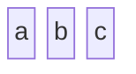
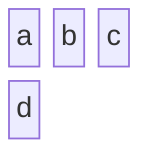
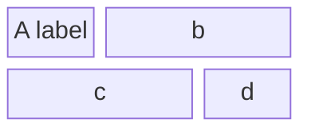
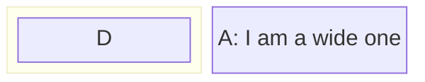
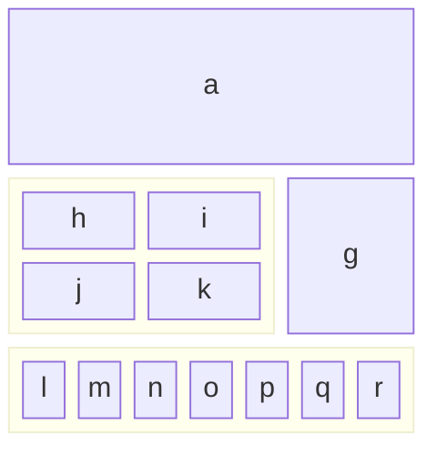
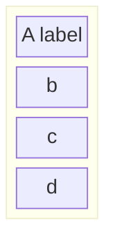
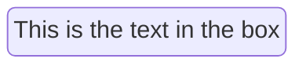
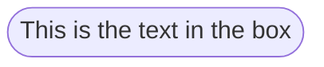
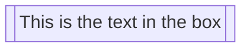

> **Warning**
>
> ## THIS IS AN AUTOGENERATED FILE. DO NOT EDIT.
>
> ## Please edit the corresponding file in [/packages/mermaid/src/docs/syntax/block.md](../../packages/mermaid/src/docs/syntax/block.md).

# Block Diagrams Documentation

## Introduction to Block Diagrams




### Definition and Purpose

Block diagrams are an intuitive and efficient way to represent complex systems, processes, or architectures visually. They are composed of blocks and connectors, where blocks represent the fundamental components or functions, and connectors show the relationship or flow between these components. This method of diagramming is essential in various fields such as engineering, software development, and process management.

The primary purpose of block diagrams is to provide a high-level view of a system, allowing for easy understanding and analysis without delving into the intricate details of each component. This makes them particularly useful for simplifying complex systems and for explaining the overall structure and interaction of components within a system.

Many people use mermaid flowcharts for this purpose. A side-effect of this is that the automatic layout sometimes move shapes to positions that the diagram maker does not want. Block diagrams use a different approach. In this diagram we give the author full control over where the shapes are positioned.

### General Use Cases

Block diagrams have a wide range of applications across various industries and disciplines. Some of the key use cases include:

- **Software Architecture**: In software development, block diagrams can be used to illustrate the architecture of a software application. This includes showing how different modules or services interact, data flow, and high-level component interaction.

- **Network Diagrams**: Block diagrams are ideal for representing network architectures in IT and telecommunications. They can depict how different network devices and services are interconnected, including routers, switches, firewalls, and the flow of data across the network.

- **Process Flowcharts**: In business and manufacturing, block diagrams can be employed to create process flowcharts. These flowcharts represent various stages of a business or manufacturing process, helping to visualize the sequence of steps, decision points, and the flow of control.

- **Electrical Systems**: Engineers use block diagrams to represent electrical systems and circuitry. They can illustrate the high-level structure of an electrical system, the interaction between different electrical components, and the flow of electrical currents.

- **Educational Purposes**: Block diagrams are also extensively used in educational materials to explain complex concepts and systems in a simplified manner. They help in breaking down and visualizing scientific theories, engineering principles, and technological systems.

These examples demonstrate the versatility of block diagrams in providing clear and concise representations of complex systems. Their simplicity and clarity make them a valuable tool for professionals across various fields to communicate complex ideas effectively.

In the following sections, we will delve into the specifics of creating and manipulating block diagrams using Mermaid, covering everything from basic syntax to advanced configurations and styling.

Creating block diagrams with Mermaid is straightforward and accessible. This section introduces the basic syntax and structure needed to start building simple diagrams. Understanding these foundational concepts is key to efficiently utilizing Mermaid for more complex diagramming tasks.

### Simple Block Diagrams

#### Basic Structure

At its core, a block diagram consists of blocks representing different entities or components. In Mermaid, these blocks are easily created using simple text labels. The most basic form of a block diagram can be a series of blocks without any connectors.

**Example - Simple Block Diagram**:
To create a simple block diagram with three blocks labeled 'a', 'b', and 'c', the syntax is as follows:




This example will produce a horizontal sequence of three blocks. Each block is automatically spaced and aligned for optimal readability.

### Defining the number of columns to use

#### Column Usage

While simple block diagrams are linear and straightforward, more complex systems may require a structured layout. Mermaid allows for the organization of blocks into multiple columns, facilitating the creation of more intricate and detailed diagrams.

**Example - Multi-Column Diagram:**
In scenarios where you need to distribute blocks across multiple columns, you can specify the number of columns and arrange the blocks accordingly. Here's how to create a block diagram with three columns and four blocks, where the fourth block appears in a second row:




This syntax instructs Mermaid to arrange the blocks 'a', 'b', 'c', and 'd' across three columns, wrapping to the next row as needed. This feature is particularly useful for representing layered or multi-tiered systems, such as network layers or hierarchical structures.

These basic building blocks of Mermaid's block diagrams provide a foundation for more complex diagramming. The simplicity of the syntax allows for quick creation and iteration of diagrams, making it an efficient tool for visualizing ideas and concepts. In the next section, we'll explore advanced block configuration options, including setting block widths and creating composite blocks.

## 3. Advanced Block Configuration

Building upon the basics, this section delves into more advanced features of block diagramming in Mermaid. These features allow for greater flexibility and complexity in diagram design, accommodating a wider range of use cases and scenarios.

### Setting Block Width

#### Spanning Multiple Columns

In more complex diagrams, you may need blocks that span multiple columns to emphasize certain components or to represent larger entities. Mermaid allows for the adjustment of block widths to cover multiple columns, enhancing the diagram's readability and structure.

**Example - Block Spanning Multiple Columns**:
To create a block diagram where one block spans across two columns, you can specify the desired width for each block:




In this example, the block labeled "A labels" spans one column, while blocks 'b', 'c' span 2 columns, and 'd' is again allocated its own column. This flexibility in block sizing is crucial for accurately representing systems with components of varying significance or size.

### Creating Composite Blocks

#### Nested Blocks

Composite blocks, or blocks within blocks, are an advanced feature in Mermaid's block diagram syntax. They allow for the representation of nested or hierarchical systems, where one component encompasses several subcomponents.

**Example - Composite Blocks:**
Creating a composite block involves defining a parent block and then nesting other blocks within it. Here's how to define a composite block with nested elements:




In this syntax, 'D' is a nested block within a larger parent block. This feature is particularly useful for depicting complex structures, such as a server with multiple services or a department within a larger organizational framework.

### Column Width Dynamics

#### Adjusting Widths

Mermaid also allows for dynamic adjustment of column widths based on the content of the blocks. The width of the columns is determined by the widest block in the column, ensuring that the diagram remains balanced and readable.

**Example - Dynamic Column Widths:**
In diagrams with varying block sizes, Mermaid automatically adjusts the column widths to fit the largest block in each column. Here's an example:




This example demonstrates how Mermaid dynamically adjusts the width of the columns to accommodate the widest block, in this case, 'a' and the composite block 'e'. This dynamic adjustment is essential for creating visually balanced and easy-to-understand diagrams.

**Merging Blocks Horizontally:**
In scenarios where you need to stack blocks horizontally, you can use column width to accomplish the task. Blocks can be arranged vertically by putting them in a single column. Here is how you can create a block diagram in which 4 blocks are stacked on top of each other:




In this example, the width of the merged block dynamically adjusts to the width of the largest child block.

With these advanced configuration options, Mermaid's block diagrams can be tailored to represent a wide array of complex systems and structures. The flexibility offered by these features enables users to create diagrams that are both informative and visually appealing. In the following sections, we will explore further capabilities, including different block shapes and linking options.

## 4. Block Varieties and Shapes

Mermaid's block diagrams are not limited to standard rectangular shapes. A variety of block shapes are available, allowing for a more nuanced and tailored representation of different types of information or entities. This section outlines the different block shapes you can use in Mermaid and their specific applications.

### Standard and Special Block Shapes

Mermaid supports a range of block shapes to suit different diagramming needs, from basic geometric shapes to more specialized forms.

#### Example - Round Edged Block

To create a block with round edges, which can be used to represent a softer or more flexible component:




#### Example - Stadium-Shaped Block

A stadium-shaped block, resembling an elongated circle, can be used for components that are process-oriented:




#### Example - Subroutine Shape

For representing subroutines or contained processes, a block with double vertical lines is useful:




#### Example - Cylindrical Shape

The cylindrical shape is ideal for representing databases or storage components:

```mermaid-example
block-beta
    id1[("Database")]
```

```mermaid
block-beta
    id1[("Database")]
```

#### Example - Circle Shape

A circle can be used for centralized or pivotal components:

```mermaid-example
block-beta
    id1(("This is the text in the circle"))
```

```mermaid
block-beta
    id1(("This is the text in the circle"))
```

#### Example - Asymmetric, Rhombus, and Hexagon Shapes

For decision points, use a rhombus, and for unique or specialized processes, asymmetric and hexagon shapes can be utilized:

**Asymmetric**

```mermaid-example
block-beta
  id1>"This is the text in the box"]
```

```mermaid
block-beta
  id1>"This is the text in the box"]
```

**Rhombus**

```mermaid-example
block-beta
    id1{"This is the text in the box"}
```

```mermaid
block-beta
    id1{"This is the text in the box"}
```

**Hexagon**

```mermaid-example
block-beta
    id1{{"This is the text in the box"}}
```

```mermaid
block-beta
    id1{{"This is the text in the box"}}
```

#### Example - Parallelogram and Trapezoid Shapes

Parallelogram and trapezoid shapes are perfect for inputs/outputs and transitional processes:

```mermaid-example
block-beta
  id1[/"This is the text in the box"/]
  id2[\"This is the text in the box"\]
  A[/"Christmas"\]
  B[\"Go shopping"/]
```

```mermaid
block-beta
  id1[/"This is the text in the box"/]
  id2[\"This is the text in the box"\]
  A[/"Christmas"\]
  B[\"Go shopping"/]
```

#### Example - Double Circle

For highlighting critical or high-priority components, a double circle can be effective:

```mermaid-example
block-beta
    id1((("This is the text in the circle")))
```

```mermaid
block-beta
    id1((("This is the text in the circle")))
```

### Block Arrows and Space Blocks

Mermaid also offers unique shapes like block arrows and space blocks for directional flow and spacing.

#### Example - Block Arrows

Block arrows can visually indicate direction or flow within a process:

```mermaid-example
block-beta
  blockArrowId<["Label"]>(right)
  blockArrowId2<["Label"]>(left)
  blockArrowId3<["Label"]>(up)
  blockArrowId4<["Label"]>(down)
  blockArrowId5<["Label"]>(x)
  blockArrowId6<["Label"]>(y)
  blockArrowId6<["Label"]>(x, down)
```

```mermaid
block-beta
  blockArrowId<["Label"]>(right)
  blockArrowId2<["Label"]>(left)
  blockArrowId3<["Label"]>(up)
  blockArrowId4<["Label"]>(down)
  blockArrowId5<["Label"]>(x)
  blockArrowId6<["Label"]>(y)
  blockArrowId6<["Label"]>(x, down)
```

#### Example - Space Blocks

Space blocks can be used to create intentional empty spaces in the diagram, which is useful for layout and readability:

```mermaid-example
block-beta
  columns 3
  a space b
  c   d   e
```

```mermaid
block-beta
  columns 3
  a space b
  c   d   e
```

or

```mermaid-example
block-beta
  ida space:3 idb idc
```

```mermaid
block-beta
  ida space:3 idb idc
```

Note that you can set how many columns the space block occupied using the number notation `space:num` where num is a number indicating the num columns width. You can also use `space` which defaults to one column.

The variety of shapes and special blocks in Mermaid enhances the expressive power of block diagrams, allowing for more accurate and context-specific representations. These options give users the flexibility to create diagrams that are both informative and visually appealing. In the next sections, we will explore the ways to connect these blocks and customize their appearance.

### Standard and Special Block Shapes

Discuss the various shapes available for blocks, including standard shapes and special forms like block arrows and space blocks.

## 5. Connecting Blocks with Edges

One of the key features of block diagrams in Mermaid is the ability to connect blocks using various types of edges or links. This section explores the different ways blocks can be interconnected to represent relationships and flows between components.

### Basic Linking and Arrow Types

The most fundamental aspect of connecting blocks is the use of arrows or links. These connectors depict the relationships or the flow of information between the blocks. Mermaid offers a range of arrow types to suit different diagramming needs.

**Example - Basic Links**

A simple link with an arrow can be created to show direction or flow from one block to another:

```mermaid-example
block-beta
  A space B
  A-->B
```

```mermaid
block-beta
  A space B
  A-->B
```

This example illustrates a direct connection from block 'A' to block 'B', using a straightforward arrow.

This syntax creates a line connecting 'A' and 'B', implying a relationship or connection without indicating a specific direction.

### Text on Links

In addition to connecting blocks, it's often necessary to describe or label the relationship. Mermaid allows for the inclusion of text on links, providing context to the connections.

Example - Text with Links
To add text to a link, the syntax includes the text within the link definition:

```mermaid-example
block-beta
  A space:2 B
  A-- "X" -->B
```

```mermaid
block-beta
  A space:2 B
  A-- "X" -->B
```

This example show how to add descriptive text to the links, enhancing the information conveyed by the diagram.

Example - Edges and Styles:

```mermaid-example
block-beta
columns 1
  db(("DB"))
  blockArrowId6<["&nbsp;&nbsp;&nbsp;"]>(down)
  block:ID
    A
    B["A wide one in the middle"]
    C
  end
  space
  D
  ID --> D
  C --> D
  style B fill:#939,stroke:#333,stroke-width:4px
```

```mermaid
block-beta
columns 1
  db(("DB"))
  blockArrowId6<["&nbsp;&nbsp;&nbsp;"]>(down)
  block:ID
    A
    B["A wide one in the middle"]
    C
  end
  space
  D
  ID --> D
  C --> D
  style B fill:#939,stroke:#333,stroke-width:4px
```

## 6. Styling and Customization

Beyond the structure and layout of block diagrams, Mermaid offers extensive styling options. These customization features allow for the creation of more visually distinctive and informative diagrams. This section covers how to apply individual styles to blocks and how to use classes for consistent styling across multiple elements.

### Individual Block Styling

Mermaid enables detailed styling of individual blocks, allowing you to apply various CSS properties such as color, stroke, and border thickness. This feature is especially useful for highlighting specific parts of a diagram or for adhering to certain visual themes.

#### Example - Styling a Single Block

To apply custom styles to a block, you can use the `style` keyword followed by the block identifier and the desired CSS properties:

```mermaid-example
block-beta
  id1 space id2
  id1("Start")-->id2("Stop")
  style id1 fill:#636,stroke:#333,stroke-width:4px
  style id2 fill:#bbf,stroke:#f66,stroke-width:2px,color:#fff,stroke-dasharray: 5 5
```

```mermaid
block-beta
  id1 space id2
  id1("Start")-->id2("Stop")
  style id1 fill:#636,stroke:#333,stroke-width:4px
  style id2 fill:#bbf,stroke:#f66,stroke-width:2px,color:#fff,stroke-dasharray: 5 5
```

### Class Styling

Mermaid enables applying styling to classes, which could make styling easier if you want to apply a certain set of styles to multiple elements, as you could just link those elements to a class.

#### Example - Styling a Single Class

```mermaid-example
block-beta
  A space B
  A-->B
  classDef blue fill:#6e6ce6,stroke:#333,stroke-width:4px;
  class A blue
  style B fill:#bbf,stroke:#f66,stroke-width:2px,color:#fff,stroke-dasharray: 5 5
```

```mermaid
block-beta
  A space B
  A-->B
  classDef blue fill:#6e6ce6,stroke:#333,stroke-width:4px;
  class A blue
  style B fill:#bbf,stroke:#f66,stroke-width:2px,color:#fff,stroke-dasharray: 5 5
```

In this example, a class named 'blue' is defined and applied to block 'A', while block 'B' receives individual styling. This demonstrates the flexibility of Mermaid in applying both shared and unique styles within the same diagram.

The ability to style blocks individually or through classes provides a powerful tool for enhancing the visual impact and clarity of block diagrams. Whether emphasizing certain elements or maintaining a cohesive design across the diagram, these styling capabilities are central to effective diagramming. The next sections will present practical examples and use cases, followed by tips for troubleshooting common issues.

### 7. Practical Examples and Use Cases

The versatility of Mermaid's block diagrams becomes evident when applied to real-world scenarios. This section provides practical examples demonstrating the application of various features discussed in previous sections. These examples showcase how block diagrams can be used to represent complex systems and processes in an accessible and informative manner.

### Detailed Examples Illustrating Various Features

Combining the elements of structure, linking, and styling, we can create comprehensive diagrams that serve specific purposes in different contexts.

#### Example - System Architecture

Illustrating a simple software system architecture with interconnected components:

```mermaid-example
block-beta
  columns 3
  Frontend blockArrowId6<[" "]>(right) Backend
  space:2 down<[" "]>(down)
  Disk left<[" "]>(left) Database[("Database")]

  classDef front fill:#696,stroke:#333;
  classDef back fill:#969,stroke:#333;
  class Frontend front
  class Backend,Database back
```

```mermaid
block-beta
  columns 3
  Frontend blockArrowId6<[" "]>(right) Backend
  space:2 down<[" "]>(down)
  Disk left<[" "]>(left) Database[("Database")]

  classDef front fill:#696,stroke:#333;
  classDef back fill:#969,stroke:#333;
  class Frontend front
  class Backend,Database back
```

This example shows a basic architecture with a frontend, backend, and database. The blocks are styled to differentiate between types of components.

#### Example - Business Process Flow

Representing a business process flow with decision points and multiple stages:

```mermaid-example
block-beta
  columns 3
  Start(("Start")) space:2
  down<[" "]>(down) space:2
  Decision{{"Make Decision"}} right<["Yes"]>(right) Process1["Process A"]
  downAgain<["No"]>(down) space r3<["Done"]>(down)
  Process2["Process B"] r2<["Done"]>(right) End(("End"))

  style Start fill:#969;
  style End fill:#696;
```

```mermaid
block-beta
  columns 3
  Start(("Start")) space:2
  down<[" "]>(down) space:2
  Decision{{"Make Decision"}} right<["Yes"]>(right) Process1["Process A"]
  downAgain<["No"]>(down) space r3<["Done"]>(down)
  Process2["Process B"] r2<["Done"]>(right) End(("End"))

  style Start fill:#969;
  style End fill:#696;
```

These practical examples and scenarios underscore the utility of Mermaid block diagrams in simplifying and effectively communicating complex information across various domains.

The next section, 'Troubleshooting and Common Issues', will provide insights into resolving common challenges encountered when working with Mermaid block diagrams, ensuring a smooth diagramming experience.

## 8. Troubleshooting and Common Issues

Working with Mermaid block diagrams can sometimes present challenges, especially as the complexity of the diagrams increases. This section aims to provide guidance on resolving common issues and offers tips for managing more intricate diagram structures.

### Common Syntax Errors

Understanding and avoiding common syntax errors is key to a smooth experience with Mermaid diagrams.

#### Example - Incorrect Linking

A common mistake is incorrect linking syntax, which can lead to unexpected results or broken diagrams:

```
block-beta
  A - B
```

**Correction**:
Ensure that links between blocks are correctly specified with arrows (--> or ---) to define the direction and type of connection. Also remember that one of the fundamentals for block diagram is to give the author full control of where the boxes are positioned so in the example you need to add a space between the boxes:

```mermaid-example
block-beta
  A space B
  A --> B
```

```mermaid
block-beta
  A space B
  A --> B
```

#### Example - Misplaced Styling

Applying styles in the wrong context or with incorrect syntax can lead to blocks not being styled as intended:

```mermaid-example
  block-beta
    A
    style A fill#969;
```

```mermaid
  block-beta
    A
    style A fill#969;
```

**Correction:**
Correct the syntax by ensuring proper separation of style properties with commas and using the correct CSS property format:

```mermaid-example
block-beta
  A
  style A fill:#969,stroke:#333;

```

```mermaid
block-beta
  A
  style A fill:#969,stroke:#333;

```

### Tips for Complex Diagram Structures

Managing complexity in Mermaid diagrams involves planning and employing best practices.

#### Modular Design

Break down complex diagrams into smaller, more manageable components. This approach not only makes the diagram easier to understand but also simplifies the creation and maintenance process.

#### Consistent Styling

Use classes to maintain consistent styling across similar elements. This not only saves time but also ensures a cohesive and professional appearance.

#### Comments and Documentation

Use comments with `%%` within the Mermaid syntax to document the purpose of various parts of the diagram. This practice is invaluable for maintaining clarity, especially when working in teams or returning to a diagram after some time.

With these troubleshooting tips and best practices, you can effectively manage and resolve common issues in Mermaid block diagrams. The final section, 'Conclusion', will summarize the key points covered in this documentation and invite user feedback for continuous improvement.
