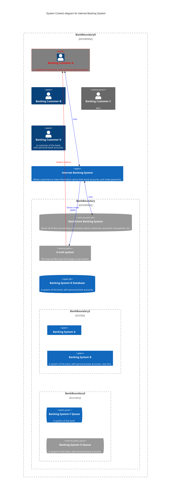
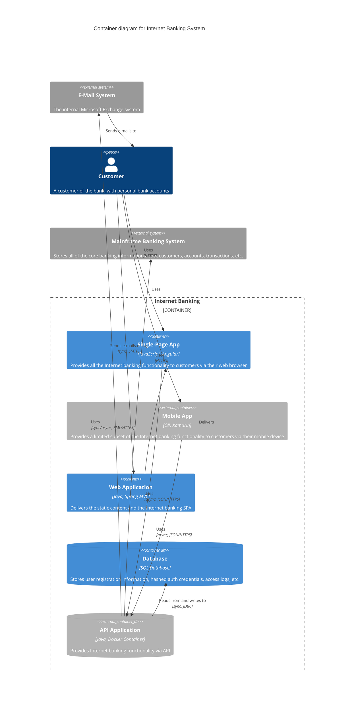
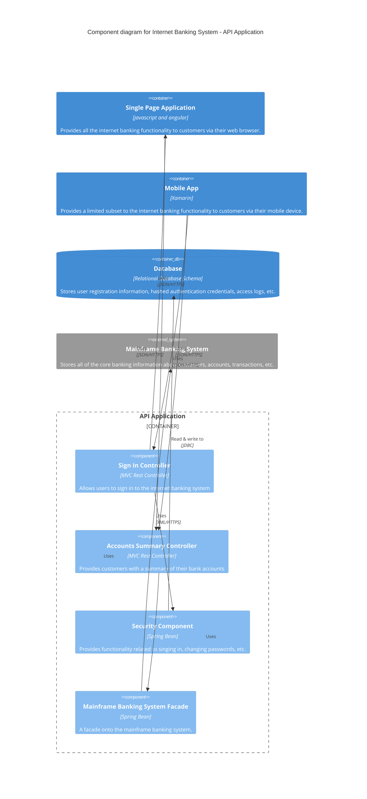
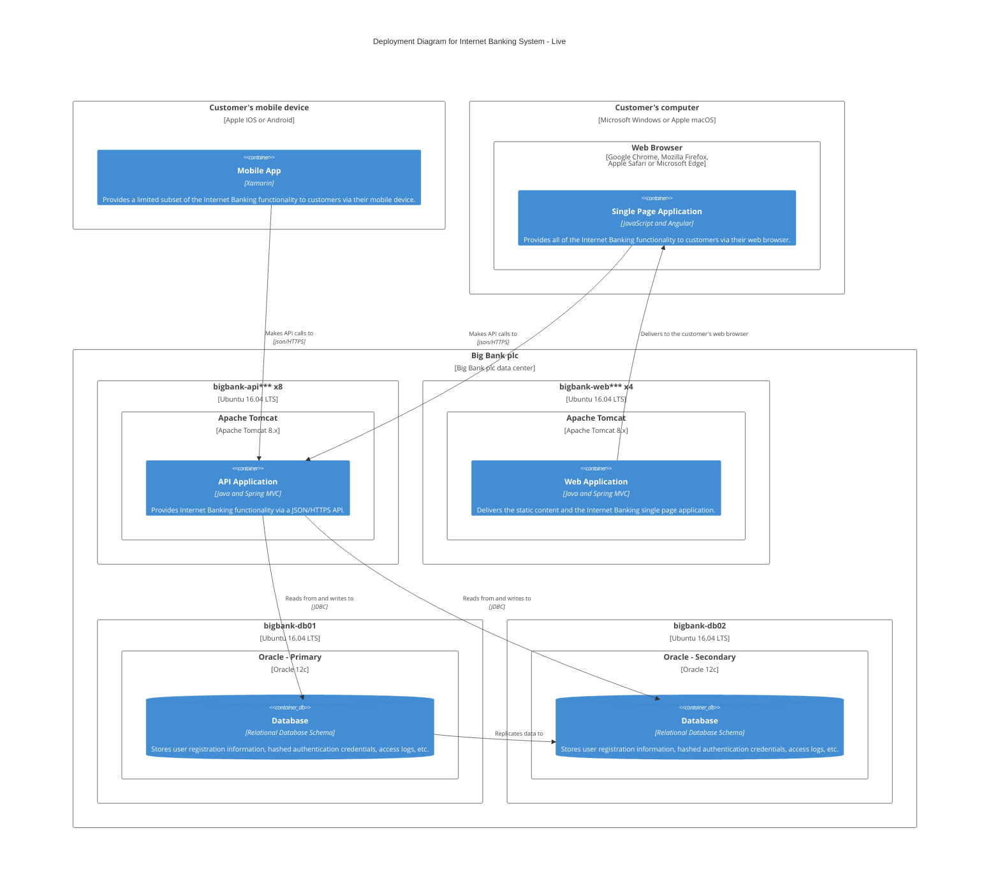

> **Warning**
>
> ## THIS IS AN AUTOGENERATED FILE. DO NOT EDIT.
>
> ## Please edit the corresponding file in [/packages/mermaid/src/docs/syntax/c4.md](../../packages/mermaid/src/docs/syntax/c4.md).

# C4 Diagrams

> C4 Diagram: This is an experimental diagram for now. The syntax and properties can change in future releases. Proper documentation will be provided when the syntax is stable.

Mermaid's C4 diagram syntax is compatible with plantUML. See example below:




For an example, see the source code demos/index.html

5 types of C4 charts are supported.

- System Context (C4Context)
- Container diagram (C4Container)
- Component diagram (C4Component)
- Dynamic diagram (C4Dynamic)
- Deployment diagram (C4Deployment)

Please refer to the linked document [C4-PlantUML syntax](https://github.com/plantuml-stdlib/C4-PlantUML/blob/master/README.md) for how to write the C4 diagram.

C4 diagram is fixed style, such as css color, so different css is not provided under different skins.
updateElementStyle and UpdateElementStyle are written in the diagram last part. updateElementStyle is inconsistent with the original definition and updates the style of the relationship, including the offset of the text label relative to the original position.

The layout does not use a fully automated layout algorithm. The position of shapes is adjusted by changing the order in which statements are written. So there is no plan to support the following Layout statements.
The number of shapes per row and the number of boundaries can be adjusted using UpdateLayoutConfig.

- Layout
  - Lay_U, Lay_Up
  - Lay_D, Lay_Down
  - Lay_L, Lay_Left
  - Lay_R, Lay_Right

The following unfinished features are not supported in the short term.

- [ ] sprite

- [ ] tags

- [ ] link

- [ ] Legend

- [x] System Context

  - [x] Person(alias, label, ?descr, ?sprite, ?tags, $link)
  - [x] Person_Ext
  - [x] System(alias, label, ?descr, ?sprite, ?tags, $link)
  - [x] SystemDb
  - [x] SystemQueue
  - [x] System_Ext
  - [x] SystemDb_Ext
  - [x] SystemQueue_Ext
  - [x] Boundary(alias, label, ?type, ?tags, $link)
  - [x] Enterprise_Boundary(alias, label, ?tags, $link)
  - [x] System_Boundary

- [x] Container diagram

  - [x] Container(alias, label, ?techn, ?descr, ?sprite, ?tags, $link)
  - [x] ContainerDb
  - [x] ContainerQueue
  - [x] Container_Ext
  - [x] ContainerDb_Ext
  - [x] ContainerQueue_Ext
  - [x] Container_Boundary(alias, label, ?tags, $link)

- [x] Component diagram

  - [x] Component(alias, label, ?techn, ?descr, ?sprite, ?tags, $link)
  - [x] ComponentDb
  - [x] ComponentQueue
  - [x] Component_Ext
  - [x] ComponentDb_Ext
  - [x] ComponentQueue_Ext

- [x] Dynamic diagram

  - [x] RelIndex(index, from, to, label, ?tags, $link)

- [x] Deployment diagram

  - [x] Deployment_Node(alias, label, ?type, ?descr, ?sprite, ?tags, $link)
  - [x] Node(alias, label, ?type, ?descr, ?sprite, ?tags, $link): short name of Deployment_Node()
  - [x] Node_L(alias, label, ?type, ?descr, ?sprite, ?tags, $link): left aligned Node()
  - [x] Node_R(alias, label, ?type, ?descr, ?sprite, ?tags, $link): right aligned Node()

- [x] Relationship Types

  - [x] Rel(from, to, label, ?techn, ?descr, ?sprite, ?tags, $link)
  - [x] BiRel (bidirectional relationship)
  - [x] Rel_U, Rel_Up
  - [x] Rel_D, Rel_Down
  - [x] Rel_L, Rel_Left
  - [x] Rel_R, Rel_Right
  - [x] Rel_Back
  - [x] RelIndex \* Compatible with C4-PlantUML syntax, but ignores the index parameter. The sequence number is determined by the order in which the rel statements are written.

- [ ] Custom tags/stereotypes support and skin param updates
  - [ ] AddElementTag(tagStereo, ?bgColor, ?fontColor, ?borderColor, ?shadowing, ?shape, ?sprite, ?techn, ?legendText, ?legendSprite): Introduces a new element tag. The styles of the tagged elements are updated and the tag is displayed in the calculated legend.
  - [ ] AddRelTag(tagStereo, ?textColor, ?lineColor, ?lineStyle, ?sprite, ?techn, ?legendText, ?legendSprite): Introduces a new Relationship tag. The styles of the tagged relationships are updated and the tag is displayed in the calculated legend.
  - [x] UpdateElementStyle(elementName, ?bgColor, ?fontColor, ?borderColor, ?shadowing, ?shape, ?sprite, ?techn, ?legendText, ?legendSprite): This call updates the default style of the elements (component, ...) and creates no additional legend entry.
  - [x] UpdateRelStyle(from, to, ?textColor, ?lineColor, ?offsetX, ?offsetY): This call updates the default relationship colors and creates no additional legend entry. Two new parameters, offsetX and offsetY, are added to set the offset of the original position of the text.
  - [ ] RoundedBoxShape(): This call returns the name of the rounded box shape and can be used as ?shape argument.
  - [ ] EightSidedShape(): This call returns the name of the eight sided shape and can be used as ?shape argument.
  - [ ] DashedLine(): This call returns the name of the dashed line and can be used as ?lineStyle argument.
  - [ ] DottedLine(): This call returns the name of the dotted line and can be used as ?lineStyle argument.
  - [ ] BoldLine(): This call returns the name of the bold line and can be used as ?lineStyle argument.
  - [x] UpdateLayoutConfig(?c4ShapeInRow, ?c4BoundaryInRow): New. This call updates the default c4ShapeInRow(4) and c4BoundaryInRow(2).

There are two ways to assign parameters with question marks. One uses the non-named parameter assignment method in the order of the parameters, and the other uses the named parameter assignment method, where the name must start with a $ symbol.

Example: UpdateRelStyle(from, to, ?textColor, ?lineColor, ?offsetX, ?offsetY)

```
UpdateRelStyle(customerA, bankA, "red", "blue", "-40", "60")
UpdateRelStyle(customerA, bankA, $offsetX="-40", $offsetY="60", $lineColor="blue", $textColor="red")
UpdateRelStyle(customerA, bankA, $offsetY="60")

```

## C4 System Context Diagram (C4Context)


## C4 Container diagram (C4Container)




## C4 Component diagram (C4Component)




## C4 Dynamic diagram (C4Dynamic)


## C4 Deployment diagram (C4Deployment)




<!--- cspell:ignore bigbank bigbankdb techn mbsfacade  --->
