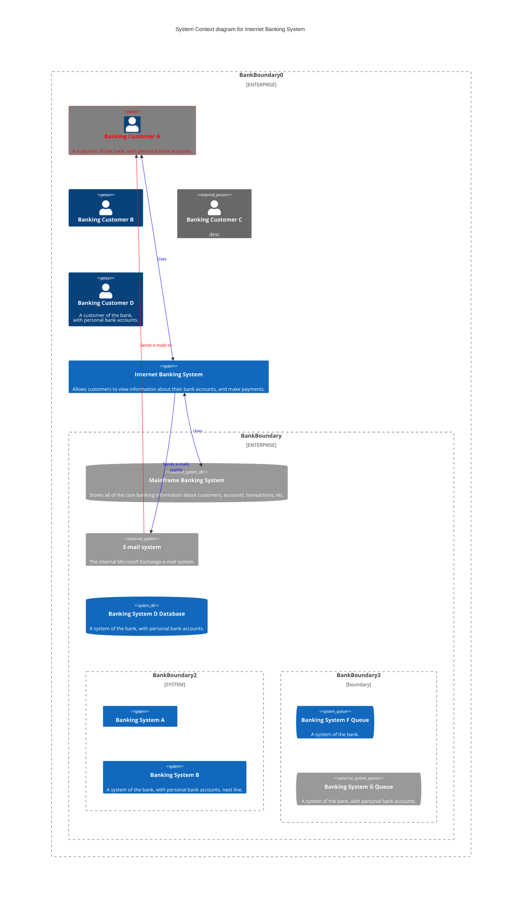
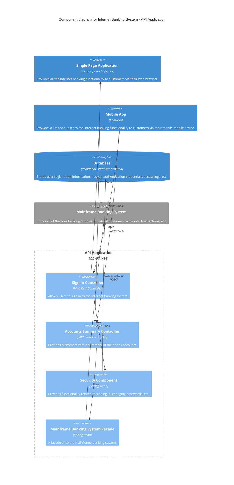
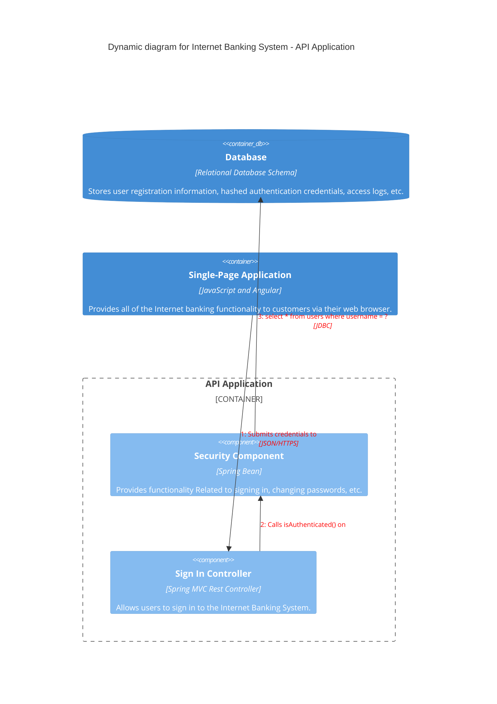

> **Warning**
>
> ## THIS IS AN AUTOGENERATED FILE. DO NOT EDIT.
>
> ## Please edit the corresponding file in [/packages/mermaid/src/docs/syntax/c4.md](../../packages/mermaid/src/docs/syntax/c4.md).

# C4 Diagrams

> The C4 diagram syntax is inspired by and mostly compatible with PlantUML. Please refer to the linked document [C4-PlantUML syntax](https://github.com/plantuml-stdlib/C4-PlantUML/blob/master/README.md) for further information on how to write a C4 diagram. For examples, see the source code demos/index.html.

5 types of C4 diagrams are supported so a C4 diagram can either be declared as:

- C4Context (System Context)
- C4Container (Container diagram)
- C4Component (Component diagram)
- C4Dynamic (Dynamic diagram)
- C4Deployment (Deployment diagram)

> Note: This is just semantics used for organization and doesn't have an effect on the actual diagram as all statements are usable across all C4 diagram types.

## Diagram Macros

Below are the supported C4 diagram macros with a short description for each. Optional parameters are signified by question marks. There are two ways to assign optional parameters. One uses the non-named parameter assignment method in the order of the parameters, and the other uses the named parameter assignment method, where the name must start with a $ symbol. If there is not a question mark it is a required parameter and will be filled first.

Example: UpdateRelStyle(from, to, ?textColor, ?lineColor)

```
UpdateRelStyle(customerA, bankA, "red", "blue")
UpdateRelStyle(customerA, bankA, $lineColor="blue", $textColor="red")
UpdateRelStyle(customerA, bankA, $lineColor="green")
```

### **Elements**

#### _System Context_

- **Person(alias, label, ?descr, ?sprite, ?tags, ?link)**\
  _Defines a person in the system context. The alias uniquely identifies the person; label is the display name; descr is an optional description; sprite sets the icon; tags add styling; link creates a hyperlink._

- **Person_Ext**\
  _Defines an external person, used to indicate individuals external to the system._

- **System(alias, label, ?descr, ?sprite, ?tags, ?link)**\
  _Defines a system; alias provides a unique identifier while label is the displayed name. Additional parameters add description, icon, styling, and hyperlink support._

- **SystemDb**\
  _Defines a database system. Inherits common system parameters while indicating a data storage system._

- **SystemQueue**\
  _Represents a messaging or queue system used within the context._

- **System_Ext**\
  _Represents an external system that interacts with the main system but is maintained externally._

- **SystemDb_Ext**\
  _Represents an external database system._

- **SystemQueue_Ext**\
  _Represents an external messaging/queue system._

- **Boundary(alias, label, ?type, ?tags, ?link)**\
  _Defines a boundary element to group related systems or elements. The optional type distinguishes the boundary's nature._

- **Enterprise_Boundary(alias, label, ?tags, ?link)**\
  _Represents a high-level boundary that encompasses multiple systems within an enterprise._

- **System_Boundary**\
  _Specifies a boundary around one or more systems within a specific context._

#### _Container_

- **Container(alias, label, ?techn, ?descr, ?sprite, ?tags, ?link)**\
  _Defines a container, such as an application or service. Includes parameters for technology, description, optional sprite, tags, and hyperlink._

- **ContainerDb**\
  _Represents a container that is a database._

- **ContainerQueue**\
  _Represents a container that provides messaging or queuing capabilities._

- **Container_Ext**\
  _Represents an external container that resides outside the primary system._

- **ContainerDb_Ext**\
  _Represents an external database container._

- **ContainerQueue_Ext**\
  _Represents an external messaging/queue container._

- **Container_Boundary(alias, label, ?tags, ?link)**\
  _Defines a boundary specific to containers, useful for grouping similar container elements._

#### _Component_

- **Component(alias, label, ?techn, ?descr, ?sprite, ?tags, ?link)**\
  _Defines a component within a container, including details such as technical information, description, and optional icon or hyperlink._

- **ComponentDb**\
  _Represents a component that functions as a database within a container._

- **ComponentQueue**\
  _Represents a component that handles messaging or queuing functions._

- **Component_Ext**\
  _Represents an external component or service within the system._

- **ComponentDb_Ext**\
  _Represents an external database component._

- **ComponentQueue_Ext**\
  _Represents an external component for messaging or queuing._

#### _Deployment_

- **Deployment_Node(alias, label, ?type, ?descr, ?sprite, ?tags, ?link)**\
  _Defines a deployment node, typically representing a server, environment, or infrastructure in a deployment diagram._

- **Node(alias, label, ?type, ?descr, ?sprite, ?tags, ?link)**\
  _A shortened form of Deployment_Node() used for brevity in diagrams._

### **Relationships**

- **Rel(from, to, label, ?techn, ?descr, ?sprite, ?tags, ?link)**\
  _Defines a directed relationship between two elements. Optional parameters support technology, description, icons, tags, and hyperlinks._

- **BiRel**\
  _Represents a bidirectional relationship between elements, indicating a two-way association._

### **Tags**

- **AddElementTag(tagStereo, ?bgColor, ?fontColor, ?borderColor, ?shadowing, ?shape, ?sprite, ?techn, ?legendText, ?legendSprite, ?borderStyle, ?borderThickness)**\
  _Associates styling and other attributes to an element using a tag. Properties include colors, shadow, shape, and legend details._

- **AddRelTag(tagStereo, ?textColor, ?lineColor, ?lineStyle, ?sprite, ?techn, ?legendText, ?legendSprite, ?lineThickness)**\
  _Associates styling attributes to a relationship through a tag, including text color, line colors, styles, and legend details._

### **Styles**

- **UpdateElementStyle(elementName, ?bgColor, ?fontColor, ?borderColor, ?shadowing, ?shape, ?sprite, ?techn, ?legendText, ?legendSprite)**\
  _Updates the styling of an element, allowing modification of background, font, border, shadow, shape, and legend properties._

- **UpdateRelStyle(from, to, ?textColor, ?lineColor, ?offsetX, ?offsetY)**\
  _Updates the style of a relationship by setting new text and line colors._

### **Legend**

- **SHOW_LEGEND()**\
  _Displays the legend on the diagram, which details the meaning of various tags and styles._

- **UPDATE_LEGEND_TITLE(legendTitle)**\
  _Updates the title text of the diagram’s legend._

### **Other**

- **RoundedBoxShape()**\
  _Returns the identifier for the rounded box shape. This value can be used as the ?shape argument for elements needing rounded corners._

- **EightSidedShape()**\
  _Returns the identifier for an eight-sided shape, suitable as a value for the ?shape argument._

- **DashedLine()**\
  _Returns the identifier for a dashed line style, used as a value for the ?lineStyle argument in relationships._

- **DottedLine()**\
  _Returns the identifier for a dotted line style, used as a value for the ?lineStyle argument in relationships._

- **BoldLine()**\
  _Returns the identifier for a bold line style, used as a value for the ?lineStyle argument in relationships._

- **SolidLine()**\
  _Returns the identifier for a solid line style, used as a value for the ?lineStyle argument in relationships._

### **Deprecated Macros**

Below are special cases of macros or parts of macros that are still supported in the syntax, but no longer have an effect on the diagram (mostly due to improvements in the layout algorithm):

- **RelIndex(index, from, to, label, ?tags, $link)**

- **Node_L(alias, label, ?type, ?descr, ?sprite, ?tags, $link)**

- **Node_R(alias, label, ?type, ?descr, ?sprite, ?tags, $link)**

- **Rel_U**

- **Rel_D**

- **Rel_L**

- **Rel_R**

- **Rel_Back**

- **UpdateLayoutConfig(?c4ShapeInRow, ?c4BoundaryInRow)**

- **?offsetX and ?offsetY**

## Tags

Tags are used to define a general arrangement of styles as well as other properties that elements and relationships can inherit from. Element tags and relationship tags are bindable to their respective counterparts. If you would like to assign multiple tags to an element or relationship you can separate them using a '+'.

Example:

```mermaid-example
C4Context

Person(customerA, "Banking Customer A", "A customer of the bank, with personal bank accounts.", $tags="myFirstElementTag+mySecondElementTag", $link="https://www.google.com", $sprite="person")
Person(customerB, "Banking Customer B", $tags="myFirstElementTag")
BiRel(customerA, customerB, "", $tags="myRelTag")
AddElementTag(myFirstElementTag, red, green, yellow, true, $shape="RoundedBoxShape()", database, techn, as, legendSprite, SolidLine(), "10")
AddElementTag(mySecondElementTag, blue, green, red, true, $shape="RoundedBoxShape()", database, techn, as, legendSprite, SolidLine(), "10")
AddRelTag(myRelTag, $lineStyle="DottedLine()", $lineColor="blue")
```

```mermaid
C4Context

Person(customerA, "Banking Customer A", "A customer of the bank, with personal bank accounts.", $tags="myFirstElementTag+mySecondElementTag", $link="https://www.google.com", $sprite="person")
Person(customerB, "Banking Customer B", $tags="myFirstElementTag")
BiRel(customerA, customerB, "", $tags="myRelTag")
AddElementTag(myFirstElementTag, red, green, yellow, true, $shape="RoundedBoxShape()", database, techn, as, legendSprite, SolidLine(), "10")
AddElementTag(mySecondElementTag, blue, green, red, true, $shape="RoundedBoxShape()", database, techn, as, legendSprite, SolidLine(), "10")
AddRelTag(myRelTag, $lineStyle="DottedLine()", $lineColor="blue")
```

## Legend

The legend lists all of the tags defined in the diagram and any elements that have a defined legendText. Legend items will inherit their respective styles and their associated sprites. If there is no sprite a line will be shown for relationships and an empty box will be shown for nodes. The legend can be turned on by the "SHOW_LEGEND()" macro and will appear in the bottom left of the diagram. The legend title can be updated by the "UPDATE_LEGEND_TITLE(legendTitle)" macro.

```mermaid-example
C4Context

Person(customerA, "Banking Customer A", "A customer of the bank, with personal bank accounts.", $tags="myFirstElementTag+mySecondElementTag", $link="https://www.google.com", $sprite="person")
Person(customerB, "Banking Customer B", $tags="mySecondElementTag")
BiRel(customerA, customerB, "", $tags="myRelTag")
AddElementTag(myFirstElementTag, red, green, yellow, true, $shape="RoundedBoxShape()", database, techn, as, legendSprite, SolidLine(), "10")
AddElementTag(mySecondElementTag, red, green, yellow, true, $shape="RoundedBoxShape()", database, techn, as, legendSprite, SolidLine(), "10")
AddRelTag(myRelTag, $lineStyle="DottedLine()", $lineColor="blue")
UpdateElementStyle(customerA, $fontColor="white", $bgColor="grey", $borderColor="red", $legendText="Customer A", $legendSprite="person")
SHOW_LEGEND()
UPDATE_LEGEND_TITLE("My Legend")
```

```mermaid
C4Context

Person(customerA, "Banking Customer A", "A customer of the bank, with personal bank accounts.", $tags="myFirstElementTag+mySecondElementTag", $link="https://www.google.com", $sprite="person")
Person(customerB, "Banking Customer B", $tags="mySecondElementTag")
BiRel(customerA, customerB, "", $tags="myRelTag")
AddElementTag(myFirstElementTag, red, green, yellow, true, $shape="RoundedBoxShape()", database, techn, as, legendSprite, SolidLine(), "10")
AddElementTag(mySecondElementTag, red, green, yellow, true, $shape="RoundedBoxShape()", database, techn, as, legendSprite, SolidLine(), "10")
AddRelTag(myRelTag, $lineStyle="DottedLine()", $lineColor="blue")
UpdateElementStyle(customerA, $fontColor="white", $bgColor="grey", $borderColor="red", $legendText="Customer A", $legendSprite="person")
SHOW_LEGEND()
UPDATE_LEGEND_TITLE("My Legend")
```

## Sprites

There are two defined sprites so far for C4 diagrams: "person" and "database". These can be used as values for the ?sprite and ?legendSprite attributes in macro statements. If the text put in for the sprite is not a defined sprite it will show a question mark. If there is no text for the sprite the sprite will be empty. If the element is a person or database it will by default have that sprite.

```mermaid-example
C4Context

Person(customerA, "Banking Customer A", "A customer of the bank, with personal bank accounts.", $tags="myFirstElementTag+mySecondElementTag", $link="https://www.google.com", $sprite="person")
Person(customerB, "Banking Customer B", $tags="mySecondElementTag", $sprite="database")
BiRel(customerA, customerB, "", $tags="myRelTag")
AddElementTag(myFirstElementTag, red, green, yellow, true, $shape="RoundedBoxShape()", database, techn, as, legendSprite, SolidLine(), "10")
AddElementTag(mySecondElementTag, red, green, yellow, true, $shape="RoundedBoxShape()", database, techn, as, legendSprite, SolidLine(), "10")
AddRelTag(myRelTag, $lineStyle="DottedLine()", $lineColor="blue")
UpdateElementStyle(customerA, $fontColor="white", $bgColor="grey", $borderColor="red", $legendText="Customer A", $legendSprite="database")
SHOW_LEGEND()
UPDATE_LEGEND_TITLE("My Legend")
```

```mermaid
C4Context

Person(customerA, "Banking Customer A", "A customer of the bank, with personal bank accounts.", $tags="myFirstElementTag+mySecondElementTag", $link="https://www.google.com", $sprite="person")
Person(customerB, "Banking Customer B", $tags="mySecondElementTag", $sprite="database")
BiRel(customerA, customerB, "", $tags="myRelTag")
AddElementTag(myFirstElementTag, red, green, yellow, true, $shape="RoundedBoxShape()", database, techn, as, legendSprite, SolidLine(), "10")
AddElementTag(mySecondElementTag, red, green, yellow, true, $shape="RoundedBoxShape()", database, techn, as, legendSprite, SolidLine(), "10")
AddRelTag(myRelTag, $lineStyle="DottedLine()", $lineColor="blue")
UpdateElementStyle(customerA, $fontColor="white", $bgColor="grey", $borderColor="red", $legendText="Customer A", $legendSprite="database")
SHOW_LEGEND()
UPDATE_LEGEND_TITLE("My Legend")
```

## Styling

There are two ways of applying styles in a C4 diagram. The first is by using macros as seen from above which can be applied to elements and relationships. And the second is by using styling and class statements, similar to other diagrams (Note: This cannot be used to style relationships). Due to having multiple ways of styling there is a priority from least to highest of: Tags -> UpdateElementStyle() / UpdateRelStyle() -> Style statements.

### Styling Statements

It is possible to apply specific styles such as a thicker border or a different background color to an individual element using the `style` keyword.

```mermaid-example
C4Context
Person(customerA, "Banking Customer A", "A customer of the bank, with personal bank accounts.")

style customerA fill:green, color: black
```

```mermaid
C4Context
Person(customerA, "Banking Customer A", "A customer of the bank, with personal bank accounts.")

style customerA fill:green, color: black
```

#### Classes

More convenient than defining the style every time is to define a class of styles and attach this class to the elements that
should have a different look.

A class definition looks like the example below:

```
classDef className fill:#f9f,stroke:#333,stroke-width:4px;
```

Also, it is possible to define styles to multiple classes in one statement:

```
classDef firstClassName,secondClassName font-weight:bold
```

Attachment of a class to a node is done as per below:

```
class element className
```

It is also possible to attach a class to a list of nodes in one statement:

```
class element1,element2 className
```

Or assign multiple classes at a time as well:

```
class element1,element2 class1, class2
```

A shorter form of adding a class is to attach the classname to the node using the `:::` operator:

```mermaid-example
C4Context
Person(customerA, "Banking Customer A", "A customer of the bank, with personal bank accounts.")

classDef myClass fill:pink

customerA:::myClass
```

```mermaid
C4Context
Person(customerA, "Banking Customer A", "A customer of the bank, with personal bank accounts.")

classDef myClass fill:pink

customerA:::myClass
```

You can assign multiple classes at a time this way too:

```
element:::class1, class2
```

### Default class

If a class is named default it will be applied to all elements. Specific styles and classes should be defined afterwards to override the applied default styling.

```
classDef default fill:#f9f,stroke:#333,stroke-width:4px;
```

```mermaid-example
C4Context
Person(customerA, "Banking Customer A", "A customer of the bank, with personal bank accounts.")
Person(customerB, "Banking Customer B", "A customer of the bank, with personal bank accounts.")

classDef default fill:#f96,color:red
classDef pink color:#f9f
customerA:::pink
```

```mermaid
C4Context
Person(customerA, "Banking Customer A", "A customer of the bank, with personal bank accounts.")
Person(customerB, "Banking Customer B", "A customer of the bank, with personal bank accounts.")

classDef default fill:#f96,color:red
classDef pink color:#f9f
customerA:::pink
```

## Example Diagrams

### System Context (C4Context)




### Container (C4Container)


### Component (C4Component)




### Dynamic (C4Dynamic)




### Deployment (C4Deployment)

```mermaid-example
    C4Deployment
    title Deployment Diagram for Internet Banking System - Live

    Deployment_Node(mob, "Customer's mobile device", "Apple IOS or Android"){
        Container(mobile, "Mobile App", "Xamarin", "Provides a limited subset of the Internet Banking functionality to customers via their mobile device.")
    }

    Deployment_Node(comp, "Customer's computer", "Microsoft Windows or Apple macOS"){
        Deployment_Node(browser, "Web Browser", "Google Chrome, Mozilla Firefox,<br/> Apple Safari or Microsoft Edge"){
            Container(spa, "Single Page Application", "JavaScript and Angular", "Provides all of the Internet Banking functionality to customers via their web browser.")
        }
    }

    Deployment_Node(plc, "Big Bank plc", "Big Bank plc data center"){
        Deployment_Node(dn, "bigbank-api*** x8", "Ubuntu 16.04 LTS"){
            Deployment_Node(apache, "Apache Tomcat", "Apache Tomcat 8.x"){
                Container(api, "API Application", "Java and Spring MVC", "Provides Internet Banking functionality via a JSON/HTTPS API.")
            }
        }
        Deployment_Node(bb2, "bigbank-web*** x4", "Ubuntu 16.04 LTS"){
            Deployment_Node(apache2, "Apache Tomcat", "Apache Tomcat 8.x"){
                Container(web, "Web Application", "Java and Spring MVC", "Delivers the static content and the Internet Banking single page application.")
            }
        }
        Deployment_Node(bigbankdb01, "bigbank-db01", "Ubuntu 16.04 LTS"){
            Deployment_Node(oracle, "Oracle - Primary", "Oracle 12c"){
                ContainerDb(db, "Database", "Relational Database Schema", "Stores user registration information, hashed authentication credentials, access logs, etc.")
            }
        }
        Deployment_Node(bigbankdb02, "bigbank-db02", "Ubuntu 16.04 LTS") {
            Deployment_Node(oracle2, "Oracle - Secondary", "Oracle 12c") {
                ContainerDb(db2, "Database", "Relational Database Schema", "Stores user registration information, hashed authentication credentials, access logs, etc.")
            }
        }
    }

    Rel(mobile, api, "Makes API calls to", "json/HTTPS")
    Rel(spa, api, "Makes API calls to", "json/HTTPS")
    Rel_U(web, spa, "Delivers to the customer's web browser")
    Rel(api, db, "Reads from and writes to", "JDBC")
    Rel(api, db2, "Reads from and writes to", "JDBC")
    Rel_R(db, db2, "Replicates data to")
```

```mermaid
    C4Deployment
    title Deployment Diagram for Internet Banking System - Live

    Deployment_Node(mob, "Customer's mobile device", "Apple IOS or Android"){
        Container(mobile, "Mobile App", "Xamarin", "Provides a limited subset of the Internet Banking functionality to customers via their mobile device.")
    }

    Deployment_Node(comp, "Customer's computer", "Microsoft Windows or Apple macOS"){
        Deployment_Node(browser, "Web Browser", "Google Chrome, Mozilla Firefox,<br/> Apple Safari or Microsoft Edge"){
            Container(spa, "Single Page Application", "JavaScript and Angular", "Provides all of the Internet Banking functionality to customers via their web browser.")
        }
    }

    Deployment_Node(plc, "Big Bank plc", "Big Bank plc data center"){
        Deployment_Node(dn, "bigbank-api*** x8", "Ubuntu 16.04 LTS"){
            Deployment_Node(apache, "Apache Tomcat", "Apache Tomcat 8.x"){
                Container(api, "API Application", "Java and Spring MVC", "Provides Internet Banking functionality via a JSON/HTTPS API.")
            }
        }
        Deployment_Node(bb2, "bigbank-web*** x4", "Ubuntu 16.04 LTS"){
            Deployment_Node(apache2, "Apache Tomcat", "Apache Tomcat 8.x"){
                Container(web, "Web Application", "Java and Spring MVC", "Delivers the static content and the Internet Banking single page application.")
            }
        }
        Deployment_Node(bigbankdb01, "bigbank-db01", "Ubuntu 16.04 LTS"){
            Deployment_Node(oracle, "Oracle - Primary", "Oracle 12c"){
                ContainerDb(db, "Database", "Relational Database Schema", "Stores user registration information, hashed authentication credentials, access logs, etc.")
            }
        }
        Deployment_Node(bigbankdb02, "bigbank-db02", "Ubuntu 16.04 LTS") {
            Deployment_Node(oracle2, "Oracle - Secondary", "Oracle 12c") {
                ContainerDb(db2, "Database", "Relational Database Schema", "Stores user registration information, hashed authentication credentials, access logs, etc.")
            }
        }
    }

    Rel(mobile, api, "Makes API calls to", "json/HTTPS")
    Rel(spa, api, "Makes API calls to", "json/HTTPS")
    Rel_U(web, spa, "Delivers to the customer's web browser")
    Rel(api, db, "Reads from and writes to", "JDBC")
    Rel(api, db2, "Reads from and writes to", "JDBC")
    Rel_R(db, db2, "Replicates data to")
```

## Configuration

### Renderer

The layout of the diagram is done with the renderer. The default renderer is 'dagre' however 'elk' is also supported and recommended for larger diagrams.

```
---
config:
  layout: elk
---
```

### Theme

The C4 diagram, similar to other diagrams, also supports themes.

```
---
config:
  theme: forest
---
```
