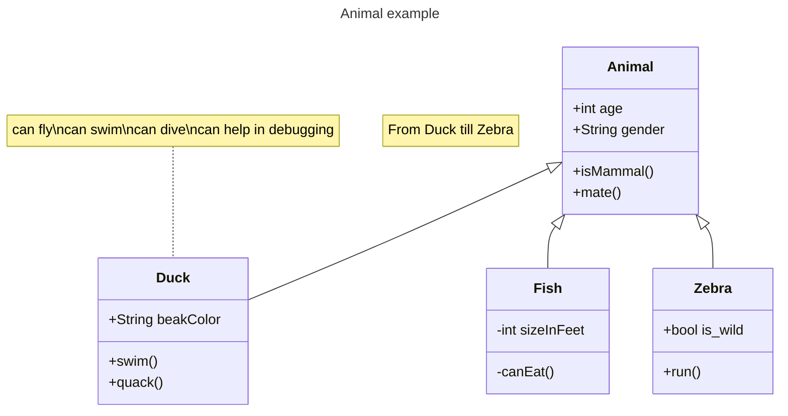
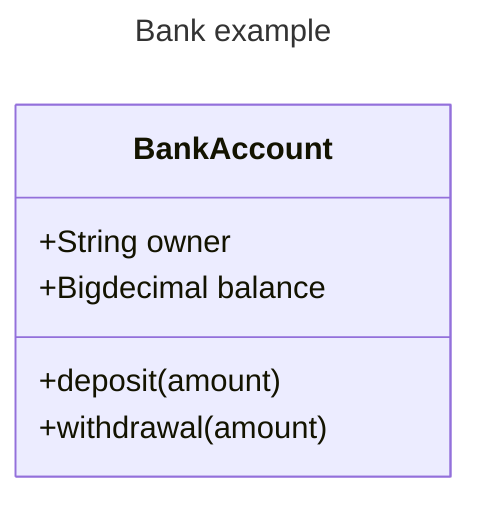
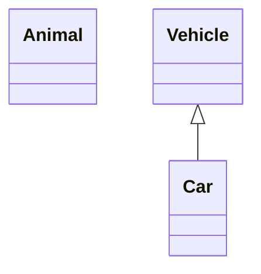
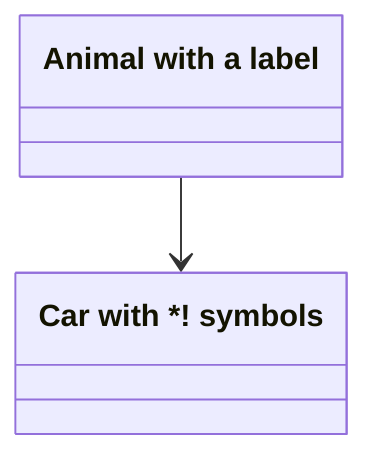
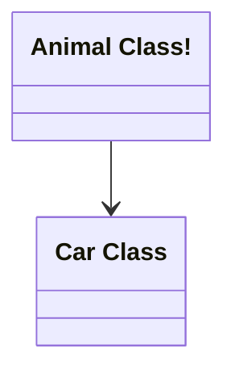
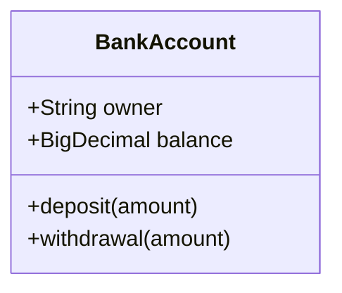
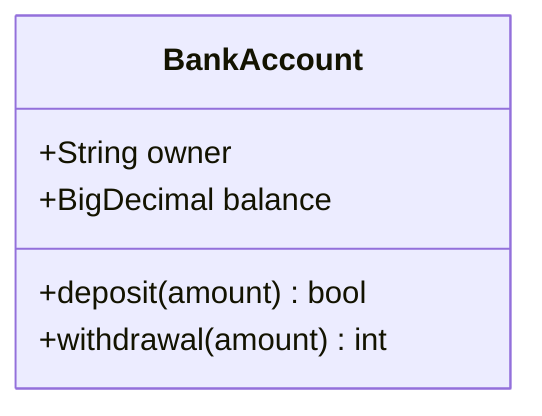
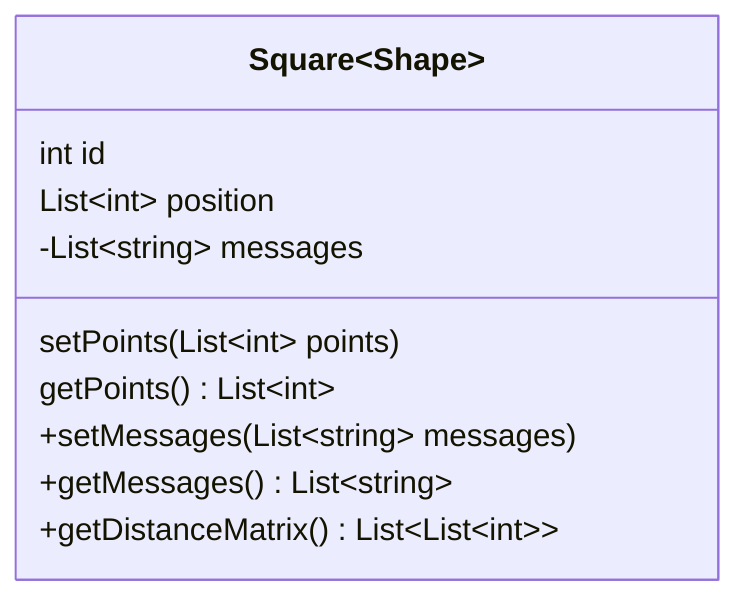
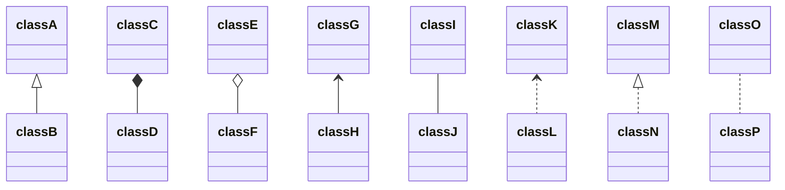

> **Warning**
>
> ## THIS IS AN AUTOGENERATED FILE. DO NOT EDIT.
>
> ## Please edit the corresponding file in [/packages/mermaid/src/docs/syntax/classDiagram.md](../../packages/mermaid/src/docs/syntax/classDiagram.md).

# Class diagrams

> "In software engineering, a class diagram in the Unified Modeling Language (UML) is a type of static structure diagram that describes the structure of a system by showing the system's classes, their attributes, operations (or methods), and the relationships among objects."
>
> -Wikipedia

The class diagram is the main building block of object-oriented modeling. It is used for general conceptual modeling of the structure of the application, and for detailed modeling to translate the models into programming code. Class diagrams can also be used for data modeling. The classes in a class diagram represent both the main elements, interactions in the application, and the classes to be programmed.

Mermaid can render class diagrams.




## Syntax

### Class

UML provides mechanisms to represent class members, such as attributes and methods, and additional information about them.
A single instance of a class in the diagram contains three compartments:

- The top compartment contains the name of the class. It is printed in bold and centered, and the first letter is capitalized. It may also contain optional annotation text describing the nature of the class.
- The middle compartment contains the attributes of the class. They are left-aligned and the first letter is lowercase.
- The bottom compartment contains the operations the class can execute. They are also left-aligned and the first letter is lowercase.




## Define a class

There are two ways to define a class:

- Explicitly using keyword **class** like `class Animal` which would define the Animal class.
- Via a **relationship** which defines two classes at a time along with their relationship. For instance, `Vehicle <|-- Car`.




Naming convention: a class name should be composed only of alphanumeric characters (including unicode), underscores, and dashes (-).

### Class labels

In case you need to provide a label for a class, you can use the following syntax:




You can also use backticks to escape special characters in the label:




## Defining Members of a class

UML provides mechanisms to represent class members such as attributes and methods, as well as additional information about them.

Mermaid distinguishes between attributes and functions/methods based on if the **parenthesis** `()` are present or not. The ones with `()` are treated as functions/methods, and all others as attributes.

There are two ways to define the members of a class, and regardless of whichever syntax is used to define the members, the output will still be same. The two different ways are :

- Associate a member of a class using **:** (colon) followed by member name, useful to define one member at a time. For example:




- Associate members of a class using **{}** brackets, where members are grouped within curly brackets. Suitable for defining multiple members at once. For example:


#### Return Type

Optionally you can end a method/function definition with the data type that will be returned (note: there must be a space between the final `)` and the return type). An example:




#### Generic Types

Generics can be represented as part of a class definition, and for class members/return types. In order to denote an item as generic, you enclose that type within `~` (**tilde**). **Nested** type declarations such as `List<List<int>>` are supported, though generics that include a comma are currently not supported. (such as `List<List<K, V>>`)

> _note_ when a generic is used within a class definition, the generic type is NOT considered part of the class name. i.e.: for any syntax which required you to reference the class name, you need to drop the type part of the definition. This also means that mermaid does not currently support having two classes with the same name, but different generic types.




#### Visibility

To describe the visibility (or encapsulation) of an attribute or method/function that is a part of a class (i.e. a class member), optional notation may be placed before that members' name:

- `+` Public
- `-` Private
- `#` Protected
- `~` Package/Internal

> _note_ you can also include additional _classifiers_ to a method definition by adding the following notation to the _end_ of the method, i.e.: after the `()` or after the return type:
>
> - `*` Abstract e.g.: `someAbstractMethod()*` or `someAbstractMethod() int*`
> - `$` Static e.g.: `someStaticMethod()$` or `someStaticMethod() String$`

> _note_ you can also include additional _classifiers_ to a field definition by adding the following notation to the very end:
>
> - `$` Static e.g.: `String someField$`

## Defining Relationship

A relationship is a general term covering the specific types of logical connections found on class and object diagrams.

```
[classA][Arrow][ClassB]
```

There are eight different types of relations defined for classes under UML which are currently supported:

| Type    | Description   |
| ------- | ------------- |
| `<\|--` | Inheritance   |
| `*--`   | Composition   |
| `o--`   | Aggregation   |
| `-->`   | Association   |
| `--`    | Link (Solid)  |
| `..>`   | Dependency    |
| `..\|>` | Realization   |
| `..`    | Link (Dashed) |




We can use the labels to describe the nature of the relation between two classes. Also, arrowheads can be used in the opposite direction as well:

```mermaid-example
classDiagram
classA --|> classB : Inheritance
classC --* classD : Composition
classE --o classF : Aggregation
classG --> classH : Association
classI -- classJ : Link(Solid)
classK ..> classL : Dependency
classM ..|> classN : Realization
classO .. classP : Link(Dashed)

```

```mermaid
classDiagram
classA --|> classB : Inheritance
classC --* classD : Composition
classE --o classF : Aggregation
classG --> classH : Association
classI -- classJ : Link(Solid)
classK ..> classL : Dependency
classM ..|> classN : Realization
classO .. classP : Link(Dashed)

```

### Labels on Relations

It is possible to add label text to a relation:

```
[classA][Arrow][ClassB]:LabelText
```

```mermaid-example
classDiagram
classA <|-- classB : implements
classC *-- classD : composition
classE o-- classF : aggregation
```

```mermaid
classDiagram
classA <|-- classB : implements
classC *-- classD : composition
classE o-- classF : aggregation
```

### Two-way relations

Relations can logically represent an N:M association:

```mermaid-example
classDiagram
    Animal <|--|> Zebra
```

```mermaid
classDiagram
    Animal <|--|> Zebra
```

Here is the syntax:

```
[Relation Type][Link][Relation Type]
```

Where `Relation Type` can be one of:

| Type  | Description |
| ----- | ----------- |
| `<\|` | Inheritance |
| `\*`  | Composition |
| `o`   | Aggregation |
| `>`   | Association |
| `<`   | Association |
| `\|>` | Realization |

And `Link` can be one of:

| Type | Description |
| ---- | ----------- |
| --   | Solid       |
| ..   | Dashed      |

### Lollipop Interfaces

Classes can also be given a special relation type that defines a lollipop interface on the class. A lollipop interface is defined using the following syntax:

- `bar ()-- foo`
- `foo --() bar`

The interface (bar) with the lollipop connects to the class (foo).

Note: Each interface that is defined is unique and is meant to not be shared between classes / have multiple edges connecting to it.

```mermaid-example
classDiagram
  bar ()-- foo
```

```mermaid
classDiagram
  bar ()-- foo
```

```mermaid-example
classDiagram
  class Class01 {
    int amount
    draw()
  }
  Class01 --() bar
  Class02 --() bar

  foo ()-- Class01
```

```mermaid
classDiagram
  class Class01 {
    int amount
    draw()
  }
  Class01 --() bar
  Class02 --() bar

  foo ()-- Class01
```

## Define Namespace

A namespace groups classes.

```mermaid-example
classDiagram
namespace BaseShapes {
    class Triangle
    class Rectangle {
      double width
      double height
    }
}
```

```mermaid
classDiagram
namespace BaseShapes {
    class Triangle
    class Rectangle {
      double width
      double height
    }
}
```

## Cardinality / Multiplicity on relations

Multiplicity or cardinality in class diagrams indicates the number of instances of one class that can be linked to an instance of the other class. For example, each company will have one or more employees (not zero), and each employee currently works for zero or one companies.

Multiplicity notations are placed near the end of an association.

The different cardinality options are :

- `1` Only 1
- `0..1` Zero or One
- `1..*` One or more
- `*` Many
- `n` n (where n>1)
- `0..n` zero to n (where n>1)
- `1..n` one to n (where n>1)

Cardinality can be easily defined by placing the text option within quotes `"` before or after a given arrow. For example:

```
[classA] "cardinality1" [Arrow] "cardinality2" [ClassB]:LabelText
```

```mermaid-example
classDiagram
    Customer "1" --> "*" Ticket
    Student "1" --> "1..*" Course
    Galaxy --> "many" Star : Contains
```

```mermaid
classDiagram
    Customer "1" --> "*" Ticket
    Student "1" --> "1..*" Course
    Galaxy --> "many" Star : Contains
```

## Annotations on classes

It is possible to annotate classes with markers to provide additional metadata about the class. This can give a clearer indication about its nature. Some common annotations include:

- `<<Interface>>` To represent an Interface class
- `<<Abstract>>` To represent an abstract class
- `<<Service>>` To represent a service class
- `<<Enumeration>>` To represent an enum

Annotations are defined within the opening `<<` and closing `>>`. There are two ways to add an annotation to a class, and either way the output will be same:

> **Tip:**\
> In Mermaid class diagrams, annotations like `<<interface>>` can be attached in two ways:
>
> - **Inline with the class definition** (Recommended for consistency):
>
>   ```mermaid-example
>   classDiagram
>     class Shape <<interface>>
>   ```
>
>   ```mermaid
>   classDiagram
>     class Shape <<interface>>
>   ```
>
> - **Separate line after the class definition**:
>
>   ```mermaid-example
>   classDiagram
>     class Shape
>     <<interface>> Shape
>   ```
>
>   ```mermaid
>   classDiagram
>     class Shape
>     <<interface>> Shape
>   ```
>
> Both methods are fully supported and produce identical diagrams.\
> However, it is recommended to use the **inline style** for better readability and consistent formatting across diagrams.

- In a **_separate line_** after a class is defined:

```mermaid-example
classDiagram
class Shape
<<interface>> Shape
Shape : noOfVertices
Shape : draw()
```

```mermaid
classDiagram
class Shape
<<interface>> Shape
Shape : noOfVertices
Shape : draw()
```

- In a **_nested structure_** along with the class definition:

```mermaid-example
classDiagram
class Shape{
    <<interface>>
    noOfVertices
    draw()
}
class Color{
    <<enumeration>>
    RED
    BLUE
    GREEN
    WHITE
    BLACK
}

```

```mermaid
classDiagram
class Shape{
    <<interface>>
    noOfVertices
    draw()
}
class Color{
    <<enumeration>>
    RED
    BLUE
    GREEN
    WHITE
    BLACK
}

```

## Comments

Comments can be entered within a class diagram, which will be ignored by the parser. Comments need to be on their own line, and must be prefaced with `%%` (double percent signs). Any text until the next newline will be treated as a comment, including any class diagram syntax.

```mermaid-example
classDiagram
%% This whole line is a comment classDiagram class Shape <<interface>>
class Shape{
    <<interface>>
    noOfVertices
    draw()
}
```

```mermaid
classDiagram
%% This whole line is a comment classDiagram class Shape <<interface>>
class Shape{
    <<interface>>
    noOfVertices
    draw()
}
```

## Setting the direction of the diagram

With class diagrams you can use the direction statement to set the direction in which the diagram will render:

```mermaid-example
classDiagram
  direction RL
  class Student {
    -idCard : IdCard
  }
  class IdCard{
    -id : int
    -name : string
  }
  class Bike{
    -id : int
    -name : string
  }
  Student "1" --o "1" IdCard : carries
  Student "1" --o "1" Bike : rides
```

```mermaid
classDiagram
  direction RL
  class Student {
    -idCard : IdCard
  }
  class IdCard{
    -id : int
    -name : string
  }
  class Bike{
    -id : int
    -name : string
  }
  Student "1" --o "1" IdCard : carries
  Student "1" --o "1" Bike : rides
```

## Interaction

It is possible to bind a click event to a node. The click can lead to either a javascript callback or to a link which will be opened in a new browser tab. **Note**: This functionality is disabled when using `securityLevel='strict'` and enabled when using `securityLevel='loose'`.

You would define these actions on a separate line after all classes have been declared.

```
action className "reference" "tooltip"
click className call callback() "tooltip"
click className href "url" "tooltip"
```

- _action_ is either `link` or `callback`, depending on which type of interaction you want to have called
- _className_ is the id of the node that the action will be associated with
- _reference_ is either the url link, or the function name for callback.
- (_optional_) tooltip is a string to be displayed when hovering over element (note: The styles of the tooltip are set by the class .mermaidTooltip.)
- note: callback function will be called with the nodeId as parameter.

## Notes

It is possible to add notes on the diagram using `note "line1\nline2"`. A note can be added for a specific class using `note for <CLASS NAME> "line1\nline2"`.

### Examples

```mermaid-example
classDiagram
    note "This is a general note"
    note for MyClass "This is a note for a class"
    class MyClass{
    }
```

```mermaid
classDiagram
    note "This is a general note"
    note for MyClass "This is a note for a class"
    class MyClass{
    }
```

_URL Link:_

```mermaid-example
classDiagram
class Shape
link Shape "https://www.github.com" "This is a tooltip for a link"
class Shape2
click Shape2 href "https://www.github.com" "This is a tooltip for a link"
```

```mermaid
classDiagram
class Shape
link Shape "https://www.github.com" "This is a tooltip for a link"
class Shape2
click Shape2 href "https://www.github.com" "This is a tooltip for a link"
```

_Callback:_

```mermaid-example
classDiagram
class Shape
callback Shape "callbackFunction" "This is a tooltip for a callback"
class Shape2
click Shape2 call callbackFunction() "This is a tooltip for a callback"
```

```mermaid
classDiagram
class Shape
callback Shape "callbackFunction" "This is a tooltip for a callback"
class Shape2
click Shape2 call callbackFunction() "This is a tooltip for a callback"
```

```html
<script>
  const callbackFunction = function () {
    alert('A callback was triggered');
  };
</script>
```

```mermaid-example
classDiagram
    class Class01
    class Class02
    callback Class01 "callbackFunction" "Callback tooltip"
    link Class02 "https://www.github.com" "This is a link"
    class Class03
    class Class04
    click Class03 call callbackFunction() "Callback tooltip"
    click Class04 href "https://www.github.com" "This is a link"
```

```mermaid
classDiagram
    class Class01
    class Class02
    callback Class01 "callbackFunction" "Callback tooltip"
    link Class02 "https://www.github.com" "This is a link"
    class Class03
    class Class04
    click Class03 call callbackFunction() "Callback tooltip"
    click Class04 href "https://www.github.com" "This is a link"
```

> **Success** The tooltip functionality and the ability to link to urls are available from version 0.5.2.

Beginner's tip—a full example using interactive links in an HTML page:

```html
<body>
  <pre class="mermaid">
    classDiagram
    Animal <|-- Duck
    Animal <|-- Fish
    Animal <|-- Zebra
    Animal : +int age
    Animal : +String gender
    Animal: +isMammal()
    Animal: +mate()
    class Duck{
      +String beakColor
      +swim()
      +quack()
      }
    class Fish{
      -int sizeInFeet
      -canEat()
      }
    class Zebra{
      +bool is_wild
      +run()
      }

      callback Duck "callback" "Tooltip"
      link Zebra "https://www.github.com" "This is a link"
  </pre>

  <script>
    const callback = function () {
      alert('A callback was triggered');
    };
    const config = {
      startOnLoad: true,
      securityLevel: 'loose',
    };
    mermaid.initialize(config);
  </script>
</body>
```

## Styling

### Styling a node

It is possible to apply specific styles such as a thicker border or a different background color to an individual node using the `style` keyword.

Note that notes and namespaces cannot be styled individually but do support themes.

```mermaid-example
classDiagram
  class Animal
  class Mineral
  style Animal fill:#f9f,stroke:#333,stroke-width:4px
  style Mineral fill:#bbf,stroke:#f66,stroke-width:2px,color:#fff,stroke-dasharray: 5 5
```

```mermaid
classDiagram
  class Animal
  class Mineral
  style Animal fill:#f9f,stroke:#333,stroke-width:4px
  style Mineral fill:#bbf,stroke:#f66,stroke-width:2px,color:#fff,stroke-dasharray: 5 5
```

#### Classes

More convenient than defining the style every time is to define a class of styles and attach this class to the nodes that
should have a different look.

A class definition looks like the example below:

```
classDef className fill:#f9f,stroke:#333,stroke-width:4px;
```

Also, it is possible to define style to multiple classes in one statement:

```
classDef firstClassName,secondClassName font-size:12pt;
```

Attachment of a class to a node is done as per below:

```
cssClass "nodeId1" className;
```

It is also possible to attach a class to a list of nodes in one statement:

```
cssClass "nodeId1,nodeId2" className;
```

A shorter form of adding a class is to attach the classname to the node using the `:::` operator:

```mermaid-example
classDiagram
    class Animal:::someclass
    classDef someclass fill:#f96
```

```mermaid
classDiagram
    class Animal:::someclass
    classDef someclass fill:#f96
```

Or:

```mermaid-example
classDiagram
    class Animal:::someclass {
        -int sizeInFeet
        -canEat()
    }
    classDef someclass fill:#f96
```

```mermaid
classDiagram
    class Animal:::someclass {
        -int sizeInFeet
        -canEat()
    }
    classDef someclass fill:#f96
```

### Default class

If a class is named default it will be applied to all nodes. Specific styles and classes should be defined afterwards to override the applied default styling.

```
classDef default fill:#f9f,stroke:#333,stroke-width:4px;
```

```mermaid-example
classDiagram
  class Animal:::pink
  class Mineral

  classDef default fill:#f96,color:red
  classDef pink color:#f9f
```

```mermaid
classDiagram
  class Animal:::pink
  class Mineral

  classDef default fill:#f96,color:red
  classDef pink color:#f9f
```

### CSS Classes

It is also possible to predefine classes in CSS styles that can be applied from the graph definition as in the example
below:

**Example style**

```html
<style>
  .styleClass > * > g {
    fill: #ff0000;
    stroke: #ffff00;
    stroke-width: 4px;
  }
</style>
```

**Example definition**

```mermaid-example
classDiagram
    class Animal:::styleClass
```

```mermaid
classDiagram
    class Animal:::styleClass
```

> cssClasses cannot be added using this shorthand method at the same time as a relation statement.

## Configuration

### Members Box

It is possible to hide the empty members box of a class node.

This is done by changing the **hideEmptyMembersBox** value of the class diagram configuration. For more information on how to edit the Mermaid configuration see the [configuration page.](https://mermaid.js.org/config/configuration.html)

```mermaid-example
---
  config:
    class:
      hideEmptyMembersBox: true
---
classDiagram
  class Duck
```

```mermaid
---
  config:
    class:
      hideEmptyMembersBox: true
---
classDiagram
  class Duck
```
