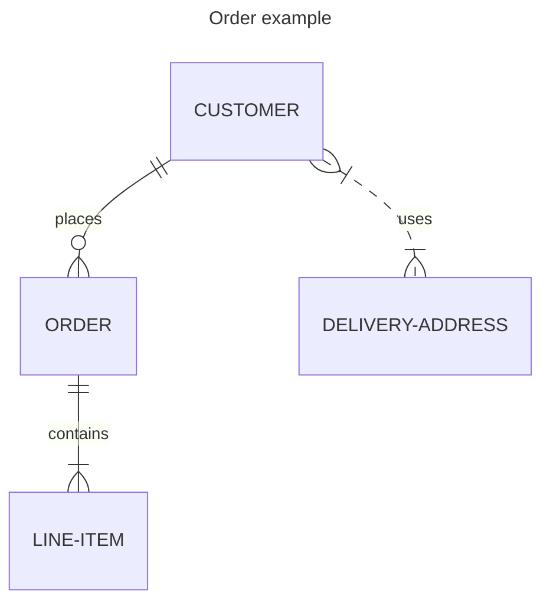
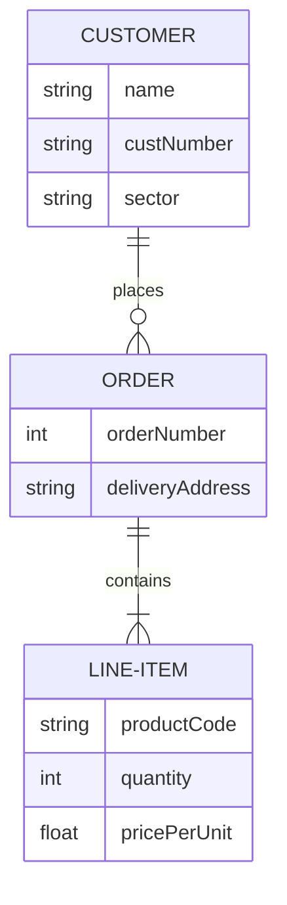
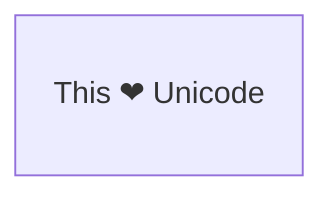
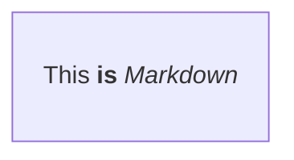
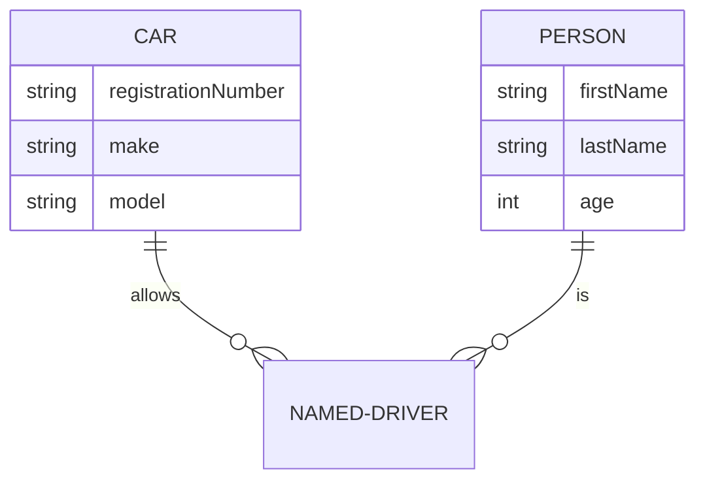
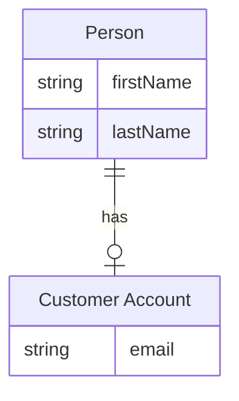
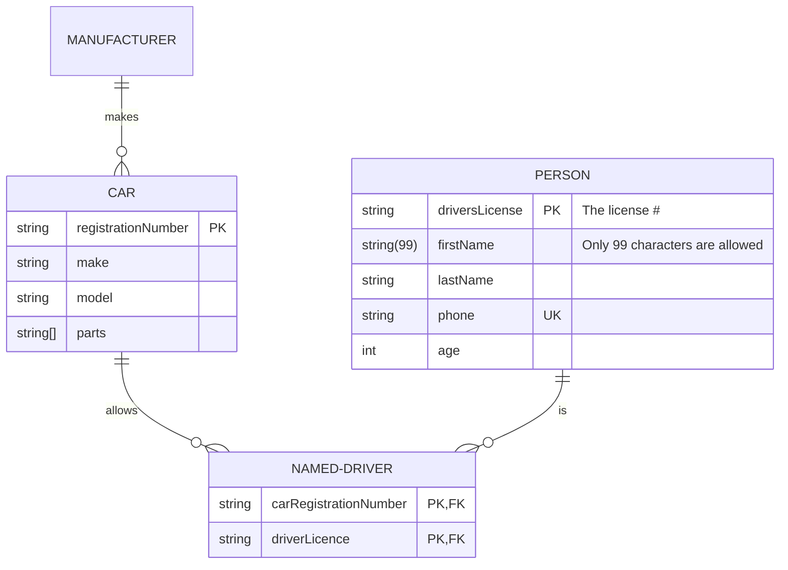

> **Warning**
>
> ## THIS IS AN AUTOGENERATED FILE. DO NOT EDIT.
>
> ## Please edit the corresponding file in [/packages/mermaid/src/docs/syntax/entityRelationshipDiagram.md](../../packages/mermaid/src/docs/syntax/entityRelationshipDiagram.md).

# Entity Relationship Diagrams

> An entity–relationship model (or ER model) describes interrelated things of interest in a specific domain of knowledge. A basic ER model is composed of entity types (which classify the things of interest) and specifies relationships that can exist between entities (instances of those entity types) [Wikipedia](https://en.wikipedia.org/wiki/Entity%E2%80%93relationship_model).

Note that practitioners of ER modelling almost always refer to _entity types_ simply as _entities_. For example the `CUSTOMER` entity _type_ would be referred to simply as the `CUSTOMER` entity. This is so common it would be inadvisable to do anything else, but technically an entity is an abstract _instance_ of an entity type, and this is what an ER diagram shows - abstract instances, and the relationships between them. This is why entities are always named using singular nouns.

Mermaid can render ER diagrams




Entity names are often capitalised, although there is no accepted standard on this, and it is not required in Mermaid.

Relationships between entities are represented by lines with end markers representing cardinality. Mermaid uses the most popular crow's foot notation. The crow's foot intuitively conveys the possibility of many instances of the entity that it connects to.

ER diagrams can be used for various purposes, ranging from abstract logical models devoid of any implementation details, through to physical models of relational database tables. It can be useful to include attribute definitions on ER diagrams to aid comprehension of the purpose and meaning of entities. These do not necessarily need to be exhaustive; often a small subset of attributes is enough. Mermaid allows them to be defined in terms of their _type_ and _name_.




When including attributes on ER diagrams, you must decide whether to include foreign keys as attributes. This probably depends on how closely you are trying to represent relational table structures. If your diagram is a _logical_ model which is not meant to imply a relational implementation, then it is better to leave these out because the associative relationships already convey the way that entities are associated. For example, a JSON data structure can implement a one-to-many relationship without the need for foreign key properties, using arrays. Similarly an object-oriented programming language may use pointers or references to collections. Even for models that are intended for relational implementation, you might decide that inclusion of foreign key attributes duplicates information already portrayed by the relationships, and does not add meaning to entities. Ultimately, it's your choice.

## Syntax

### Entities and Relationships

Mermaid syntax for ER diagrams is compatible with PlantUML, with an extension to label the relationship. Each statement consists of the following parts:

```
    <first-entity> [<relationship> <second-entity> : <relationship-label>]
```

Where:

- `first-entity` is the name of an entity. Names support any unicode characters and can include spaces if surrounded by double quotes (e.g. "name with space").
- `relationship` describes the way that both entities inter-relate. See below.
- `second-entity` is the name of the other entity.
- `relationship-label` describes the relationship from the perspective of the first entity.

For example:

```
    PROPERTY ||--|{ ROOM : contains
```

This statement can be read as _a property contains one or more rooms, and a room is part of one and only one property_. You can see that the label here is from the first entity's perspective: a property contains a room, but a room does not contain a property. When considered from the perspective of the second entity, the equivalent label is usually very easy to infer. (Some ER diagrams label relationships from both perspectives, but this is not supported here, and is usually superfluous).

Only the `first-entity` part of a statement is mandatory. This makes it possible to show an entity with no relationships, which can be useful during iterative construction of diagrams. If any other parts of a statement are specified, then all parts are mandatory.

#### Unicode text

Entity names, relationships, and attributes all support unicode text.




#### Markdown formatting

Markdown formatting and text is also supported.




### Relationship Syntax

The `relationship` part of each statement can be broken down into three sub-components:

- the cardinality of the first entity with respect to the second
- whether the relationship confers identity on a 'child' entity
- the cardinality of the second entity with respect to the first

Cardinality is a property that describes how many elements of another entity can be related to the entity in question. In the above example a `PROPERTY` can have one or more `ROOM` instances associated to it, whereas a `ROOM` can only be associated with one `PROPERTY`. In each cardinality marker there are two characters. The outermost character represents a maximum value, and the innermost character represents a minimum value. The table below summarises possible cardinalities.

| Value (left) | Value (right) | Meaning                       |
| :----------: | :-----------: | ----------------------------- |
|    `\|o`     |     `o\|`     | Zero or one                   |
|    `\|\|`    |    `\|\|`     | Exactly one                   |
|     `}o`     |     `o{`      | Zero or more (no upper limit) |
|    `}\|`     |     `\|{`     | One or more (no upper limit)  |

**Aliases**

| Value (left) | Value (right) | Alias for    |
| :----------: | :-----------: | ------------ |
| one or zero  |  one or zero  | Zero or one  |
| zero or one  |  zero or one  | Zero or one  |
| one or more  |  one or more  | One or more  |
| one or many  |  one or many  | One or more  |
|   many(1)    |    many(1)    | One or more  |
|      1+      |      1+       | One or more  |
| zero or more | zero or more  | Zero or more |
| zero or many | zero or many  | Zero or more |
|   many(0)    |    many(0)    | Zero or more |
|      0+      |      0+       | Zero or more |
|   only one   |   only one    | Exactly one  |
|      1       |       1       | Exactly one  |

### Identification

Relationships may be classified as either _identifying_ or _non-identifying_ and these are rendered with either solid or dashed lines respectively. This is relevant when one of the entities in question cannot have independent existence without the other. For example a firm that insures people to drive cars might need to store data on `NAMED-DRIVER`s. In modelling this we might start out by observing that a `CAR` can be driven by many `PERSON` instances, and a `PERSON` can drive many `CAR`s - both entities can exist without the other, so this is a non-identifying relationship that we might specify in Mermaid as: `PERSON }|..|{ CAR : "driver"`. Note the two dots in the middle of the relationship that will result in a dashed line being drawn between the two entities. But when this many-to-many relationship is resolved into two one-to-many relationships, we observe that a `NAMED-DRIVER` cannot exist without both a `PERSON` and a `CAR` - the relationships become identifying and would be specified using hyphens, which translate to a solid line:

| Value |     Alias for     |
| :---: | :---------------: |
|  --   |   _identifying_   |
|  ..   | _non-identifying_ |

**Aliases**

|     Value     |     Alias for     |
| :-----------: | :---------------: |
|      to       |   _identifying_   |
| optionally to | _non-identifying_ |


### Attributes

Attributes can be defined for entities by specifying the entity name followed by a block containing multiple `type name` pairs, where a block is delimited by an opening `{` and a closing `}`. The attributes are rendered inside the entity boxes. For example:




The `type` values must begin with an alphabetic character and may contain digits, hyphens, underscores, parentheses and square brackets. The `name` values follow a similar format to `type`, but may start with an asterisk as another option to indicate an attribute is a primary key. Other than that, there are no restrictions, and there is no implicit set of valid data types.

### Entity Name Aliases

An alias can be added to an entity using square brackets. If provided, the alias will be showed in the diagram instead of the entity name. Alias names follow all of the same rules as entity names.




#### Attribute Keys and Comments

Attributes may also have a `key` or comment defined. Keys can be `PK`, `FK` or `UK`, for Primary Key, Foreign Key or Unique Key (markdown formatting and unicode is not supported for keys). To specify multiple key constraints on a single attribute, separate them with a comma (e.g., `PK, FK`). A `comment` is defined by double quotes at the end of an attribute. Comments themselves cannot have double-quote characters in them.




### Direction

The direction statement declares the direction of the diagram.

This declares that the diagram is oriented from top to bottom (`TB`). This can be reversed to be oriented from bottom to top (`BT`).


This declares that the diagram is oriented from left to right (`LR`). This can be reversed to be oriented from right to left (`RL`).

```mermaid-example
erDiagram
    direction LR
    CUSTOMER ||--o{ ORDER : places
    CUSTOMER {
        string name
        string custNumber
        string sector
    }
    ORDER ||--|{ LINE-ITEM : contains
    ORDER {
        int orderNumber
        string deliveryAddress
    }
    LINE-ITEM {
        string productCode
        int quantity
        float pricePerUnit
    }
```

```mermaid
erDiagram
    direction LR
    CUSTOMER ||--o{ ORDER : places
    CUSTOMER {
        string name
        string custNumber
        string sector
    }
    ORDER ||--|{ LINE-ITEM : contains
    ORDER {
        int orderNumber
        string deliveryAddress
    }
    LINE-ITEM {
        string productCode
        int quantity
        float pricePerUnit
    }
```

Possible diagram orientations are:

- TB - Top to bottom
- BT - Bottom to top
- RL - Right to left
- LR - Left to right

### Styling a node

It is possible to apply specific styles such as a thicker border or a different background color to a node.

```mermaid-example
erDiagram
    id1||--||id2 : label
    style id1 fill:#f9f,stroke:#333,stroke-width:4px
    style id2 fill:#bbf,stroke:#f66,stroke-width:2px,color:#fff,stroke-dasharray: 5 5
```

```mermaid
erDiagram
    id1||--||id2 : label
    style id1 fill:#f9f,stroke:#333,stroke-width:4px
    style id2 fill:#bbf,stroke:#f66,stroke-width:2px,color:#fff,stroke-dasharray: 5 5
```

It is also possible to attach styles to a list of nodes in one statement:

```
    style nodeId1,nodeId2 styleList
```

#### Classes

More convenient than defining the style every time is to define a class of styles and attach this class to the nodes that
should have a different look.

A class definition looks like the example below:

```
    classDef className fill:#f9f,stroke:#333,stroke-width:4px
```

It is also possible to define multiple classes in one statement:

```
    classDef firstClassName,secondClassName font-size:12pt
```

Attachment of a class to a node is done as per below:

```
    class nodeId1 className
```

It is also possible to attach a class to a list of nodes in one statement:

```
    class nodeId1,nodeId2 className
```

Multiple classes can be attached at the same time as well:

```
    class nodeId1,nodeId2 className1,className2
```

A shorter form of adding a class is to attach the classname to the node using the `:::`operator as per below:

```mermaid-example
erDiagram
    direction TB
    CAR:::someclass {
        string registrationNumber
        string make
        string model
    }
    PERSON:::someclass {
        string firstName
        string lastName
        int age
    }
    HOUSE:::someclass

    classDef someclass fill:#f96
```

```mermaid
erDiagram
    direction TB
    CAR:::someclass {
        string registrationNumber
        string make
        string model
    }
    PERSON:::someclass {
        string firstName
        string lastName
        int age
    }
    HOUSE:::someclass

    classDef someclass fill:#f96
```

This form can be used when declaring relationships between entities:

```mermaid-example
erDiagram
    CAR {
        string registrationNumber
        string make
        string model
    }
    PERSON {
        string firstName
        string lastName
        int age
    }
    PERSON:::foo ||--|| CAR : owns
    PERSON o{--|| HOUSE:::bar : has

    classDef foo stroke:#f00
    classDef bar stroke:#0f0
    classDef foobar stroke:#00f
```

```mermaid
erDiagram
    CAR {
        string registrationNumber
        string make
        string model
    }
    PERSON {
        string firstName
        string lastName
        int age
    }
    PERSON:::foo ||--|| CAR : owns
    PERSON o{--|| HOUSE:::bar : has

    classDef foo stroke:#f00
    classDef bar stroke:#0f0
    classDef foobar stroke:#00f
```

Similar to the class statement, the shorthand syntax can also apply multiple classes at once:

```
    nodeId:::className1,className2
```

### Default class

If a class is named default it will be assigned to all classes without specific class definitions.

```
    classDef default fill:#f9f,stroke:#333,stroke-width:4px;
```

> **Note:** Custom styles from style or other class statements take priority and will overwrite the default styles. (e.g. The `default` class gives nodes a background color of pink but the `blue` class will give that node a background color of blue if applied.)

```mermaid-example
erDiagram
    CAR {
        string registrationNumber
        string make
        string model
    }
    PERSON {
        string firstName
        string lastName
        int age
    }
    PERSON:::foo ||--|| CAR : owns
    PERSON o{--|| HOUSE:::bar : has

    classDef default fill:#f9f,stroke-width:4px
    classDef foo stroke:#f00
    classDef bar stroke:#0f0
    classDef foobar stroke:#00f
```

```mermaid
erDiagram
    CAR {
        string registrationNumber
        string make
        string model
    }
    PERSON {
        string firstName
        string lastName
        int age
    }
    PERSON:::foo ||--|| CAR : owns
    PERSON o{--|| HOUSE:::bar : has

    classDef default fill:#f9f,stroke-width:4px
    classDef foo stroke:#f00
    classDef bar stroke:#0f0
    classDef foobar stroke:#00f
```

## Configuration

### Layout

The layout of the diagram is handled by [`render()`](../config/setup/mermaid/interfaces/Mermaid.md#render). The default layout is dagre.

For larger or more-complex diagrams, you can alternatively apply the ELK (Eclipse Layout Kernel) layout using your YAML frontmatter's `config`. For more information, see [Customizing ELK Layout](../intro/syntax-reference.md#customizing-elk-layout).

```yaml
---
config:
  layout: elk
---
```

Your Mermaid code should be similar to the following:

```mermaid-example
---
title: Order example
config:
    layout: elk
---
erDiagram
    CUSTOMER ||--o{ ORDER : places
    ORDER ||--|{ LINE-ITEM : contains
    CUSTOMER }|..|{ DELIVERY-ADDRESS : uses
```

```mermaid
---
title: Order example
config:
    layout: elk
---
erDiagram
    CUSTOMER ||--o{ ORDER : places
    ORDER ||--|{ LINE-ITEM : contains
    CUSTOMER }|..|{ DELIVERY-ADDRESS : uses
```

> **Note**
> Note that the site needs to use mermaid version 9.4+ for this to work and have this featured enabled in the lazy-loading configuration.

<!--- cspell:locale en,en-gb --->
