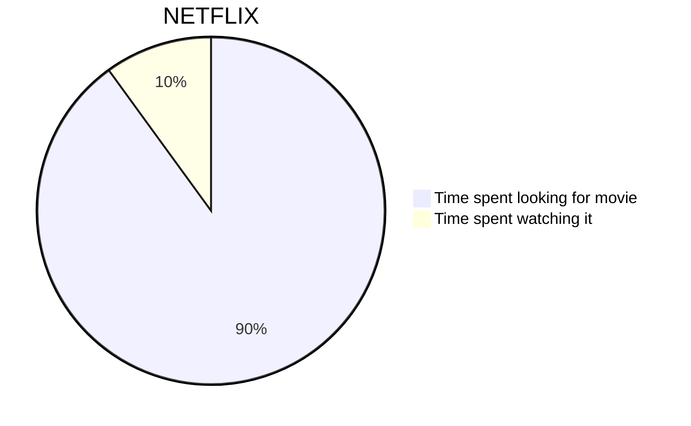
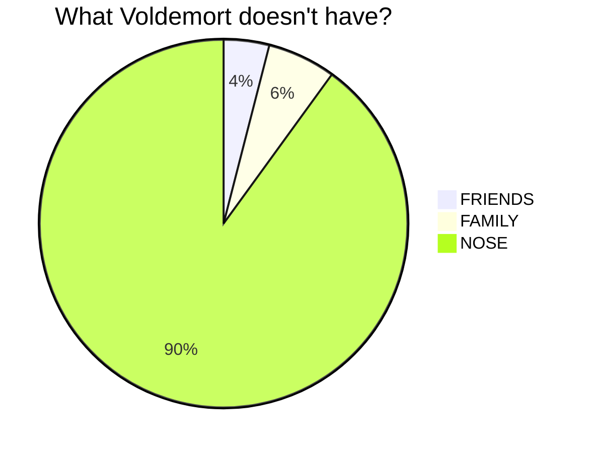
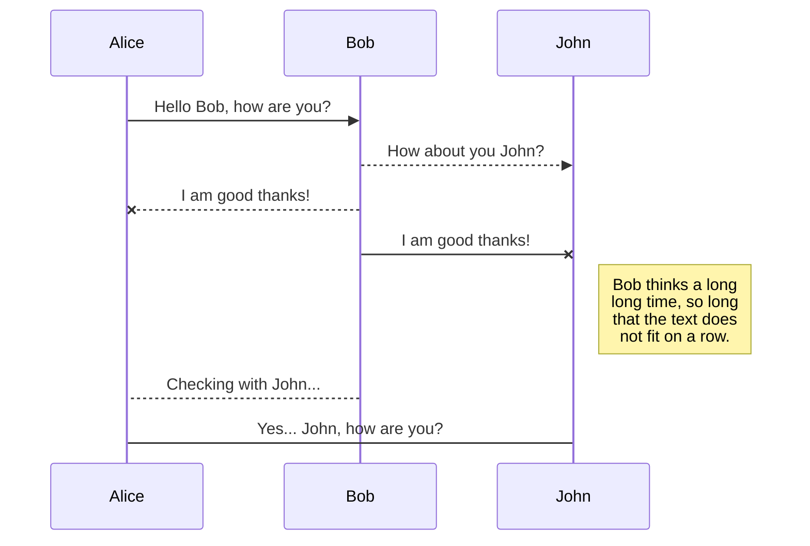
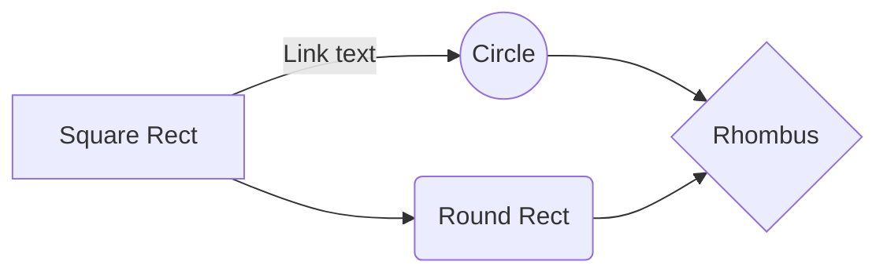
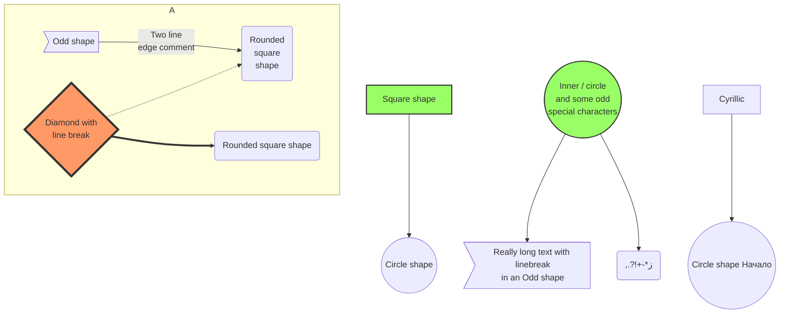
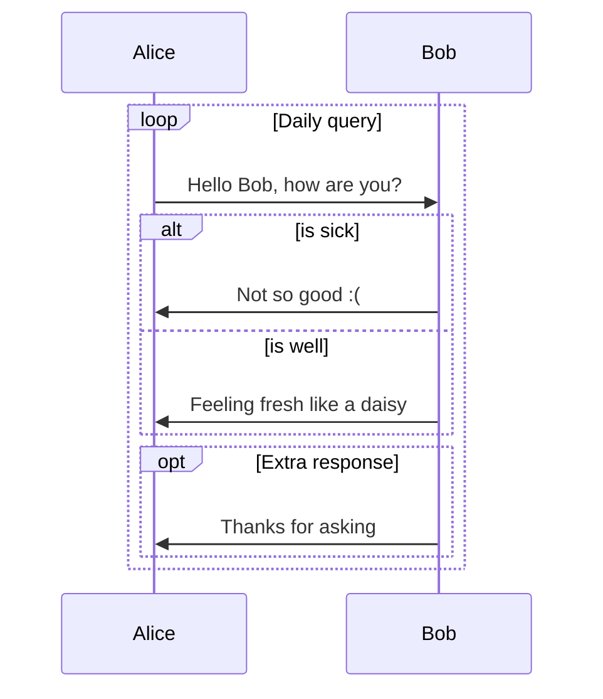
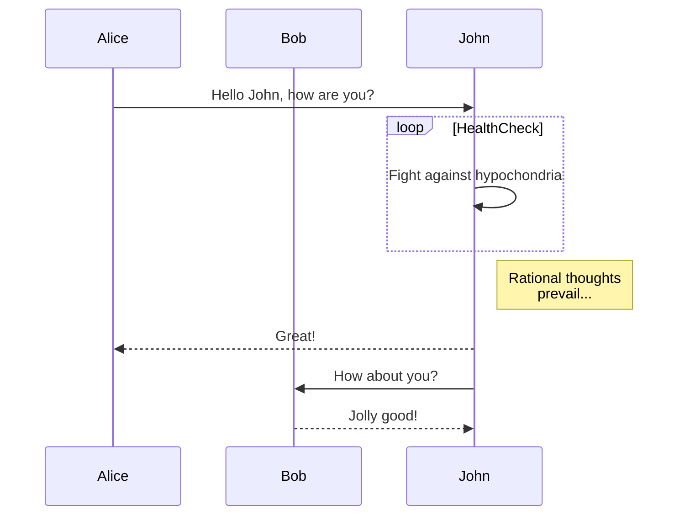
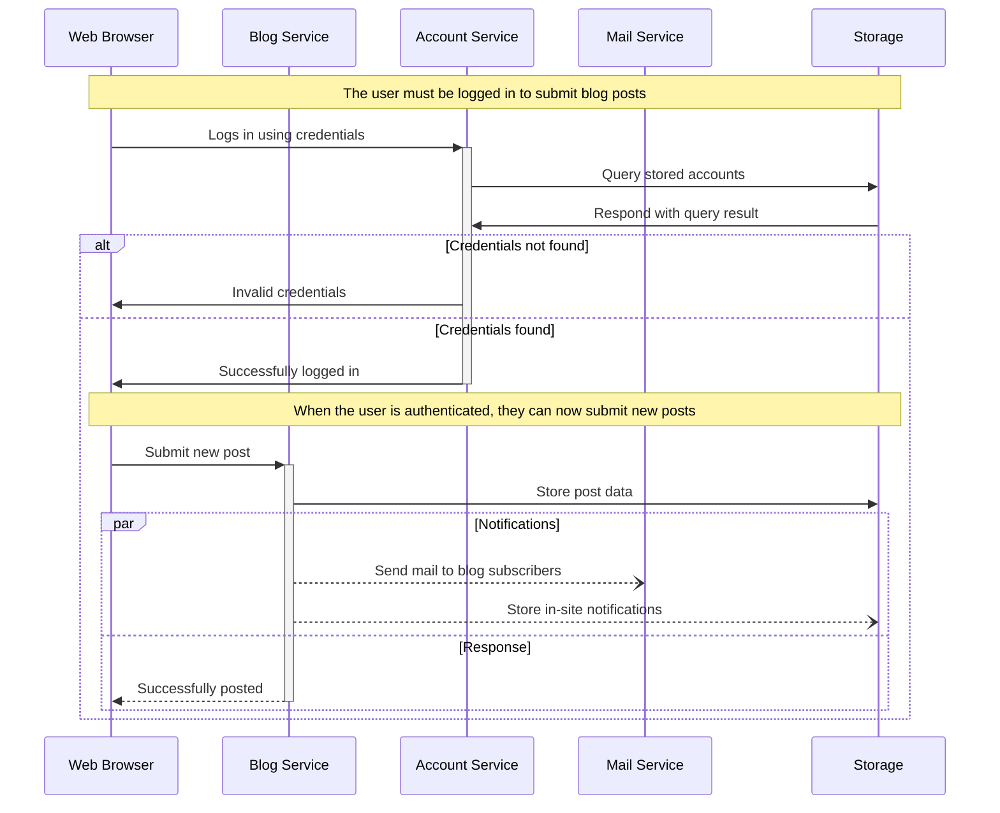
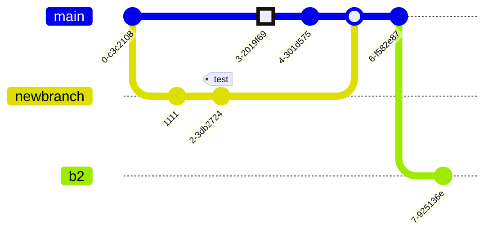
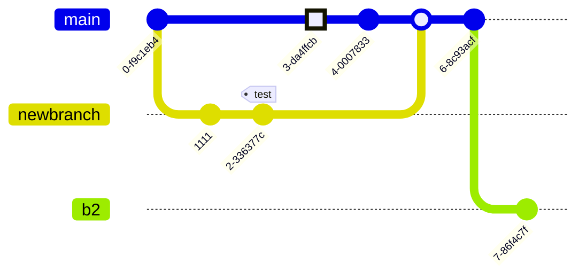

> **Warning**
>
> ## THIS IS AN AUTOGENERATED FILE. DO NOT EDIT.
>
> ## Please edit the corresponding file in [/packages/mermaid/src/docs/syntax/examples.md](../../packages/mermaid/src/docs/syntax/examples.md).

# Examples

This page contains a collection of examples of diagrams and charts that can be created through mermaid and its myriad applications.

**If you wish to learn how to support mermaid on your webpage, read the [Beginner's Guide](../config/usage.md?id=usage).**

**If you wish to learn about mermaid's syntax, Read the [Diagram Syntax](../syntax/flowchart.md?id=flowcharts-basic-syntax) section.**

## Basic Pie Chart

## Basic sequence diagram

## Basic flowchart

## Larger flowchart with some styling

## SequenceDiagram: Loops, alt and opt

## SequenceDiagram: Message to self in loop

## Sequence Diagram: Blogging app service communication

## A commit flow diagram.

<!--- cspell:ignore Ashish newbranch --->
