> **Warning**
>
> ## THIS IS AN AUTOGENERATED FILE. DO NOT EDIT.
>
> ## Please edit the corresponding file in [/packages/mermaid/src/docs/syntax/flowchart.md](../../packages/mermaid/src/docs/syntax/flowchart.md).

# Flowcharts - Basic Syntax

Flowcharts are composed of **nodes** (geometric shapes) and **edges** (arrows or lines). The Mermaid code defines how nodes and edges are made and accommodates different arrow types, multi-directional arrows, and any linking to and from subgraphs.

> **Warning**
> If you are using the word "end" in a Flowchart node, capitalize the entire word or any of the letters (e.g., "End" or "END"), or apply this [workaround](https://github.com/mermaid-js/mermaid/issues/1444#issuecomment-639528897). Typing "end" in all lowercase letters will break the Flowchart.

### A node (default)


> **Note**
> The id is what is displayed in the box.

> **💡 Tip**
> Instead of `flowchart` one can also use `graph`.

### A node with text

It is also possible to set text in the box that differs from the id. If this is done several times, it is the last text
found for the node that will be used. Also if you define edges for the node later on, you can omit text definitions. The
one previously defined will be used when rendering the box.


#### Unicode text

Use `"` to enclose the unicode text.

```mermaid
flowchart LR
    id["This ❤ Unicode"]
```




#### Markdown formatting

Use double quotes and backticks "\` text \`" to enclose the markdown text.


### Direction

This statement declares the direction of the Flowchart.

This declares the flowchart is oriented from top to bottom (`TD` or `TB`).


This declares the flowchart is oriented from left to right (`LR`).


Possible FlowChart orientations are:

- TB - Top to bottom
- TD - Top-down/ same as top to bottom
- BT - Bottom to top
- RL - Right to left
- LR - Left to right

## Node shapes

### A node with round edges


### A stadium-shaped node


### A node in a subroutine shape


### A node in a cylindrical shape


### A node in the form of a circle

```mermaid-example
flowchart LR
    id1((This is the text in the circle))
```

```mermaid
flowchart LR
    id1((This is the text in the circle))
```

### A node in an asymmetric shape

```mermaid-example
flowchart LR
    id1>This is the text in the box]
```

```mermaid
flowchart LR
    id1>This is the text in the box]
```

Currently only the shape above is possible and not its mirror. _This might change with future releases._

### A node (rhombus)

```mermaid-example
flowchart LR
    id1{This is the text in the box}
```

```mermaid
flowchart LR
    id1{This is the text in the box}
```

### A hexagon node

```mermaid-example
flowchart LR
    id1{{This is the text in the box}}
```

```mermaid
flowchart LR
    id1{{This is the text in the box}}
```

### Parallelogram

```mermaid-example
flowchart TD
    id1[/This is the text in the box/]
```

```mermaid
flowchart TD
    id1[/This is the text in the box/]
```

### Parallelogram alt

```mermaid-example
flowchart TD
    id1[\This is the text in the box\]
```

```mermaid
flowchart TD
    id1[\This is the text in the box\]
```

### Trapezoid

```mermaid-example
flowchart TD
    A[/Christmas\]
```

```mermaid
flowchart TD
    A[/Christmas\]
```

### Trapezoid alt

```mermaid-example
flowchart TD
    B[\Go shopping/]
```

```mermaid
flowchart TD
    B[\Go shopping/]
```

### Double circle

```mermaid-example
flowchart TD
    id1(((This is the text in the circle)))
```

```mermaid
flowchart TD
    id1(((This is the text in the circle)))
```

## Links between nodes

Nodes can be connected with links/edges. It is possible to have different types of links or attach a text string to a link.

### A link with arrow head

```mermaid-example
flowchart LR
    A-->B
```

```mermaid
flowchart LR
    A-->B
```

### An open link

```mermaid-example
flowchart LR
    A --- B
```

```mermaid
flowchart LR
    A --- B
```

### Text on links

```mermaid-example
flowchart LR
    A-- This is the text! ---B
```

```mermaid
flowchart LR
    A-- This is the text! ---B
```

or

```mermaid-example
flowchart LR
    A---|This is the text|B
```

```mermaid
flowchart LR
    A---|This is the text|B
```

### A link with arrow head and text

```mermaid-example
flowchart LR
    A-->|text|B
```

```mermaid
flowchart LR
    A-->|text|B
```

or

```mermaid-example
flowchart LR
    A-- text -->B
```

```mermaid
flowchart LR
    A-- text -->B
```

### Dotted link

```mermaid-example
flowchart LR
   A-.->B;
```

```mermaid
flowchart LR
   A-.->B;
```

### Dotted link with text

```mermaid-example
flowchart LR
   A-. text .-> B
```

```mermaid
flowchart LR
   A-. text .-> B
```

### Thick link

```mermaid-example
flowchart LR
   A ==> B
```

```mermaid
flowchart LR
   A ==> B
```

### Thick link with text

```mermaid-example
flowchart LR
   A == text ==> B
```

```mermaid
flowchart LR
   A == text ==> B
```

### An invisible link

This can be a useful tool in some instances where you want to alter the default positioning of a node.

```mermaid-example
flowchart LR
    A ~~~ B
```

```mermaid
flowchart LR
    A ~~~ B
```

### Chaining of links

It is possible declare many links in the same line as per below:

```mermaid-example
flowchart LR
   A -- text --> B -- text2 --> C
```

```mermaid
flowchart LR
   A -- text --> B -- text2 --> C
```

It is also possible to declare multiple nodes links in the same line as per below:

```mermaid-example
flowchart LR
   a --> b & c--> d
```

```mermaid
flowchart LR
   a --> b & c--> d
```

You can then describe dependencies in a very expressive way. Like the one-liner below:

```mermaid-example
flowchart TB
    A & B--> C & D
```

```mermaid
flowchart TB
    A & B--> C & D
```

If you describe the same diagram using the the basic syntax, it will take four lines. A
word of warning, one could go overboard with this making the flowchart harder to read in
markdown form. The Swedish word `lagom` comes to mind. It means, not too much and not too little.
This goes for expressive syntaxes as well.

```mermaid-example
flowchart TB
    A --> C
    A --> D
    B --> C
    B --> D
```

```mermaid
flowchart TB
    A --> C
    A --> D
    B --> C
    B --> D
```

### New arrow types

There are new types of arrows supported as per below:

```mermaid-example
flowchart LR
    A --o B
    B --x C
```

```mermaid
flowchart LR
    A --o B
    B --x C
```

### Multi directional arrows

There is the possibility to use multidirectional arrows.

```mermaid-example
flowchart LR
    A o--o B
    B <--> C
    C x--x D
```

```mermaid
flowchart LR
    A o--o B
    B <--> C
    C x--x D
```

### Minimum length of a link

Each node in the flowchart is ultimately assigned to a rank in the rendered
graph, i.e. to a vertical or horizontal level (depending on the flowchart
orientation), based on the nodes to which it is linked. By default, links
can span any number of ranks, but you can ask for any link to be longer
than the others by adding extra dashes in the link definition.

In the following example, two extra dashes are added in the link from node _B_
to node _E_, so that it spans two more ranks than regular links:

```mermaid-example
flowchart TD
    A[Start] --> B{Is it?}
    B -->|Yes| C[OK]
    C --> D[Rethink]
    D --> B
    B ---->|No| E[End]
```

```mermaid
flowchart TD
    A[Start] --> B{Is it?}
    B -->|Yes| C[OK]
    C --> D[Rethink]
    D --> B
    B ---->|No| E[End]
```

> **Note** Links may still be made longer than the requested number of ranks
> by the rendering engine to accommodate other requests.

When the link label is written in the middle of the link, the extra dashes must
be added on the right side of the link. The following example is equivalent to
the previous one:

```mermaid-example
flowchart TD
    A[Start] --> B{Is it?}
    B -- Yes --> C[OK]
    C --> D[Rethink]
    D --> B
    B -- No ----> E[End]
```

```mermaid
flowchart TD
    A[Start] --> B{Is it?}
    B -- Yes --> C[OK]
    C --> D[Rethink]
    D --> B
    B -- No ----> E[End]
```

For dotted or thick links, the characters to add are equals signs or dots,
as summed up in the following table:

| Length            |   1    |    2    |    3     |
| ----------------- | :----: | :-----: | :------: |
| Normal            | `---`  | `----`  | `-----`  |
| Normal with arrow | `-->`  | `--->`  | `---->`  |
| Thick             | `===`  | `====`  | `=====`  |
| Thick with arrow  | `==>`  | `===>`  | `====>`  |
| Dotted            | `-.-`  | `-..-`  | `-...-`  |
| Dotted with arrow | `-.->` | `-..->` | `-...->` |

## Special characters that break syntax

It is possible to put text within quotes in order to render more troublesome characters. As in the example below:

```mermaid-example
flowchart LR
    id1["This is the (text) in the box"]
```

```mermaid
flowchart LR
    id1["This is the (text) in the box"]
```

### Entity codes to escape characters

It is possible to escape characters using the syntax exemplified here.

```mermaid-example
    flowchart LR
        A["A double quote:#quot;"] --> B["A dec char:#9829;"]
```

```mermaid
    flowchart LR
        A["A double quote:#quot;"] --> B["A dec char:#9829;"]
```

Numbers given are base 10, so `#` can be encoded as `#35;`. It is also supported to use HTML character names.

## Subgraphs

    subgraph title
        graph definition
    end

An example below:

```mermaid-example
flowchart TB
    c1-->a2
    subgraph one
    a1-->a2
    end
    subgraph two
    b1-->b2
    end
    subgraph three
    c1-->c2
    end
```

```mermaid
flowchart TB
    c1-->a2
    subgraph one
    a1-->a2
    end
    subgraph two
    b1-->b2
    end
    subgraph three
    c1-->c2
    end
```

You can also set an explicit id for the subgraph.

```mermaid-example
flowchart TB
    c1-->a2
    subgraph ide1 [one]
    a1-->a2
    end
```

```mermaid
flowchart TB
    c1-->a2
    subgraph ide1 [one]
    a1-->a2
    end
```

### flowcharts

With the graphtype flowchart it is also possible to set edges to and from subgraphs as in the flowchart below.

```mermaid-example
flowchart TB
    c1-->a2
    subgraph one
    a1-->a2
    end
    subgraph two
    b1-->b2
    end
    subgraph three
    c1-->c2
    end
    one --> two
    three --> two
    two --> c2
```

```mermaid
flowchart TB
    c1-->a2
    subgraph one
    a1-->a2
    end
    subgraph two
    b1-->b2
    end
    subgraph three
    c1-->c2
    end
    one --> two
    three --> two
    two --> c2
```

### Direction in subgraphs

With the graphtype flowcharts you can use the direction statement to set the direction which the subgraph will render like in this example.

```mermaid-example
flowchart LR
  subgraph TOP
    direction TB
    subgraph B1
        direction RL
        i1 -->f1
    end
    subgraph B2
        direction BT
        i2 -->f2
    end
  end
  A --> TOP --> B
  B1 --> B2
```

```mermaid
flowchart LR
  subgraph TOP
    direction TB
    subgraph B1
        direction RL
        i1 -->f1
    end
    subgraph B2
        direction BT
        i2 -->f2
    end
  end
  A --> TOP --> B
  B1 --> B2
```

#### Limitation

If any of a subgraph's nodes are linked to the outside, subgraph direction will be ignored. Instead the subgraph will inherit the direction of the parent graph:

```mermaid-example
flowchart LR
    subgraph subgraph1
        direction TB
        top1[top] --> bottom1[bottom]
    end
    subgraph subgraph2
        direction TB
        top2[top] --> bottom2[bottom]
    end
    %% ^ These subgraphs are identical, except for the links to them:

    %% Link *to* subgraph1: subgraph1 direction is mantained
    outside --> subgraph1
    %% Link *within* subgraph2:
    %% subgraph2 inherits the direction of the top-level graph (LR)
    outside ---> top2
```

```mermaid
flowchart LR
    subgraph subgraph1
        direction TB
        top1[top] --> bottom1[bottom]
    end
    subgraph subgraph2
        direction TB
        top2[top] --> bottom2[bottom]
    end
    %% ^ These subgraphs are identical, except for the links to them:

    %% Link *to* subgraph1: subgraph1 direction is mantained
    outside --> subgraph1
    %% Link *within* subgraph2:
    %% subgraph2 inherits the direction of the top-level graph (LR)
    outside ---> top2
```

## Markdown Strings

The "Markdown Strings" feature enhances flowcharts and mind maps by offering a more versatile string type, which supports text formatting options such as bold and italics, and automatically wraps text within labels.

```mermaid-example
%%{init: {"flowchart": {"htmlLabels": false}} }%%
flowchart LR
subgraph "One"
  a("`The **cat**
  in the hat`") -- "edge label" --> b{{"`The **dog** in the hog`"}}
end
subgraph "`**Two**`"
  c("`The **cat**
  in the hat`") -- "`Bold **edge label**`" --> d("The dog in the hog")
end
```

```mermaid
%%{init: {"flowchart": {"htmlLabels": false}} }%%
flowchart LR
subgraph "One"
  a("`The **cat**
  in the hat`") -- "edge label" --> b{{"`The **dog** in the hog`"}}
end
subgraph "`**Two**`"
  c("`The **cat**
  in the hat`") -- "`Bold **edge label**`" --> d("The dog in the hog")
end
```

Formatting:

- For bold text, use double asterisks (`**`) before and after the text.
- For italics, use single asterisks (`*`) before and after the text.
- With traditional strings, you needed to add `<br>` tags for text to wrap in nodes. However, markdown strings automatically wrap text when it becomes too long and allows you to start a new line by simply using a newline character instead of a `<br>` tag.

This feature is applicable to node labels, edge labels, and subgraph labels.

## Interaction

It is possible to bind a click event to a node, the click can lead to either a javascript callback or to a link which will be opened in a new browser tab.

> **Note**
> This functionality is disabled when using `securityLevel='strict'` and enabled when using `securityLevel='loose'`.

    click nodeId callback
    click nodeId call callback()

- nodeId is the id of the node
- callback is the name of a javascript function defined on the page displaying the graph, the function will be called with the nodeId as parameter.

Examples of tooltip usage below:

```html
<script>
  const callback = function () {
    alert('A callback was triggered');
  };
</script>
```

The tooltip text is surrounded in double quotes. The styles of the tooltip are set by the class `.mermaidTooltip`.

```mermaid-example
flowchart LR
    A-->B
    B-->C
    C-->D
    click A callback "Tooltip for a callback"
    click B "https://www.github.com" "This is a tooltip for a link"
    click C call callback() "Tooltip for a callback"
    click D href "https://www.github.com" "This is a tooltip for a link"
```

```mermaid
flowchart LR
    A-->B
    B-->C
    C-->D
    click A callback "Tooltip for a callback"
    click B "https://www.github.com" "This is a tooltip for a link"
    click C call callback() "Tooltip for a callback"
    click D href "https://www.github.com" "This is a tooltip for a link"
```

> **Success** The tooltip functionality and the ability to link to urls are available from version 0.5.2.

?> Due to limitations with how Docsify handles JavaScript callback functions, an alternate working demo for the above code can be viewed at [this jsfiddle](https://jsfiddle.net/Ogglas/2o73vdez/7).

Links are opened in the same browser tab/window by default. It is possible to change this by adding a link target to the click definition (`_self`, `_blank`, `_parent` and `_top` are supported):

```mermaid-example
flowchart LR
    A-->B
    B-->C
    C-->D
    D-->E
    click A "https://www.github.com" _blank
    click B "https://www.github.com" "Open this in a new tab" _blank
    click C href "https://www.github.com" _blank
    click D href "https://www.github.com" "Open this in a new tab" _blank
```

```mermaid
flowchart LR
    A-->B
    B-->C
    C-->D
    D-->E
    click A "https://www.github.com" _blank
    click B "https://www.github.com" "Open this in a new tab" _blank
    click C href "https://www.github.com" _blank
    click D href "https://www.github.com" "Open this in a new tab" _blank
```

Beginner's tip—a full example using interactive links in a html context:

```html
<body>
  <pre class="mermaid">
    flowchart LR
        A-->B
        B-->C
        C-->D
        click A callback "Tooltip"
        click B "https://www.github.com" "This is a link"
        click C call callback() "Tooltip"
        click D href "https://www.github.com" "This is a link"
  </pre>

  <script>
    const callback = function () {
      alert('A callback was triggered');
    };
    const config = {
      startOnLoad: true,
      flowchart: { useMaxWidth: true, htmlLabels: true, curve: 'cardinal' },
      securityLevel: 'loose',
    };
    mermaid.initialize(config);
  </script>
</body>
```

### Comments

Comments can be entered within a flow diagram, which will be ignored by the parser. Comments need to be on their own line, and must be prefaced with `%%` (double percent signs). Any text after the start of the comment to the next newline will be treated as a comment, including any flow syntax

```mermaid-example
flowchart LR
%% this is a comment A -- text --> B{node}
   A -- text --> B -- text2 --> C
```

```mermaid
flowchart LR
%% this is a comment A -- text --> B{node}
   A -- text --> B -- text2 --> C
```

## Styling and classes

### Styling links

It is possible to style links. For instance, you might want to style a link that is going backwards in the flow. As links
have no ids in the same way as nodes, some other way of deciding what style the links should be attached to is required.
Instead of ids, the order number of when the link was defined in the graph is used, or use default to apply to all links.
In the example below the style defined in the linkStyle statement will belong to the fourth link in the graph:

    linkStyle 3 stroke:#ff3,stroke-width:4px,color:red;

It is also possible to add style to multiple links in a single statement, by separating link numbers with commas:

    linkStyle 1,2,7 color:blue;

### Styling line curves

It is possible to style the type of curve used for lines between items, if the default method does not meet your needs.
Available curve styles include `basis`, `bumpX`, `bumpY`, `cardinal`, `catmullRom`, `linear`, `monotoneX`, `monotoneY`,
`natural`, `step`, `stepAfter`, and `stepBefore`.

In this example, a left-to-right graph uses the `stepBefore` curve style:

    %%{ init: { 'flowchart': { 'curve': 'stepBefore' } } }%%
    graph LR

For a full list of available curves, including an explanation of custom curves, refer to
the [Shapes](https://github.com/d3/d3-shape/blob/main/README.md#curves) documentation in the
[d3-shape](https://github.com/d3/d3-shape/) project.

### Styling a node

It is possible to apply specific styles such as a thicker border or a different background color to a node.

```mermaid-example
flowchart LR
    id1(Start)-->id2(Stop)
    style id1 fill:#f9f,stroke:#333,stroke-width:4px
    style id2 fill:#bbf,stroke:#f66,stroke-width:2px,color:#fff,stroke-dasharray: 5 5
```

```mermaid
flowchart LR
    id1(Start)-->id2(Stop)
    style id1 fill:#f9f,stroke:#333,stroke-width:4px
    style id2 fill:#bbf,stroke:#f66,stroke-width:2px,color:#fff,stroke-dasharray: 5 5
```

#### Classes

More convenient than defining the style every time is to define a class of styles and attach this class to the nodes that
should have a different look.

A class definition looks like the example below:

        classDef className fill:#f9f,stroke:#333,stroke-width:4px;

Also, it is possible to define style to multiple classes in one statement:

        classDef firstClassName,secondClassName font-size:12pt;

Attachment of a class to a node is done as per below:

        class nodeId1 className;

It is also possible to attach a class to a list of nodes in one statement:

        class nodeId1,nodeId2 className;

A shorter form of adding a class is to attach the classname to the node using the `:::`operator as per below:

```mermaid-example
flowchart LR
    A:::someclass --> B
    classDef someclass fill:#f96
```

```mermaid
flowchart LR
    A:::someclass --> B
    classDef someclass fill:#f96
```

This form can be used when declaring multiple links between nodes:

```mermaid-example
flowchart LR
    A:::foo & B:::bar --> C:::foobar
    classDef foo stroke:#f00
    classDef bar stroke:#0f0
    classDef foobar stroke:#00f
```

```mermaid
flowchart LR
    A:::foo & B:::bar --> C:::foobar
    classDef foo stroke:#f00
    classDef bar stroke:#0f0
    classDef foobar stroke:#00f
```

### CSS classes

It is also possible to predefine classes in CSS styles that can be applied from the graph definition as in the example
below:

**Example style**

```html
<style>
  .cssClass > rect {
    fill: #ff0000;
    stroke: #ffff00;
    stroke-width: 4px;
  }
</style>
```

**Example definition**

```mermaid-example
flowchart LR
    A-->B[AAA<span>BBB</span>]
    B-->D
    class A cssClass
```

```mermaid
flowchart LR
    A-->B[AAA<span>BBB</span>]
    B-->D
    class A cssClass
```

### Default class

If a class is named default it will be assigned to all classes without specific class definitions.

        classDef default fill:#f9f,stroke:#333,stroke-width:4px;

## Basic support for fontawesome

It is possible to add icons from fontawesome.

The icons are accessed via the syntax fa:#icon class name#.

```mermaid-example
flowchart TD
    B["fa:fa-twitter for peace"]
    B-->C[fa:fa-ban forbidden]
    B-->D(fa:fa-spinner)
    B-->E(A fa:fa-camera-retro perhaps?)
```

```mermaid
flowchart TD
    B["fa:fa-twitter for peace"]
    B-->C[fa:fa-ban forbidden]
    B-->D(fa:fa-spinner)
    B-->E(A fa:fa-camera-retro perhaps?)
```

Mermaid is compatible with Font Awesome up to verion 5, Free icons only. Check that the icons you use are from the [supported set of icons](https://fontawesome.com/v5/search?o=r&m=free).

## Graph declarations with spaces between vertices and link and without semicolon

- In graph declarations, the statements also can now end without a semicolon. After release 0.2.16, ending a graph statement with semicolon is just optional. So the below graph declaration is also valid along with the old declarations of the graph.

- A single space is allowed between vertices and the link. However there should not be any space between a vertex and its text and a link and its text. The old syntax of graph declaration will also work and hence this new feature is optional and is introduced to improve readability.

Below is the new declaration of the graph edges which is also valid along with the old declaration of the graph edges.

```mermaid-example
flowchart LR
    A[Hard edge] -->|Link text| B(Round edge)
    B --> C{Decision}
    C -->|One| D[Result one]
    C -->|Two| E[Result two]
```

```mermaid
flowchart LR
    A[Hard edge] -->|Link text| B(Round edge)
    B --> C{Decision}
    C -->|One| D[Result one]
    C -->|Two| E[Result two]
```

## Configuration

### Renderer

The layout of the diagram is done with the renderer. The default renderer is dagre.

Starting with Mermaid version 9.4, you can use an alternate renderer named elk. The elk renderer is better for larger and/or more complex diagrams.

The _elk_ renderer is an experimental feature.
You can change the renderer to elk by adding this directive:

    %%{init: {"flowchart": {"defaultRenderer": "elk"}} }%%

> **Note**
> Note that the site needs to use mermaid version 9.4+ for this to work and have this featured enabled in the lazy-loading configuration.

### Width

It is possible to adjust the width of the rendered flowchart.

This is done by defining **mermaid.flowchartConfig** or by the CLI to use a JSON file with the configuration. How to use the CLI is described in the mermaidCLI page.
mermaid.flowchartConfig can be set to a JSON string with config parameters or the corresponding object.

```javascript
mermaid.flowchartConfig = {
    width: 100%
}
```
