> **Warning**
>
> ## THIS IS AN AUTOGENERATED FILE. DO NOT EDIT.
>
> ## Please edit the corresponding file in [/packages/mermaid/src/docs/syntax/flowchart.md](../../packages/mermaid/src/docs/syntax/flowchart.md).

# Flowcharts - Basic Syntax

Flowcharts are composed of **nodes** (geometric shapes) and **edges** (arrows or lines). The Mermaid code defines how nodes and edges are made and accommodates different arrow types, multi-directional arrows, and any linking to and from subgraphs.

> **Warning**
> If you are using the word "end" in a Flowchart node, capitalize the entire word or any of the letters (e.g., "End" or "END"), or apply this [workaround](https://github.com/mermaid-js/mermaid/issues/1444#issuecomment-639528897). Typing "end" in all lowercase letters will break the Flowchart.

> **Warning**
> If you are using the letter "o" or "x" as the first letter in a connecting Flowchart node, add a space before the letter or capitalize the letter (e.g., "dev--- ops", "dev---Ops").
>
> Typing "A---oB" will create a [circle edge](#circle-edge-example).
>
> Typing "A---xB" will create a [cross edge](#cross-edge-example).

### A node (default)


> **Note**
> The id is what is displayed in the box.

> **💡 Tip**
> Instead of `flowchart` one can also use `graph`.

### A node with text

It is also possible to set text in the box that differs from the id. If this is done several times, it is the last text
found for the node that will be used. Also if you define edges for the node later on, you can omit text definitions. The
one previously defined will be used when rendering the box.


#### Unicode text

Use `"` to enclose the unicode text.

```mermaid
flowchart LR
    id["This ❤ Unicode"]
```




#### Markdown formatting

Use double quotes and backticks "\` text \`" to enclose the markdown text.


### Direction

This statement declares the direction of the Flowchart.

This declares the flowchart is oriented from top to bottom (`TD` or `TB`).


This declares the flowchart is oriented from left to right (`LR`).


Possible FlowChart orientations are:

- TB - Top to bottom
- TD - Top-down/ same as top to bottom
- BT - Bottom to top
- RL - Right to left
- LR - Left to right

## Node shapes

### A node with round edges


### A stadium-shaped node


### A node in a subroutine shape


### A node in a cylindrical shape


### A node in the form of a circle

```mermaid-example
flowchart LR
    id1((This is the text in the circle))
```

```mermaid
flowchart LR
    id1((This is the text in the circle))
```

### A node in an asymmetric shape

```mermaid-example
flowchart LR
    id1>This is the text in the box]
```

```mermaid
flowchart LR
    id1>This is the text in the box]
```

Currently only the shape above is possible and not its mirror. _This might change with future releases._

### A node (rhombus)

```mermaid-example
flowchart LR
    id1{This is the text in the box}
```

```mermaid
flowchart LR
    id1{This is the text in the box}
```

### A hexagon node

```mermaid-example
flowchart LR
    id1{{This is the text in the box}}
```

```mermaid
flowchart LR
    id1{{This is the text in the box}}
```

### Parallelogram

```mermaid-example
flowchart TD
    id1[/This is the text in the box/]
```

```mermaid
flowchart TD
    id1[/This is the text in the box/]
```

### Parallelogram alt

```mermaid-example
flowchart TD
    id1[\This is the text in the box\]
```

```mermaid
flowchart TD
    id1[\This is the text in the box\]
```

### Trapezoid

```mermaid-example
flowchart TD
    A[/Christmas\]
```

```mermaid
flowchart TD
    A[/Christmas\]
```

### Trapezoid alt

```mermaid-example
flowchart TD
    B[\Go shopping/]
```

```mermaid
flowchart TD
    B[\Go shopping/]
```

### Double circle

```mermaid-example
flowchart TD
    id1(((This is the text in the circle)))
```

```mermaid
flowchart TD
    id1(((This is the text in the circle)))
```

## Expanded Node Shapes in Mermaid Flowcharts (v11.3.0+)

Mermaid introduces 30 new shapes to enhance the flexibility and precision of flowchart creation. These new shapes provide more options to represent processes, decisions, events, data storage visually, and other elements within your flowcharts, improving clarity and semantic meaning.

New Syntax for Shape Definition

Mermaid now supports a general syntax for defining shape types to accommodate the growing number of shapes. This syntax allows you to assign specific shapes to nodes using a clear and flexible format:

```
A@{ shape: rect }
```

This syntax creates a node A as a rectangle. It renders in the same way as `A["A"]`, or `A`.

### Complete List of New Shapes

Below is a comprehensive list of the newly introduced shapes and their corresponding semantic meanings, short names, and aliases:

| **Semantic Name**                 | **Shape Name**         | **Short Name** | **Description**                | **Alias Supported**                                              |
| --------------------------------- | ---------------------- | -------------- | ------------------------------ | ---------------------------------------------------------------- |
| Card                              | Notched Rectangle      | `notch-rect`   | Represents a card              | `card`, `notched-rectangle`                                      |
| Collate                           | Hourglass              | `hourglass`    | Represents a collate operation | `collate`, `hourglass`                                           |
| Com Link                          | Lightning Bolt         | `bolt`         | Communication link             | `com-link`, `lightning-bolt`                                     |
| Comment                           | Curly Brace            | `brace`        | Adds a comment                 | `brace-l`, `comment`                                             |
| Comment Right                     | Curly Brace            | `brace-r`      | Adds a comment                 |                                                                  |
| Comment with braces on both sides | Curly Braces           | `braces`       | Adds a comment                 |                                                                  |
| Data Input/Output                 | Lean Right             | `lean-r`       | Represents input or output     | `in-out`, `lean-right`                                           |
| Data Input/Output                 | Lean Left              | `lean-l`       | Represents output or input     | `lean-left`, `out-in`                                            |
| Database                          | Cylinder               | `cyl`          | Database storage               | `cylinder`, `database`, `db`                                     |
| Decision                          | Diamond                | `diam`         | Decision-making step           | `decision`, `diamond`, `question`                                |
| Delay                             | Half-Rounded Rectangle | `delay`        | Represents a delay             | `half-rounded-rectangle`                                         |
| Direct Access Storage             | Horizontal Cylinder    | `h-cyl`        | Direct access storage          | `das`, `horizontal-cylinder`                                     |
| Disk Storage                      | Lined Cylinder         | `lin-cyl`      | Disk storage                   | `disk`, `lined-cylinder`                                         |
| Display                           | Curved Trapezoid       | `curv-trap`    | Represents a display           | `curved-trapezoid`, `display`                                    |
| Divided Process                   | Divided Rectangle      | `div-rect`     | Divided process shape          | `div-proc`, `divided-process`, `divided-rectangle`               |
| Document                          | Document               | `doc`          | Represents a document          | `doc`, `document`                                                |
| Event                             | Rounded Rectangle      | `rounded`      | Represents an event            | `event`                                                          |
| Extract                           | Triangle               | `tri`          | Extraction process             | `extract`, `triangle`                                            |
| Fork/Join                         | Filled Rectangle       | `fork`         | Fork or join in process flow   | `join`                                                           |
| Internal Storage                  | Window Pane            | `win-pane`     | Internal storage               | `internal-storage`, `window-pane`                                |
| Junction                          | Filled Circle          | `f-circ`       | Junction point                 | `filled-circle`, `junction`                                      |
| Lined Document                    | Lined Document         | `lin-doc`      | Lined document                 | `lined-document`                                                 |
| Lined/Shaded Process              | Lined Rectangle        | `lin-rect`     | Lined process shape            | `lin-proc`, `lined-process`, `lined-rectangle`, `shaded-process` |
| Loop Limit                        | Trapezoidal Pentagon   | `notch-pent`   | Loop limit step                | `loop-limit`, `notched-pentagon`                                 |
| Manual File                       | Flipped Triangle       | `flip-tri`     | Manual file operation          | `flipped-triangle`, `manual-file`                                |
| Manual Input                      | Sloped Rectangle       | `sl-rect`      | Manual input step              | `manual-input`, `sloped-rectangle`                               |
| Manual Operation                  | Trapezoid Base Top     | `trap-t`       | Represents a manual task       | `inv-trapezoid`, `manual`, `trapezoid-top`                       |
| Multi-Document                    | Stacked Document       | `docs`         | Multiple documents             | `documents`, `st-doc`, `stacked-document`                        |
| Multi-Process                     | Stacked Rectangle      | `st-rect`      | Multiple processes             | `processes`, `procs`, `stacked-rectangle`                        |
| Odd                               | Odd                    | `odd`          | Odd shape                      |                                                                  |
| Paper Tape                        | Flag                   | `flag`         | Paper tape                     | `paper-tape`                                                     |
| Prepare Conditional               | Hexagon                | `hex`          | Preparation or condition step  | `hexagon`, `prepare`                                             |
| Priority Action                   | Trapezoid Base Bottom  | `trap-b`       | Priority action                | `priority`, `trapezoid`, `trapezoid-bottom`                      |
| Process                           | Rectangle              | `rect`         | Standard process shape         | `proc`, `process`, `rectangle`                                   |
| Start                             | Circle                 | `circle`       | Starting point                 | `circ`                                                           |
| Start                             | Small Circle           | `sm-circ`      | Small starting point           | `small-circle`, `start`                                          |
| Stop                              | Double Circle          | `dbl-circ`     | Represents a stop point        | `double-circle`                                                  |
| Stop                              | Framed Circle          | `fr-circ`      | Stop point                     | `framed-circle`, `stop`                                          |
| Stored Data                       | Bow Tie Rectangle      | `bow-rect`     | Stored data                    | `bow-tie-rectangle`, `stored-data`                               |
| Subprocess                        | Framed Rectangle       | `fr-rect`      | Subprocess                     | `framed-rectangle`, `subproc`, `subprocess`, `subroutine`        |
| Summary                           | Crossed Circle         | `cross-circ`   | Summary                        | `crossed-circle`, `summary`                                      |
| Tagged Document                   | Tagged Document        | `tag-doc`      | Tagged document                | `tag-doc`, `tagged-document`                                     |
| Tagged Process                    | Tagged Rectangle       | `tag-rect`     | Tagged process                 | `tag-proc`, `tagged-process`, `tagged-rectangle`                 |
| Terminal Point                    | Stadium                | `stadium`      | Terminal point                 | `pill`, `terminal`                                               |
| Text Block                        | Text Block             | `text`         | Text block                     |                                                                  |

### Example Flowchart with New Shapes

Here’s an example flowchart that utilizes some of the newly introduced shapes:

```mermaid-example
flowchart RL
    A@{ shape: manual-file, label: "File Handling"}
    B@{ shape: manual-input, label: "User Input"}
    C@{ shape: docs, label: "Multiple Documents"}
    D@{ shape: procs, label: "Process Automation"}
    E@{ shape: paper-tape, label: "Paper Records"}
```

```mermaid
flowchart RL
    A@{ shape: manual-file, label: "File Handling"}
    B@{ shape: manual-input, label: "User Input"}
    C@{ shape: docs, label: "Multiple Documents"}
    D@{ shape: procs, label: "Process Automation"}
    E@{ shape: paper-tape, label: "Paper Records"}
```

### Process

```mermaid-example
flowchart TD
    A@{ shape: rect, label: "This is a process" }
```

```mermaid
flowchart TD
    A@{ shape: rect, label: "This is a process" }
```

### Event

```mermaid-example
flowchart TD
    A@{ shape: rounded, label: "This is an event" }
```

```mermaid
flowchart TD
    A@{ shape: rounded, label: "This is an event" }
```

### Terminal Point (Stadium)

```mermaid-example
flowchart TD
    A@{ shape: stadium, label: "Terminal point" }
```

```mermaid
flowchart TD
    A@{ shape: stadium, label: "Terminal point" }
```

### Subprocess

```mermaid-example
flowchart TD
    A@{ shape: subproc, label: "This is a subprocess" }
```

```mermaid
flowchart TD
    A@{ shape: subproc, label: "This is a subprocess" }
```

### Database (Cylinder)

```mermaid-example
flowchart TD
    A@{ shape: cyl, label: "Database" }
```

```mermaid
flowchart TD
    A@{ shape: cyl, label: "Database" }
```

### Start (Circle)

```mermaid-example
flowchart TD
    A@{ shape: circle, label: "Start" }
```

```mermaid
flowchart TD
    A@{ shape: circle, label: "Start" }
```

### Odd

```mermaid-example
flowchart TD
    A@{ shape: odd, label: "Odd shape" }
```

```mermaid
flowchart TD
    A@{ shape: odd, label: "Odd shape" }
```

### Decision (Diamond)

```mermaid-example
flowchart TD
    A@{ shape: diamond, label: "Decision" }
```

```mermaid
flowchart TD
    A@{ shape: diamond, label: "Decision" }
```

### Prepare Conditional (Hexagon)

```mermaid-example
flowchart TD
    A@{ shape: hex, label: "Prepare conditional" }
```

```mermaid
flowchart TD
    A@{ shape: hex, label: "Prepare conditional" }
```

### Data Input/Output (Lean Right)

```mermaid-example
flowchart TD
    A@{ shape: lean-r, label: "Input/Output" }
```

```mermaid
flowchart TD
    A@{ shape: lean-r, label: "Input/Output" }
```

### Data Input/Output (Lean Left)

```mermaid-example
flowchart TD
    A@{ shape: lean-l, label: "Output/Input" }
```

```mermaid
flowchart TD
    A@{ shape: lean-l, label: "Output/Input" }
```

### Priority Action (Trapezoid Base Bottom)

```mermaid-example
flowchart TD
    A@{ shape: trap-b, label: "Priority action" }
```

```mermaid
flowchart TD
    A@{ shape: trap-b, label: "Priority action" }
```

### Manual Operation (Trapezoid Base Top)

```mermaid-example
flowchart TD
    A@{ shape: trap-t, label: "Manual operation" }
```

```mermaid
flowchart TD
    A@{ shape: trap-t, label: "Manual operation" }
```

### Stop (Double Circle)

```mermaid-example
flowchart TD
    A@{ shape: dbl-circ, label: "Stop" }
```

```mermaid
flowchart TD
    A@{ shape: dbl-circ, label: "Stop" }
```

### Text Block

```mermaid-example
flowchart TD
    A@{ shape: text, label: "This is a text block" }
```

```mermaid
flowchart TD
    A@{ shape: text, label: "This is a text block" }
```

### Card (Notched Rectangle)

```mermaid-example
flowchart TD
    A@{ shape: notch-rect, label: "Card" }
```

```mermaid
flowchart TD
    A@{ shape: notch-rect, label: "Card" }
```

### Lined/Shaded Process

```mermaid-example
flowchart TD
    A@{ shape: lin-rect, label: "Lined process" }
```

```mermaid
flowchart TD
    A@{ shape: lin-rect, label: "Lined process" }
```

### Start (Small Circle)

```mermaid-example
flowchart TD
    A@{ shape: sm-circ, label: "Small start" }
```

```mermaid
flowchart TD
    A@{ shape: sm-circ, label: "Small start" }
```

### Stop (Framed Circle)

```mermaid-example
flowchart TD
    A@{ shape: framed-circle, label: "Stop" }
```

```mermaid
flowchart TD
    A@{ shape: framed-circle, label: "Stop" }
```

### Fork/Join (Long Rectangle)

```mermaid-example
flowchart TD
    A@{ shape: fork, label: "Fork or Join" }
```

```mermaid
flowchart TD
    A@{ shape: fork, label: "Fork or Join" }
```

### Collate (Hourglass)

```mermaid-example
flowchart TD
    A@{ shape: hourglass, label: "Collate" }
```

```mermaid
flowchart TD
    A@{ shape: hourglass, label: "Collate" }
```

### Comment (Curly Brace)

```mermaid-example
flowchart TD
    A@{ shape: comment, label: "Comment" }
```

```mermaid
flowchart TD
    A@{ shape: comment, label: "Comment" }
```

### Comment Right (Curly Brace Right)

```mermaid-example
flowchart TD
    A@{ shape: brace-r, label: "Comment" }
```

```mermaid
flowchart TD
    A@{ shape: brace-r, label: "Comment" }
```

### Comment with braces on both sides

```mermaid-example
flowchart TD
    A@{ shape: braces, label: "Comment" }
```

```mermaid
flowchart TD
    A@{ shape: braces, label: "Comment" }
```

### Com Link (Lightning Bolt)

```mermaid-example
flowchart TD
    A@{ shape: bolt, label: "Communication link" }
```

```mermaid
flowchart TD
    A@{ shape: bolt, label: "Communication link" }
```

### Document

```mermaid-example
flowchart TD
    A@{ shape: doc, label: "Document" }
```

```mermaid
flowchart TD
    A@{ shape: doc, label: "Document" }
```

### Delay (Half-Rounded Rectangle)

```mermaid-example
flowchart TD
    A@{ shape: delay, label: "Delay" }
```

```mermaid
flowchart TD
    A@{ shape: delay, label: "Delay" }
```

### Direct Access Storage (Horizontal Cylinder)

```mermaid-example
flowchart TD
    A@{ shape: das, label: "Direct access storage" }
```

```mermaid
flowchart TD
    A@{ shape: das, label: "Direct access storage" }
```

### Disk Storage (Lined Cylinder)

```mermaid-example
flowchart TD
    A@{ shape: lin-cyl, label: "Disk storage" }
```

```mermaid
flowchart TD
    A@{ shape: lin-cyl, label: "Disk storage" }
```

### Display (Curved Trapezoid)

```mermaid-example
flowchart TD
    A@{ shape: curv-trap, label: "Display" }
```

```mermaid
flowchart TD
    A@{ shape: curv-trap, label: "Display" }
```

### Divided Process (Divided Rectangle)

```mermaid-example
flowchart TD
    A@{ shape: div-rect, label: "Divided process" }
```

```mermaid
flowchart TD
    A@{ shape: div-rect, label: "Divided process" }
```

### Extract (Small Triangle)

```mermaid-example
flowchart TD
    A@{ shape: tri, label: "Extract" }
```

```mermaid
flowchart TD
    A@{ shape: tri, label: "Extract" }
```

### Internal Storage (Window Pane)

```mermaid-example
flowchart TD
    A@{ shape: win-pane, label: "Internal storage" }
```

```mermaid
flowchart TD
    A@{ shape: win-pane, label: "Internal storage" }
```

### Junction (Filled Circle)

```mermaid-example
flowchart TD
    A@{ shape: f-circ, label: "Junction" }
```

```mermaid
flowchart TD
    A@{ shape: f-circ, label: "Junction" }
```

### Lined Document

```mermaid-example
flowchart TD
    A@{ shape: lin-doc, label: "Lined document" }
```

```mermaid
flowchart TD
    A@{ shape: lin-doc, label: "Lined document" }
```

### Loop Limit (Notched Pentagon)

```mermaid-example
flowchart TD
    A@{ shape: notch-pent, label: "Loop limit" }
```

```mermaid
flowchart TD
    A@{ shape: notch-pent, label: "Loop limit" }
```

### Manual File (Flipped Triangle)

```mermaid-example
flowchart TD
    A@{ shape: flip-tri, label: "Manual file" }
```

```mermaid
flowchart TD
    A@{ shape: flip-tri, label: "Manual file" }
```

### Manual Input (Sloped Rectangle)

```mermaid-example
flowchart TD
    A@{ shape: sl-rect, label: "Manual input" }
```

```mermaid
flowchart TD
    A@{ shape: sl-rect, label: "Manual input" }
```

### Multi-Document (Stacked Document)

```mermaid-example
flowchart TD
    A@{ shape: docs, label: "Multiple documents" }
```

```mermaid
flowchart TD
    A@{ shape: docs, label: "Multiple documents" }
```

### Multi-Process (Stacked Rectangle)

```mermaid-example
flowchart TD
    A@{ shape: processes, label: "Multiple processes" }
```

```mermaid
flowchart TD
    A@{ shape: processes, label: "Multiple processes" }
```

### Paper Tape (Flag)

```mermaid-example
flowchart TD
    A@{ shape: flag, label: "Paper tape" }
```

```mermaid
flowchart TD
    A@{ shape: flag, label: "Paper tape" }
```

### Stored Data (Bow Tie Rectangle)

```mermaid-example
flowchart TD
    A@{ shape: bow-rect, label: "Stored data" }
```

```mermaid
flowchart TD
    A@{ shape: bow-rect, label: "Stored data" }
```

### Summary (Crossed Circle)

```mermaid-example
flowchart TD
    A@{ shape: cross-circ, label: "Summary" }
```

```mermaid
flowchart TD
    A@{ shape: cross-circ, label: "Summary" }
```

### Tagged Document

```mermaid-example
flowchart TD
    A@{ shape: tag-doc, label: "Tagged document" }
```

```mermaid
flowchart TD
    A@{ shape: tag-doc, label: "Tagged document" }
```

### Tagged Process (Tagged Rectangle)

```mermaid-example
flowchart TD
    A@{ shape: tag-rect, label: "Tagged process" }
```

```mermaid
flowchart TD
    A@{ shape: tag-rect, label: "Tagged process" }
```

## Special shapes in Mermaid Flowcharts (v11.3.0+)

Mermaid also introduces 2 special shapes to enhance your flowcharts: **icon** and **image**. These shapes allow you to include icons and images directly within your flowcharts, providing more visual context and clarity.

### Icon Shape

You can use the `icon` shape to include an icon in your flowchart. To use icons, you need to register the icon pack first. Follow the instructions provided [here](../config/icons.md). The syntax for defining an icon shape is as follows:

```mermaid-example
flowchart TD
    A@{ icon: "fa:user", form: "square", label: "User Icon", pos: "t", h: 60 }
```

```mermaid
flowchart TD
    A@{ icon: "fa:user", form: "square", label: "User Icon", pos: "t", h: 60 }
```

### Parameters

- **icon**: The name of the icon from the registered icon pack.
- **form**: Specifies the background shape of the icon. If not defined there will be no background to icon. Options include:
  - `square`
  - `circle`
  - `rounded`
- **label**: The text label associated with the icon. This can be any string. If not defined, no label will be displayed.
- **pos**: The position of the label. If not defined label will default to bottom of icon. Possible values are:
  - `t`
  - `b`
- **h**: The height of the icon. If not defined this will default to 48 which is minimum.

### Image Shape

You can use the `image` shape to include an image in your flowchart. The syntax for defining an image shape is as follows:

```mermaid-example
flowchart TD
    A@{ img: "https://example.com/image.png", label: "Image Label", pos: "t", w: 60, h: 60, constraint: "off" }
```

```mermaid
flowchart TD
    A@{ img: "https://example.com/image.png", label: "Image Label", pos: "t", w: 60, h: 60, constraint: "off" }
```

### Parameters

- **img**: The URL of the image to be displayed.
- **label**: The text label associated with the image. This can be any string. If not defined, no label will be displayed.
- **pos**: The position of the label. If not defined, the label will default to the bottom of the image. Possible values are:
  - `t`
  - `b`
- **w**: The width of the image. If not defined, this will default to the natural width of the image.
- **h**: The height of the image. If not defined, this will default to the natural height of the image.
- **constraint**: Determines if the image should constrain the node size. This setting also ensures the image maintains its original aspect ratio, adjusting the height (`h`) accordingly to the width (`w`). If not defined, this will default to `off` Possible values are:
  - `on`
  - `off`

These new shapes provide additional flexibility and visual appeal to your flowcharts, making them more informative and engaging.

## Links between nodes

Nodes can be connected with links/edges. It is possible to have different types of links or attach a text string to a link.

### A link with arrow head

```mermaid-example
flowchart LR
    A-->B
```

```mermaid
flowchart LR
    A-->B
```

### An open link

```mermaid-example
flowchart LR
    A --- B
```

```mermaid
flowchart LR
    A --- B
```

### Text on links

```mermaid-example
flowchart LR
    A-- This is the text! ---B
```

```mermaid
flowchart LR
    A-- This is the text! ---B
```

or

```mermaid-example
flowchart LR
    A---|This is the text|B
```

```mermaid
flowchart LR
    A---|This is the text|B
```

### A link with arrow head and text

```mermaid-example
flowchart LR
    A-->|text|B
```

```mermaid
flowchart LR
    A-->|text|B
```

or

```mermaid-example
flowchart LR
    A-- text -->B
```

```mermaid
flowchart LR
    A-- text -->B
```

### Dotted link

```mermaid-example
flowchart LR
   A-.->B;
```

```mermaid
flowchart LR
   A-.->B;
```

### Dotted link with text

```mermaid-example
flowchart LR
   A-. text .-> B
```

```mermaid
flowchart LR
   A-. text .-> B
```

### Thick link

```mermaid-example
flowchart LR
   A ==> B
```

```mermaid
flowchart LR
   A ==> B
```

### Thick link with text

```mermaid-example
flowchart LR
   A == text ==> B
```

```mermaid
flowchart LR
   A == text ==> B
```

### An invisible link

This can be a useful tool in some instances where you want to alter the default positioning of a node.

```mermaid-example
flowchart LR
    A ~~~ B
```

```mermaid
flowchart LR
    A ~~~ B
```

### Chaining of links

It is possible declare many links in the same line as per below:

```mermaid-example
flowchart LR
   A -- text --> B -- text2 --> C
```

```mermaid
flowchart LR
   A -- text --> B -- text2 --> C
```

It is also possible to declare multiple nodes links in the same line as per below:

```mermaid-example
flowchart LR
   a --> b & c--> d
```

```mermaid
flowchart LR
   a --> b & c--> d
```

You can then describe dependencies in a very expressive way. Like the one-liner below:

```mermaid-example
flowchart TB
    A & B--> C & D
```

```mermaid
flowchart TB
    A & B--> C & D
```

If you describe the same diagram using the basic syntax, it will take four lines. A
word of warning, one could go overboard with this making the flowchart harder to read in
markdown form. The Swedish word `lagom` comes to mind. It means, not too much and not too little.
This goes for expressive syntaxes as well.

```mermaid-example
flowchart TB
    A --> C
    A --> D
    B --> C
    B --> D
```

```mermaid
flowchart TB
    A --> C
    A --> D
    B --> C
    B --> D
```

## New arrow types

There are new types of arrows supported:

- circle edge
- cross edge

### Circle edge example

```mermaid-example
flowchart LR
    A --o B
```

```mermaid
flowchart LR
    A --o B
```

### Cross edge example

```mermaid-example
flowchart LR
    A --x B
```

```mermaid
flowchart LR
    A --x B
```

## Multi directional arrows

There is the possibility to use multidirectional arrows.

```mermaid-example
flowchart LR
    A o--o B
    B <--> C
    C x--x D
```

```mermaid
flowchart LR
    A o--o B
    B <--> C
    C x--x D
```

### Minimum length of a link

Each node in the flowchart is ultimately assigned to a rank in the rendered
graph, i.e. to a vertical or horizontal level (depending on the flowchart
orientation), based on the nodes to which it is linked. By default, links
can span any number of ranks, but you can ask for any link to be longer
than the others by adding extra dashes in the link definition.

In the following example, two extra dashes are added in the link from node _B_
to node _E_, so that it spans two more ranks than regular links:

```mermaid-example
flowchart TD
    A[Start] --> B{Is it?}
    B -->|Yes| C[OK]
    C --> D[Rethink]
    D --> B
    B ---->|No| E[End]
```

```mermaid
flowchart TD
    A[Start] --> B{Is it?}
    B -->|Yes| C[OK]
    C --> D[Rethink]
    D --> B
    B ---->|No| E[End]
```

> **Note** Links may still be made longer than the requested number of ranks
> by the rendering engine to accommodate other requests.

When the link label is written in the middle of the link, the extra dashes must
be added on the right side of the link. The following example is equivalent to
the previous one:

```mermaid-example
flowchart TD
    A[Start] --> B{Is it?}
    B -- Yes --> C[OK]
    C --> D[Rethink]
    D --> B
    B -- No ----> E[End]
```

```mermaid
flowchart TD
    A[Start] --> B{Is it?}
    B -- Yes --> C[OK]
    C --> D[Rethink]
    D --> B
    B -- No ----> E[End]
```

For dotted or thick links, the characters to add are equals signs or dots,
as summed up in the following table:

| Length            |   1    |    2    |    3     |
| ----------------- | :----: | :-----: | :------: |
| Normal            | `---`  | `----`  | `-----`  |
| Normal with arrow | `-->`  | `--->`  | `---->`  |
| Thick             | `===`  | `====`  | `=====`  |
| Thick with arrow  | `==>`  | `===>`  | `====>`  |
| Dotted            | `-.-`  | `-..-`  | `-...-`  |
| Dotted with arrow | `-.->` | `-..->` | `-...->` |

## Special characters that break syntax

It is possible to put text within quotes in order to render more troublesome characters. As in the example below:

```mermaid-example
flowchart LR
    id1["This is the (text) in the box"]
```

```mermaid
flowchart LR
    id1["This is the (text) in the box"]
```

### Entity codes to escape characters

It is possible to escape characters using the syntax exemplified here.

```mermaid-example
    flowchart LR
        A["A double quote:#quot;"] --> B["A dec char:#9829;"]
```

```mermaid
    flowchart LR
        A["A double quote:#quot;"] --> B["A dec char:#9829;"]
```

Numbers given are base 10, so `#` can be encoded as `#35;`. It is also supported to use HTML character names.

## Subgraphs

```
subgraph title
    graph definition
end
```

An example below:

```mermaid-example
flowchart TB
    c1-->a2
    subgraph one
    a1-->a2
    end
    subgraph two
    b1-->b2
    end
    subgraph three
    c1-->c2
    end
```

```mermaid
flowchart TB
    c1-->a2
    subgraph one
    a1-->a2
    end
    subgraph two
    b1-->b2
    end
    subgraph three
    c1-->c2
    end
```

You can also set an explicit id for the subgraph.

```mermaid-example
flowchart TB
    c1-->a2
    subgraph ide1 [one]
    a1-->a2
    end
```

```mermaid
flowchart TB
    c1-->a2
    subgraph ide1 [one]
    a1-->a2
    end
```

### flowcharts

With the graphtype flowchart it is also possible to set edges to and from subgraphs as in the flowchart below.

```mermaid-example
flowchart TB
    c1-->a2
    subgraph one
    a1-->a2
    end
    subgraph two
    b1-->b2
    end
    subgraph three
    c1-->c2
    end
    one --> two
    three --> two
    two --> c2
```

```mermaid
flowchart TB
    c1-->a2
    subgraph one
    a1-->a2
    end
    subgraph two
    b1-->b2
    end
    subgraph three
    c1-->c2
    end
    one --> two
    three --> two
    two --> c2
```

### Direction in subgraphs

With the graphtype flowcharts you can use the direction statement to set the direction which the subgraph will render like in this example.

```mermaid-example
flowchart LR
  subgraph TOP
    direction TB
    subgraph B1
        direction RL
        i1 -->f1
    end
    subgraph B2
        direction BT
        i2 -->f2
    end
  end
  A --> TOP --> B
  B1 --> B2
```

```mermaid
flowchart LR
  subgraph TOP
    direction TB
    subgraph B1
        direction RL
        i1 -->f1
    end
    subgraph B2
        direction BT
        i2 -->f2
    end
  end
  A --> TOP --> B
  B1 --> B2
```

#### Limitation

If any of a subgraph's nodes are linked to the outside, subgraph direction will be ignored. Instead the subgraph will inherit the direction of the parent graph:

```mermaid-example
flowchart LR
    subgraph subgraph1
        direction TB
        top1[top] --> bottom1[bottom]
    end
    subgraph subgraph2
        direction TB
        top2[top] --> bottom2[bottom]
    end
    %% ^ These subgraphs are identical, except for the links to them:

    %% Link *to* subgraph1: subgraph1 direction is maintained
    outside --> subgraph1
    %% Link *within* subgraph2:
    %% subgraph2 inherits the direction of the top-level graph (LR)
    outside ---> top2
```

```mermaid
flowchart LR
    subgraph subgraph1
        direction TB
        top1[top] --> bottom1[bottom]
    end
    subgraph subgraph2
        direction TB
        top2[top] --> bottom2[bottom]
    end
    %% ^ These subgraphs are identical, except for the links to them:

    %% Link *to* subgraph1: subgraph1 direction is maintained
    outside --> subgraph1
    %% Link *within* subgraph2:
    %% subgraph2 inherits the direction of the top-level graph (LR)
    outside ---> top2
```

## Markdown Strings

The "Markdown Strings" feature enhances flowcharts and mind maps by offering a more versatile string type, which supports text formatting options such as bold and italics, and automatically wraps text within labels.

```mermaid-example
%%{init: {"flowchart": {"htmlLabels": false}} }%%
flowchart LR
subgraph "One"
  a("`The **cat**
  in the hat`") -- "edge label" --> b{{"`The **dog** in the hog`"}}
end
subgraph "`**Two**`"
  c("`The **cat**
  in the hat`") -- "`Bold **edge label**`" --> d("The dog in the hog")
end
```

```mermaid
%%{init: {"flowchart": {"htmlLabels": false}} }%%
flowchart LR
subgraph "One"
  a("`The **cat**
  in the hat`") -- "edge label" --> b{{"`The **dog** in the hog`"}}
end
subgraph "`**Two**`"
  c("`The **cat**
  in the hat`") -- "`Bold **edge label**`" --> d("The dog in the hog")
end
```

Formatting:

- For bold text, use double asterisks (`**`) before and after the text.
- For italics, use single asterisks (`*`) before and after the text.
- With traditional strings, you needed to add `<br>` tags for text to wrap in nodes. However, markdown strings automatically wrap text when it becomes too long and allows you to start a new line by simply using a newline character instead of a `<br>` tag.

This feature is applicable to node labels, edge labels, and subgraph labels.

The auto wrapping can be disabled by using

```
---
config:
  markdownAutoWrap: false
---
graph LR
```

## Interaction

It is possible to bind a click event to a node, the click can lead to either a javascript callback or to a link which will be opened in a new browser tab.

> **Note**
> This functionality is disabled when using `securityLevel='strict'` and enabled when using `securityLevel='loose'`.

```
click nodeId callback
click nodeId call callback()
```

- nodeId is the id of the node
- callback is the name of a javascript function defined on the page displaying the graph, the function will be called with the nodeId as parameter.

Examples of tooltip usage below:

```html
<script>
  window.callback = function () {
    alert('A callback was triggered');
  };
</script>
```

The tooltip text is surrounded in double quotes. The styles of the tooltip are set by the class `.mermaidTooltip`.

```mermaid-example
flowchart LR
    A-->B
    B-->C
    C-->D
    click A callback "Tooltip for a callback"
    click B "https://www.github.com" "This is a tooltip for a link"
    click C call callback() "Tooltip for a callback"
    click D href "https://www.github.com" "This is a tooltip for a link"
```

```mermaid
flowchart LR
    A-->B
    B-->C
    C-->D
    click A callback "Tooltip for a callback"
    click B "https://www.github.com" "This is a tooltip for a link"
    click C call callback() "Tooltip for a callback"
    click D href "https://www.github.com" "This is a tooltip for a link"
```

> **Success** The tooltip functionality and the ability to link to urls are available from version 0.5.2.

?> Due to limitations with how Docsify handles JavaScript callback functions, an alternate working demo for the above code can be viewed at [this jsfiddle](https://jsfiddle.net/yk4h7qou/2/).

Links are opened in the same browser tab/window by default. It is possible to change this by adding a link target to the click definition (`_self`, `_blank`, `_parent` and `_top` are supported):

```mermaid-example
flowchart LR
    A-->B
    B-->C
    C-->D
    D-->E
    click A "https://www.github.com" _blank
    click B "https://www.github.com" "Open this in a new tab" _blank
    click C href "https://www.github.com" _blank
    click D href "https://www.github.com" "Open this in a new tab" _blank
```

```mermaid
flowchart LR
    A-->B
    B-->C
    C-->D
    D-->E
    click A "https://www.github.com" _blank
    click B "https://www.github.com" "Open this in a new tab" _blank
    click C href "https://www.github.com" _blank
    click D href "https://www.github.com" "Open this in a new tab" _blank
```

Beginner's tip—a full example using interactive links in a html context:

```html
<body>
  <pre class="mermaid">
    flowchart LR
        A-->B
        B-->C
        C-->D
        click A callback "Tooltip"
        click B "https://www.github.com" "This is a link"
        click C call callback() "Tooltip"
        click D href "https://www.github.com" "This is a link"
  </pre>

  <script>
    window.callback = function () {
      alert('A callback was triggered');
    };
    const config = {
      startOnLoad: true,
      flowchart: { useMaxWidth: true, htmlLabels: true, curve: 'cardinal' },
      securityLevel: 'loose',
    };
    mermaid.initialize(config);
  </script>
</body>
```

### Comments

Comments can be entered within a flow diagram, which will be ignored by the parser. Comments need to be on their own line, and must be prefaced with `%%` (double percent signs). Any text after the start of the comment to the next newline will be treated as a comment, including any flow syntax

```mermaid-example
flowchart LR
%% this is a comment A -- text --> B{node}
   A -- text --> B -- text2 --> C
```

```mermaid
flowchart LR
%% this is a comment A -- text --> B{node}
   A -- text --> B -- text2 --> C
```

## Styling and classes

### Styling links

It is possible to style links. For instance, you might want to style a link that is going backwards in the flow. As links
have no ids in the same way as nodes, some other way of deciding what style the links should be attached to is required.
Instead of ids, the order number of when the link was defined in the graph is used, or use default to apply to all links.
In the example below the style defined in the linkStyle statement will belong to the fourth link in the graph:

```
linkStyle 3 stroke:#ff3,stroke-width:4px,color:red;
```

It is also possible to add style to multiple links in a single statement, by separating link numbers with commas:

```
linkStyle 1,2,7 color:blue;
```

### Styling line curves

It is possible to style the type of curve used for lines between items, if the default method does not meet your needs.
Available curve styles include `basis`, `bumpX`, `bumpY`, `cardinal`, `catmullRom`, `linear`, `monotoneX`, `monotoneY`,
`natural`, `step`, `stepAfter`, and `stepBefore`.

In this example, a left-to-right graph uses the `stepBefore` curve style:

```
%%{ init: { 'flowchart': { 'curve': 'stepBefore' } } }%%
graph LR
```

For a full list of available curves, including an explanation of custom curves, refer to
the [Shapes](https://github.com/d3/d3-shape/blob/main/README.md#curves) documentation in the
[d3-shape](https://github.com/d3/d3-shape/) project.

### Styling a node

It is possible to apply specific styles such as a thicker border or a different background color to a node.

```mermaid-example
flowchart LR
    id1(Start)-->id2(Stop)
    style id1 fill:#f9f,stroke:#333,stroke-width:4px
    style id2 fill:#bbf,stroke:#f66,stroke-width:2px,color:#fff,stroke-dasharray: 5 5
```

```mermaid
flowchart LR
    id1(Start)-->id2(Stop)
    style id1 fill:#f9f,stroke:#333,stroke-width:4px
    style id2 fill:#bbf,stroke:#f66,stroke-width:2px,color:#fff,stroke-dasharray: 5 5
```

#### Classes

More convenient than defining the style every time is to define a class of styles and attach this class to the nodes that
should have a different look.

A class definition looks like the example below:

```
    classDef className fill:#f9f,stroke:#333,stroke-width:4px;
```

Also, it is possible to define style to multiple classes in one statement:

```
    classDef firstClassName,secondClassName font-size:12pt;
```

Attachment of a class to a node is done as per below:

```
    class nodeId1 className;
```

It is also possible to attach a class to a list of nodes in one statement:

```
    class nodeId1,nodeId2 className;
```

A shorter form of adding a class is to attach the classname to the node using the `:::`operator as per below:

```mermaid-example
flowchart LR
    A:::someclass --> B
    classDef someclass fill:#f96
```

```mermaid
flowchart LR
    A:::someclass --> B
    classDef someclass fill:#f96
```

This form can be used when declaring multiple links between nodes:

```mermaid-example
flowchart LR
    A:::foo & B:::bar --> C:::foobar
    classDef foo stroke:#f00
    classDef bar stroke:#0f0
    classDef foobar stroke:#00f
```

```mermaid
flowchart LR
    A:::foo & B:::bar --> C:::foobar
    classDef foo stroke:#f00
    classDef bar stroke:#0f0
    classDef foobar stroke:#00f
```

#### Linear gradient style

Mermaid allows for linear gradient styling on nodes by leveraging the [linearGradient](https://developer.mozilla.org/en-US/docs/Web/SVG/Element/linearGradient) element in SVG paired with CSS [linear-gradient()](https://www.w3.org/TR/css-images-4/#gradients) syntax, to design more visually distinct flowcharts. You can define gradients in much the same way as in CSS, specifying directions, multiple color stops, transition hints, and transparency to achieve unique effects. Color interpolation is done in `sRGB` space, as commonly supported by browsers. A linear gradient can be set as the fill property in a node’s `style` or `classDef` using the following syntax:

```
    style nodeId fill:linear-gradient(direction, colorStop1, colorStop2, ...);
```

or

```
    classDef classId fill:linear-gradient(direction, colorStop1, colorStop2, ...);
    class nodeId classId
```

- _direction_ _(Optional)_: Defines the direction of the gradient line. It can be specified using directional keywords (e.g., `to right`, `to bottom`, `to top left`) or angles (e.g., `45deg`, `1.57rad`, `0.25turn`, `100grad`) measured clockwise from `to top` or `0deg`. If unspecified, it defaults to `to bottom` or `180deg`.
- _colorStop1, colorStop2, ..._: A list of colors separated by commas where each color can have an optional position (e.g., `red 20%, blue 50px`). Positions can be given in percentage (`%`) or length units like `px`, `em`, `rem`, `ex`, `ch`, `vw`, `vh`, `vmin`, `vmax`, `cm`, `mm`, `in`, `pt`, and `pc`. Backward positions will be adjusted to the previous maximum. Missing positions are automatically set by assigning the first color stop to 0%, the last to 100%, and by evenly spacing any remaining unpositioned stops between the preceding and following color stops with positions. See [Color Stop Fixup](https://www.w3.org/TR/css-images-4/#color-stop-fixup).

> **Note**
> You may also add transition hints as position-only markers in between the color stops to control interpolation and adjust the flow of colors in the gradient. See an example of it in the non-linear interpolation section below.

> **Note**
> A comprehensive collection of side-by-side examples comparing Mermaid and CSS linear gradients is available on [this CodePen](https://codepen.io/enourbakhsh/full/jOgBNjN). This comparison shows that the two methods are practically indistinguishable across a wide range of use cases.

##### Linear gradient examples

**1. Basic gradient**
Create a basic gradient from red to blue, flowing from top to bottom (default direction):

```mermaid-example
flowchart
    A[Basic Gradient]
    style A fill:linear-gradient(red, blue)
```

```mermaid
flowchart
    A[Basic Gradient]
    style A fill:linear-gradient(red, blue)
```

or

```mermaid-example
flowchart
    A[Basic Gradient]:::styleA
    classDef styleA fill:linear-gradient(red, blue)
```

```mermaid
flowchart
    A[Basic Gradient]:::styleA
    classDef styleA fill:linear-gradient(red, blue)
```

In this example, the gradient starts with red at the top and transitions to blue at the bottom.

**2. Gradient with directional keywords**
Use directional keywords to define the gradient's direction:

```mermaid-example
flowchart LR
    A[Directional Gradient]
    style A fill:linear-gradient(to bottom left, pink, cyan)
```

```mermaid
flowchart LR
    A[Directional Gradient]
    style A fill:linear-gradient(to bottom left, pink, cyan)
```

This gradient moves from the top-right corner to the bottom-left corner, starting with pink and ending with cyan.

**3. Gradient with angle**
Specify the gradient angle to control the direction:

```mermaid-example
flowchart BT
    A[Angle Gradient]
    style A fill:linear-gradient(35deg, orange, purple);
```

```mermaid
flowchart BT
    A[Angle Gradient]
    style A fill:linear-gradient(35deg, orange, purple);
```

The gradient line is tilted at a 35-degree angle, starting with orange and transitioning to purple.

**4. Multiple color stops**
Include multiple color stops at specific positions:

```mermaid-example
flowchart LR
    A[Color Stops]
    style A fill:linear-gradient(to bottom, red, yellow 30%, green 60%, brown 90%, #00BFFF);
```

```mermaid
flowchart LR
    A[Color Stops]
    style A fill:linear-gradient(to bottom, red, yellow 30%, green 60%, brown 90%, #00BFFF);
```

Here, the gradient starts with red at the top, transitions to yellow at 30%, green at 60%, brown at 90%, and ends with Deep Sky Blue at the bottom.

**5. Length Units for color stops**
Use length units for color stop positions (physical units like `cm` are calculated assuming _96dpi_):

```mermaid-example
flowchart LR
    A[Length Units]
    style A fill:linear-gradient(to right, #FF5733 10px, #FFC300 20%, #DAF7A6 2cm, #900C3F);
```

```mermaid
flowchart LR
    A[Length Units]
    style A fill:linear-gradient(to right, #FF5733 10px, #FFC300 20%, #DAF7A6 2cm, #900C3F);
```

This gradient moves from left to right, using specific lengths and percentages to control where colors change.

**6. Gradients with opacity**
Apply gradients using colors with opacity:

```mermaid-example
flowchart TD
    A[Opacity Gradient]:::opacity
    classDef opacity fill:linear-gradient(to bottom right, rgba(255,0,0,0.8), rgba(0,0,255,0.2));
```

```mermaid
flowchart TD
    A[Opacity Gradient]:::opacity
    classDef opacity fill:linear-gradient(to bottom right, rgba(255,0,0,0.8), rgba(0,0,255,0.2));
```

The gradient transitions from semi-transparent red to semi-transparent blue diagonally.

**7. Automatic positioning**
If positions for color stops are not specified, they are distributed evenly:

```mermaid-example
flowchart LR
    A[Automatic Positions]
    style A fill:linear-gradient(to right, red 10%, green, orange, blue, cyan 90%);
```

```mermaid
flowchart LR
    A[Automatic Positions]
    style A fill:linear-gradient(to right, red 10%, green, orange, blue, cyan 90%);
```

In this example, the gradient begins with red from 0% to 10% (specified), transitions smoothly to green at 30%, then to orange at 50%, blue at 70%, and finally reaches cyan at 90% (specified), remaining cyan until the end, distributing the colors with missing positions evenly throughout.

**8. Overlapping positions**
If color stops have overlapping positions, Mermaid adjusts them to maintain the correct order:

```mermaid-example
flowchart RL
    A[Overlapping Positions]
    style A fill:linear-gradient(to bottom, black 60%, white 40%);
```

```mermaid
flowchart RL
    A[Overlapping Positions]
    style A fill:linear-gradient(to bottom, black 60%, white 40%);
```

Here, since 40% comes after 60%, the white color stop at 40% is adjusted to 60% to keep positions ascending.

**9. Out-of-bounds positions**
Color stops set outside the 0% to 100% range cause the gradient calculation to stretch beyond the node's shape while keeping all rendered content contained within.

```mermaid-example
flowchart TD
    A[Out-of-Bounds Positions]
    style A fill:linear-gradient(to right, red -20%, yellow 50%, green 145%);
```

```mermaid
flowchart TD
    A[Out-of-Bounds Positions]
    style A fill:linear-gradient(to right, red -20%, yellow 50%, green 145%);
```

In this gradient, red at -20% blends toward yellow and appears as a red-yellow mix at 0%. Likewise, green at 145% blends with yellow near 100%, creating a yellow-green mix rather than pure green at the end. Yellow is centered because the 50% stop is explicitly defined.

**10. Sharp color transition**
Specifying two identical positions for consecutive colors creates a sharp transition:

```mermaid-example
flowchart LR
    A[Sharp Color Transition]
    style A fill:linear-gradient(45deg, red 50%, blue 50%);
```

```mermaid
flowchart LR
    A[Sharp Color Transition]
    style A fill:linear-gradient(45deg, red 50%, blue 50%);
```

This results in a sharp change from red to blue exactly at the 50% mark.

**11. Double color stops**
Using double positions for a color creates an unvarying zone with that color:

```mermaid-example
flowchart LR
    A[Double Color Stops]
    style A fill:linear-gradient(45deg, yellow, red 30% 50%, blue);
```

```mermaid
flowchart LR
    A[Double Color Stops]
    style A fill:linear-gradient(45deg, yellow, red 30% 50%, blue);
```

This is equivalent to:

```mermaid-example
flowchart TD
    A[Double Color Stops]
    style A fill:linear-gradient(45deg, yellow, red 30%, red 50%, blue);
```

```mermaid
flowchart TD
    A[Double Color Stops]
    style A fill:linear-gradient(45deg, yellow, red 30%, red 50%, blue);
```

In this example, the gradient transitions from yellow to red between 0% and 30%, remains uniformly red between 30% and 50%, and then transitions from red to blue after 50%.

**12. Color functions**
Mermaid supports CSS color functions, provided they are supported by the browser:

```mermaid-example
flowchart LR
    A[Color Functions]
    style A fill:linear-gradient(to bottom, rgb(190, 0, 24), hwb(95 23% 50% / 0.4), hsla(30, 81%, 30%, 0.9));
```

```mermaid
flowchart LR
    A[Color Functions]
    style A fill:linear-gradient(to bottom, rgb(190, 0, 24), hwb(95 23% 50% / 0.4), hsla(30, 81%, 30%, 0.9));
```

**13. Applying gradients to different shapes**
Gradients adjust based on the node's shape and dimensions:

```mermaid-example
flowchart TD
    A[A] --> B{Rhombus} --> C((Circle)) --> D[(Cylinder)]
    B --> E[/Parallelogram/]
    C --> F([Stadium])
    E --> G[[Subroutine]]
    classDef default fill:linear-gradient(135deg, #ff000080, #ffa50080, #ffff0080, #00800080, #0000ff80, #4b008280, #ee82ee80);
```

```mermaid
flowchart TD
    A[A] --> B{Rhombus} --> C((Circle)) --> D[(Cylinder)]
    B --> E[/Parallelogram/]
    C --> F([Stadium])
    E --> G[[Subroutine]]
    classDef default fill:linear-gradient(135deg, #ff000080, #ffa50080, #ffff0080, #00800080, #0000ff80, #4b008280, #ee82ee80);
```

> **Note**
> The gradient line length is determined by projecting a shape's dimensions along the gradient's direction. For simple shapes, this uses trigonometric calculations, while for complex shapes, points are sampled along the shape’s outline. This approach ensures the gradient spans the entire shape by adapting to its unique geometry. You can explore an interactive demo showing this concept in action across various shapes on [this CodePen](https://codepen.io/enourbakhsh/full/WNVErLx).

##### Non-Linear interpolation

Non-linear color transitions occur when using transition hints or colors with varying opacity. See the two scenarios below.

**Scenario I: interpolating between colors with color transition hint**
Transition hints are positional markers that can be placed between color stops to guide the gradient's interpolation.

```mermaid-example
flowchart LR
    A[Transition Hint]
    style A fill:linear-gradient(to right, red, 20%, blue);
```

```mermaid
flowchart LR
    A[Transition Hint]
    style A fill:linear-gradient(to right, red, 20%, blue);
```

In this gradient, the midpoint color occurs at 20% of the gradient's length, causing a faster transition from red to blue in the early part. Note that without a specified midpoint, it defaults to 50%, resulting in a linear interpolation.

**Scenario II: transitioning between neighboring colors with different opacities**

```mermaid-example
flowchart LR
    A[Opacity Transition]
    style A fill:linear-gradient(to bottom right, rgba(255,0,0,0.9), rgba(0,0,255,0.2));
```

```mermaid
flowchart LR
    A[Opacity Transition]
    style A fill:linear-gradient(to bottom right, rgba(255,0,0,0.9), rgba(0,0,255,0.2));
```

In this gradient, the transition is from a semi-transparent red (90% opacity) to a semi-transparent blue (20% opacity), moving diagonally from the top-left to the bottom-right. The gradient leans more heavily toward the side with higher opacity. This gives the more opaque red a stronger presence in the gradient’s interpolation, while the semi-transparent blue appears less dominant.

> **Note**
> You are allowed to have both transition hints and opacity variations in the same gradient.

**Fine-tuning non-linear interpolation with custom transition stops**
You can specify `num-transition-stops` directly in the `style` or `classDef` to customize the number of segments that make up the gradient transition. The default is `5`, which provides a decent transition, but adjusting this number allows for finer control. This value must be odd to align with the symmetry logic used for interpolation. Here is an example:

```mermaid-example
flowchart LR
    A[Custom Number of Transition Stops]
    style A fill:linear-gradient(to bottom left, navy, 35%, peachpuff, darkorchid), num-transition-stops: 13;
```

```mermaid
flowchart LR
    A[Custom Number of Transition Stops]
    style A fill:linear-gradient(to bottom left, navy, 35%, peachpuff, darkorchid), num-transition-stops: 13;
```

In the gradient above, `num-transition-stops: 13` creates 13 stops, meaning 6 interpolation points on each side of the midpoint hint at 70% between `navy` and `peachpuff` for a higher-resolution interpolation than the default.

##### Linear gradient overlay

**Stacking multiple gradients**
You can stack multiple `fill:linear-gradient`'s to achieve complex layered effects, with each gradient partially transparent to allow blending. For example, you can recreate the effect shown in [MDN’s CSS gradient demo](https://developer.mozilla.org/en-US/docs/Web/CSS/gradient/linear-gradient#try_it) using the following Mermaid code:

```mermaid-example
flowchart TD
    A[Gradient Overlay]:::gradientOverlay
    classDef gradientOverlay fill:linear-gradient(217deg, rgba(255,0,0,.8), rgba(255,0,0,0) 70.71%), fill:linear-gradient(127deg, rgba(0,255,0,.8), rgba(0,255,0,0) 70.71%), fill:linear-gradient(336deg, rgba(0,0,255,.8), rgba(0,0,255,0) 70.71%);
```

```mermaid
flowchart TD
    A[Gradient Overlay]:::gradientOverlay
    classDef gradientOverlay fill:linear-gradient(217deg, rgba(255,0,0,.8), rgba(255,0,0,0) 70.71%), fill:linear-gradient(127deg, rgba(0,255,0,.8), rgba(0,255,0,0) 70.71%), fill:linear-gradient(336deg, rgba(0,0,255,.8), rgba(0,0,255,0) 70.71%);
```

In this example, red, green, and blue gradients are angled differently and fade out around 70%, creating a layered, blended effect within the node.

**Combining simple fills and linear gradients for layered node styling**
When styling a node with a linear gradient, the theme’s default background color is ignored. This means that if you don’t specify a simple fill color, no background or foreground color will be applied to the gradient layers. This allows the color or content of the underlying container to show through (semi-)transparent areas of the gradient, if any, which can be useful for designs that embrace transparency.

To include simple, single-colored layers alongside gradient layers, use the fill property to define a color. This fill doesn’t need to be fully opaque and creates a uniform, single-colored layer in the stack. The placement of this simple fill property in the style or class definition determines its influence on the final outcome when combined with other layers. Earlier fills take precedence and overlay subsequent layers.

```mermaid-example
flowchart LR
    A[No Yellow] --> B[Yellow First]
    A --> C[Yellow Last]
    B --> D[Transparent Yellow First]
    C --> E[Transparent Yellow Last]
    style A fill:linear-gradient(to left, rgba(255,0,0,0.8), rgba(0,0,255,0.3))
    style B fill:yellow, fill:linear-gradient(to left, rgba(255,0,0,0.8), rgba(0,0,255,0.3))
    style C fill:linear-gradient(to left, rgba(255,0,0,0.8), rgba(0,0,255,0.3)), fill:yellow
    style D fill:rgba(255,255,0,0.6), fill:linear-gradient(to left, rgba(255,0,0,0.8), rgba(0,0,255,0.3))
    style E fill:linear-gradient(to left, rgba(255,0,0,0.8), rgba(0,0,255,0.3)), fill:rgba(255,255,0,0.6)
```

```mermaid
flowchart LR
    A[No Yellow] --> B[Yellow First]
    A --> C[Yellow Last]
    B --> D[Transparent Yellow First]
    C --> E[Transparent Yellow Last]
    style A fill:linear-gradient(to left, rgba(255,0,0,0.8), rgba(0,0,255,0.3))
    style B fill:yellow, fill:linear-gradient(to left, rgba(255,0,0,0.8), rgba(0,0,255,0.3))
    style C fill:linear-gradient(to left, rgba(255,0,0,0.8), rgba(0,0,255,0.3)), fill:yellow
    style D fill:rgba(255,255,0,0.6), fill:linear-gradient(to left, rgba(255,0,0,0.8), rgba(0,0,255,0.3))
    style E fill:linear-gradient(to left, rgba(255,0,0,0.8), rgba(0,0,255,0.3)), fill:rgba(255,255,0,0.6)
```

In the example above, node A uses only a gradient fill, allowing the page background to show through its transparent areas. The other nodes include a yellow layer—either opaque or transparent—in addition to the gradient. The order in which the fill properties are defined impacts how the layers blend visually.

**Combining gradients from class definition and style**
You can also set a default gradient in `classDef`—which can apply to multiple nodes—and then layer additional gradients on top of specific nodes directly using `style`. This is especially useful when you have a default look for all nodes but want to add unique overlays on some for emphasis or distinction. Each gradient can be semi-transparent, allowing for blended visuals. For example:

```mermaid-example
 flowchart TD
    A[Northern Lights] --> B((Default)) & C[/Default\]
    classDef default fill:linear-gradient(to top, rgba(23, 10, 113, 0.9), 40%, transparent), fill:white
    style A fill:linear-gradient(to right, rgba(0, 255, 127, 0.3) 10%, rgba(0, 191, 255, 0.3) 30%, transparent 50%, rgba(138, 43, 226, 0.2) 70%, rgba(19, 24, 98, 0.3) 90%)
```

```mermaid
 flowchart TD
    A[Northern Lights] --> B((Default)) & C[/Default\]
    classDef default fill:linear-gradient(to top, rgba(23, 10, 113, 0.9), 40%, transparent), fill:white
    style A fill:linear-gradient(to right, rgba(0, 255, 127, 0.3) 10%, rgba(0, 191, 255, 0.3) 30%, transparent 50%, rgba(138, 43, 226, 0.2) 70%, rgba(19, 24, 98, 0.3) 90%)
```

Here, the default gradient in `classDef` features a twilight indigo base that transitions into white from a simple fill. On top of this, node A adds a vibrant northern-lights-inspired gradient, allowing traces of the default background to show through.

### CSS classes

It is also possible to predefine classes in CSS styles that can be applied from the graph definition as in the example
below:

**Example style**

```html
<style>
  .cssClass > rect {
    fill: #ff0000;
    stroke: #ffff00;
    stroke-width: 4px;
  }
</style>
```

**Example definition**

```mermaid-example
flowchart LR
    A-->B[AAA<span>BBB</span>]
    B-->D
    class A cssClass
```

```mermaid
flowchart LR
    A-->B[AAA<span>BBB</span>]
    B-->D
    class A cssClass
```

### Default class

If a class is named default it will be assigned to all classes without specific class definitions.

```
    classDef default fill:#f9f,stroke:#333,stroke-width:4px;
```

## Basic support for fontawesome

It is possible to add icons from fontawesome.

The icons are accessed via the syntax fa:#icon class name#.

```mermaid-example
flowchart TD
    B["fa:fa-twitter for peace"]
    B-->C[fa:fa-ban forbidden]
    B-->D(fa:fa-spinner)
    B-->E(A fa:fa-camera-retro perhaps?)
```

```mermaid
flowchart TD
    B["fa:fa-twitter for peace"]
    B-->C[fa:fa-ban forbidden]
    B-->D(fa:fa-spinner)
    B-->E(A fa:fa-camera-retro perhaps?)
```

Mermaid supports Font Awesome if the CSS is included on the website.
Mermaid does not have any restriction on the version of Font Awesome that can be used.

Please refer the [Official Font Awesome Documentation](https://fontawesome.com/start) on how to include it in your website.

Adding this snippet in the `<head>` would add support for Font Awesome v6.5.1

```html
<link
  href="https://cdnjs.cloudflare.com/ajax/libs/font-awesome/6.5.1/css/all.min.css"
  rel="stylesheet"
/>
```

### Custom icons

It is possible to use custom icons served from Font Awesome as long as the website imports the corresponding kit.

Note that this is currently a paid feature from Font Awesome.

For custom icons, you need to use the `fak` prefix.

**Example**

```
flowchart TD
    B[fa:fa-twitter] %% standard icon
    B-->E(fak:fa-custom-icon-name) %% custom icon
```

And trying to render it

```mermaid-example
flowchart TD
    B["fa:fa-twitter for peace"]
    B-->C["fab:fa-truck-bold a custom icon"]
```

```mermaid
flowchart TD
    B["fa:fa-twitter for peace"]
    B-->C["fab:fa-truck-bold a custom icon"]
```

## Graph declarations with spaces between vertices and link and without semicolon

- In graph declarations, the statements also can now end without a semicolon. After release 0.2.16, ending a graph statement with semicolon is just optional. So the below graph declaration is also valid along with the old declarations of the graph.

- A single space is allowed between vertices and the link. However there should not be any space between a vertex and its text and a link and its text. The old syntax of graph declaration will also work and hence this new feature is optional and is introduced to improve readability.

Below is the new declaration of the graph edges which is also valid along with the old declaration of the graph edges.

```mermaid-example
flowchart LR
    A[Hard edge] -->|Link text| B(Round edge)
    B --> C{Decision}
    C -->|One| D[Result one]
    C -->|Two| E[Result two]
```

```mermaid
flowchart LR
    A[Hard edge] -->|Link text| B(Round edge)
    B --> C{Decision}
    C -->|One| D[Result one]
    C -->|Two| E[Result two]
```

## Configuration

### Renderer

The layout of the diagram is done with the renderer. The default renderer is dagre.

Starting with Mermaid version 9.4, you can use an alternate renderer named elk. The elk renderer is better for larger and/or more complex diagrams.

The _elk_ renderer is an experimental feature.
You can change the renderer to elk by adding this directive:

```
%%{init: {"flowchart": {"defaultRenderer": "elk"}} }%%
```

> **Note**
> Note that the site needs to use mermaid version 9.4+ for this to work and have this featured enabled in the lazy-loading configuration.

### Width

It is possible to adjust the width of the rendered flowchart.

This is done by defining **mermaid.flowchartConfig** or by the CLI to use a JSON file with the configuration. How to use the CLI is described in the mermaidCLI page.
mermaid.flowchartConfig can be set to a JSON string with config parameters or the corresponding object.

```javascript
mermaid.flowchartConfig = {
    width: 100%
}
```

<!--- cspell:ignore lagom vmin vmax unpositioned --->
