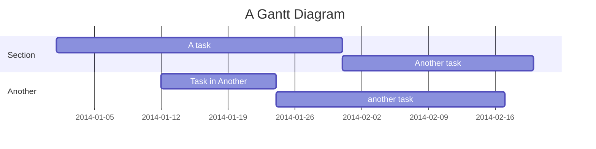
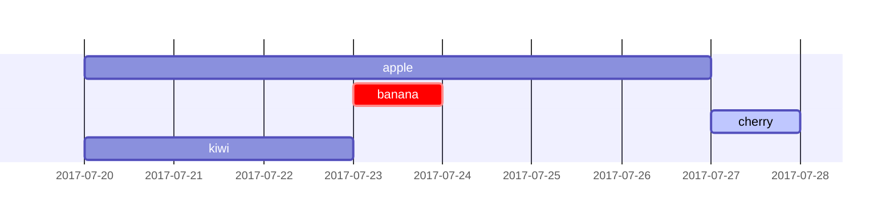
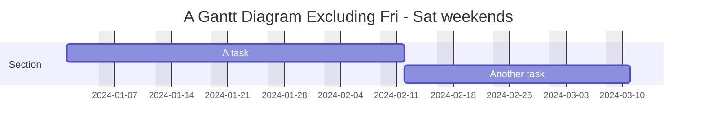

> **Warning**
>
> ## THIS IS AN AUTOGENERATED FILE. DO NOT EDIT.
>
> ## Please edit the corresponding file in [/packages/mermaid/src/docs/syntax/gantt.md](../../packages/mermaid/src/docs/syntax/gantt.md).

# Gantt diagrams

> A Gantt chart is a type of bar chart, first developed by Karol Adamiecki in 1896, and independently by Henry Gantt in the 1910s, that illustrates a project schedule and the amount of time it would take for any one project to finish. Gantt charts illustrate number of days between the start and finish dates of the terminal elements and summary elements of a project.

## A note to users

Gantt Charts will record each scheduled task as one continuous bar that extends from the left to the right. The x axis represents time and the y records the different tasks and the order in which they are to be completed.

It is important to remember that when a date, day, or collection of dates specific to a task are "excluded", the Gantt Chart will accommodate those changes by extending an equal number of days, towards the right, not by creating a gap inside the task.
As shown here 

However, if the excluded dates are between two tasks that are set to start consecutively, the excluded dates will be skipped graphically and left blank, and the following task will begin after the end of the excluded dates.
As shown here 

A Gantt chart is useful for tracking the amount of time it would take before a project is finished, but it can also be used to graphically represent "non-working days", with a few tweaks.

Mermaid can render Gantt diagrams as SVG, PNG or a MarkDown link that can be pasted into docs.




## Syntax


Tasks are by default sequential. A task start date defaults to the end date of the preceding task.

A colon, `:`, separates the task title from its metadata.
Metadata items are separated by a comma, `,`. Valid tags are `active`, `done`, `crit`, and `milestone`. Tags are optional, but if used, they must be specified first.
After processing the tags, the remaining metadata items are interpreted as follows:

1. If a single item is specified, it determines when the task ends. It can either be a specific date/time or a duration. If a duration is specified, it is added to the start date of the task to determine the end date of the task, taking into account any exclusions.
2. If two items are specified, the last item is interpreted as in the previous case. The first item can either specify an explicit start date/time (in the format specified by `dateFormat`) or reference another task using `after <otherTaskID> [[otherTaskID2 [otherTaskID3]]...]`. In the latter case, the start date of the task will be set according to the latest end date of any referenced task.
3. If three items are specified, the last two will be interpreted as in the previous case. The first item will denote the ID of the task, which can be referenced using the `later <taskID>` syntax.

| Metadata syntax                                      | Start date                                          | End date                                              | ID       |
| ---------------------------------------------------- | --------------------------------------------------- | ----------------------------------------------------- | -------- |
| `<taskID>, <startDate>, <endDate>`                   | `startdate` as interpreted using `dateformat`       | `endDate` as interpreted using `dateformat`           | `taskID` |
| `<taskID>, <startDate>, <length>`                    | `startdate` as interpreted using `dateformat`       | Start date + `length`                                 | `taskID` |
| `<taskID>, after <otherTaskId>, <endDate>`           | End date of previously specified task `otherTaskID` | `endDate` as interpreted using `dateformat`           | `taskID` |
| `<taskID>, after <otherTaskId>, <length>`            | End date of previously specified task `otherTaskID` | Start date + `length`                                 | `taskID` |
| `<taskID>, <startDate>, until <otherTaskId>`         | `startdate` as interpreted using `dateformat`       | Start date of previously specified task `otherTaskID` | `taskID` |
| `<taskID>, after <otherTaskId>, until <otherTaskId>` | End date of previously specified task `otherTaskID` | Start date of previously specified task `otherTaskID` | `taskID` |
| `<startDate>, <endDate>`                             | `startdate` as interpreted using `dateformat`       | `enddate` as interpreted using `dateformat`           | n/a      |
| `<startDate>, <length>`                              | `startdate` as interpreted using `dateformat`       | Start date + `length`                                 | n/a      |
| `after <otherTaskID>, <endDate>`                     | End date of previously specified task `otherTaskID` | `enddate` as interpreted using `dateformat`           | n/a      |
| `after <otherTaskID>, <length>`                      | End date of previously specified task `otherTaskID` | Start date + `length`                                 | n/a      |
| `<startDate>, until <otherTaskId>`                   | `startdate` as interpreted using `dateformat`       | Start date of previously specified task `otherTaskID` | n/a      |
| `after <otherTaskId>, until <otherTaskId>`           | End date of previously specified task `otherTaskID` | Start date of previously specified task `otherTaskID` | n/a      |
| `<endDate>`                                          | End date of preceding task                          | `enddate` as interpreted using `dateformat`           | n/a      |
| `<length>`                                           | End date of preceding task                          | Start date + `length`                                 | n/a      |
| `until <otherTaskId>`                                | End date of preceding task                          | Start date of previously specified task `otherTaskID` | n/a      |

> **Note**
> Support for keyword `until` was added in (v10.9.0+). This can be used to define a task which is running until some other specific task or milestone starts.

For simplicity, the table does not show the use of multiple tasks listed with the `after` keyword. Here is an example of how to use it and how it's interpreted:




### Title

The `title` is an _optional_ string to be displayed at the top of the Gantt chart to describe the chart as a whole.

### Excludes

The `excludes` is an _optional_ attribute that accepts specific dates in YYYY-MM-DD format, days of the week ("sunday") or "weekends", but not the word "weekdays".
These date will be marked on the graph, and be excluded from the duration calculation of tasks. Meaning that if there are excluded dates during a task interval, the number of 'skipped' days will be added to the end of the task to ensure the duration is as specified in the code.

#### Weekend (v\11.0.0+)

When excluding weekends, it is possible to configure the weekends to be either Friday and Saturday or Saturday and Sunday. By default weekends are Saturday and Sunday.
To define the weekend start day, there is an _optional_ attribute `weekend` that can be added in a new line followed by either `friday` or `saturday`.




### Section statements

You can divide the chart into various sections, for example to separate different parts of a project like development and documentation.

To do so, start a line with the `section` keyword and give it a name. (Note that unlike with the [title for the entire chart](#title), this name is _required_.

### Milestones

You can add milestones to the diagrams. Milestones differ from tasks as they represent a single instant in time and are identified by the keyword `milestone`. Below is an example on how to use milestones. As you may notice, the exact location of the milestone is determined by the initial date for the milestone and the "duration" of the task this way: _initial date_+_duration_/2.

```mermaid
gantt
    dateFormat HH:mm
    axisFormat %H:%M
    Initial milestone : milestone, m1, 17:49, 2m
    Task A : 10m
    Task B : 5m
    Final milestone : milestone, m2, 18:08, 4m
```




## Setting dates

`dateFormat` defines the format of the date **input** of your gantt elements. How these dates are represented in the rendered chart **output** are defined by `axisFormat`.

### Input date format

The default input date format is `YYYY-MM-DD`. You can define your custom `dateFormat`.

```markdown
dateFormat YYYY-MM-DD
```

The following formatting options are supported:

| Input      | Example        | Description                                            |
| ---------- | -------------- | ------------------------------------------------------ |
| `YYYY`     | 2014           | 4 digit year                                           |
| `YY`       | 14             | 2 digit year                                           |
| `Q`        | 1..4           | Quarter of year. Sets month to first month in quarter. |
| `M MM`     | 1..12          | Month number                                           |
| `MMM MMMM` | January..Dec   | Month name in locale set by `dayjs.locale()`           |
| `D DD`     | 1..31          | Day of month                                           |
| `Do`       | 1st..31st      | Day of month with ordinal                              |
| `DDD DDDD` | 1..365         | Day of year                                            |
| `X`        | 1410715640.579 | Unix timestamp                                         |
| `x`        | 1410715640579  | Unix ms timestamp                                      |
| `H HH`     | 0..23          | 24 hour time                                           |
| `h hh`     | 1..12          | 12 hour time used with `a A`.                          |
| `a A`      | am pm          | Post or ante meridiem                                  |
| `m mm`     | 0..59          | Minutes                                                |
| `s ss`     | 0..59          | Seconds                                                |
| `S`        | 0..9           | Tenths of a second                                     |
| `SS`       | 0..99          | Hundreds of a second                                   |
| `SSS`      | 0..999         | Thousandths of a second                                |
| `Z ZZ`     | +12:00         | Offset from UTC as +-HH:mm, +-HHmm, or Z               |

More info in: <https://day.js.org/docs/en/parse/string-format/>

### Output date format on the axis

The default output date format is `YYYY-MM-DD`. You can define your custom `axisFormat`, like `2020-Q1` for the first quarter of the year 2020.

```markdown
axisFormat %Y-%m-%d
```

The following formatting strings are supported:

| Format | Definition                                                                                 |
| ------ | ------------------------------------------------------------------------------------------ |
| %a     | abbreviated weekday name                                                                   |
| %A     | full weekday name                                                                          |
| %b     | abbreviated month name                                                                     |
| %B     | full month name                                                                            |
| %c     | date and time, as "%a %b %e %H:%M:%S %Y"                                                   |
| %d     | zero-padded day of the month as a decimal number \[01,31]                                  |
| %e     | space-padded day of the month as a decimal number \[ 1,31]; equivalent to %\_d             |
| %H     | hour (24-hour clock) as a decimal number \[00,23]                                          |
| %I     | hour (12-hour clock) as a decimal number \[01,12]                                          |
| %j     | day of the year as a decimal number \[001,366]                                             |
| %m     | month as a decimal number \[01,12]                                                         |
| %M     | minute as a decimal number \[00,59]                                                        |
| %L     | milliseconds as a decimal number \[000, 999]                                               |
| %p     | either AM or PM                                                                            |
| %S     | second as a decimal number \[00,61]                                                        |
| %U     | week number of the year (Sunday as the first day of the week) as a decimal number \[00,53] |
| %w     | weekday as a decimal number \[0(Sunday),6]                                                 |
| %W     | week number of the year (Monday as the first day of the week) as a decimal number \[00,53] |
| %x     | date, as "%m/%d/%Y"                                                                        |
| %X     | time, as "%H:%M:%S"                                                                        |
| %y     | year without century as a decimal number \[00,99]                                          |
| %Y     | year with century as a decimal number                                                      |
| %Z     | time zone offset, such as "-0700"                                                          |
| %%     | a literal "%" character                                                                    |

More info in: <https://github.com/d3/d3-time-format/tree/v4.0.0#locale_format>

### Axis ticks (v10.3.0+)

The default output ticks are auto. You can custom your `tickInterval`, like `1day` or `1week`.

```markdown
tickInterval 1day
```

The pattern is:

```javascript
/^([1-9][0-9]*)(millisecond|second|minute|hour|day|week|month)$/;
```

More info in: <https://github.com/d3/d3-time#interval_every>

Week-based `tickInterval`s start the week on sunday by default. If you wish to specify another weekday on which the `tickInterval` should start, use the `weekday` option:

```mermaid-example
gantt
  tickInterval 1week
  weekday monday
```

```mermaid
gantt
  tickInterval 1week
  weekday monday
```

> **Warning** > `millisecond` and `second` support was added in v10.3.0

## Output in compact mode

The compact mode allows you to display multiple tasks in the same row. Compact mode can be enabled for a gantt chart by setting the display mode of the graph via preceding YAML settings.


## Comments

Comments can be entered within a gantt chart, which will be ignored by the parser. Comments need to be on their own line and must be prefaced with `%%` (double percent signs). Any text after the start of the comment to the next newline will be treated as a comment, including any diagram syntax.


## Styling

Styling of the Gantt diagram is done by defining a number of CSS classes. During rendering, these classes are extracted from the file located at src/diagrams/gantt/styles.js

### Classes used

| Class                 | Description                                                            |
| --------------------- | ---------------------------------------------------------------------- |
| grid.tick             | Styling for the Grid Lines                                             |
| grid.path             | Styling for the Grid's borders                                         |
| .taskText             | Task Text Styling                                                      |
| .taskTextOutsideRight | Styling for Task Text that exceeds the activity bar towards the right. |
| .taskTextOutsideLeft  | Styling for Task Text that exceeds the activity bar, towards the left. |
| todayMarker           | Toggle and Styling for the "Today Marker"                              |

### Sample stylesheet

```css
.grid .tick {
  stroke: lightgrey;
  opacity: 0.3;
  shape-rendering: crispEdges;
}
.grid path {
  stroke-width: 0;
}

#tag {
  color: white;
  background: #fa283d;
  width: 150px;
  position: absolute;
  display: none;
  padding: 3px 6px;
  margin-left: -80px;
  font-size: 11px;
}

#tag:before {
  border: solid transparent;
  content: ' ';
  height: 0;
  left: 50%;
  margin-left: -5px;
  position: absolute;
  width: 0;
  border-width: 10px;
  border-bottom-color: #fa283d;
  top: -20px;
}
.taskText {
  fill: white;
  text-anchor: middle;
}
.taskTextOutsideRight {
  fill: black;
  text-anchor: start;
}
.taskTextOutsideLeft {
  fill: black;
  text-anchor: end;
}
```

## Today marker

You can style or hide the marker for the current date. To style it, add a value for the `todayMarker` key.

```
todayMarker stroke-width:5px,stroke:#0f0,opacity:0.5
```

To hide the marker, set `todayMarker` to `off`.

```
todayMarker off
```

## Configuration

It is possible to adjust the margins for rendering the gantt diagram.

This is done by defining the `ganttConfig` part of the configuration object.
How to use the CLI is described in the [mermaidCLI](../config/mermaidCLI.md) page.

mermaid.ganttConfig can be set to a JSON string with config parameters or the corresponding object.

```javascript
mermaid.ganttConfig = {
  titleTopMargin: 25, // Margin top for the text over the diagram
  barHeight: 20, // The height of the bars in the graph
  barGap: 4, // The margin between the different activities in the gantt diagram
  topPadding: 75, // Margin between title and gantt diagram and between axis and gantt diagram.
  rightPadding: 75, // The space allocated for the section name to the right of the activities
  leftPadding: 75, // The space allocated for the section name to the left of the activities
  gridLineStartPadding: 10, // Vertical starting position of the grid lines
  fontSize: 12, // Font size
  sectionFontSize: 24, // Font size for sections
  numberSectionStyles: 1, // The number of alternating section styles
  axisFormat: '%d/%m', // Date/time format of the axis
  tickInterval: '1week', // Axis ticks
  topAxis: true, // When this flag is set, date labels will be added to the top of the chart
  displayMode: 'compact', // Turns compact mode on
  weekday: 'sunday', // On which day a week-based interval should start
};
```

### Possible configuration params:

| Param           | Description                                                                                                                                | Default value |
| --------------- | ------------------------------------------------------------------------------------------------------------------------------------------ | ------------- |
| mirrorActor     | Turns on/off the rendering of actors below the diagram as well as above it                                                                 | false         |
| bottomMarginAdj | Adjusts how far down the graph ended. Wide borders styles with css could generate unwanted clipping which is why this config param exists. | 1             |

## Interaction

It is possible to bind a click event to a task. The click can lead to either a javascript callback or to a link which will be opened in the current browser tab. **Note**: This functionality is disabled when using `securityLevel='strict'` and enabled when using `securityLevel='loose'`.

```
click taskId call callback(arguments)
click taskId href URL
```

- taskId is the id of the task
- callback is the name of a javascript function defined on the page displaying the graph, the function will be called with the taskId as the parameter if no other arguments are specified.

Beginner's tip—a full example using interactive links in an html context:

```html
<body>
  <pre class="mermaid">
    gantt
      dateFormat  YYYY-MM-DD

      section Clickable
      Visit mermaidjs         :active, cl1, 2014-01-07, 3d
      Print arguments         :cl2, after cl1, 3d
      Print task              :cl3, after cl2, 3d

      click cl1 href "https://mermaidjs.github.io/"
      click cl2 call printArguments("test1", "test2", test3)
      click cl3 call printTask()
  </pre>

  <script>
    const printArguments = function (arg1, arg2, arg3) {
      alert('printArguments called with arguments: ' + arg1 + ', ' + arg2 + ', ' + arg3);
    };
    const printTask = function (taskId) {
      alert('taskId: ' + taskId);
    };
    const config = {
      startOnLoad: true,
      securityLevel: 'loose',
    };
    mermaid.initialize(config);
  </script>
</body>
```

## Examples

### Bar chart (using gantt chart)

```mermaid
gantt
    title Git Issues - days since last update
    dateFormat X
    axisFormat %s
    section Issue19062
    71   : 0, 71
    section Issue19401
    36   : 0, 36
    section Issue193
    34   : 0, 34
    section Issue7441
    9    : 0, 9
    section Issue1300
    5    : 0, 5
```




<!--- cspell:ignore isadded --->
