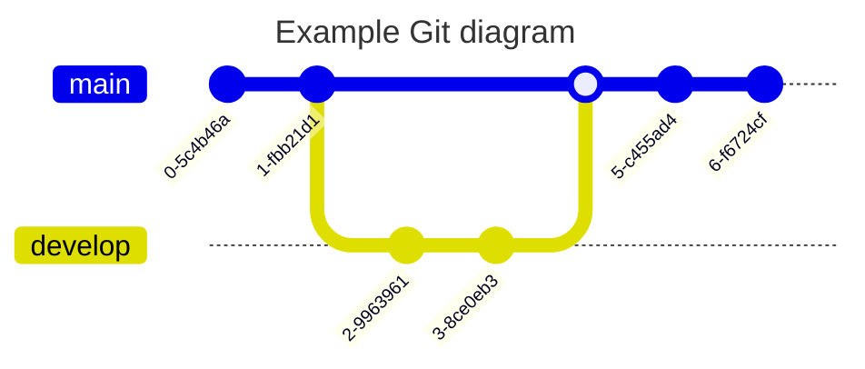
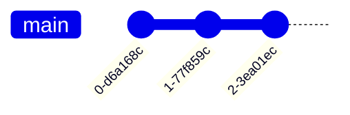
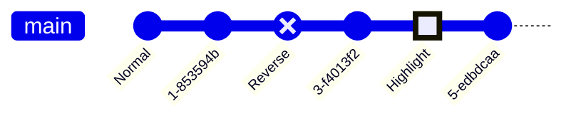
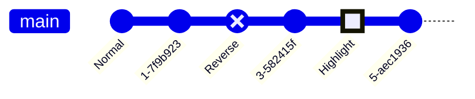
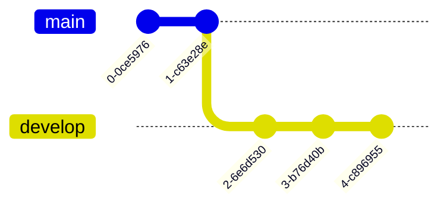
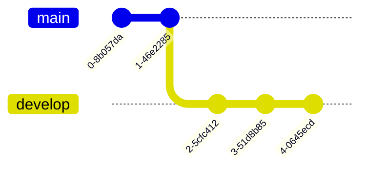
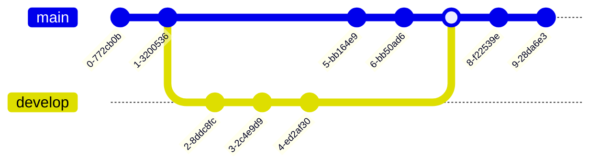

> **Warning**
>
> ## THIS IS AN AUTOGENERATED FILE. DO NOT EDIT.
>
> ## Please edit the corresponding file in [/packages/mermaid/src/docs/syntax/gitgraph.md](../../packages/mermaid/src/docs/syntax/gitgraph.md).

# GitGraph Diagrams

> A Git Graph is a pictorial representation of git commits and git actions(commands) on various branches.

These kind of diagram are particularly helpful to developers and devops teams to share their Git branching strategies. For example, it makes it easier to visualize how git flow works.

Mermaid can render Git diagrams




In Mermaid, we support the basic git operations like:

- _commit_ : Representing a new commit on the current branch.
- _branch_ : To create & switch to a new branch, setting it as the current branch.
- _checkout_ : To checking out an existing branch and setting it as the current branch.
- _merge_ : To merge an existing branch onto the current branch.

With the help of these key git commands, you will be able to draw a gitgraph in Mermaid very easily and quickly.
Entity names are often capitalized, although there is no accepted standard on this, and it is not required in Mermaid.

**NOTE**: `checkout` and `switch` can be used interchangeably.

## Syntax

Mermaid syntax for a gitgraph is very straight-forward and simple. It follows a declarative-approach, where each commit is drawn on the timeline in the diagram, in order of its occurrences/presence in code. Basically, it follows the insertion order for each command.

First thing you do is to declare your diagram type using the **gitgraph** keyword. This `gitgraph` keyword, tells Mermaid that you wish to draw a gitgraph, and parse the diagram code accordingly.

Each gitgraph, is initialized with **_main_** branch. So unless you create a different branch, by-default the commits will go to the main branch. This is driven with how git works, where in the beginning you always start with the main branch (formerly called as **_master_** branch). And by-default, `main` branch is set as your **_current branch_**.

You make use of **_commit_** keyword to register a commit on the current branch. Let see how this works:

A simple gitgraph showing three commits on the default (**_main_**) branch:




If you look closely at the previous example, you can see the default branch `main` along with three commits. Also, notice that by default each commit has been given a unique & random ID. What if you wanted to give your own custom ID to a commit? Yes, it is possible to do that with Mermaid.

### Adding custom commit id

For a given commit you may specify a custom ID at the time of declaring it using the `id` attribute, followed by `:` and your custom value within a `""` quote. For example: `commit id: "your_custom_id"`

Let us see how this works with the help of the following diagram:


In this example, we have given our custom IDs to the commits.

### Modifying commit type

In Mermaid, a commit can be of three type, which render a bit different in the diagram. These types are:

- `NORMAL` : Default commit type. Represented by a solid circle in the diagram
- `REVERSE` : To emphasize a commit as a reverse commit. Represented by a crossed solid circle in the diagram.
- `HIGHLIGHT` : To highlight a particular commit in the diagram. Represented by a filled rectangle in the diagram.

For a given commit you may specify its type at the time of declaring it using the `type` attribute, followed by `:` and the required type option discussed above. For example: `commit type: HIGHLIGHT`

NOTE: If no commit type is specified, `NORMAL` is picked as default.

Let us see how these different commit type look with the help of the following diagram:





In this example, we have specified different types to each commit. Also, see how we have included both `id` and `type` together at the time of declaring our commits.

### Adding Tags

For a given commit you may decorate it as a **tag**, similar to the concept of tags or release version in git world.
You can attach a custom tag at the time of declaring a commit using the `tag` attribute, followed by `:` and your custom value within `""` quote. For example: `commit tag: "your_custom_tag"`

Let us see how this works with the help of the following diagram:


In this example, we have given custom tags to the commits. Also, see how we have combined all these attributes in a single commit declaration. You can mix-match these attributes as you like.

### Create a new branch

In Mermaid, in-order to create a new branch, you make use of the `branch` keyword. You also need to provide a name of the new branch. The name has to be unique and cannot be that of an existing branch. A branch name that could be confused for a keyword must be quoted within `""`. Usage examples: `branch develop`, `branch "cherry-pick"`

When Mermaid, reads the `branch` keyword, it creates a new branch and sets it as the current branch. Equivalent to you creating a new branch and checking it out in Git world.

Let see this in an example:





In this example, see how we started with default `main` branch, and pushed two commits on that.
Then we created the `develop` branch, and all commits afterwards are put on the `develop` branch as it became the current branch.

### Checking out an existing branch

In Mermaid, in order to switch to an existing branch, you make use of the `checkout` keyword. You also need to provide a name of an existing branch. If no branch is found with the given name, it will result in console error. Usage example: `checkout develop`

When Mermaid, reads the `checkout` keyword, it finds the given branch and sets it as the current branch. Equivalent to checking out a branch in the Git world.

Let see modify our previous example:


In this example, see how we started with default `main` branch, and pushed two commits on that.
Then we created the `develop` branch, and all three commits afterwards are put on the `develop` branch as it became the current branch.
After this we made use of the `checkout` keyword to set the current branch as `main`, and all commit that follow are registered against the current branch, i.e. `main`.

### Merging two branches

In Mermaid, in order to merge or join to an existing branch, you make use of the `merge` keyword. You also need to provide the name of an existing branch to merge from. If no branch is found with the given name, it will result in console error. Also, you can only merge two separate branches, and cannot merge a branch with itself. In such case an error is throw.

Usage example: `merge develop`

When Mermaid, reads the `merge` keyword, it finds the given branch and its head commit (the last commit on that branch), and joins it with the head commit on the **current branch**. Each merge results in a **_merge commit_**, represented in the diagram with **filled double circle**.

Let us modify our previous example to merge our two branches:




In this example, see how we started with default `main` branch, and pushed two commits on that.
Then we created the `develop` branch, and all three commits afterwards are put on the `develop` branch as it became the current branch.
After this we made use of the `checkout` keyword to set the current branch as `main`, and all commits that follow are registered against the current branch, i.e. `main`.
After this we merge the `develop` branch onto the current branch `main`, resulting in a merge commit.
Since the current branch at this point is still `main`, the last two commits are registered against that.

You can also decorate your merge with similar attributes as you did for the commit using:

- `id`--> To override the default ID with custom ID
- `tag`--> To add a custom tag to your merge commit
- `type`--> To override the default shape of merge commit. Here you can use other commit type mentioned earlier.

And you can choose to use none, some or all of these attributes together.
For example: `merge develop id: "my_custom_id" tag: "my_custom_tag" type: REVERSE`

Let us see how this works with the help of the following diagram:


### Cherry Pick commit from another branch

Similar to how 'git' allows you to cherry-pick a commit from **another branch** onto the **current** branch, Mermaid also supports this functionality. You can also cherry-pick a commit from another branch using the `cherry-pick` keyword.

To use the `cherry-pick` keyword, you must specify the id using the `id` attribute, followed by `:` and your desired commit id within a `""` quote. For example:

`cherry-pick id: "your_custom_id"`

Here, a new commit representing the cherry-pick is created on the current branch, and is visually highlighted in the diagram with a **cherry** and a tag depicting the commit id from which it is cherry-picked from.

A few important rules to note here are:

1. You need to provide the `id` for an existing commit to be cherry-picked. If given commit id does not exist it will result in an error. For this, make use of the `commit id:$value` format of declaring commits. See the examples from above.
2. The given commit must not exist on the current branch. The cherry-picked commit must always be a different branch than the current branch.
3. Current branch must have at least one commit, before you can cherry-pick, otherwise it will cause an error is throw.
4. When cherry-picking a merge commit, providing a parent commit ID is mandatory. If the parent attribute is omitted or an invalid parent commit ID is provided, an error will be thrown.
5. The specified parent commit must be an immediate parent of the merge commit being cherry-picked.

Let see an example:


## GitGraph specific configuration options

In Mermaid, you have the option to configure the gitgraph diagram. You can configure the following options:

- `showBranches` : Boolean, default is `true`. If set to `false`, the branches are not shown in the diagram.
- `showCommitLabel` : Boolean, default is `true`. If set to `false`, the commit labels are not shown in the diagram.
- `mainBranchName` : String, default is `main`. The name of the default/root branch.
- `mainBranchOrder` : Position of the main branch in the list of branches. default is `0`, meaning, by default `main` branch is the first in the order.
- `parallelCommits`: Boolean, default is `false`. If set to `true`, commits x distance away from the parent are shown at the same level in the diagram.

Let's look at them one by one.

## Hiding Branch names and lines

Sometimes you may want to hide the branch names and lines from the diagram. You can do this by using the `showBranches` keyword. By default its value is `true`. You can set it to `false` using directives.

Usage example:

```mermaid-example
---
config:
  logLevel: 'debug'
  theme: 'base'
  gitGraph:
    showBranches: false
---
      gitGraph
        commit
        branch hotfix
        checkout hotfix
        commit
        branch develop
        checkout develop
        commit id:"ash" tag:"abc"
        branch featureB
        checkout featureB
        commit type:HIGHLIGHT
        checkout main
        checkout hotfix
        commit type:NORMAL
        checkout develop
        commit type:REVERSE
        checkout featureB
        commit
        checkout main
        merge hotfix
        checkout featureB
        commit
        checkout develop
        branch featureA
        commit
        checkout develop
        merge hotfix
        checkout featureA
        commit
        checkout featureB
        commit
        checkout develop
        merge featureA
        branch release
        checkout release
        commit
        checkout main
        commit
        checkout release
        merge main
        checkout develop
        merge release
```

```mermaid
---
config:
  logLevel: 'debug'
  theme: 'base'
  gitGraph:
    showBranches: false
---
      gitGraph
        commit
        branch hotfix
        checkout hotfix
        commit
        branch develop
        checkout develop
        commit id:"ash" tag:"abc"
        branch featureB
        checkout featureB
        commit type:HIGHLIGHT
        checkout main
        checkout hotfix
        commit type:NORMAL
        checkout develop
        commit type:REVERSE
        checkout featureB
        commit
        checkout main
        merge hotfix
        checkout featureB
        commit
        checkout develop
        branch featureA
        commit
        checkout develop
        merge hotfix
        checkout featureA
        commit
        checkout featureB
        commit
        checkout develop
        merge featureA
        branch release
        checkout release
        commit
        checkout main
        commit
        checkout release
        merge main
        checkout develop
        merge release
```

## Commit labels Layout: Rotated or Horizontal

Mermaid supports two types of commit labels layout. The default layout is **rotated**, which means the labels are placed below the commit circle, rotated at 45 degrees for better readability. This is particularly useful for commits with long labels.

The other option is **horizontal**, which means the labels are placed below the commit circle centred horizontally, and are not rotated. This is particularly useful for commits with short labels.

You can change the layout of the commit labels by using the `rotateCommitLabel` keyword in the directive. It defaults to `true`, which means the commit labels are rotated.

Usage example: Rotated commit labels

```mermaid-example
---
config:
  logLevel: 'debug'
  theme: 'base'
  gitGraph:
    rotateCommitLabel: true
---
gitGraph
  commit id: "feat(api): ..."
  commit id: "a"
  commit id: "b"
  commit id: "fix(client): .extra long label.."
  branch c2
  commit id: "feat(modules): ..."
  commit id: "test(client): ..."
  checkout main
  commit id: "fix(api): ..."
  commit id: "ci: ..."
  branch b1
  commit
  branch b2
  commit
```

```mermaid
---
config:
  logLevel: 'debug'
  theme: 'base'
  gitGraph:
    rotateCommitLabel: true
---
gitGraph
  commit id: "feat(api): ..."
  commit id: "a"
  commit id: "b"
  commit id: "fix(client): .extra long label.."
  branch c2
  commit id: "feat(modules): ..."
  commit id: "test(client): ..."
  checkout main
  commit id: "fix(api): ..."
  commit id: "ci: ..."
  branch b1
  commit
  branch b2
  commit
```

Usage example: Horizontal commit labels

```mermaid-example
---
config:
  logLevel: 'debug'
  theme: 'base'
  gitGraph:
    rotateCommitLabel: false
---
gitGraph
  commit id: "feat(api): ..."
  commit id: "a"
  commit id: "b"
  commit id: "fix(client): .extra long label.."
  branch c2
  commit id: "feat(modules): ..."
  commit id: "test(client): ..."
  checkout main
  commit id: "fix(api): ..."
  commit id: "ci: ..."
  branch b1
  commit
  branch b2
  commit
```

```mermaid
---
config:
  logLevel: 'debug'
  theme: 'base'
  gitGraph:
    rotateCommitLabel: false
---
gitGraph
  commit id: "feat(api): ..."
  commit id: "a"
  commit id: "b"
  commit id: "fix(client): .extra long label.."
  branch c2
  commit id: "feat(modules): ..."
  commit id: "test(client): ..."
  checkout main
  commit id: "fix(api): ..."
  commit id: "ci: ..."
  branch b1
  commit
  branch b2
  commit
```

## Hiding commit labels

Sometimes you may want to hide the commit labels from the diagram. You can do this by using the `showCommitLabel` keyword. By default its value is `true`. You can set it to `false` using directives.

Usage example:

```mermaid-example
---
config:
  logLevel: 'debug'
  theme: 'base'
  gitGraph:
    showBranches: false
    showCommitLabel: false
---
      gitGraph
        commit
        branch hotfix
        checkout hotfix
        commit
        branch develop
        checkout develop
        commit id:"ash"
        branch featureB
        checkout featureB
        commit type:HIGHLIGHT
        checkout main
        checkout hotfix
        commit type:NORMAL
        checkout develop
        commit type:REVERSE
        checkout featureB
        commit
        checkout main
        merge hotfix
        checkout featureB
        commit
        checkout develop
        branch featureA
        commit
        checkout develop
        merge hotfix
        checkout featureA
        commit
        checkout featureB
        commit
        checkout develop
        merge featureA
        branch release
        checkout release
        commit
        checkout main
        commit
        checkout release
        merge main
        checkout develop
        merge release
```

```mermaid
---
config:
  logLevel: 'debug'
  theme: 'base'
  gitGraph:
    showBranches: false
    showCommitLabel: false
---
      gitGraph
        commit
        branch hotfix
        checkout hotfix
        commit
        branch develop
        checkout develop
        commit id:"ash"
        branch featureB
        checkout featureB
        commit type:HIGHLIGHT
        checkout main
        checkout hotfix
        commit type:NORMAL
        checkout develop
        commit type:REVERSE
        checkout featureB
        commit
        checkout main
        merge hotfix
        checkout featureB
        commit
        checkout develop
        branch featureA
        commit
        checkout develop
        merge hotfix
        checkout featureA
        commit
        checkout featureB
        commit
        checkout develop
        merge featureA
        branch release
        checkout release
        commit
        checkout main
        commit
        checkout release
        merge main
        checkout develop
        merge release
```

## Customizing main branch name

Sometimes you may want to customize the name of the main/default branch. You can do this by using the `mainBranchName` keyword. By default its value is `main`. You can set it to any string using directives.

Usage example:

```mermaid-example
---
config:
  logLevel: 'debug'
  theme: 'base'
  gitGraph:
    showBranches: true
    showCommitLabel: true
    mainBranchName: 'MetroLine1'
---
      gitGraph
        commit id:"NewYork"
        commit id:"Dallas"
        branch MetroLine2
        commit id:"LosAngeles"
        commit id:"Chicago"
        commit id:"Houston"
        branch MetroLine3
        commit id:"Phoenix"
        commit type: HIGHLIGHT id:"Denver"
        commit id:"Boston"
        checkout MetroLine1
        commit id:"Atlanta"
        merge MetroLine3
        commit id:"Miami"
        commit id:"Washington"
        merge MetroLine2 tag:"MY JUNCTION"
        commit id:"Boston"
        commit id:"Detroit"
        commit type:REVERSE id:"SanFrancisco"
```

```mermaid
---
config:
  logLevel: 'debug'
  theme: 'base'
  gitGraph:
    showBranches: true
    showCommitLabel: true
    mainBranchName: 'MetroLine1'
---
      gitGraph
        commit id:"NewYork"
        commit id:"Dallas"
        branch MetroLine2
        commit id:"LosAngeles"
        commit id:"Chicago"
        commit id:"Houston"
        branch MetroLine3
        commit id:"Phoenix"
        commit type: HIGHLIGHT id:"Denver"
        commit id:"Boston"
        checkout MetroLine1
        commit id:"Atlanta"
        merge MetroLine3
        commit id:"Miami"
        commit id:"Washington"
        merge MetroLine2 tag:"MY JUNCTION"
        commit id:"Boston"
        commit id:"Detroit"
        commit type:REVERSE id:"SanFrancisco"
```

Look at the imaginary railroad map created using Mermaid. Here, we have changed the default main branch name to `MetroLine1`.

## Customizing branch ordering

In Mermaid, by default the branches are shown in the order of their definition or appearance in the diagram code.

Sometimes you may want to customize the order of the branches. You can do this by using the `order` keyword next the branch definition. You can set it to a positive number.

Mermaid follows the given precedence order of the `order` keyword.

- Main branch is always shown first as it has default order value of `0`. (unless its order is modified and changed from `0` using the `mainBranchOrder` keyword in the config)
- Next, All branches without an `order` are shown in the order of their appearance in the diagram code.
- Next, All branches with an `order` are shown in the order of their `order` value.

To fully control the order of all the branches, you must define `order` for all the branches.

Usage example:

```mermaid-example
---
config:
  logLevel: 'debug'
  theme: 'base'
  gitGraph:
    showBranches: true
    showCommitLabel: true
---
      gitGraph
      commit
      branch test1 order: 3
      branch test2 order: 2
      branch test3 order: 1

```

```mermaid
---
config:
  logLevel: 'debug'
  theme: 'base'
  gitGraph:
    showBranches: true
    showCommitLabel: true
---
      gitGraph
      commit
      branch test1 order: 3
      branch test2 order: 2
      branch test3 order: 1

```

Look at the diagram, all the branches are following the order defined.

Usage example:

```mermaid-example
---
config:
  logLevel: 'debug'
  theme: 'base'
  gitGraph:
    showBranches: true
    showCommitLabel: true
    mainBranchOrder: 2
---
      gitGraph
      commit
      branch test1 order: 3
      branch test2
      branch test3
      branch test4 order: 1

```

```mermaid
---
config:
  logLevel: 'debug'
  theme: 'base'
  gitGraph:
    showBranches: true
    showCommitLabel: true
    mainBranchOrder: 2
---
      gitGraph
      commit
      branch test1 order: 3
      branch test2
      branch test3
      branch test4 order: 1

```

Look at the diagram, here, all the branches without a specified order are drawn in their order of definition.
Then, `test4` branch is drawn because the order of `1`.
Then, `main` branch is drawn because the order of `2`.
And, lastly `test1`is drawn because the order of `3`.

NOTE: Because we have overridden the `mainBranchOrder` to `2`, the `main` branch is not drawn in the beginning, instead follows the ordering.

Here, we have changed the default main branch name to `MetroLine1`.

## Orientation (v10.3.0+)

Mermaid supports three graph orientations: **Left-to-Right** (default), **Top-to-Bottom**, and **Bottom-to-Top**.

You can set this with either `LR:` (for [**Left-to-Right**](#left-to-right-default-lr)), `TB:` (for [**Top-to-Bottom**](#top-to-bottom-tb)) or `BT:` (for [**Bottom-to-Top**](#bottom-to-top-bt)) after `gitGraph`.

### Left to Right (default, `LR:`)

In Mermaid, the default orientation is for commits to run from left to right and for branches to be stacked on top of one another.

However, you can set this explicitly with `LR:` after `gitGraph`.

Usage example:

```mermaid-example
    gitGraph LR:
       commit
       commit
       branch develop
       commit
       commit
       checkout main
       commit
       commit
       merge develop
       commit
       commit
```

```mermaid
    gitGraph LR:
       commit
       commit
       branch develop
       commit
       commit
       checkout main
       commit
       commit
       merge develop
       commit
       commit
```

### Top to Bottom (`TB:`)

In `TB` (**Top-to-Bottom**) orientation, the commits run from top to bottom of the graph and branches are arranged side-by-side.

To orient the graph this way, you need to add `TB:` after gitGraph.

Usage example:

```mermaid-example
    gitGraph TB:
       commit
       commit
       branch develop
       commit
       commit
       checkout main
       commit
       commit
       merge develop
       commit
       commit
```

```mermaid
    gitGraph TB:
       commit
       commit
       branch develop
       commit
       commit
       checkout main
       commit
       commit
       merge develop
       commit
       commit
```

### Bottom to Top (`BT:`) (v11.0.0+)

In `BT` (**Bottom-to-Top**) orientation, the commits run from bottom to top of the graph and branches are arranged side-by-side.

To orient the graph this way, you need to add `BT:` after gitGraph.

Usage example:

```mermaid-example
    gitGraph BT:
       commit
       commit
       branch develop
       commit
       commit
       checkout main
       commit
       commit
       merge develop
       commit
       commit
```

```mermaid
    gitGraph BT:
       commit
       commit
       branch develop
       commit
       commit
       checkout main
       commit
       commit
       merge develop
       commit
       commit
```

## Parallel commits (v10.8.0+)

Commits in Mermaid display temporal information in gitgraph by default. For example if two commits are one commit away from its parent, the commit that was made earlier is rendered closer to its parent. You can turn this off by enabling the `parallelCommits` flag.

### Temporal Commits (default, `parallelCommits: false`)

```mermaid-example
---
config:
  gitGraph:
    parallelCommits: false
---
gitGraph:
  commit
  branch develop
  commit
  commit
  checkout main
  commit
  commit
```

```mermaid
---
config:
  gitGraph:
    parallelCommits: false
---
gitGraph:
  commit
  branch develop
  commit
  commit
  checkout main
  commit
  commit
```

### Parallel commits (`parallelCommits: true`)

```mermaid-example
---
config:
  gitGraph:
    parallelCommits: true
---
gitGraph:
  commit
  branch develop
  commit
  commit
  checkout main
  commit
  commit
```

```mermaid
---
config:
  gitGraph:
    parallelCommits: true
---
gitGraph:
  commit
  branch develop
  commit
  commit
  checkout main
  commit
  commit
```

## Themes

Mermaid supports a bunch of pre-defined themes which you can use to find the right one for you. PS: you can actually override an existing theme's variable to get your own custom theme going. Learn more about [theming your diagram](../config/theming.md).

The following are the different pre-defined theme options:

- `base`
- `forest`
- `dark`
- `default`
- `neutral`

**NOTE**: To change theme you can either use the `initialize` call or _directives_. Learn more about [directives](../config/directives.md)
Let's put them to use, and see how our sample diagram looks in different themes:

### Base Theme

```mermaid-example
---
config:
  logLevel: 'debug'
  theme: 'base'
---
      gitGraph
        commit
        branch hotfix
        checkout hotfix
        commit
        branch develop
        checkout develop
        commit id:"ash" tag:"abc"
        branch featureB
        checkout featureB
        commit type:HIGHLIGHT
        checkout main
        checkout hotfix
        commit type:NORMAL
        checkout develop
        commit type:REVERSE
        checkout featureB
        commit
        checkout main
        merge hotfix
        checkout featureB
        commit
        checkout develop
        branch featureA
        commit
        checkout develop
        merge hotfix
        checkout featureA
        commit
        checkout featureB
        commit
        checkout develop
        merge featureA
        branch release
        checkout release
        commit
        checkout main
        commit
        checkout release
        merge main
        checkout develop
        merge release
```

```mermaid
---
config:
  logLevel: 'debug'
  theme: 'base'
---
      gitGraph
        commit
        branch hotfix
        checkout hotfix
        commit
        branch develop
        checkout develop
        commit id:"ash" tag:"abc"
        branch featureB
        checkout featureB
        commit type:HIGHLIGHT
        checkout main
        checkout hotfix
        commit type:NORMAL
        checkout develop
        commit type:REVERSE
        checkout featureB
        commit
        checkout main
        merge hotfix
        checkout featureB
        commit
        checkout develop
        branch featureA
        commit
        checkout develop
        merge hotfix
        checkout featureA
        commit
        checkout featureB
        commit
        checkout develop
        merge featureA
        branch release
        checkout release
        commit
        checkout main
        commit
        checkout release
        merge main
        checkout develop
        merge release
```

### Forest Theme

```mermaid-example
---
config:
  logLevel: 'debug'
  theme: 'forest'
---
      gitGraph
        commit
        branch hotfix
        checkout hotfix
        commit
        branch develop
        checkout develop
        commit id:"ash" tag:"abc"
        branch featureB
        checkout featureB
        commit type:HIGHLIGHT
        checkout main
        checkout hotfix
        commit type:NORMAL
        checkout develop
        commit type:REVERSE
        checkout featureB
        commit
        checkout main
        merge hotfix
        checkout featureB
        commit
        checkout develop
        branch featureA
        commit
        checkout develop
        merge hotfix
        checkout featureA
        commit
        checkout featureB
        commit
        checkout develop
        merge featureA
        branch release
        checkout release
        commit
        checkout main
        commit
        checkout release
        merge main
        checkout develop
        merge release
```

```mermaid
---
config:
  logLevel: 'debug'
  theme: 'forest'
---
      gitGraph
        commit
        branch hotfix
        checkout hotfix
        commit
        branch develop
        checkout develop
        commit id:"ash" tag:"abc"
        branch featureB
        checkout featureB
        commit type:HIGHLIGHT
        checkout main
        checkout hotfix
        commit type:NORMAL
        checkout develop
        commit type:REVERSE
        checkout featureB
        commit
        checkout main
        merge hotfix
        checkout featureB
        commit
        checkout develop
        branch featureA
        commit
        checkout develop
        merge hotfix
        checkout featureA
        commit
        checkout featureB
        commit
        checkout develop
        merge featureA
        branch release
        checkout release
        commit
        checkout main
        commit
        checkout release
        merge main
        checkout develop
        merge release
```

### Default Theme

```mermaid-example
---
config:
  logLevel: 'debug'
  theme: 'default'
---
      gitGraph
        commit type:HIGHLIGHT
        branch hotfix
        checkout hotfix
        commit
        branch develop
        checkout develop
        commit id:"ash" tag:"abc"
        branch featureB
        checkout featureB
        commit type:HIGHLIGHT
        checkout main
        checkout hotfix
        commit type:NORMAL
        checkout develop
        commit type:REVERSE
        checkout featureB
        commit
        checkout main
        merge hotfix
        checkout featureB
        commit
        checkout develop
        branch featureA
        commit
        checkout develop
        merge hotfix
        checkout featureA
        commit
        checkout featureB
        commit
        checkout develop
        merge featureA
        branch release
        checkout release
        commit
        checkout main
        commit
        checkout release
        merge main
        checkout develop
        merge release
```

```mermaid
---
config:
  logLevel: 'debug'
  theme: 'default'
---
      gitGraph
        commit type:HIGHLIGHT
        branch hotfix
        checkout hotfix
        commit
        branch develop
        checkout develop
        commit id:"ash" tag:"abc"
        branch featureB
        checkout featureB
        commit type:HIGHLIGHT
        checkout main
        checkout hotfix
        commit type:NORMAL
        checkout develop
        commit type:REVERSE
        checkout featureB
        commit
        checkout main
        merge hotfix
        checkout featureB
        commit
        checkout develop
        branch featureA
        commit
        checkout develop
        merge hotfix
        checkout featureA
        commit
        checkout featureB
        commit
        checkout develop
        merge featureA
        branch release
        checkout release
        commit
        checkout main
        commit
        checkout release
        merge main
        checkout develop
        merge release
```

### Dark Theme

```mermaid-example
---
config:
  logLevel: 'debug'
  theme: 'dark'
---
      gitGraph
        commit
        branch hotfix
        checkout hotfix
        commit
        branch develop
        checkout develop
        commit id:"ash" tag:"abc"
        branch featureB
        checkout featureB
        commit type:HIGHLIGHT
        checkout main
        checkout hotfix
        commit type:NORMAL
        checkout develop
        commit type:REVERSE
        checkout featureB
        commit
        checkout main
        merge hotfix
        checkout featureB
        commit
        checkout develop
        branch featureA
        commit
        checkout develop
        merge hotfix
        checkout featureA
        commit
        checkout featureB
        commit
        checkout develop
        merge featureA
        branch release
        checkout release
        commit
        checkout main
        commit
        checkout release
        merge main
        checkout develop
        merge release
```

```mermaid
---
config:
  logLevel: 'debug'
  theme: 'dark'
---
      gitGraph
        commit
        branch hotfix
        checkout hotfix
        commit
        branch develop
        checkout develop
        commit id:"ash" tag:"abc"
        branch featureB
        checkout featureB
        commit type:HIGHLIGHT
        checkout main
        checkout hotfix
        commit type:NORMAL
        checkout develop
        commit type:REVERSE
        checkout featureB
        commit
        checkout main
        merge hotfix
        checkout featureB
        commit
        checkout develop
        branch featureA
        commit
        checkout develop
        merge hotfix
        checkout featureA
        commit
        checkout featureB
        commit
        checkout develop
        merge featureA
        branch release
        checkout release
        commit
        checkout main
        commit
        checkout release
        merge main
        checkout develop
        merge release
```

### Neutral Theme

```mermaid-example
---
config:
  logLevel: 'debug'
  theme: 'neutral'
---
      gitGraph
        commit
        branch hotfix
        checkout hotfix
        commit
        branch develop
        checkout develop
        commit id:"ash" tag:"abc"
        branch featureB
        checkout featureB
        commit type:HIGHLIGHT
        checkout main
        checkout hotfix
        commit type:NORMAL
        checkout develop
        commit type:REVERSE
        checkout featureB
        commit
        checkout main
        merge hotfix
        checkout featureB
        commit
        checkout develop
        branch featureA
        commit
        checkout develop
        merge hotfix
        checkout featureA
        commit
        checkout featureB
        commit
        checkout develop
        merge featureA
        branch release
        checkout release
        commit
        checkout main
        commit
        checkout release
        merge main
        checkout develop
        merge release
```

```mermaid
---
config:
  logLevel: 'debug'
  theme: 'neutral'
---
      gitGraph
        commit
        branch hotfix
        checkout hotfix
        commit
        branch develop
        checkout develop
        commit id:"ash" tag:"abc"
        branch featureB
        checkout featureB
        commit type:HIGHLIGHT
        checkout main
        checkout hotfix
        commit type:NORMAL
        checkout develop
        commit type:REVERSE
        checkout featureB
        commit
        checkout main
        merge hotfix
        checkout featureB
        commit
        checkout develop
        branch featureA
        commit
        checkout develop
        merge hotfix
        checkout featureA
        commit
        checkout featureB
        commit
        checkout develop
        merge featureA
        branch release
        checkout release
        commit
        checkout main
        commit
        checkout release
        merge main
        checkout develop
        merge release
```

## Customize using Theme Variables

Mermaid allows you to customize your diagram using theme variables which govern the look and feel of various elements of the diagram.

For understanding let us take a sample diagram with theme `default`, the default values of the theme variables is picked automatically from the theme. Later on we will see how to override the default values of the theme variables.

See how the default theme is used to set the colors for the branches:

```mermaid-example
---
config:
  logLevel: 'debug'
  theme: 'default'
---
       gitGraph
       commit
       branch develop
       commit tag:"v1.0.0"
       commit
       checkout main
       commit type: HIGHLIGHT
       commit
       merge develop
       commit
       branch featureA
       commit
```

```mermaid
---
config:
  logLevel: 'debug'
  theme: 'default'
---
       gitGraph
       commit
       branch develop
       commit tag:"v1.0.0"
       commit
       checkout main
       commit type: HIGHLIGHT
       commit
       merge develop
       commit
       branch featureA
       commit
```

> #### IMPORTANT:
>
> Mermaid supports the theme variables to override the default values for **up to 8 branches**, i.e., you can set the color/styling of up to 8 branches using theme variables. After this threshold of 8 branches, the theme variables are reused in the cyclic manner, i.e. the 9th branch will use the color/styling of the 1st branch, or the branch at index position '8' will use the color/styling of the branch at index position '0'.
> _More on this in the next section. See examples on **Customizing branch label colors** below_

### Customizing branch colors

You can customize the branch colors using the `git0` to `git7` theme variables. Mermaid allows you to set the colors for up-to 8 branches, where `git0` variable will drive the value of the first branch, `git1` will drive the value of the second branch and so on.

NOTE: Default values for these theme variables are picked from the selected theme. If you want to override the default values, you can use the `initialize` call to add your custom theme variable values.

Example:

Now let's override the default values for the `git0` to `git3` variables:

```mermaid-example
---
config:
  logLevel: 'debug'
  theme: 'default'
  themeVariables:
      'git0': '#ff0000'
      'git1': '#00ff00'
      'git2': '#0000ff'
      'git3': '#ff00ff'
      'git4': '#00ffff'
      'git5': '#ffff00'
      'git6': '#ff00ff'
      'git7': '#00ffff'
---
       gitGraph
       commit
       branch develop
       commit tag:"v1.0.0"
       commit
       checkout main
       commit type: HIGHLIGHT
       commit
       merge develop
       commit
       branch featureA
       commit

```

```mermaid
---
config:
  logLevel: 'debug'
  theme: 'default'
  themeVariables:
      'git0': '#ff0000'
      'git1': '#00ff00'
      'git2': '#0000ff'
      'git3': '#ff00ff'
      'git4': '#00ffff'
      'git5': '#ffff00'
      'git6': '#ff00ff'
      'git7': '#00ffff'
---
       gitGraph
       commit
       branch develop
       commit tag:"v1.0.0"
       commit
       checkout main
       commit type: HIGHLIGHT
       commit
       merge develop
       commit
       branch featureA
       commit

```

See how the branch colors are changed to the values specified in the theme variables.

### Customizing branch label colors

You can customize the branch label colors using the `gitBranchLabel0` to `gitBranchLabel7` theme variables. Mermaid allows you to set the colors for up-to 8 branches, where `gitBranchLabel0` variable will drive the value of the first branch label, `gitBranchLabel1` will drive the value of the second branch label and so on.

Lets see how the default theme is used to set the colors for the branch labels:

Now let's override the default values for the `gitBranchLabel0` to `gitBranchLabel2` variables:

```mermaid-example
---
config:
  logLevel: 'debug'
  theme: 'default'
  themeVariables:
    'gitBranchLabel0': '#ffffff'
    'gitBranchLabel1': '#ffffff'
    'gitBranchLabel2': '#ffffff'
    'gitBranchLabel3': '#ffffff'
    'gitBranchLabel4': '#ffffff'
    'gitBranchLabel5': '#ffffff'
    'gitBranchLabel6': '#ffffff'
    'gitBranchLabel7': '#ffffff'
    'gitBranchLabel8': '#ffffff'
    'gitBranchLabel9': '#ffffff'
---
  gitGraph
    checkout main
    branch branch1
    branch branch2
    branch branch3
    branch branch4
    branch branch5
    branch branch6
    branch branch7
    branch branch8
    branch branch9
    checkout branch1
    commit
```

```mermaid
---
config:
  logLevel: 'debug'
  theme: 'default'
  themeVariables:
    'gitBranchLabel0': '#ffffff'
    'gitBranchLabel1': '#ffffff'
    'gitBranchLabel2': '#ffffff'
    'gitBranchLabel3': '#ffffff'
    'gitBranchLabel4': '#ffffff'
    'gitBranchLabel5': '#ffffff'
    'gitBranchLabel6': '#ffffff'
    'gitBranchLabel7': '#ffffff'
    'gitBranchLabel8': '#ffffff'
    'gitBranchLabel9': '#ffffff'
---
  gitGraph
    checkout main
    branch branch1
    branch branch2
    branch branch3
    branch branch4
    branch branch5
    branch branch6
    branch branch7
    branch branch8
    branch branch9
    checkout branch1
    commit
```

Here, you can see that `branch8` and `branch9` colors and the styles are being picked from branch at index position `0` (`main`) and `1`(`branch1`) respectively, i.e., **branch themeVariables are repeated cyclically**.

### Customizing Commit colors

You can customize commit using the `commitLabelColor` and `commitLabelBackground` theme variables for changes in the commit label color and background color respectively.

Example:
Now let's override the default values for the `commitLabelColor` to `commitLabelBackground` variables:

```mermaid-example
---
config:
  logLevel: 'debug'
  theme: 'default'
  themeVariables:
    commitLabelColor: '#ff0000'
    commitLabelBackground: '#00ff00'
---
       gitGraph
       commit
       branch develop
       commit tag:"v1.0.0"
       commit
       checkout main
       commit type: HIGHLIGHT
       commit
       merge develop
       commit
       branch featureA
       commit

```

```mermaid
---
config:
  logLevel: 'debug'
  theme: 'default'
  themeVariables:
    commitLabelColor: '#ff0000'
    commitLabelBackground: '#00ff00'
---
       gitGraph
       commit
       branch develop
       commit tag:"v1.0.0"
       commit
       checkout main
       commit type: HIGHLIGHT
       commit
       merge develop
       commit
       branch featureA
       commit

```

See how the commit label color and background color are changed to the values specified in the theme variables.

### Customizing Commit Label Font Size

You can customize commit using the `commitLabelFontSize` theme variables for changing in the font size of the commit label .

Example:
Now let's override the default values for the `commitLabelFontSize` variable:

```mermaid-example
---
config:
  logLevel: 'debug'
  theme: 'default'
  themeVariables:
    commitLabelColor: '#ff0000'
    commitLabelBackground: '#00ff00'
    commitLabelFontSize: '16px'
---
       gitGraph
       commit
       branch develop
       commit tag:"v1.0.0"
       commit
       checkout main
       commit type: HIGHLIGHT
       commit
       merge develop
       commit
       branch featureA
       commit

```

```mermaid
---
config:
  logLevel: 'debug'
  theme: 'default'
  themeVariables:
    commitLabelColor: '#ff0000'
    commitLabelBackground: '#00ff00'
    commitLabelFontSize: '16px'
---
       gitGraph
       commit
       branch develop
       commit tag:"v1.0.0"
       commit
       checkout main
       commit type: HIGHLIGHT
       commit
       merge develop
       commit
       branch featureA
       commit

```

See how the commit label font size changed.

### Customizing Tag Label Font Size

You can customize commit using the `tagLabelFontSize` theme variables for changing in the font size of the tag label .

Example:
Now let's override the default values for the `tagLabelFontSize` variable:

```mermaid-example
---
config:
  logLevel: 'debug'
  theme: 'default'
  themeVariables:
    commitLabelColor: '#ff0000'
    commitLabelBackground: '#00ff00'
    tagLabelFontSize: '16px'
---
       gitGraph
       commit
       branch develop
       commit tag:"v1.0.0"
       commit
       checkout main
       commit type: HIGHLIGHT
       commit
       merge develop
       commit
       branch featureA
       commit

```

```mermaid
---
config:
  logLevel: 'debug'
  theme: 'default'
  themeVariables:
    commitLabelColor: '#ff0000'
    commitLabelBackground: '#00ff00'
    tagLabelFontSize: '16px'
---
       gitGraph
       commit
       branch develop
       commit tag:"v1.0.0"
       commit
       checkout main
       commit type: HIGHLIGHT
       commit
       merge develop
       commit
       branch featureA
       commit

```

See how the tag label font size changed.

### Customizing Tag colors

You can customize tag using the `tagLabelColor`,`tagLabelBackground` and `tagLabelBorder` theme variables for changes in the tag label color,tag label background color and tag label border respectively.
Example:
Now let's override the default values for the `tagLabelColor`, `tagLabelBackground` and to `tagLabelBorder` variables:

```mermaid-example
---
config:
  logLevel: 'debug'
  theme: 'default'
  themeVariables:
    tagLabelColor: '#ff0000'
    tagLabelBackground: '#00ff00'
    tagLabelBorder: '#0000ff'
---
       gitGraph
       commit
       branch develop
       commit tag:"v1.0.0"
       commit
       checkout main
       commit type: HIGHLIGHT
       commit
       merge develop
       commit
       branch featureA
       commit

```

```mermaid
---
config:
  logLevel: 'debug'
  theme: 'default'
  themeVariables:
    tagLabelColor: '#ff0000'
    tagLabelBackground: '#00ff00'
    tagLabelBorder: '#0000ff'
---
       gitGraph
       commit
       branch develop
       commit tag:"v1.0.0"
       commit
       checkout main
       commit type: HIGHLIGHT
       commit
       merge develop
       commit
       branch featureA
       commit

```

See how the tag colors are changed to the values specified in the theme variables.

### Customizing Highlight commit colors

You can customize the highlight commit colors in relation to the branch it is on using the `gitInv0` to `gitInv7` theme variables. Mermaid allows you to set the colors for up-to 8 branches specific highlight commit, where `gitInv0` variable will drive the value of the first branch's highlight commits, `gitInv1` will drive the value of the second branch's highlight commit label and so on.

Example:

Now let's override the default values for the `git0` to `git3` variables:

```mermaid-example
---
config:
  logLevel: 'debug'
  theme: 'default'
  themeVariables:
    'gitInv0': '#ff0000'
---
       gitGraph
       commit
       branch develop
       commit tag:"v1.0.0"
       commit
       checkout main
       commit type: HIGHLIGHT
       commit
       merge develop
       commit
       branch featureA
       commit

```

```mermaid
---
config:
  logLevel: 'debug'
  theme: 'default'
  themeVariables:
    'gitInv0': '#ff0000'
---
       gitGraph
       commit
       branch develop
       commit tag:"v1.0.0"
       commit
       checkout main
       commit type: HIGHLIGHT
       commit
       merge develop
       commit
       branch featureA
       commit

```

See how the highlighted commit color on the first branch is changed to the value specified in the theme variable `gitInv0`.
