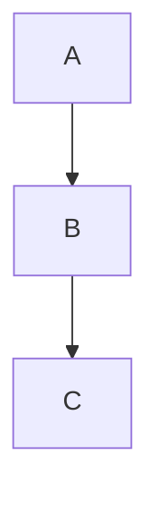
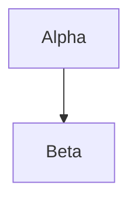
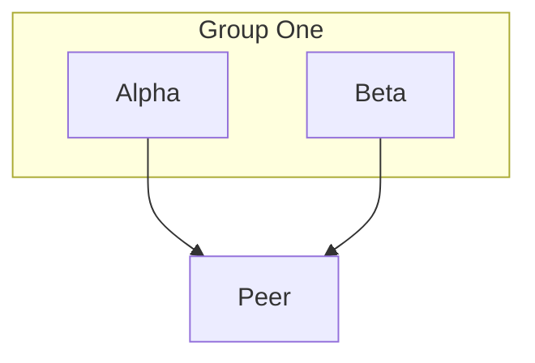

> **Warning**
>
> ## THIS IS AN AUTOGENERATED FILE. DO NOT EDIT.
>
> ## Please edit the corresponding file in [/packages/mermaid/src/docs/syntax/grid-layout.md](../../packages/mermaid/src/docs/syntax/grid-layout.md).

# Grid Layout

## Introduction

Use `layout: grid` when you want deterministic row and column placement instead of a layout derived mainly from edge direction. You can place every item explicitly, constrain only a row or column, or let Mermaid fill the remaining cells automatically.

Grid layout supports flowchart, agentflow, state, class, entity relationship, requirement, use case, and mindmap diagrams. Flowchart and agentflow support inline `@{ ... }` placement metadata. All supported diagram types can use `config.grid.placements`.

## Enable the layout

## Placement metadata

Flowchart and agentflow nodes and expanded subgraphs accept four grid-specific metadata keys:

- `row`
- `column`
- `horizontalAlign`
- `verticalAlign`

Coordinates are:

- positive integers starting at `1`
- local to the direct parent group
- sparse but collapsed (rows `1` and `100` render as adjacent occupied tracks)

When inline metadata and `config.grid.placements` both set the same property, inline metadata takes precedence.

## Placement maps

All supported diagram types can use the global placement map:

The placement-map keys are the node ids produced by the diagram type. Flowchart and agentflow ids are usually the ids you author directly.

Placements for ids that are not present in the diagram are ignored with a console warning. This
allows a shared or generated placement map to contain entries for optional nodes.

## Automatic placement

If either coordinate is omitted, Mermaid fills it deterministically:

- explicit `(row, column)` cells are reserved first
- `row` only picks the first free column in that row
- `column` only picks the first free row in that column
- when both are omitted, Mermaid scans row-major using `grid.columns` when it is greater than `0`; otherwise, it uses `ceil(sqrt(itemCount))`

Automatic placement runs independently within each group. Two or more direct siblings with the same explicit `(row, column)` share one cell as a vertical stack in declaration order.

## Alignment and stacking

- `horizontalAlign`: `left`, `center`, `right`
- `verticalAlign`: `top`, `center`, `bottom`

Horizontal alignment applies to each item. Vertical alignment applies to the whole stack in an explicitly shared cell. Items in the same cell must resolve to the same vertical alignment; otherwise, Mermaid reports `GRID_CELL_ALIGNMENT_CONFLICT`.

## Nested groups

Groups are laid out recursively from the inside out. Child coordinates are always local to the immediate parent group; diagram direction (`TB`, `BT`, `LR`, `RL`) does not rotate or mirror the authored grid.

## Configuration

| Setting            | Default   | Purpose                                                             |
| ------------------ | --------- | ------------------------------------------------------------------- |
| `placements`       | `{}`      | Maps node ids to placement values.                                  |
| `columns`          | `0`       | Sets the auto-placement column count. `0` selects it automatically. |
| `rowGap`           | `50`      | Sets the gap between occupied rows.                                 |
| `columnGap`        | `50`      | Sets the gap between occupied columns.                              |
| `cellGap`          | `20`      | Sets the gap between items stacked in one cell.                     |
| `containerPadding` | `20`      | Sets the minimum padding inside groups.                             |
| `titleGap`         | `8`       | Sets the clearance between a group title and its child grid.        |
| `horizontalAlign`  | `center`  | Sets the default horizontal alignment within a cell.                |
| `verticalAlign`    | `center`  | Sets the default vertical alignment for a cell stack.               |
| `curve`            | `rounded` | Sets the edge rendering curve.                                      |
| `edgeCornerRadius` | `5`       | Sets the corner radius for `rounded` edges.                         |

For accepted values and validation rules, see the [grid layout configuration reference](/config/schema-docs/config-defs-grid-layout-config.html).

## Edge routing

Grid layout calculates edge routes after positioning the nodes and groups. The calculated route:

- uses horizontal and vertical segments
- avoids measured nodes, unrelated groups, and group titles
- may pass through unused space within a grid cell
- crosses group boundaries when connecting nodes in different groups
- attempts to keep parallel and reverse edges on separate ports and lanes

In dense nested diagrams, parallel hierarchy edges can share part of an internal corridor while keeping distinct endpoint ports. If no valid route exists around node or group geometry, Mermaid reports `GRID_ROUTE_NOT_FOUND`.

Edge labels are placed after the initial routes are calculated. Mermaid attempts to reroute edges around those labels. If it cannot find a safe bounded detour, an edge can pass through another edge's label rather than failing the whole diagram.

## Edge curves

Grid edges use `rounded` rendering by default. Set `grid.curve` to any Mermaid
flowchart curve style, including `basis`, `cardinal`, `catmullRom`, `step`, or
`rounded`.

`edgeCornerRadius` controls the corner radius for `rounded` edges. It is ignored
by other curve styles, and each corner is automatically limited by the adjacent
segment lengths.

`linear` and `rounded` preserve the calculated route corridor. Other curves interpolate between the obstacle-aware route points and can move outside that corridor. The interpolated curve is not revalidated against obstacles.

## Current limits

Grid layout does **not** support:

- row or column spanning
- in-cell layouts other than vertical stacking; use a nested subgraph to create a separate grid within a cell
- track-level row/column alignment declarations
- manual absolute coordinates or manual edge waypoints
