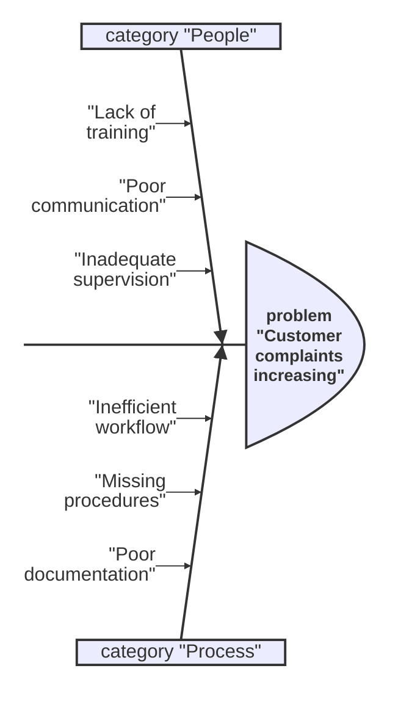
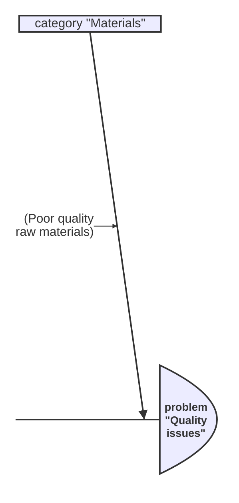
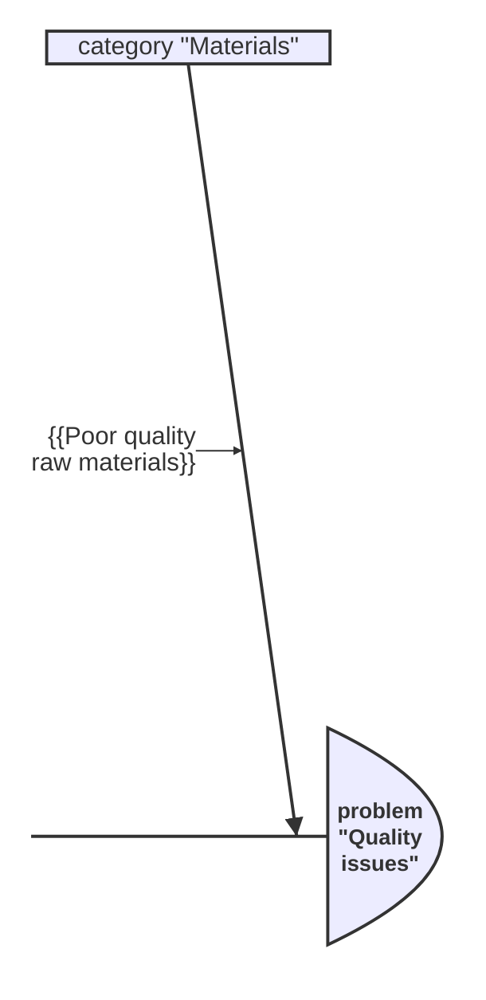
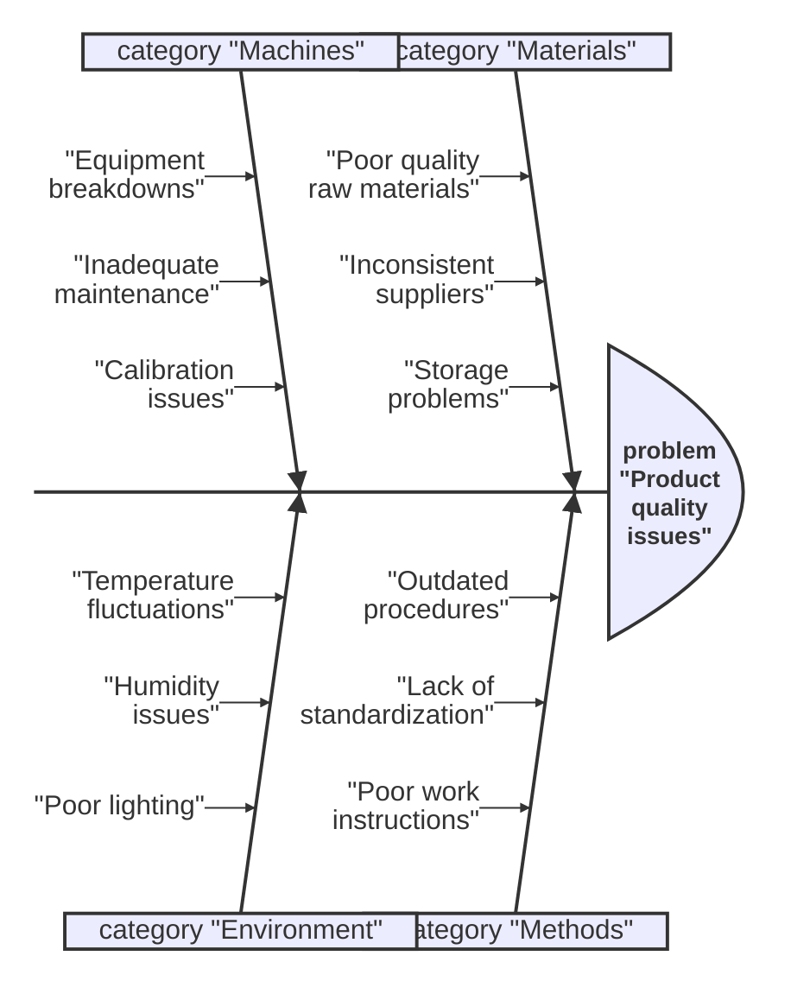
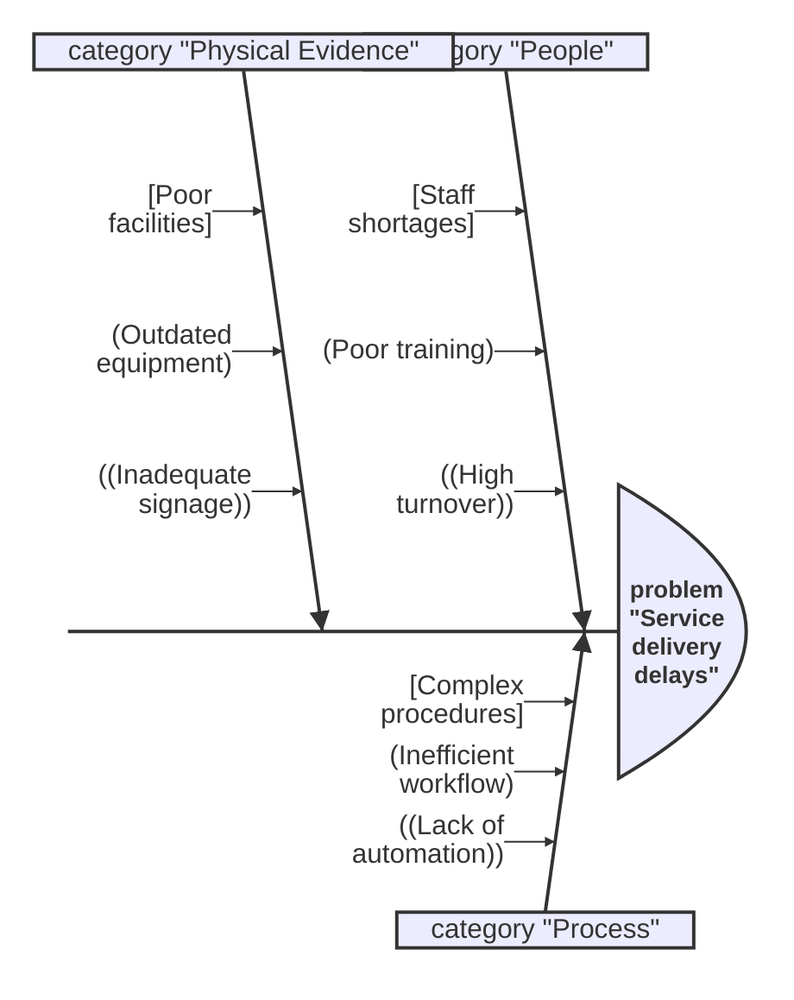
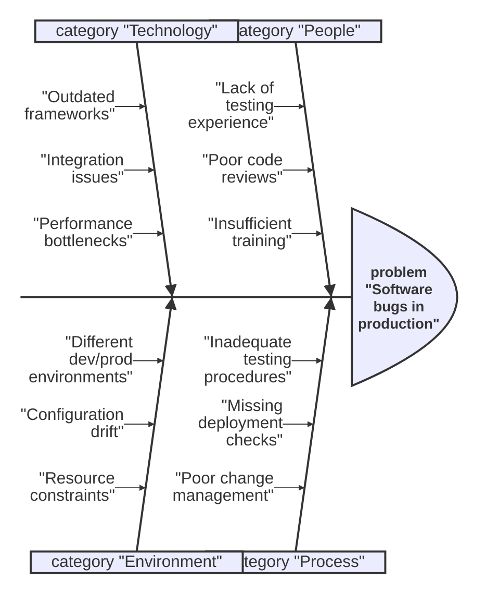

> **Warning**
>
> ## THIS IS AN AUTOGENERATED FILE. DO NOT EDIT.
>
> ## Please edit the corresponding file in [/packages/mermaid/src/docs/syntax/ishikawa.md](../../packages/mermaid/src/docs/syntax/ishikawa.md).

# Ishikawa Diagram

> **Note**: Ishikawa diagrams are also known as fishbone diagrams or cause-and-effect diagrams.

An Ishikawa diagram is a tool for identifying the root causes of a problem. It helps teams systematically analyze complex issues by organizing potential causes into categories, creating a visual representation that resembles a fishbone.

## What is an Ishikawa Diagram?

An Ishikawa diagram (also known as a fishbone diagram or cause-and-effect diagram) is a tool for identifying the root causes of a problem. It helps teams systematically analyze complex issues by organizing potential causes into categories.

The diagram gets its name from its creator, Kaoru Ishikawa, and its appearance - the main problem is written at the "head" of the fish, and the causes branch out like the bones of a fish skeleton.

## Common Categories

### The 8 Ps (Service Industries)

- **Product/Service**: Issues related to the product or service itself
- **Price**: Cost-related problems
- **Place**: Location or distribution issues
- **Promotion**: Marketing and communication problems
- **People**: Human resource and training issues
- **Process**: Workflow and procedure problems
- **Physical Evidence**: Tangible aspects of the service
- **Performance**: Quality and efficiency issues

### The 6 Ms (Manufacturing)

- **Materials**: Raw materials, supplies, and components
- **Methods**: Procedures, processes, and work instructions
- **Machines**: Equipment, tools, and technology
- **Environment**: Physical conditions and surroundings
- **Measurement**: Inspection, testing, and quality control
- **Manpower**: People, skills, and training

## Basic Syntax

The syntax for creating Ishikawa diagrams is simple and relies on indentation for setting the levels in the hierarchy.




## Syntax Elements

### Problem Statement

Start your diagram with the `problem` keyword followed by the main issue:

```
problem "Your problem statement here"
```

### Categories

Define categories using the `category` keyword:

```
category "Category name"
```

### Causes

List causes under each category using indentation:

```
category "People"
  "Cause 1"
  "Cause 2"
  "Cause 3"
```

## Different Shapes

Like other Mermaid diagrams, you can use different shapes for your nodes:

### Square


### Rounded Square




### Circle


### Cloud


### Hexagon




## Examples

### Manufacturing Quality Issues




### Service Delivery Problems




### Software Development Issues




## Configuration

You can configure the appearance of Ishikawa diagrams using the `ishikawa` configuration object:

```javascript
mermaid.initialize({
  ishikawa: {
    padding: 20, // Padding around nodes
    maxNodeWidth: 200, // Maximum width of nodes
    useMaxWidth: true, // Use maximum width for the diagram
    fontSize: 14, // Font size for text
    fontFamily: 'Arial', // Font family
    fontWeight: 'normal', // Font weight
  },
});
```

## Best Practices

1. **Start with a clear problem statement**: Be specific about what issue you're analyzing
2. **Use appropriate categories**: Choose categories that make sense for your industry and problem
3. **Be specific with causes**: Avoid vague statements; be as specific as possible
4. **Use the 5 Whys technique**: Ask "why" multiple times to get to root causes
5. **Involve the right people**: Include team members who are closest to the problem
6. **Validate causes**: Ensure that the identified causes are actually contributing to the problem

## Use Cases

Ishikawa diagrams are particularly useful for:

- **Quality management**: Identifying causes of defects or quality issues
- **Process improvement**: Understanding bottlenecks and inefficiencies
- **Problem solving**: Systematic analysis of complex problems
- **Team collaboration**: Visual tool for group discussions
- **Training**: Teaching systematic problem-solving approaches
- **Documentation**: Recording analysis for future reference

## Tips for Effective Use

1. **Keep it simple**: Don't overcomplicate the diagram with too many categories or causes
2. **Focus on facts**: Base your analysis on data and observations, not assumptions
3. **Prioritize causes**: Not all causes are equally important; identify the most significant ones
4. **Update regularly**: Revisit and update the diagram as you learn more about the problem
5. **Use it as a starting point**: The diagram should lead to action plans, not just analysis
