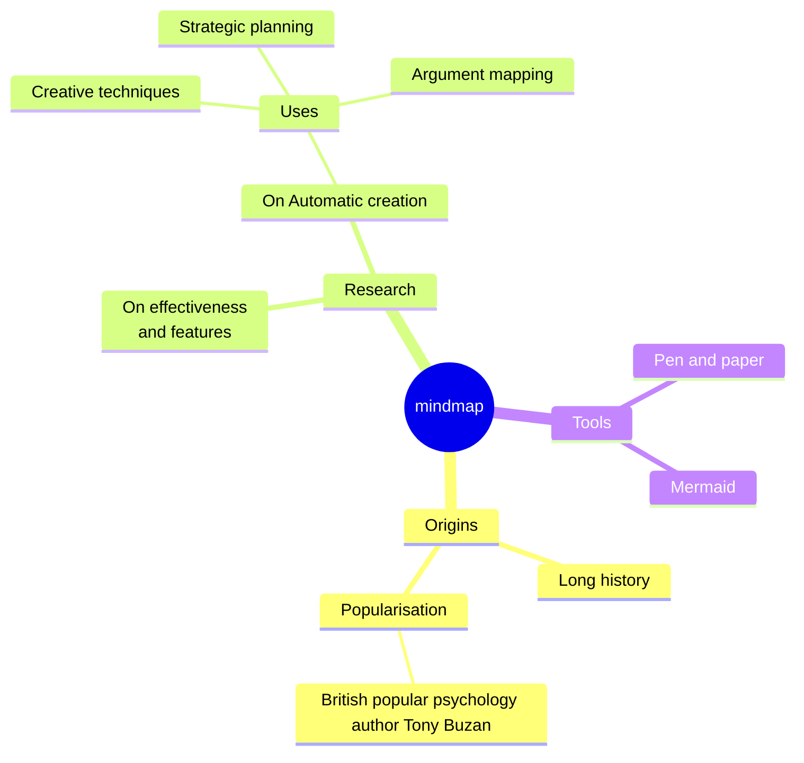
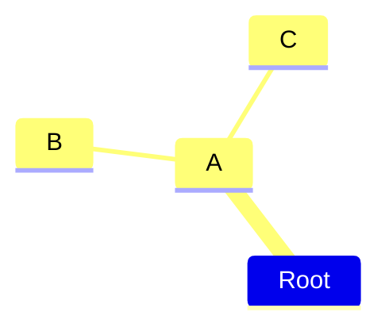
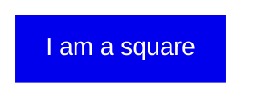
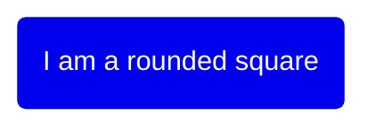
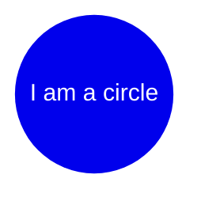
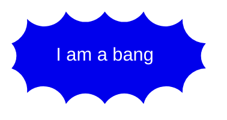
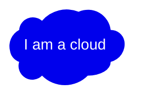
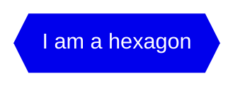
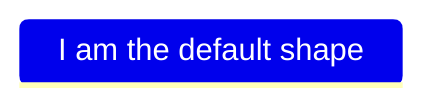
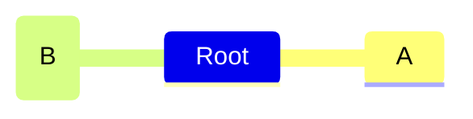

> **Warning**
>
> ## THIS IS AN AUTOGENERATED FILE. DO NOT EDIT.
>
> ## Please edit the corresponding file in [/packages/mermaid/src/docs/syntax/mindmap.md](../../packages/mermaid/src/docs/syntax/mindmap.md).

# Mindmap

> Mindmap: This is an experimental diagram for now. The syntax and properties can change in future releases. The syntax is stable except for the icon integration which is the experimental part.

"A mind map is a diagram used to visually organize information into a hierarchy, showing relationships among pieces of the whole. It is often created around a single concept, drawn as an image in the center of a blank page, to which associated representations of ideas such as images, words and parts of words are added. Major ideas are connected directly to the central concept, and other ideas branch out from those major ideas." Wikipedia

### An example of a mindmap.




## Syntax

The syntax for creating Mindmaps is simple and relies on indentation for setting the levels in the hierarchy.

In the following example you can see how there are 3 different levels. One with starting at the left of the text and another level with two rows starting at the same column, defining the node A. At the end there is one more level where the text is indented further than the previous lines defining the nodes B and C.

```
mindmap
    Root
        A
            B
            C
```

In summary is a simple text outline where there is one node at the root level called `Root` which has one child `A`. `A` in turn has two children `B`and `C`. In the diagram below we can see this rendered as a mindmap.




In this way we can use a text outline to generate a hierarchical mindmap.

## Different shapes

Mermaid mindmaps can show nodes using different shapes. When specifying a shape for a node the syntax is similar to flowchart nodes, with an id followed by the shape definition and with the text within the shape delimiters. Where possible we try/will try to keep the same shapes as for flowcharts, even though they are not all supported from the start.

Mindmap can show the following shapes:

### Square




### Rounded square




### Circle




### Bang




### Cloud




### Hexagon




### Default




More shapes will be added, beginning with the shapes available in flowcharts.

# Icons and classes

## Icons

As with flowcharts you can add icons to your nodes but with an updated syntax. The styling for the font based icons are added during the integration so that they are available for the web page. _This is not something a diagram author can do but has to be done with the site administrator or the integrator_. Once the icon fonts are in place you add them to the mind map nodes using the `::icon()` syntax. You place the classes for the icon within the parenthesis like in the following example where icons for material design and [Font Awesome 5](https://fontawesome.com/v5/search?o=r&m=free) are displayed. The intention is that this approach should be used for all diagrams supporting icons. **Experimental feature:** This wider scope is also the reason Mindmaps are experimental as this syntax and approach could change.




## Classes

Again the syntax for adding classes is similar to flowcharts. You can add classes using a triple colon following a number of css classes separated by space. In the following example one of the nodes has two custom classes attached urgent turning the background red and the text white and large increasing the font size:

```mermaid-example
mindmap
    Root
        A[A]
        :::urgent large
        B(B)
        C
```

```mermaid
mindmap
    Root
        A[A]
        :::urgent large
        B(B)
        C
```

_These classes need to be supplied by the site administrator._

## Unclear indentation

The actual indentation does not really matter only compared with the previous rows. If we take the previous example and disrupt it a little we can see how the calculations are performed. Let us start with placing C with a smaller indentation than `B` but larger then `A`.

```
mindmap
    Root
        A
            B
          C
```

This outline is unclear as `B` clearly is a child of `A` but when we move on to `C` the clarity is lost. `C` is neither a child of `B` with a higher indentation nor does it have the same indentation as `B`. The only thing that is clear is that the first node with smaller indentation, indicating a parent, is A. Then Mermaid relies on this known truth and compensates for the unclear indentation and selects `A` as a parent of `C` leading till the same diagram with `B` and `C` as siblings.

```mermaid-example
mindmap
Root
    A
        B
      C
```

```mermaid
mindmap
Root
    A
        B
      C
```

## Markdown Strings

The "Markdown Strings" feature enhances mind maps by offering a more versatile string type, which supports text formatting options such as bold and italics, and automatically wraps text within labels.

```mermaid-example
mindmap
    id1["`**Root** with
a second line
Unicode works too: 🤓`"]
      id2["`The dog in **the** hog... a *very long text* that wraps to a new line`"]
      id3[Regular labels still works]
```

```mermaid
mindmap
    id1["`**Root** with
a second line
Unicode works too: 🤓`"]
      id2["`The dog in **the** hog... a *very long text* that wraps to a new line`"]
      id3[Regular labels still works]
```

Formatting:

- For bold text, use double asterisks \*\* before and after the text.
- For italics, use single asterisks \* before and after the text.
- With traditional strings, you needed to add <br> tags for text to wrap in nodes. However, markdown strings automatically wrap text when it becomes too long and allows you to start a new line by simply using a newline character instead of a <br> tag.

## Integrating with your library/website.

Mindmap uses the experimental lazy loading & async rendering features which could change in the future. From version 9.4.0 this diagram is included in mermaid but use lazy loading in order to keep the size of mermaid down. This is important in order to be able to add additional diagrams going forward.

You can still use the pre 9.4.0 method to add mermaid with mindmaps to a web page:

```html
<script type="module">
  import mermaid from 'https://cdn.jsdelivr.net/npm/mermaid@9.3.0/dist/mermaid.esm.min.mjs';
  import mindmap from 'https://cdn.jsdelivr.net/npm/@mermaid-js/mermaid-mindmap@9.3.0/dist/mermaid-mindmap.esm.min.mjs';
  await mermaid.registerExternalDiagrams([mindmap]);
</script>
```

From version 9.4.0 you can simplify this code to:

```html
<script type="module">
  import mermaid from 'https://cdn.jsdelivr.net/npm/mermaid@11/dist/mermaid.esm.min.mjs';
</script>
```

You can also refer the [implementation in the live editor](https://github.com/mermaid-js/mermaid-live-editor/blob/develop/src/lib/util/mermaid.ts) to see how the async loading is done.

<!---
cspell:locale en,en-gb
cspell:ignore Buzan
--->
