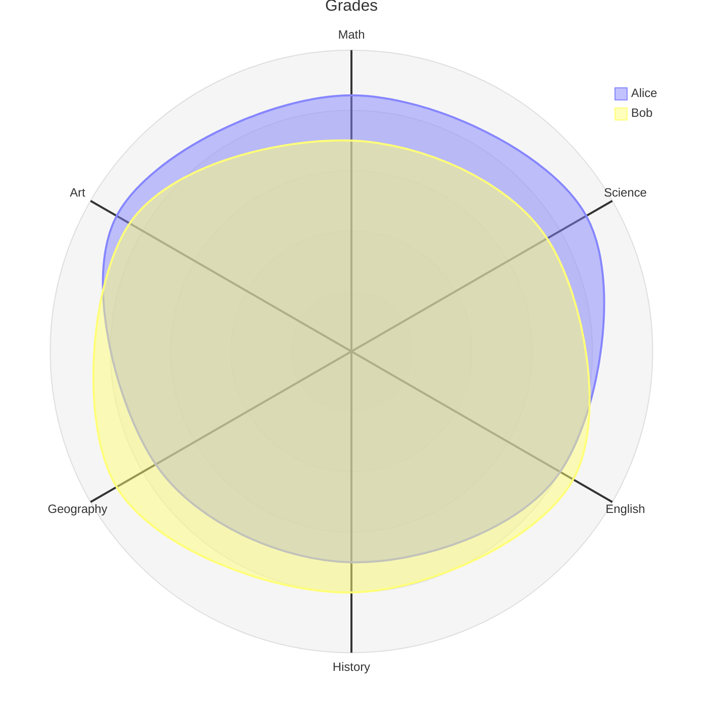
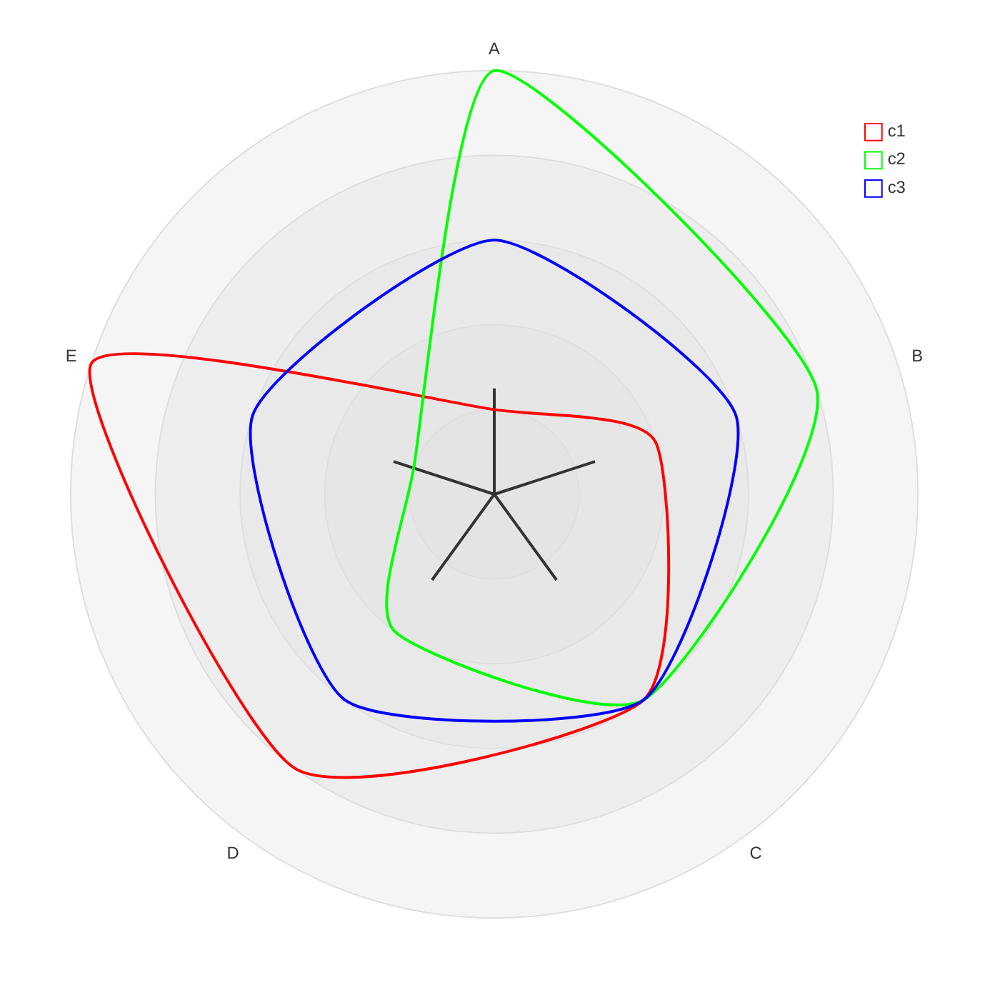

> **Warning**
>
> ## THIS IS AN AUTOGENERATED FILE. DO NOT EDIT.
>
> ## Please edit the corresponding file in [/packages/mermaid/src/docs/syntax/radar.md](../../packages/mermaid/src/docs/syntax/radar.md).

# Radar Diagram (v11.6.0+)

## Introduction

A radar diagram is a simple way to plot low-dimensional data in a circular format.

It is also known as a **radar chart**, **spider chart**, **star chart**, **cobweb chart**, **polar chart**, or **Kiviat diagram**.

## Usage

This diagram type is particularly useful for developers, data scientists, and engineers who require a clear and concise way to represent data in a circular format.

It is commonly used to graphically summarize and compare the performance of multiple entities across multiple dimensions.

## Syntax

```md
radar-beta
axis A, B, C, D, E
curve c1{1,2,3,4,5}
curve c2{5,4,3,2,1}
... More Fields ...
```

## Examples




## Details of Syntax

### Title

`title`: The title is an optional field that allows to render a title at the top of the radar diagram.

```
radar-beta
  title Title of the Radar Diagram
  ...
```

### Axis

`axis`: The axis keyword is used to define the axes of the radar diagram.

Each axis is represented by an ID and an optional label.

Multiple axes can be defined in a single line.

```
radar-beta
  axis id1["Label1"]
  axis id2["Label2"], id3["Label3"]
  ...
```

### Curve

`curve`: The curve keyword is used to define the data points for a curve in the radar diagram.

Each curve is represented by an ID, an optional label, and a list of values.

Values can be defined by a list of numbers or a list of key-value pairs. If key-value pairs are used, the key represents the axis ID and the value represents the data point. Else, the data points are assumed to be in the order of the axes defined.

Multiple curves can be defined in a single line.

```
radar-beta
  axis axis1, axis2, axis3
  curve id1["Label1"]{1, 2, 3}
  curve id2["Label2"]{4, 5, 6}, id3{7, 8, 9}
  curve id4{ axis3: 30, axis1: 20, axis2: 10 }
  ...
```

### Options

- `showLegend`: The showLegend keyword is used to show or hide the legend in the radar diagram. The legend is shown by default.
- `max`: The maximum value for the radar diagram. This is used to scale the radar diagram. If not provided, the maximum value is calculated from the data points.
- `min`: The minimum value for the radar diagram. This is used to scale the radar diagram. If not provided, the minimum value is `0`.
- `graticule`: The graticule keyword is used to define the type of graticule to be rendered in the radar diagram. The graticule can be `circle` or `polygon`. If not provided, the default graticule is `circle`.
- `ticks`: The ticks keyword is used to define the number of ticks on the graticule. It is the number of concentric circles or polygons drawn to indicate the scale of the radar diagram. If not provided, the default number of ticks is `5`.

```
radar-beta
  ...
  showLegend true
  max 100
  min 0
  graticule circle
  ticks 5
  ...
```

## Configuration

Please refer to the [configuration](/config/schema-docs/config-defs-radar-diagram-config.html) guide for details.

| Parameter       | Description                              | Default Value |
| --------------- | ---------------------------------------- | ------------- |
| width           | Width of the radar diagram               | `600`         |
| height          | Height of the radar diagram              | `600`         |
| marginTop       | Top margin of the radar diagram          | `50`          |
| marginBottom    | Bottom margin of the radar diagram       | `50`          |
| marginLeft      | Left margin of the radar diagram         | `50`          |
| marginRight     | Right margin of the radar diagram        | `50`          |
| axisScaleFactor | Scale factor for the axis                | `1`           |
| axisLabelFactor | Factor to adjust the axis label position | `1.05`        |
| curveTension    | Tension for the rounded curves           | `0.17`        |

## Theme Variables

### Global Theme Variables

> **Note**
> The default values for these variables depend on the theme used. To override the default values, set the desired values in the themeVariables section of the configuration:
>
> ---
>
> config:
> themeVariables:
> cScale0: "#FF0000"
> cScale1: "#00FF00"
>
> ---

Radar charts support the color scales `cScale${i}` where `i` is a number from `0` to the theme's maximum number of colors in its color scale. Usually, the maximum number of colors is `12`.

| Property   | Description                    |
| ---------- | ------------------------------ |
| fontSize   | Font size of the title         |
| titleColor | Color of the title             |
| cScale${i} | Color scale for the i-th curve |

### Radar Style Options

> **Note**
> Specific variables for radar resides inside the `radar` key. To set the radar style options, use this syntax.
>
> ---
>
> config:
> themeVariables:
> radar:
> axisColor: "#FF0000"
>
> ---

| Property             | Description                  | Default Value |
| -------------------- | ---------------------------- | ------------- |
| axisColor            | Color of the axis lines      | `black`       |
| axisStrokeWidth      | Width of the axis lines      | `1`           |
| axisLabelFontSize    | Font size of the axis labels | `12px`        |
| curveOpacity         | Opacity of the curves        | `0.7`         |
| curveStrokeWidth     | Width of the curves          | `2`           |
| graticuleColor       | Color of the graticule       | `black`       |
| graticuleOpacity     | Opacity of the graticule     | `0.5`         |
| graticuleStrokeWidth | Width of the graticule       | `1`           |
| legendBoxSize        | Size of the legend box       | `10`          |
| legendFontSize       | Font size of the legend      | `14px`        |

## Example on config and theme




<!--- cspell:ignore Kiviat --->
