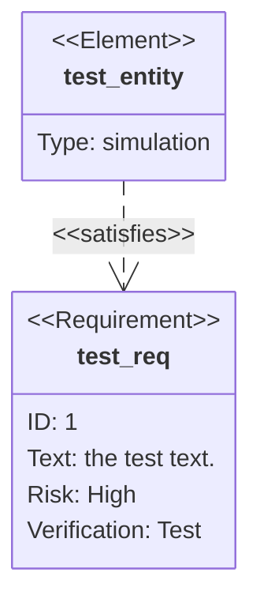
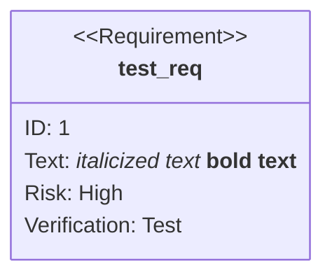
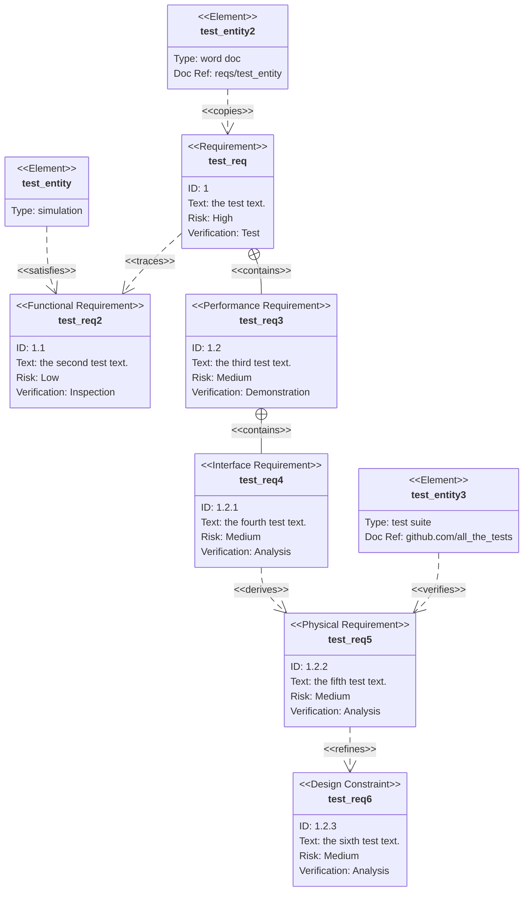
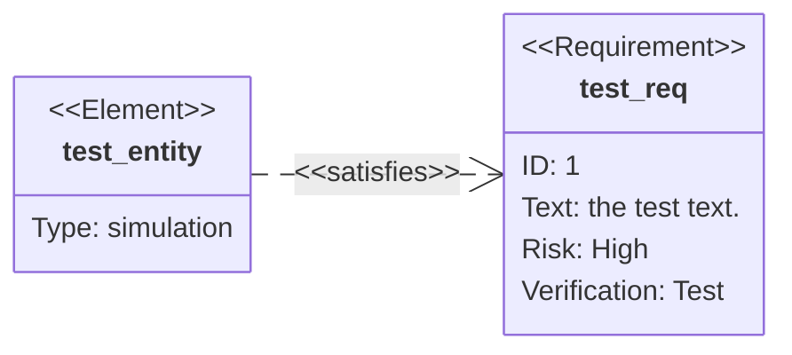
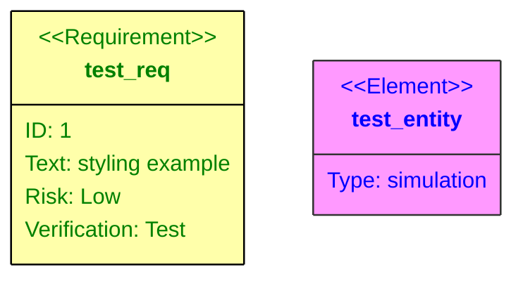
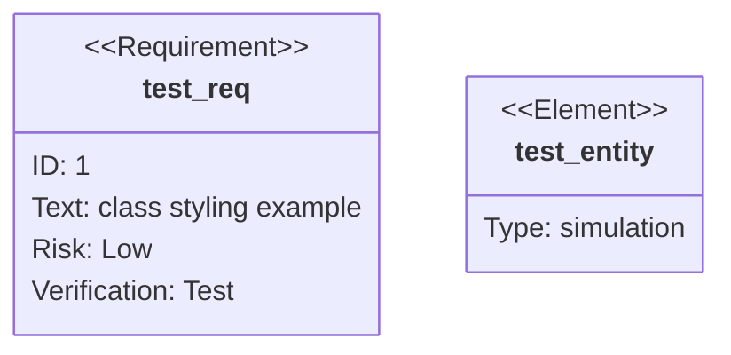
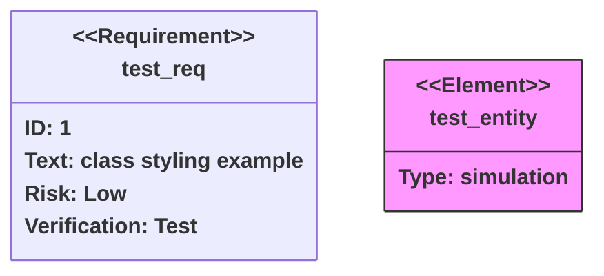

> **Warning**
>
> ## THIS IS AN AUTOGENERATED FILE. DO NOT EDIT.
>
> ## Please edit the corresponding file in [/packages/mermaid/src/docs/syntax/requirementDiagram.md](../../packages/mermaid/src/docs/syntax/requirementDiagram.md).

# Requirement Diagram

> A Requirement diagram provides a visualization for requirements and their connections, to each other and other documented elements. The modeling specs follow those defined by SysML v1.6.

Rendering requirements is straightforward.




## Syntax

There are three types of components to a requirement diagram: requirement, element, and relationship.

The grammar for defining each is defined below. Words denoted in angle brackets, such as `<word>`, are enumerated keywords that have options elaborated in a table. `user_defined_...` is use in any place where user input is expected.

An important note on user text: all input can be surrounded in quotes or not. For example, both `id: "here is an example"` and `id: here is an example` are both valid. However, users must be careful with unquoted input. The parser will fail if another keyword is detected.

### Requirement

A requirement definition contains a requirement type, name, id, text, risk, and verification method. The syntax follows:

```
<type> user_defined_name {
    id: user_defined_id
    text: user_defined text
    risk: <risk>
    verifymethod: <method>
}
```

Type, risk, and method are enumerations defined in SysML.

| Keyword            | Options                                                                                                                 |
| ------------------ | ----------------------------------------------------------------------------------------------------------------------- |
| Type               | requirement, functionalRequirement, interfaceRequirement, performanceRequirement, physicalRequirement, designConstraint |
| Risk               | Low, Medium, High                                                                                                       |
| VerificationMethod | Analysis, Inspection, Test, Demonstration                                                                               |

### Element

An element definition contains an element name, type, and document reference. These three are all user defined. The element feature is intended to be lightweight but allow requirements to be connected to portions of other documents.

```
element user_defined_name {
    type: user_defined_type
    docref: user_defined_ref
}
```

### Markdown Formatting

In places where user defined text is possible (like names, requirement text, element docref, etc.), you can:

- Surround the text in quotes: `"example text"`
- Use markdown formatting inside quotes: `"**bold text** and *italics*"`

Example:




### Relationship

Relationships are comprised of a source node, destination node, and relationship type.

Each follows the definition format of

```
{name of source} - <type> -> {name of destination}
```

or

```
{name of destination} <- <type> - {name of source}
```

"name of source" and "name of destination" should be names of requirement or element nodes defined elsewhere.

A relationship type can be one of contains, copies, derives, satisfies, verifies, refines, or traces.

Each relationship is labeled in the diagram.

## Larger Example

This example uses all features of the diagram.




## Direction

The diagram can be rendered in different directions using the `direction` statement. Valid values are:

- `TB` - Top to Bottom (default)
- `BT` - Bottom to Top
- `LR` - Left to Right
- `RL` - Right to Left

Example:




## Styling

Requirements and elements can be styled using direct styling or classes. As a rule of thumb, when applying styles or classes, it accepts a list of requirement or element names and a list of class names allowing multiple assignments at a time (The only exception is the shorthand syntax `:::` which can assign multiple classes but only to one requirement or element at a time).

### Direct Styling

Use the `style` keyword to apply CSS styles directly:




### Class Definitions

Define reusable styles using `classDef`:




### Default class

If a class is named default it will be applied to all nodes. Specific styles and classes should be defined afterwards to override the applied default styling.

```
classDef default fill:#f9f,stroke:#333,stroke-width:4px;
```

### Applying Classes

Classes can be applied in two ways:

1. Using the `class` keyword:

```
class test_req,test_entity important
```

2. Using the shorthand syntax with `:::` either during the definition or afterwards:

```
requirement test_req:::important {
    id: 1
    text: class styling example
    risk: low
    verifymethod: test
}
```

```
element test_elem {
}

test_elem:::myClass
```

### Combined Example




<!--- cspell:ignore reqs --->
