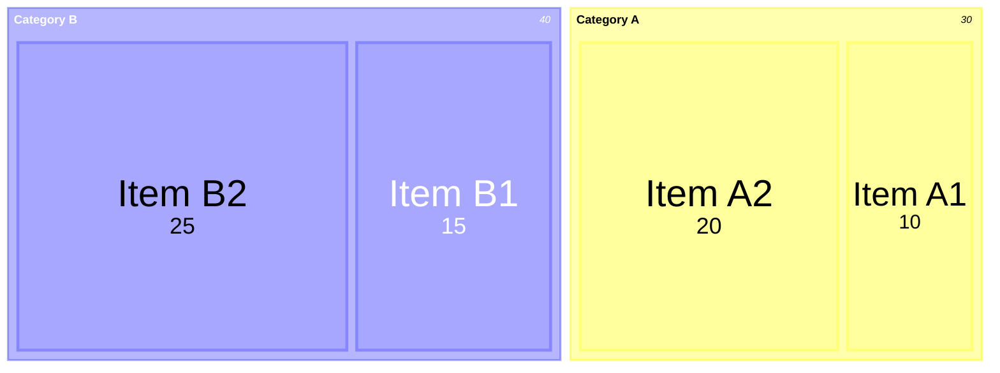
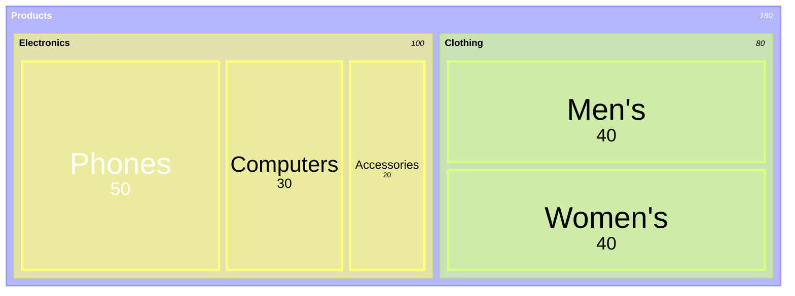
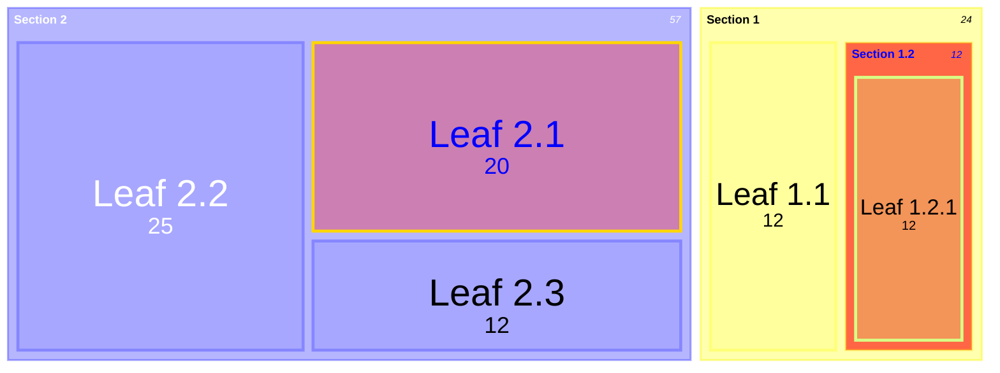
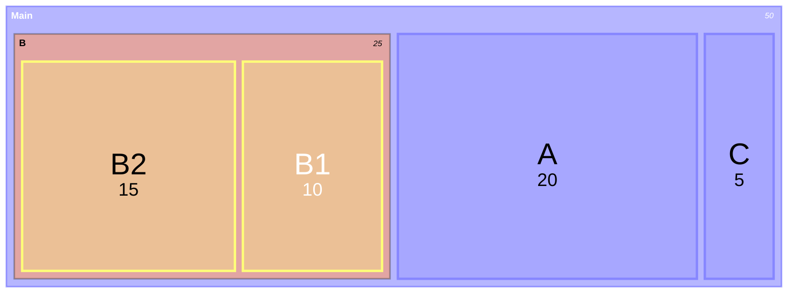
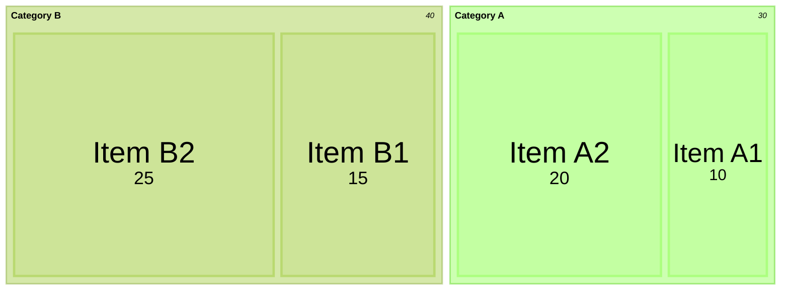
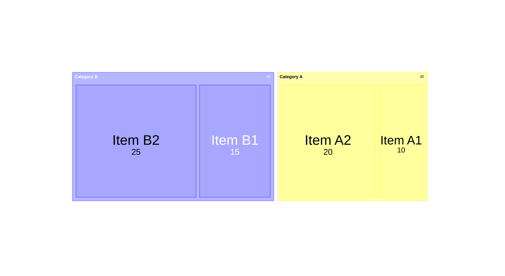
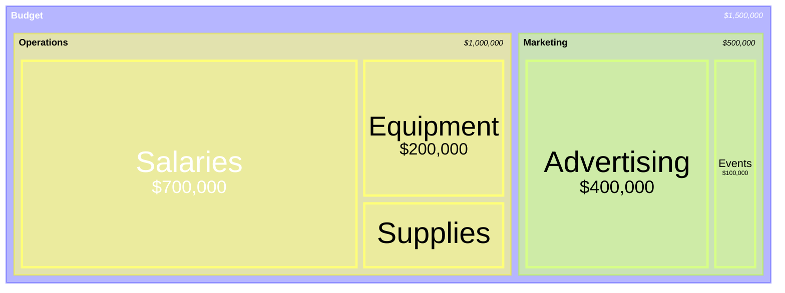
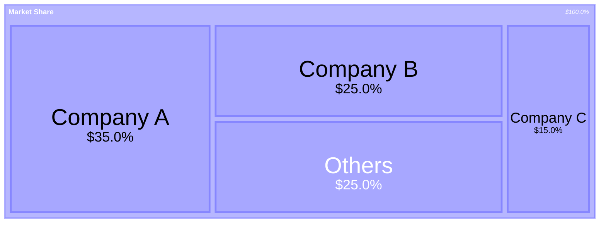

> **Warning**
>
> ## THIS IS AN AUTOGENERATED FILE. DO NOT EDIT.
>
> ## Please edit the corresponding file in [/packages/mermaid/src/docs/syntax/treemap.md](../../packages/mermaid/src/docs/syntax/treemap.md).

# Treemap Diagram

> A treemap diagram displays hierarchical data as a set of nested rectangles. Each branch of the tree is represented by a rectangle, which is then tiled with smaller rectangles representing sub-branches.

> **Warning**
> This is a new diagram type in Mermaid. Its syntax may evolve in future versions.

## Introduction

Treemap diagrams are an effective way to visualize hierarchical data and show proportions between categories and subcategories. The size of each rectangle is proportional to the value it represents, making it easy to compare different parts of a hierarchy.

Treemap diagrams are particularly useful for:

- Visualizing hierarchical data structures
- Comparing proportions between categories
- Displaying large amounts of hierarchical data in a limited space
- Identifying patterns and outliers in hierarchical data

## Syntax

```
treemap-beta
"Section 1"
    "Leaf 1.1": 12
    "Section 1.2"
      "Leaf 1.2.1": 12
"Section 2"
    "Leaf 2.1": 20
    "Leaf 2.2": 25
```

### Node Definition

Nodes in a treemap are defined using the following syntax:

- **Section/Parent nodes**: Defined with quoted text `"Section Name"`
- **Leaf nodes with values**: Defined with quoted text followed by a colon and value `"Leaf Name": value`
- **Hierarchy**: Created using indentation (spaces or tabs)
- **Styling**: Nodes can be styled using the `:::class` syntax

## Examples

### Basic Treemap




### Hierarchical Treemap




### Treemap with Styling




## Styling and Configuration

Treemap diagrams can be customized using Mermaid's styling and configuration options.

### Using classDef for Styling

You can define custom styles for nodes using the `classDef` syntax, which is a standard feature across many Mermaid diagram types:




### Theme Configuration

You can customize the colors of your treemap using the theme configuration:




### Diagram Padding

You can adjust the padding around the treemap diagram using the `diagramPadding` configuration option:




## Configuration Options

The treemap diagram supports the following configuration options:

| Option         | Description                                                                 | Default |
| -------------- | --------------------------------------------------------------------------- | ------- |
| useMaxWidth    | When true, the diagram width is set to 100% and scales with available space | true    |
| padding        | Internal padding between nodes                                              | 10      |
| diagramPadding | Padding around the entire diagram                                           | 8       |
| showValues     | Whether to show values in the treemap                                       | true    |
| nodeWidth      | Width of nodes                                                              | 100     |
| nodeHeight     | Height of nodes                                                             | 40      |
| borderWidth    | Width of borders                                                            | 1       |
| valueFontSize  | Font size for values                                                        | 12      |
| labelFontSize  | Font size for labels                                                        | 14      |
| valueFormat    | Format for values (see Value Formatting section)                            | ','     |

## Advanced Features

### Value Formatting

Values in treemap diagrams can be formatted to display in different ways using the `valueFormat` configuration option. This option primarily uses [D3's format specifiers](https://github.com/d3/d3-format#locale_format) to control how numbers are displayed, with some additional special cases for common formats.

Some common format patterns:

- `,` - Thousands separator (default)
- `$` - Add dollar sign
- `.1f` - Show one decimal place
- `.1%` - Show as percentage with one decimal place
- `$0,0` - Dollar sign with thousands separator
- `$.2f` - Dollar sign with 2 decimal places
- `$,.2f` - Dollar sign with thousands separator and 2 decimal places

The treemap diagram supports both standard D3 format specifiers and some common currency formats that combine the dollar sign with other formatting options.

Example with currency formatting:




Example with percentage formatting:




## Common Use Cases

Treemap diagrams are commonly used for:

1. **Financial Data**: Visualizing budget allocations, market shares, or portfolio compositions
2. **File System Analysis**: Showing disk space usage by folders and files
3. **Population Demographics**: Displaying population distribution across regions and subregions
4. **Product Hierarchies**: Visualizing product categories and their sales volumes
5. **Organizational Structures**: Representing departments and team sizes in a company

## Limitations

- Treemap diagrams work best when the data has a natural hierarchy
- Very small values may be difficult to see or label in a treemap diagram
- Deep hierarchies (many levels) can be challenging to represent clearly
- Treemap diagrams are not well suited for representing data with negative values

## Related Diagrams

If treemap diagrams don't suit your needs, consider these alternatives:

- [**Pie Charts**](./pie.md): For simple proportion comparisons without hierarchy
- **Sunburst Diagrams**: For hierarchical data with a radial layout (yet to be released in Mermaid).
- [**Sankey Diagrams**](./sankey.md): For flow-based hierarchical data

## Notes

The treemap diagram implementation in Mermaid is designed to be simple to use while providing powerful visualization capabilities. As this is a newer diagram type, feedback and feature requests are welcome through the Mermaid GitHub repository.
