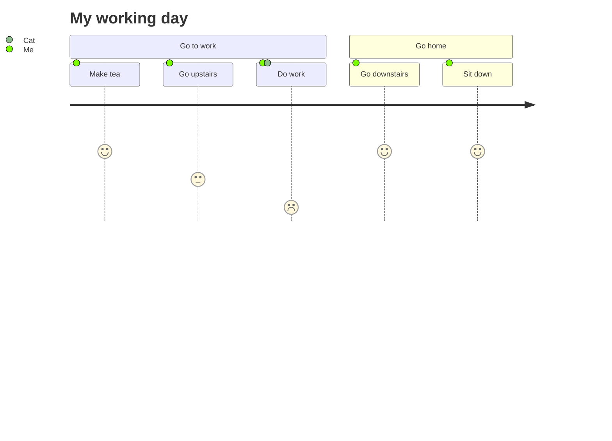

> **Warning**
>
> ## THIS IS AN AUTOGENERATED FILE. DO NOT EDIT.
>
> ## Please edit the corresponding file in [/packages/mermaid/src/docs/syntax/userJourney.md](../../packages/mermaid/src/docs/syntax/userJourney.md).

# User Journey Diagram

> User journeys describe at a high level of detail exactly what steps different users take to complete a specific task within a system, application or website. This technique shows the current (as-is) user workflow, and reveals areas of improvement for the to-be workflow. (Wikipedia)

Mermaid can render user journey diagrams:

Each user journey is split into sections, these describe the part of the task
the user is trying to complete.

Tasks syntax is `Task name: <score>: <comma separated list of actors>`
