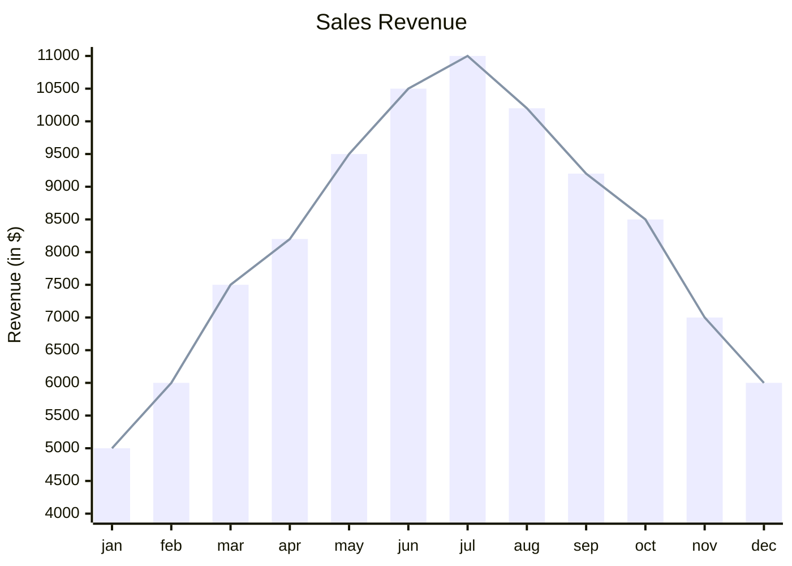
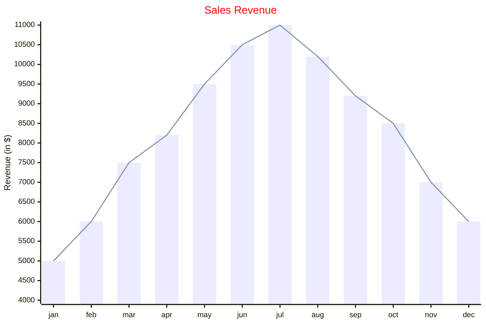

> **Warning**
>
> ## THIS IS AN AUTOGENERATED FILE. DO NOT EDIT.
>
> ## Please edit the corresponding file in [/packages/mermaid/src/docs/syntax/xyChart.md](../../packages/mermaid/src/docs/syntax/xyChart.md).

# XY Chart

> In the context of mermaid-js, the XY chart is a comprehensive charting module that encompasses various types of charts that utilize both x-axis and y-axis for data representation. Presently, it includes two fundamental chart types: the bar chart and the line chart. These charts are designed to visually display and analyze data that involve two numerical variables.

> It's important to note that while the current implementation of mermaid-js includes these two chart types, the framework is designed to be dynamic and adaptable. Therefore, it has the capacity for expansion and the inclusion of additional chart types in the future. This means that users can expect an evolving suite of charting options within the XY chart module, catering to various data visualization needs as new chart types are introduced over time.

## Example

## Syntax

> **Note**
> All text values that contain only one word can be written without `"`. If a text value has many words in it, specifically if it contains spaces, enclose the value in `"`

### Orientations

The chart can be drawn horizontal or vertical, default value is vertical.

    xychart-beta horizontal
    ...

### Title

The title is a short description of the chart and it will always render on top of the chart.

#### Example

    xychart-beta
        title "This is a simple example"
        ...

> **Note**
> If the title is a single word one no need to use `"`, but if it has space `"` is needed

### x-axis

The x-axis primarily serves as a categorical value, although it can also function as a numeric range value when needed.

#### Example

1.  `x-axis title min --> max` x-axis will function as numeric with the given range
2.  `x-axis "title with space" [cat1, "cat2 with space", cat3]` x-axis if categorical, categories are text type

### y-axis

The y-axis is employed to represent numerical range values, it cannot have categorical values.

#### Example

1.  `y-axis title min --> max`
2.  `y-axis title` it will only add the title, the range will be auto generated from data.

> **Note**
> Both x and y axis are optional if not provided we will try to create the range

### Line chart

A line chart offers the capability to graphically depict lines.

#### Example

1.  `line [2.3, 45, .98, -3.4]` it can have all valid numeric values.

### Bar chart

A bar chart offers the capability to graphically depict bars.

#### Example

1.  `bar [2.3, 45, .98, -3.4]` it can have all valid numeric values.

#### Simplest example

The only two things required are the chart name (`xychart-beta`) and one data set. So you will be able to draw a chart with a simple config like

    xychart-beta
        line [+1.3, .6, 2.4, -.34]

## Chart Configurations

| Parameter                | Description                                    | Default value |
| ------------------------ | ---------------------------------------------- | :-----------: |
| width                    | Width of the chart                             |      700      |
| height                   | Height of the chart                            |      500      |
| titlePadding             | Top and Bottom padding of the title            |      10       |
| titleFontSize            | Title font size                                |      20       |
| showTitle                | Title to be shown or not                       |     true      |
| xAxis                    | xAxis configuration                            |  AxisConfig   |
| yAxis                    | yAxis configuration                            |  AxisConfig   |
| chartOrientation         | 'vertical' or 'horizontal'                     |  'vertical'   |
| plotReservedSpacePercent | Minimum space plots will take inside the chart |      50       |

### AxisConfig

| Parameter     | Description                          | Default value |
| ------------- | ------------------------------------ | :-----------: |
| showLabel     | Show axis labels or tick values      |     true      |
| labelFontSize | Font size of the label to be drawn   |      14       |
| labelPadding  | Top and Bottom padding of the label  |       5       |
| showTitle     | Axis title to be shown or not        |     true      |
| titleFontSize | Axis title font size                 |      16       |
| titlePadding  | Top and Bottom padding of Axis title |       5       |
| showTick      | Tick to be shown or not              |     true      |
| tickLength    | How long the tick will be            |       5       |
| tickWidth     | How width the tick will be           |       2       |
| showAxisLine  | Axis line to be shown or not         |     true      |
| axisLineWidth | Thickness of the axis line           |       2       |

## Chart Theme Variables

> **Note**
> Themes for xychart resides inside xychart attribute so to set the variables use this syntax
> %%{init: { "themeVariables": {"xyChart": {"titleColor": "#ff0000"} } }}%%

| Parameter        | Description                                               |
| ---------------- | --------------------------------------------------------- |
| backgroundColor  | Background color of the whole chart                       |
| titleColor       | Color of the Title text                                   |
| xAxisLableColor  | Color of the x-axis labels                                |
| xAxisTitleColor  | Color of the x-axis title                                 |
| xAxisTickColor   | Color of the x-axis tick                                  |
| xAxisLineColor   | Color of the x-axis line                                  |
| yAxisLableColor  | Color of the y-axis labels                                |
| yAxisTitleColor  | Color of the y-axis title                                 |
| yAxisTickColor   | Color of the y-axis tick                                  |
| yAxisLineColor   | Color of the y-axis line                                  |
| plotColorPalette | String of colors separated by comma e.g. "#f3456, #43445" |

## Example on config and theme

