> **Warning**
>
> ## THIS IS AN AUTOGENERATED FILE. DO NOT EDIT.
>
> ## Please edit the corresponding file in [/packages/mermaid/src/docs/syntax/zenuml.md](../../packages/mermaid/src/docs/syntax/zenuml.md).

# ZenUML

> A Sequence diagram is an interaction diagram that shows how processes operate with one another and in what order.

Mermaid can render sequence diagrams with ZenUML. Note that ZenUML uses a different
syntax than the original Sequence Diagram in mermaid.

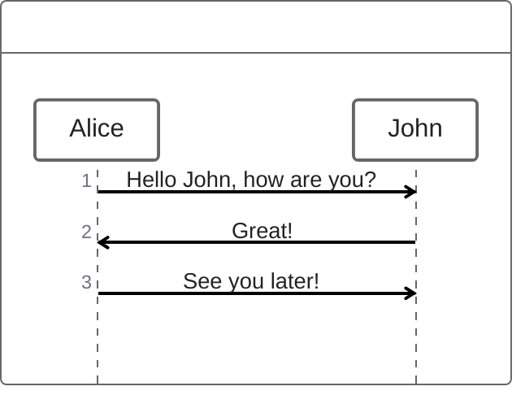


## Syntax

### Participants

The participants can be defined implicitly as in the first example on this page. The participants or actors are
rendered in order of appearance in the diagram source text. Sometimes you might want to show the participants in a
different order than how they appear in the first message. It is possible to specify the actor's order of
appearance by doing the following:

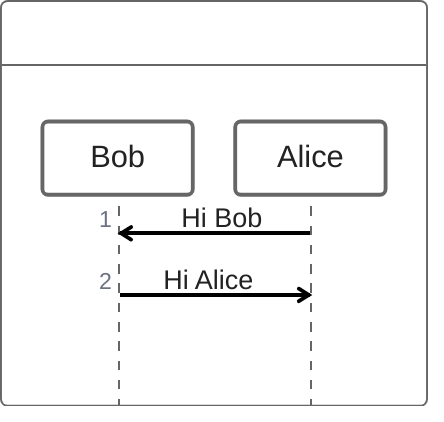


### Annotators

If you specifically want to use symbols instead of just rectangles with text you can do so by using the annotator syntax to declare participants as per below.

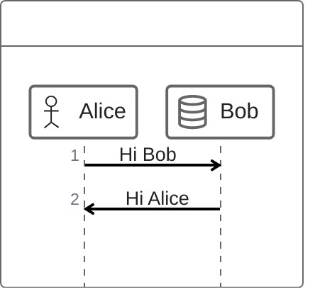


Here are the available annotators:
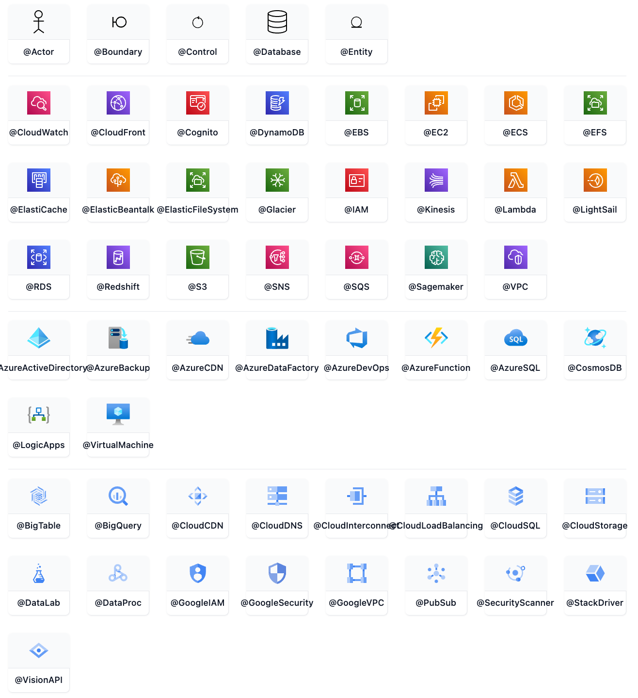

### Aliases

The participants can have a convenient identifier and a descriptive label.

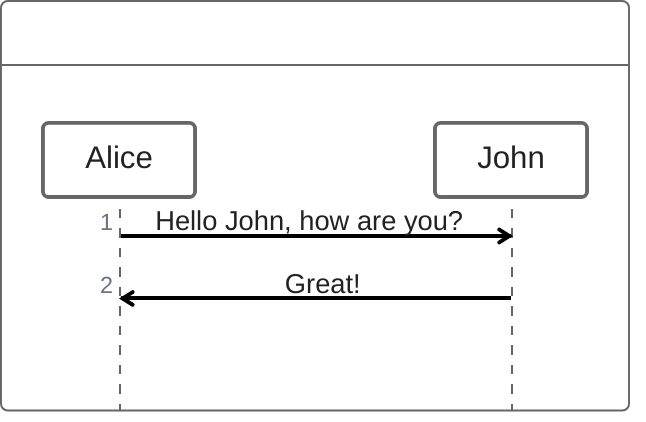


## Messages

Messages can be one of:

1.  Sync message
2.  Async message
3.  Creation message
4.  Reply message

### Sync message

You can think of a sync (blocking) method in a programming language.

    A.SyncMessage
    A.SyncMessage(with, parameters) {
      B.nestedSyncMessage()
    }

### Async message

You can think of an async (non-blocking) method in a programming language.
Fire an event and forget about it.

    Alice->Bob: How are you?

### Creation message

We use `new` keyword to create an object.

    new Object

### Reply message

There are three ways to express a reply message:

    // 1. assign a variable from a sync message.
    a = A.SyncMessage()

    // 1.1. optionally give the variable a type
    SomeType a = A.SyncMessage()

    // 2. use return keyword
    A.SyncMessage() {
      return result
    }

    // 3. use @return or @reply annotator on an async message
    @return
    A->B: result

The third way `@return` is rarely used, but it is useful when you want to return to one level up.

    Client->A.method() {
      B.method() {
        if(condition) {
          return x1
          // mark a reply message from A to client and return early
          @return
          A->Client: x11
        }
      }
      return x2
    }

## Nesting

Sync messages and Creation messages are naturally nestable with `{}`.

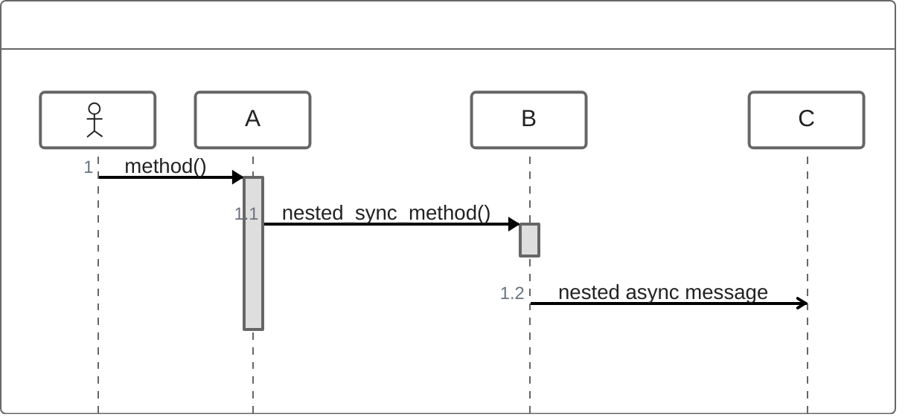


## Comments

It is possible to add comments to a sequence diagram with `// comment` syntax.
Comments will be rendered above the messages or fragments. Comments on other places
are ignored. Markdown is supported.

See the example below:

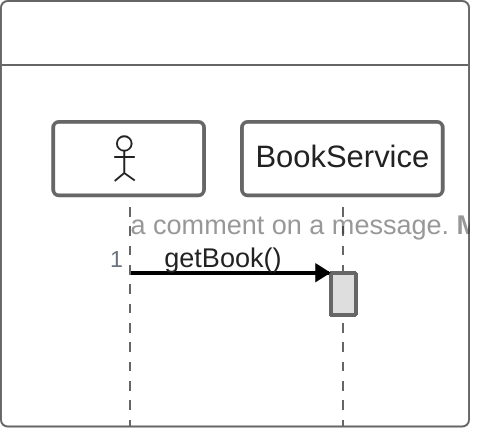


## Loops

It is possible to express loops in a ZenUML diagram. This is done by any of the
following notations:

1.  while
2.  for
3.  forEach, foreach
4.  loop

<!---->

    while(condition) {
      ...statements...
    }

See the example below:

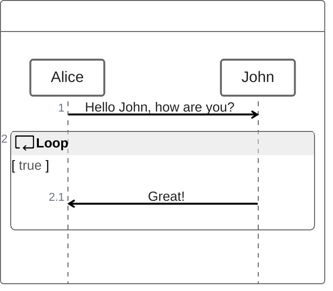


## Alt

It is possible to express alternative paths in a sequence diagram. This is done by the notation

    if(condition1) {
      ...statements...
    } else if(condition2) {
      ...statements...
    } else {
      ...statements...
    }

See the example below:

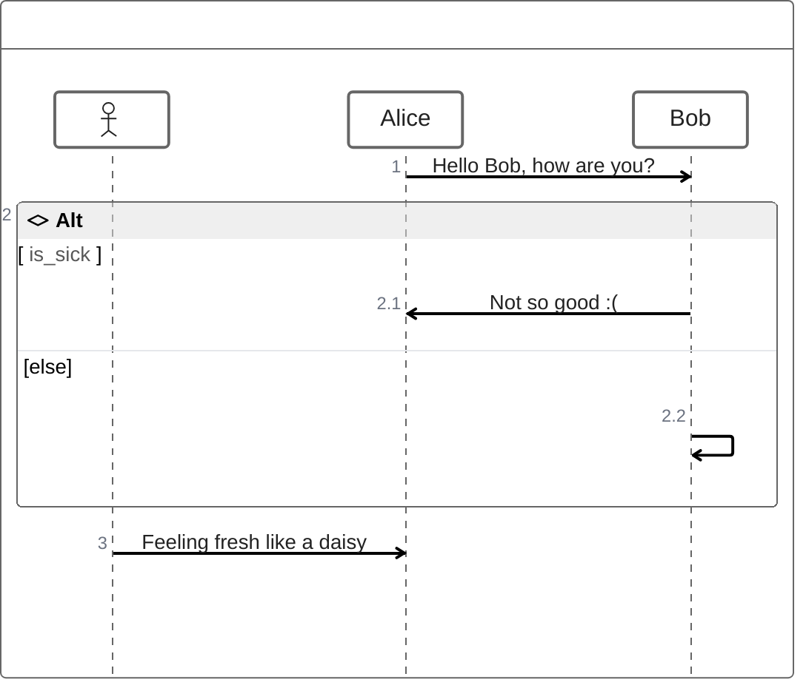


## Opt

It is possible to render an `opt` fragment. This is done by the notation

    opt {
      ...statements...
    }

See the example below:

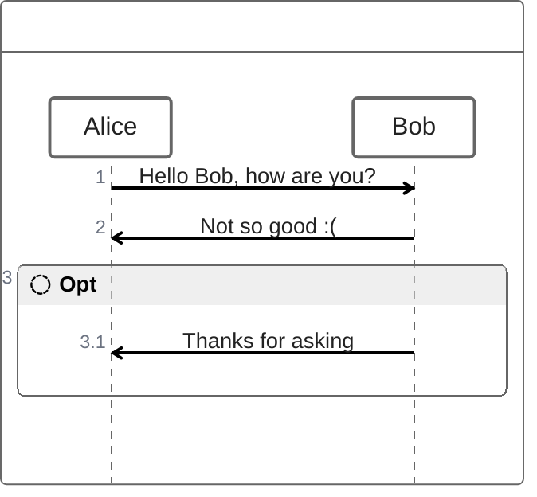


## Parallel

It is possible to show actions that are happening in parallel.

This is done by the notation

    par {
      statement1
      statement2
      statement3
    }

See the example below:

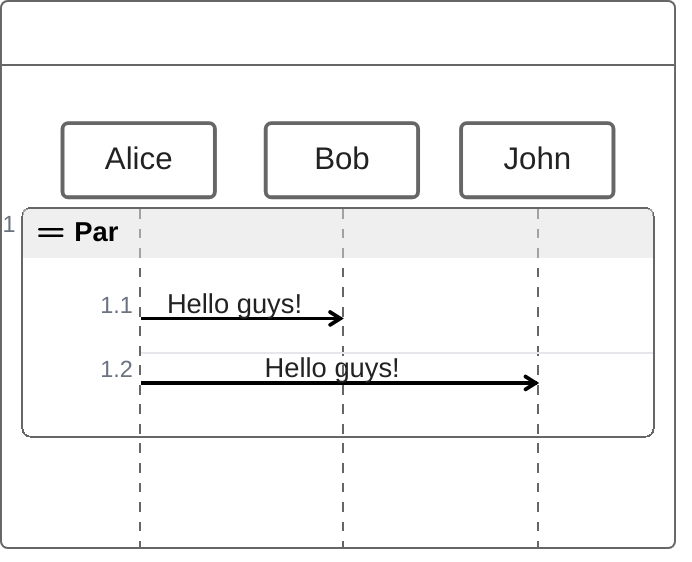


## Try/Catch/Finally (Break)

It is possible to indicate a stop of the sequence within the flow (usually used to model exceptions).

This is done by the notation

    try {
      ...statements...
    } catch {
      ...statements...
    } finally {
      ...statements...
    }

See the example below:

```mermaid-example
zenuml
    try {
      Consumer->API: Book something
      API->BookingService: Start booking process
    } catch {
      API->Consumer: show failure
    } finally {
      API->BookingService: rollback status
    }
```

```mermaid
zenuml
    try {
      Consumer->API: Book something
      API->BookingService: Start booking process
    } catch {
      API->Consumer: show failure
    } finally {
      API->BookingService: rollback status
    }
```
