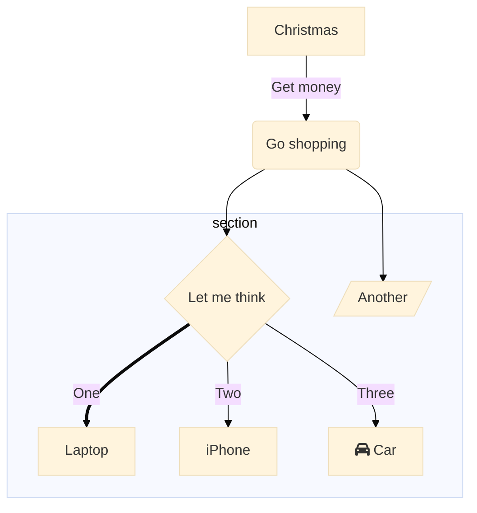
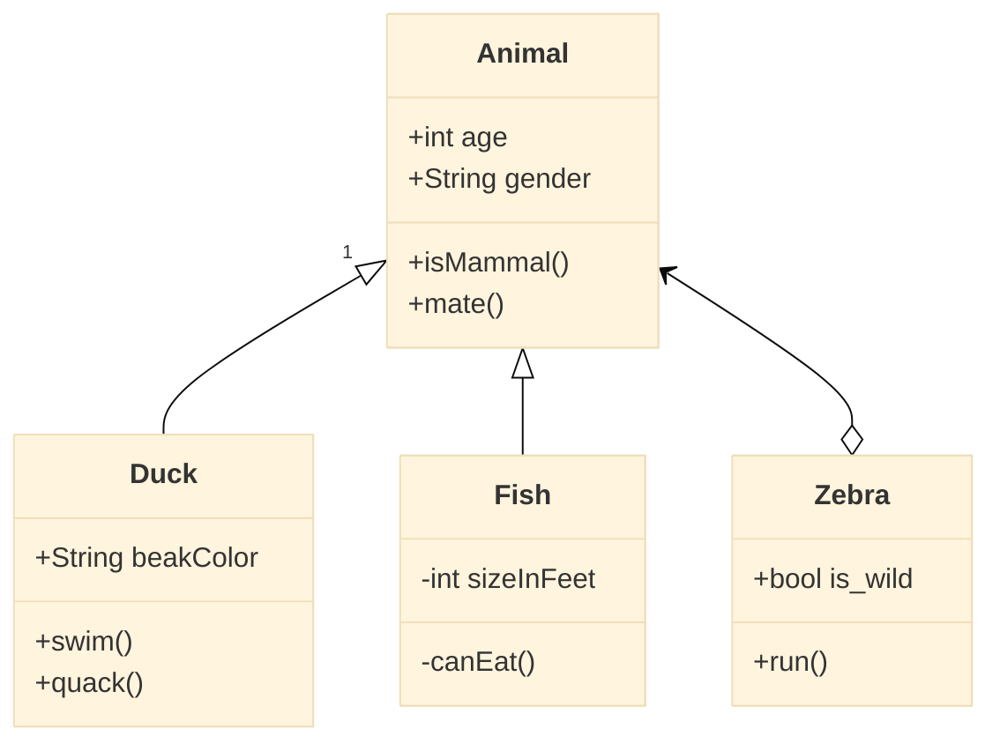

# Theming

**Edit this Page** [](https://github.com/mermaid-js/mermaid/blob/develop/docs/theming.md)

With Version 8.7.0 Mermaid comes out with a system for dynamic and integrated setting of the diagram's theme. The objective of this is to increase the customizability of mermaid, by allowing for the customization of themes through the `%%init%%` directive and `initialize`. With it a site integrator can override a vast majority of attributes used when rendering a diagram.

Themes, for all intents and purposes also follow the Levels of Configuration and employ `directives` to modify configurations, as they were introduced in Version [8.6.0](./8.6.0_docs.md). 

## Site-wide Themes
Site-wide themes are still declared via `initialize` by site owners.

Example of `Initalize` call:
```
    mermaidAPI.initialize({	
        'securityLevel': 'loose', 'theme': 'base'	
    });	
```
**Notes**: Only site owners can use the `mermaidAPI.initialize` call to set values. Site-Users will have to use `%%init%%` to modify configurations, everytime they create a diagram. 

## Themes at the Local or Current Level
When Generating a diagram using on a webpage that supports mermaid. It is also possible to override site-wide theme settings locally, for a specific diagram, using directives, as long as it is not prohibited by the `secure` array. 


```
%%{init: {'theme':'base'}}%%
  graph TD
    a --> b
```


Here is an example of how `%%init%%` can set the theme to 'base', this assumes that `themeVariables` are set to default:

```
mermaid
%%{init: {'theme':'base'}}%%
        graph TD
          A[Christmas] -->|Get money| B(Go shopping)
          B --> C{Let me think}
          B --> G[/Another/]
          C ==>|One| D[Laptop]
          C -->|Two| E[iPhone]
          C -->|Three| F[fa:fa-car Car]
          subgraph section
            C
            D
            E
            F
            G
          end
```

# Making a Custom Theme  with `themeVariables`

The easiest way to make a custom theme is to start with the base theme, and just modify theme variables through `themeVariables`, via `%%init%%`. 

| Parameter | Description |Type | Required | Objects contained|
| --- | --- | --- | --- | --- |
|themeVariables | Array containing objects, modifiable with the `%%init%%` directive| Array | Required | primaryColor, lineColor, textColor|

**Notes**:
Leaving it empty will set the values to default
* primaryColor- the base color for the theme 
* lineColor- the line color for the theme 
* textColor-the text color for the theme 

**Here is an example of overriding `primaryColor` and giving everything a ifferent look, using `%%init%%`. 
```
mermaid
%%{init: {'theme':'base', 'themeVariables': {primaryColor: '#ff0000'}}%%
        graph TD
          A[Christmas] -->|Get money| B(Go shopping)
          B --> C{Let me think}
          B --> G[/Another/]
          C ==>|One| D[Laptop]
          C -->|Two| E[iPhone]
          C -->|Three| F[fa:fa-car Car]
          subgraph section
            C
            D
            E
            F
            G
          end
```
The Theming Engine does not admit color codes and will only accept proper color values. Color Names is not supported so for instance, the color value 'red' will not work, but '#ff0000' will work.

# Examples:

When adjusting a theme it might be helpful to look at the theme with these diagrams to evaluate that everything is visible and looks good.
In the following examples, the directive `init` is used, with the `theme` being declared as `base`. for more information on this, read the documentation for [Version 8.6.0](/8.6.0_docs.md)

### Flowchart
```
%%{init: {'securityLevel': 'loose', 'theme':'base'}}%%
        graph TD
          A[Christmas] -->|Get money| B(Go shopping)
          B --> C{Let me think}
          B --> G[/Another/]
          C ==>|One| D[Laptop]
          C -->|Two| E[iPhone]
          C -->|Three| F[fa:fa-car Car]
          subgraph section
            C
            D
            E
            F
            G
          end
```


### Flowchart (beta)
```
mermaid
%%{init: {'securityLevel': 'loose', 'theme':'base'}}%%
        flowchart TD
          A[Christmas] -->|Get money| B(Go shopping)
          B --> C{Let me think}
          B --> G[Another]
          C ==>|One| D[Laptop]
          C x--x|Two| E[iPhone]
          C o--o|Three| F[fa:fa-car Car]
          subgraph section
            C
            D
            E
            F
            G
          end
```

### Sequence diagram

```
mermaid
%%{init: {'securityLevel': 'loose', 'theme':'base'}}%%

        sequenceDiagram
          autonumber
          par Action 1
            Alice->>John: Hello John, how are you?
          and Action 2
            Alice->>Bob: Hello Bob, how are you?
          end
          Alice->>+John: Hello John, how are you?
          Alice->>+John: John, can you hear me?
          John-->>-Alice: Hi Alice, I can hear you!
          Note right of John: John is perceptive
          John-->>-Alice: I feel great!
              loop Every minute
                John-->Alice: Great!
            end
```

### class diagram



### Gantt

```
mermaid
gantt
       dateFormat                :YYYY-MM-DD
       title                     Adding GANTT diagram functionality to mermaid
       excludes                  :excludes the named dates/days from being included in a charted task..
       section A section
       Completed task            :done,    des1, 2014-01-06,2014-01-08
       Active task               :active,  des2, 2014-01-09, 3d
       Future task               :         des3, after des2, 5d
       Future task2              :         des4, after des3, 5d

       section Critical tasks
       Completed task in the critical line :crit, done, 2014-01-06,24h
       Implement parser and jison          :crit, done, after des1, 2d
       Create tests for parser             :crit, active, 3d
       Future task in critical line        :crit, 5d
       Create tests for renderer           :2d
       Add to mermaid                      :1d

       section Documentation
       Describe gantt syntax               :active, a1, after des1, 3d
       Add gantt diagram to demo page      :after a1  , 20h
       Add another diagram to demo page    :doc1, after a1  , 48h

       section Last section
       Describe gantt syntax               :after doc1, 3d
       Add gantt diagram to demo page      :20h
       Add another diagram to demo page    :48h
```

### State diagram
```
mermaid
%%{init: {'securityLevel': 'loose', 'theme':'base'}}%%
      stateDiagram
        [*] --> Active

        state Active {
            [*] --> NumLockOff
            NumLockOff --> NumLockOn : EvNumLockPressed
            NumLockOn --> NumLockOff : EvNumLockPressed
            --
            [*] --> CapsLockOff
            CapsLockOff --> CapsLockOn : EvCapsLockPressed
            CapsLockOn --> CapsLockOff : EvCapsLockPressed
            --
            [*] --> ScrollLockOff
            ScrollLockOff --> ScrollLockOn : EvCapsLockPressed
            ScrollLockOn --> ScrollLockOff : EvCapsLockPressed
        }
        state SomethingElse {
          A --> B
          B --> A
        }

        Active --> SomethingElse
        note right of SomethingElse : This is the note to the right.

        SomethingElse --> [*]

```

### State diagram (beta)

```
mermaid
%%{init: {'securityLevel': 'loose', 'theme':'base'}}%%
stateDiagram-v2
        [*] --> Active

        state Active {
            [*] --> NumLockOff
            NumLockOff --> NumLockOn : EvNumLockPressed
            NumLockOn --> NumLockOff : EvNumLockPressed
            --
            [*] --> CapsLockOff
            CapsLockOff --> CapsLockOn : EvCapsLockPressed
            CapsLockOn --> CapsLockOff : EvCapsLockPressed
            --
            [*] --> ScrollLockOff
            ScrollLockOff --> ScrollLockOn : EvCapsLockPressed
            ScrollLockOn --> ScrollLockOff : EvCapsLockPressed
        }
        state SomethingElse {
          A --> B
          B --> A
        }

        Active --> SomethingElse2
        note right of SomethingElse2 : This is the note to the right.

        SomethingElse2 --> [*]
```

### Entity Relations diagram

```
mermaid
      erDiagram
        CUSTOMER }|..|{ DELIVERY-ADDRESS : has
        CUSTOMER ||--o{ ORDER : places
        CUSTOMER ||--o{ INVOICE : "liable for"
        DELIVERY-ADDRESS ||--o{ ORDER : receives
        INVOICE ||--|{ ORDER : covers
        ORDER ||--|{ ORDER-ITEM : includes
        PRODUCT-CATEGORY ||--|{ PRODUCT : contains
        PRODUCT ||--o{ ORDER-ITEM : "ordered in"
```

### User journey diagram
```
mermaid
journey
            title My working day
            section Go to work
              Make tea: 5: Me
              Go upstairs: 3: Me
              Do work: 1: Me, Cat
            section Go home
              Go downstairs: 5: Me
              Sit down: 5: Me
```
