# Theme Configuration

**Edit this Page** [](https://github.com/mermaid-js/mermaid/blob/develop/docs/theming.md)

With Version 8.7.0 Mermaid comes out with a system for dynamic and integrated configuration of the diagram themes. The objective of this is to increase the customizability of mermaid and the ease of Styling, with the customization of themes through the `%%init%%` directive and `initialize` calls.

Themes follow and build upon the Levels of Configuration and employ `directives` to modify and create custom configurations, as they were introduced in Version [8.6.0](./8.6.0_docs.md).

**These Theming Configurations, similar to directives, will also be made applicable in the Live-Editor, to maximize customizability.

## Site-wide Themes
Site-wide themes are still declared via `initialize` by site owners.

Example of `Initalize` call setting `theme` to `base`:
```
    mermaidAPI.initialize({
        'securityLevel': 'loose', 'theme': 'base'
    });
```
**Notes**: Only site owners can use the `mermaidAPI.initialize` call, to set values. Site-Users will have to use `%%init%%` to modify or create the theme for their diagrams.

## Themes at the Local or Current Level
When Generating a diagram using on a webpage that supports mermaid. It is also possible to override site-wide theme settings locally, for a specific diagram, using directives, as long as it is not prohibited by the `secure` array.


```
%%{init: {'theme':'base'}}%%
  graph TD
    a --> b
```


Here is an example of how `%%init%%` can set the theme to 'base', this assumes that `themeVariables` are set to default:

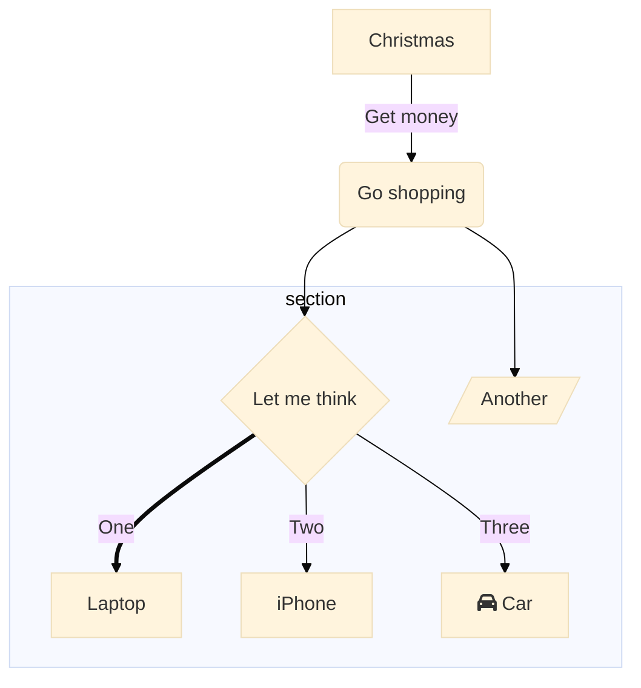

# Making a Custom Theme  with `themeVariables`

The easiest way to make a custom theme is to start with the base theme, and just modify theme variables through `themeVariables`, via `%%init%%`.

|   Parameter    |                            Description                             | Type  | Required |         Objects contained          |
| -------------- | ------------------------------------------------------------------ | ----- | -------- | ---------------------------------- |
| themeVariables | Array containing objects, modifiable with the `%%init%%` directive | Array | Required | primaryColor, lineColor, textColor |


## Here is an example of overriding `primaryColor` through `themeVariables` and giving everything a different look, using `%%init%%`.

```
%%{init: {'theme': 'base', 'themeVariables': { 'primaryColor': '#ff0000'}}}%%
        graph TD
          A[Christmas] -->|Get money| B(Go shopping)
          B --> C{Let me think}
          B --> G[/Another/]
          C ==>|One| D[Laptop]
          C -->|Two| E[iPhone]
          C -->|Three| F[fa:fa-car Car]
          subgraph section
            C
            D
            E
            F
            G
          end
```

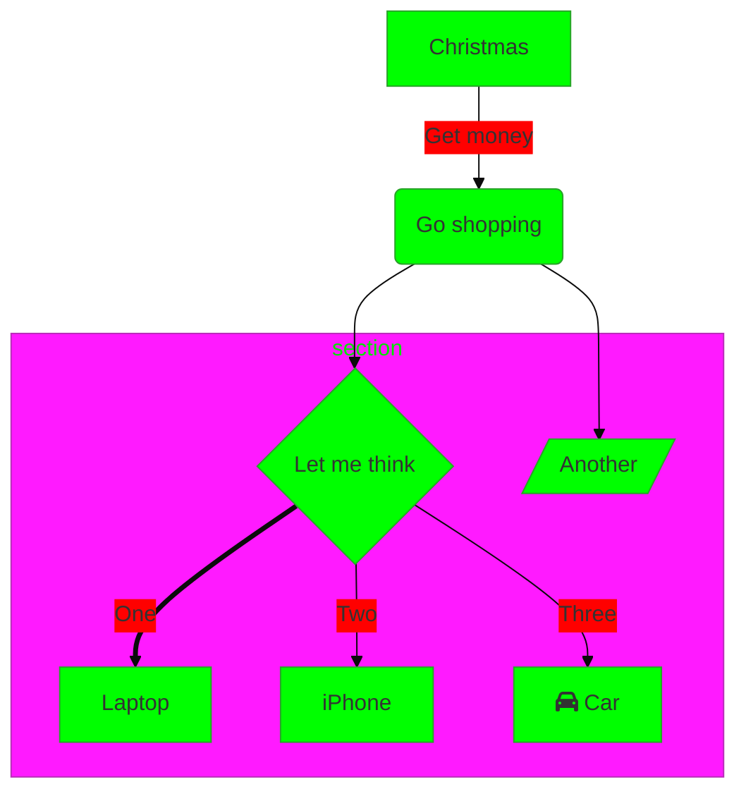


**Notes:**
Leaving it empty will set all variable values to default.

## Color and Color Calculation:

Color definitions have certain interactions in mermaid, this is in order to ensure visibility for diagrams. mermaid will adjust some variables automatically, when colors are changed in order to compensate and maintain readability.

**The Default Value Column** to the right of the Variable column will denote the Variable paired/associated with the Variable on the left and the nature of this pairing or association. If it for instance says primaryColor it means that it gets primaryColor as default value. If it says "based on primaryColor" it means that it is calculated/ derived from primaryColor. This calculation can be primary color inversion, a change of hue, darkening or lightening by 10%, etc.

You can create your own themes, by changing any of the given variables below. If you are using a dark background, set dark mode to true to adjust the colors. It is possible to override the calculations using the variable names below, with `%%init%%` if you wish to style it differently.


## Theme Variables Reference Table

```note
Variables that are unique to some diagrams can be affected by changes in Theme Variables
```

|       Variable       |         Default/Base/Factor value          | Calc |                                                           Description                                                            |
| -------------------- | ------------------------------ | ---- | -------------------------------------------------------------------------------------------------------------------------------- |
| darkMode             | false                          |      | Boolean Value that dictates how to calculate colors. "true" will activate darkmode.                                                                                 |
| background           | #f4f4f4                        |      | Used to calculate color for items that should either be background colored or contrasting to the background.                     |
| primaryColor         | #fff4dd                        |      | Color to be used as background in nodes, other colors will be derived from this                                                  |
| fontFamily           | "trebuchet ms", verdana, arial |      |                                                                                                                                  |
| fontSize             | 16px                           |      |  Font Size, in pixels                                                                                                                                |
| secondaryColor       | based on primaryColor          | *    |                                                                                                                                  |
| tertiaryColor        | based on primaryColor          | *    |                                                                                                                                  |
| primaryBorderColor   | based on primaryColor          | *    | Color to be used as border in nodes using primaryColor                                                                           |
| primaryTextColor     | based on darkMode #ddd/#333    | *    | Color to be used as text color in nodes using primaryColor                                                                        |
| secondaryBorderColor | based on secondaryColor        | *    | Color to be used as border in nodes using secondaryColor                                                                         |
| secondaryTextColor   | based on secondaryColor        | *    | Color to be used as text color in nodes using secondaryColor                                                                      |
| tertiaryBorderColor  | based on tertiaryColor         | *    | Color to be used as border in nodes using tertiaryColor                                                                          |
| tertiaryTextColor    | based on tertiaryColor         | *    | Color to be used as text color in nodes using tertiaryColor                                                                       |
| noteBkgColor         | #fff5ad                        |      | Color used as background in notes                                                                                                |
| noteTextColor        | #333                           |      | Text color in note rectangles.                                                                                                        |
| noteBorderColor      | based on noteBkgColor          | *    | Border color in note rectangles.                                                                                                      |
| lineColor            | based on background            | *    |                                                                                                                                  |
| textColor            | based on primaryTextColor      | *    | Text in diagram over the background for instance text on labels and on signals in sequence diagram or the title in gantt diagram |
| mainBkg              | based on primaryColor          | *    | Background in flowchart objects like rects/circles, class diagram classes, sequence diagram  etc                                 |
| errorBkgColor        | tertiaryColor                  | *    | Color for syntax error message                                                                                                   |
| errorTextColor       | tertiaryTextColor              | *    | Color for syntax error message                                                                                                   |

# What follows are Variables, specific to different diagrams and charts.

## Some Theme Variables serve as, or affect the Default Values for Specific Diagram Variables, unless changed using `%%init%%` .

## Flowchart

|       Variable      |    Default/ Associated Value        | Calc |                                                           Description                                                            |
| -------------------- | ------------------------------ | ---- | -------------------------------------------------------------------------------------------------------------------------------- |
| nodeBorder           | primaryBorderColor             | *    | Node Border Color                                                                                                                                |
| clusterBkg           | tertiaryColor                  | *    | Background in subgraphs                                                                                                          |
| clusterBorder        | tertiaryBorderColor            | *    | Cluster Border Color                                                                                                                               |
| defaultLinkColor     | lineColor                      | *    | Link Color                                                                                                                                  |
| titleColor           | tertiaryTextColor              | *    |  Title Color                                                                                                                              |
| edgeLabelBackground  | based on secondaryColor        | *    |                                                                                                                                  |
| nodeTextColor        | primaryTextColor               | *    |  Color for text inside Nodes.                                                                                                                                |

# sequence diagram

|         name          |      Default value      | Calc | Description |
| --------------------- | ----------------------- | ---- | ----------- |
| actorBorder           | primaryBorderColor      | *    |   Actor Border Color          |
| actorBkg              | mainBkg                 | *    | Actor Background Color         |
| actorTextColor        | primaryTextColor        | *    |  Actor Text Color            |
| actorLineColor        | grey                    | *    |   Actor Line Color           |
| labelBoxBkgColor      | actorBkg                | *    |  Label Box Background Color            |
| signalColor           | textColor               | *    |  Signal Color           |
| signalTextColor       | textColor               | *    |  Signal Text Color           |
| labelBoxBorderColor   | actorBorder             | *    |   Label Box Border Color          |
| labelTextColor        | actorTextColor          | *    |   Label Text Color           |
| loopTextColor         | actorTextColor          | *    |   Loop ext Color            |
| activationBorderColor | based on secondaryColor | *    |    Activation Border Color         |
| activationBkgColor    | secondaryColor          | *    |   Activation Background Color          |
| sequenceNumberColor   | based on lineColor      | *    |    Sequence Number Color          |

# state colors

|     name      |  Default value   | Calc |                 Description                 |
| ------------- | ---------------- | ---- | ------------------------------------------- |
| labelColor    | primaryTextColor | *    |                                             |
| altBackground | tertiaryColor    | *    | Used for background in deep composite states |

# class colors

|   name    | Default value | Calc |      Description       |
| --------- | ------------- | ---- | ---------------------- |
| classText | textColor     | *    | Color of Text in class diagrams |

# User journey colors

|   name    |      Default value       | Calc |               Description               |
| --------- | ------------------------ | ---- | --------------------------------------- |
| fillType0 | primaryColor             | *    | Fill for 1st section in journey diagram |
| fillType1 | secondaryColor           | *    | Fill for 2nd section in journey diagram |
| fillType2 | based on primaryColor    | *    | Fill for 3rd section in journey diagram |
| fillType3 | based on  secondaryColor | *    | Fill for 4th section in journey diagram |
| fillType4 | based on primaryColor    | *    | Fill for 5th section in journey diagram |
| fillType5 | based on secondaryColor  | *    | Fill for 6th section in journey diagram |
| fillType6 | based on primaryColor    | *    | Fill for 7th section in journey diagram |
| fillType7 | based on secondaryColor  | *    | Fill for 8th section in journey diagram |

**Notes: Values are meant to create an alternating look.


# Here is an example of overriding `primaryColor` and giving everything a different look, using `%%init%%`.
```
%%{init: {'theme': 'base', 'themeVariables': { 'primaryColor': '#ff0000'}}}%%
        graph TD
          A[Christmas] -->|Get money| B(Go shopping)
          B --> C{Let me think}
          B --> G[/Another/]
          C ==>|One| D[Laptop]
          C -->|Two| E[iPhone]
          C -->|Three| F[fa:fa-car Car]
          subgraph section
            C
            D
            E
            F
            G
          end
```

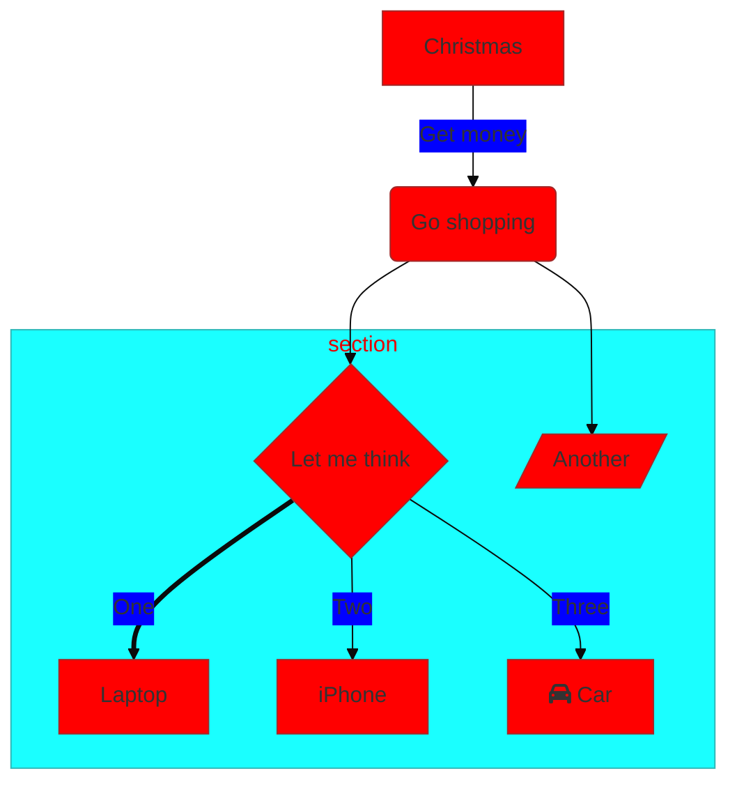

**This got a bit too dark and bit too colorful. With some easy steps this can be fixed:

* Make the primary color a little lighter
* set the tertiary color to a reddish shade as well
* make the edge label background differ from the subgraph by setting the edgeLabelBackground


```
%%{init: {'theme': 'base', 'themeVariables': { 'primaryColor': '#ffcccc', 'edgeLabelBackground':'#ffffee', 'tertiaryColor': '#fff0f0'}}}%%
        graph TD
          A[Christmas] -->|Get money| B(Go shopping)
          B --> C{Let me think}
          B --> G[/Another/]
          C ==>|One| D[Laptop]
          C -->|Two| E[iPhone]
          C -->|Three| F[fa:fa-car Car]
          subgraph section
            C
            D
            E
            F
            G
          end
```

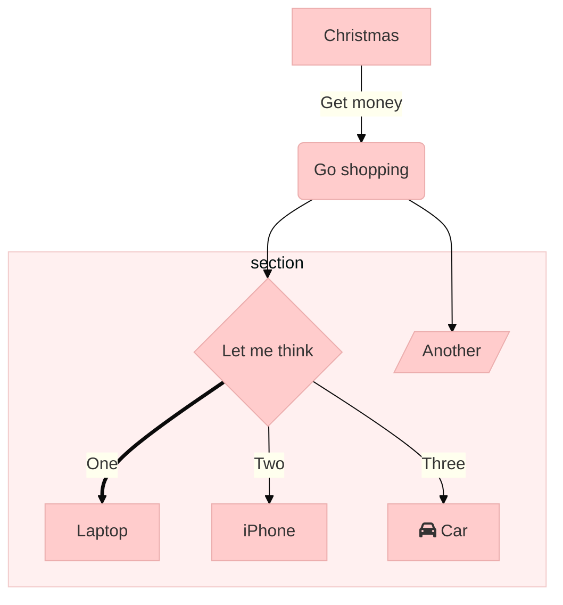

The Theming Engine does not admit color codes and will only accept proper color values. Color Names is not supported so for instance, the color value 'red' will not work, but '#ff0000' will work.

# Common theming activities

## How to change the color of the arrows

# Examples:

When adjusting a theme it might be helpful to look at how your preferred theme goes with the diagrams, to evaluate whether everything is visible and looks good.
In the following examples, the directive `init` is used, with the `theme` being declared as `base`. For more information on using directives, read the documentation for [Version 8.6.0](/8.6.0_docs.md)

### Flowchart
```
%%{init: {'securityLevel': 'loose', 'theme':'base'}}%%
        graph TD
          A[Christmas] -->|Get money| B(Go shopping)
          B --> C{Let me think}
          B --> G[/Another/]
          C ==>|One| D[Laptop]
          C -->|Two| E[iPhone]
          C -->|Three| F[fa:fa-car Car]
          subgraph section
            C
            D
            E
            F
            G
          end
```


### Flowchart (beta)
```
%%{init: {'securityLevel': 'loose', 'theme':'base'}}%%
        flowchart TD
          A[Christmas] -->|Get money| B(Go shopping)
          B --> C{Let me think}
          B --> G[Another]
          C ==>|One| D[Laptop]
          C x--x|Two| E[iPhone]
          C o--o|Three| F[fa:fa-car Car]
          subgraph section
            C
            D
            E
            F
            G
          end
```
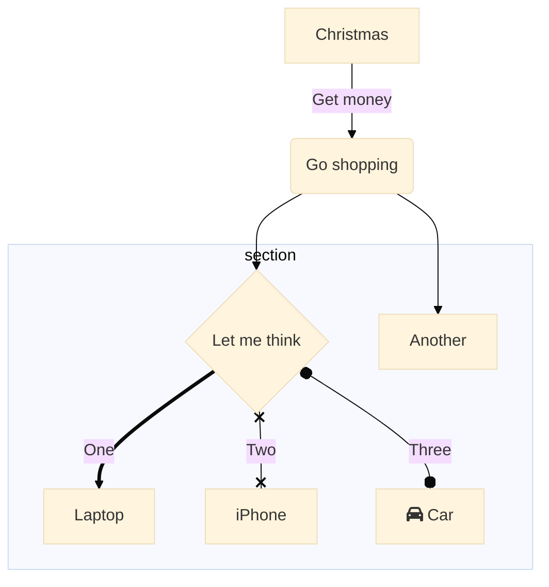

### Sequence diagram
```
%%{init: {'securityLevel': 'loose', 'theme':'base'}}%%
        sequenceDiagram
          autonumber
          par Action 1
            Alice->>John: Hello John, how are you?
          and Action 2
            Alice->>Bob: Hello Bob, how are you?
          end
          Alice->>+John: Hello John, how are you?
          Alice->>+John: John, can you hear me?
          John-->>-Alice: Hi Alice, I can hear you!
          Note right of John: John is perceptive
          John-->>-Alice: I feel great!
              loop Every minute
                John-->Alice: Great!
            end
```
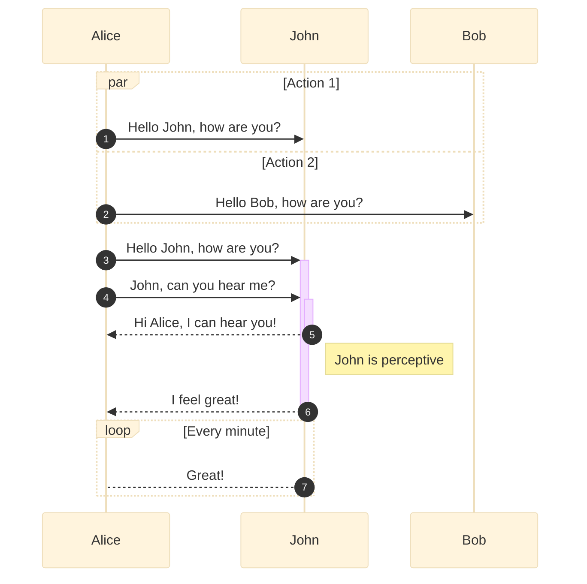

### Class diagram
```
%%{init: {'securityLevel': 'loose', 'theme':'base'}}%%

classDiagram
	Animal "1" <|-- Duck
	Animal <|-- Fish
	Animal <--o Zebra
	Animal : +int age
	Animal : +String gender
	Animal: +isMammal()
	Animal: +mate()
	class Duck{
		+String beakColor
		+swim()
		+quack()
	}
	class Fish{
		-int sizeInFeet
		-canEat()
	}
	class Zebra{
		+bool is_wild
		+run()
	}
```
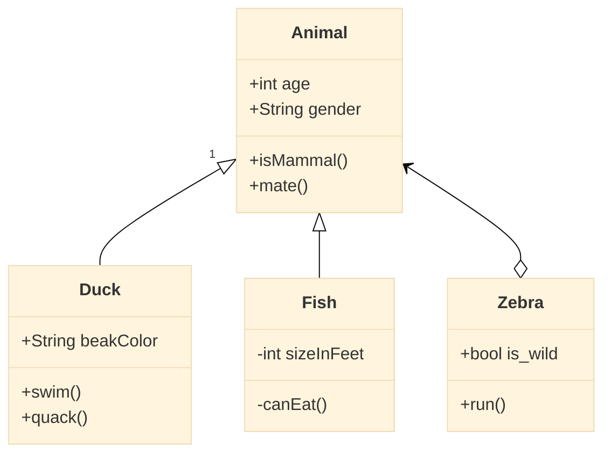

### Gantt
```
gantt
       dateFormat                YYYY-MM-DD
       title                     Adding GANTT diagram functionality to mermaid
       excludes                  :excludes the named dates/days from being included in a charted task..
       section A section
       Completed task            :done,    des1, 2014-01-06,2014-01-08
       Active task               :active,  des2, 2014-01-09, 3d
       Future task               :         des3, after des2, 5d
       Future task2              :         des4, after des3, 5d

       section Critical tasks
       Completed task in the critical line :crit, done, 2014-01-06,24h
       Implement parser and jison          :crit, done, after des1, 2d
       Create tests for parser             :crit, active, 3d
       Future task in critical line        :crit, 5d
       Create tests for renderer           :2d
       Add to mermaid                      :1d

       section Documentation
       Describe gantt syntax               :active, a1, after des1, 3d
       Add gantt diagram to demo page      :after a1  , 20h
       Add another diagram to demo page    :doc1, after a1  , 48h

       section Last section
       Describe gantt syntax               :after doc1, 3d
       Add gantt diagram to demo page      :20h
       Add another diagram to demo page    :48h
```

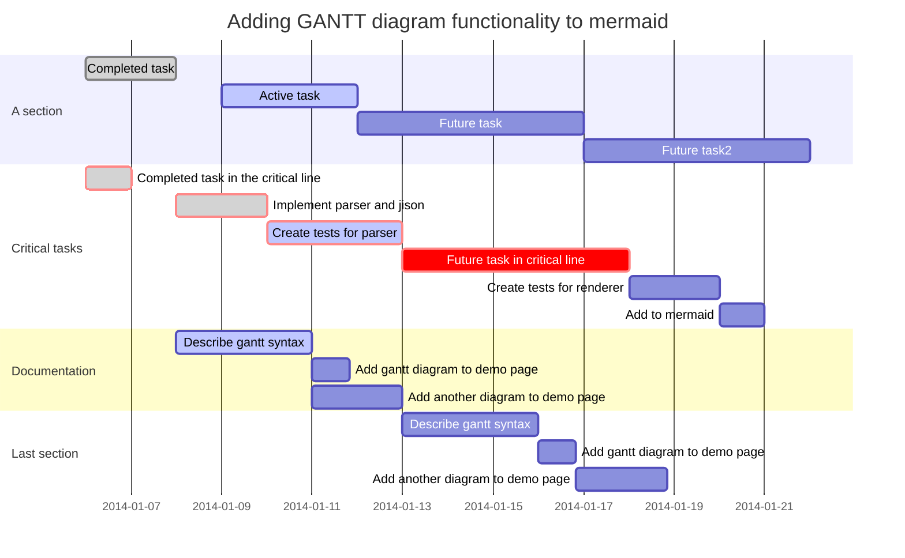

### State diagram
```
%%{init: {'securityLevel': 'loose', 'theme':'base'}}%%
      stateDiagram
        [*] --> Active

        state Active {
            [*] --> NumLockOff
            NumLockOff --> NumLockOn : EvNumLockPressed
            NumLockOn --> NumLockOff : EvNumLockPressed
            --
            [*] --> CapsLockOff
            CapsLockOff --> CapsLockOn : EvCapsLockPressed
            CapsLockOn --> CapsLockOff : EvCapsLockPressed
            --
            [*] --> ScrollLockOff
            ScrollLockOff --> ScrollLockOn : EvCapsLockPressed
            ScrollLockOn --> ScrollLockOff : EvCapsLockPressed
        }
        state SomethingElse {
          A --> B
          B --> A
        }

        Active --> SomethingElse
        note right of SomethingElse : This is the note to the right.

        SomethingElse --> [*]

```
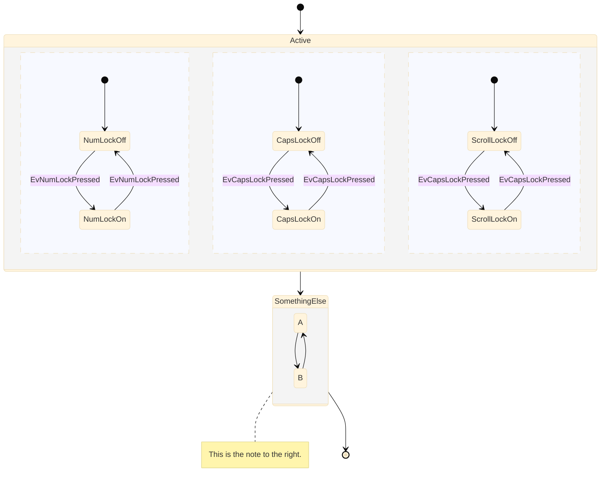

### State diagram (beta)

```
%%{init: {'securityLevel': 'loose', 'theme':'base'}}%%
stateDiagram-v2
        [*] --> Active

        state Active {
            [*] --> NumLockOff
            NumLockOff --> NumLockOn : EvNumLockPressed
            NumLockOn --> NumLockOff : EvNumLockPressed
            --
            [*] --> CapsLockOff
            CapsLockOff --> CapsLockOn : EvCapsLockPressed
            CapsLockOn --> CapsLockOff : EvCapsLockPressed
            --
            [*] --> ScrollLockOff
            ScrollLockOff --> ScrollLockOn : EvCapsLockPressed
            ScrollLockOn --> ScrollLockOff : EvCapsLockPressed
        }
        state SomethingElse {
          A --> B
          B --> A
        }

        Active --> SomethingElse2
        note right of SomethingElse2 : This is the note to the right.

        SomethingElse2 --> [*]
```
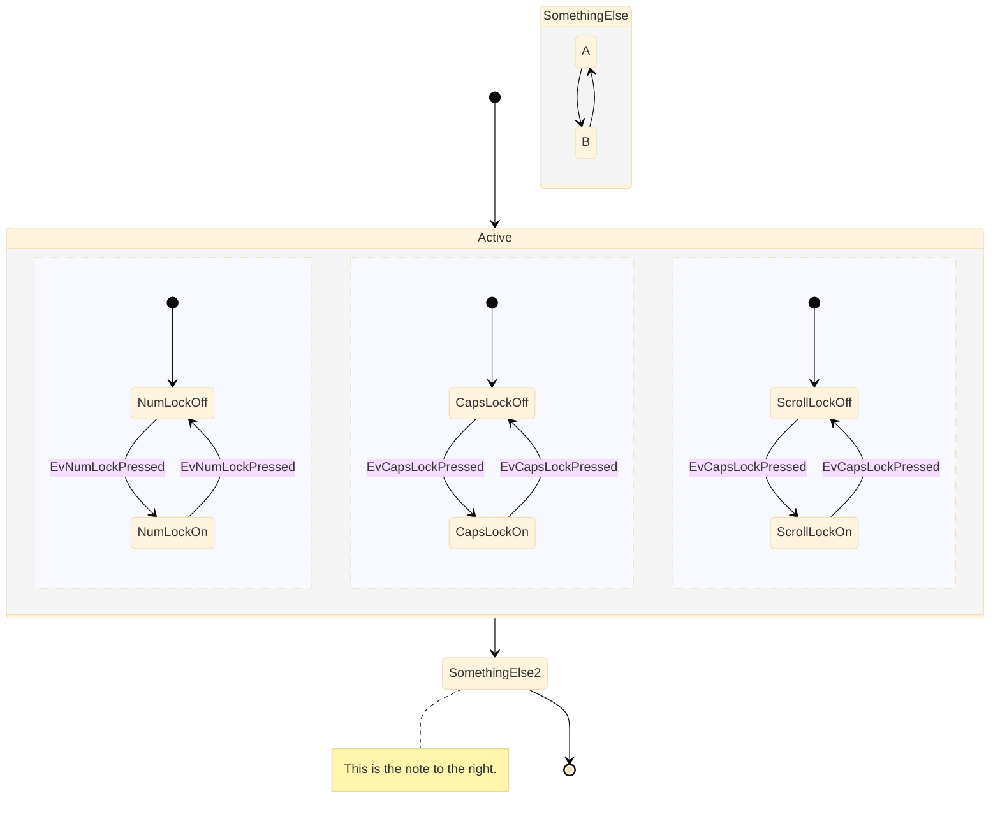

### Entity Relations diagram

```
      erDiagram
        CUSTOMER }|..|{ DELIVERY-ADDRESS : has
        CUSTOMER ||--o{ ORDER : places
        CUSTOMER ||--o{ INVOICE : "liable for"
        DELIVERY-ADDRESS ||--o{ ORDER : receives
        INVOICE ||--|{ ORDER : covers
        ORDER ||--|{ ORDER-ITEM : includes
        PRODUCT-CATEGORY ||--|{ PRODUCT : contains
        PRODUCT ||--o{ ORDER-ITEM : "ordered in"
```
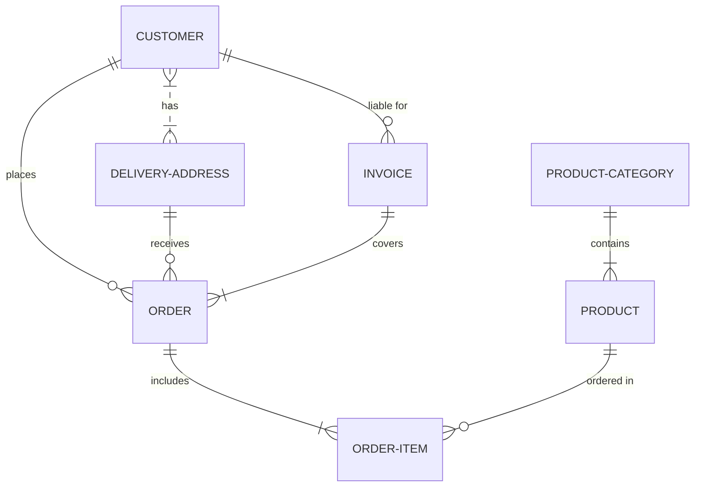

### User journey diagram
```
journey
            title My working day
            section Go to work
              Make tea: 5: Me
              Go upstairs: 3: Me
              Do work: 1: Me, Cat
            section Go home
              Go downstairs: 5: Me
              Sit down: 5: Me
```

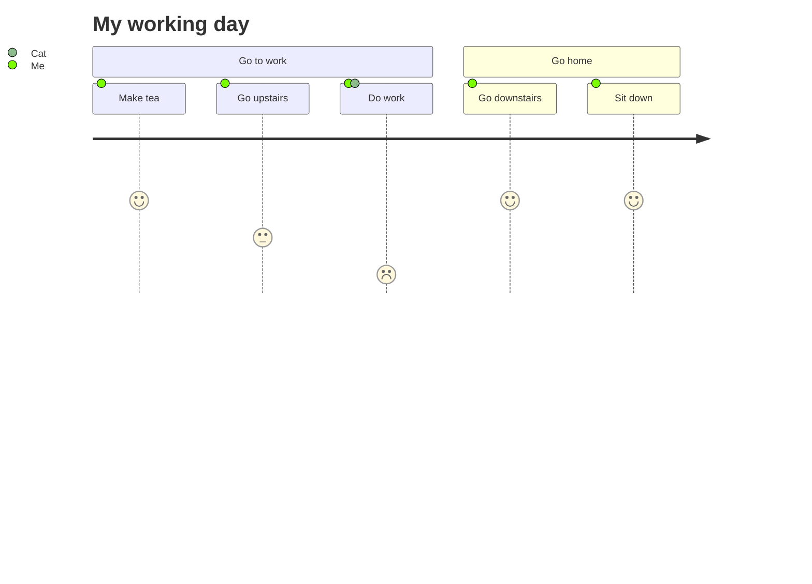
