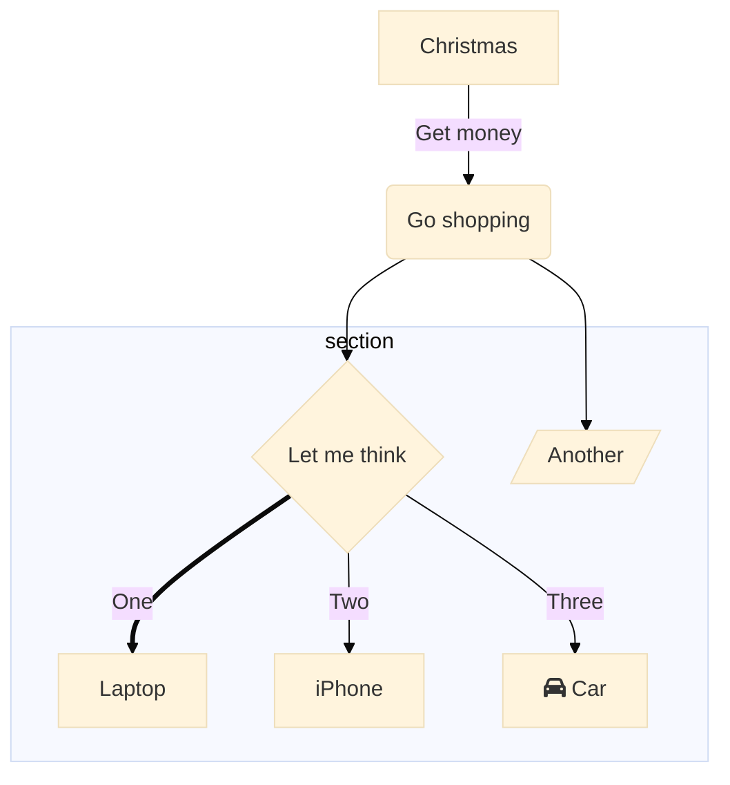
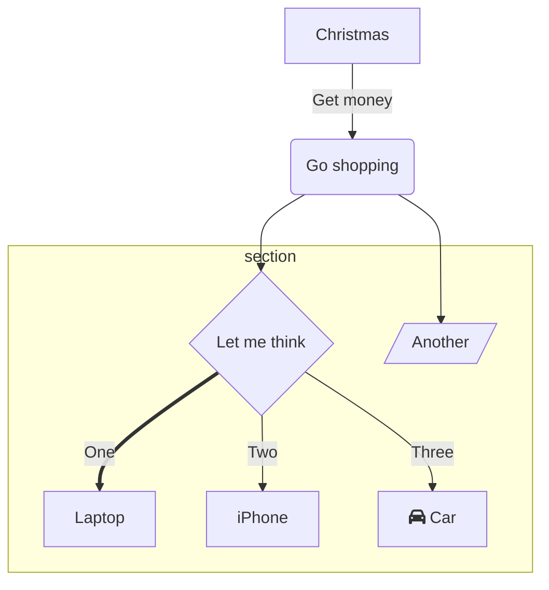
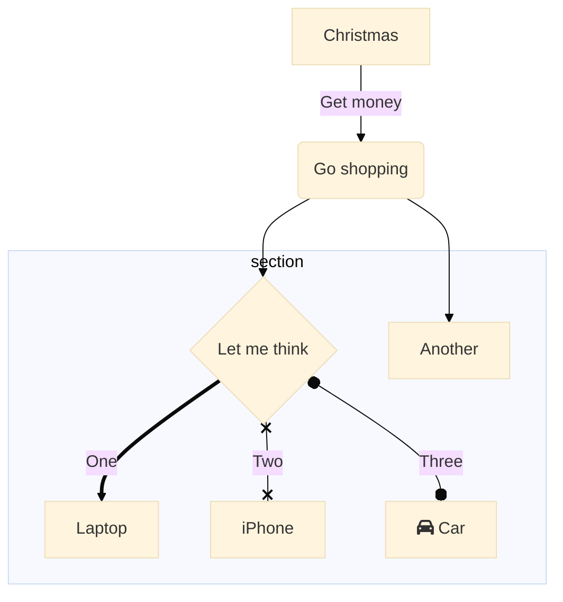
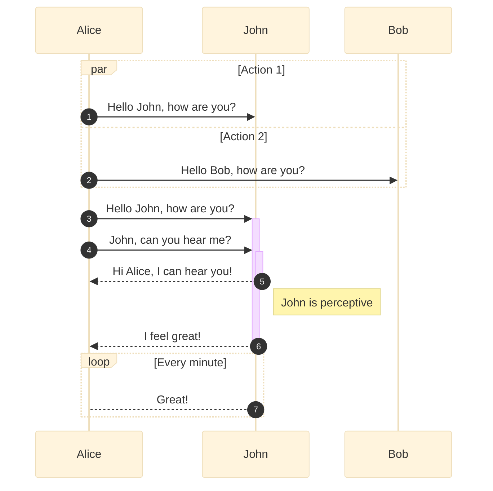
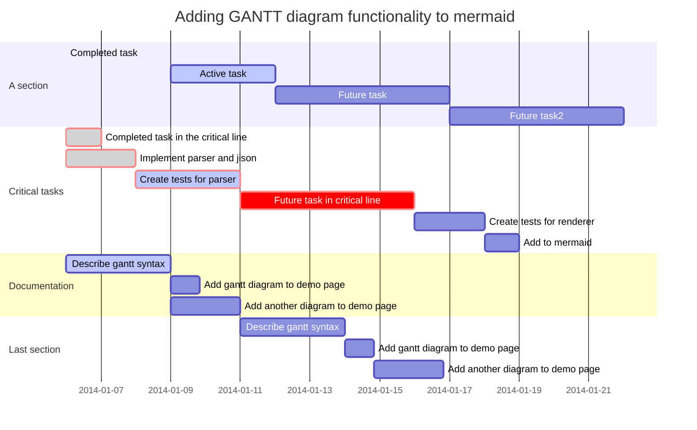
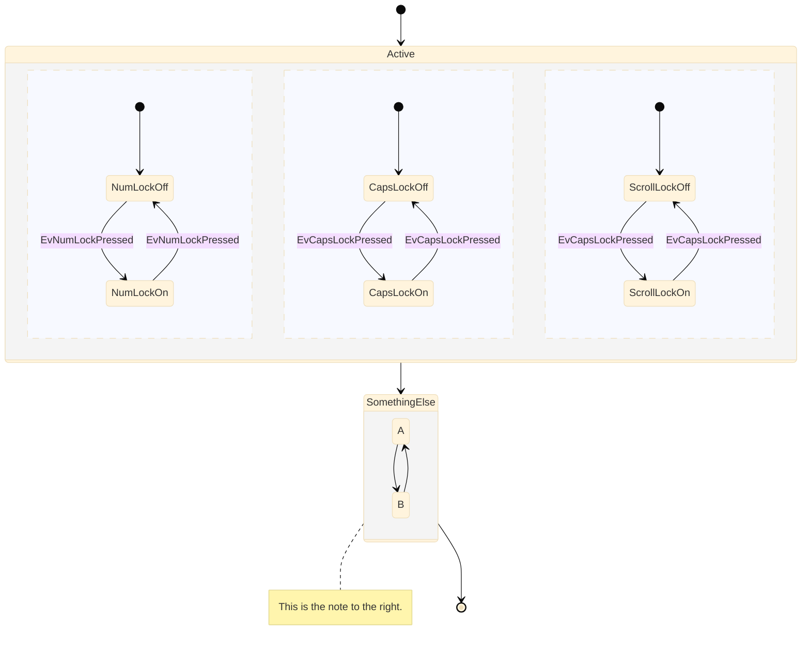
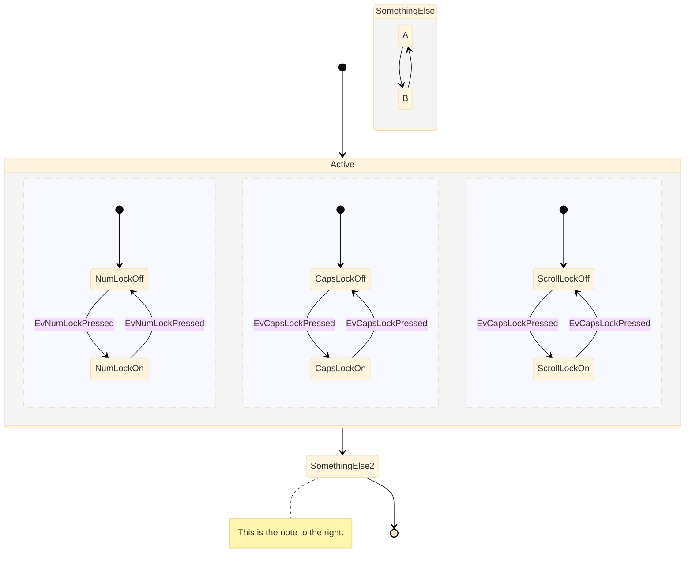
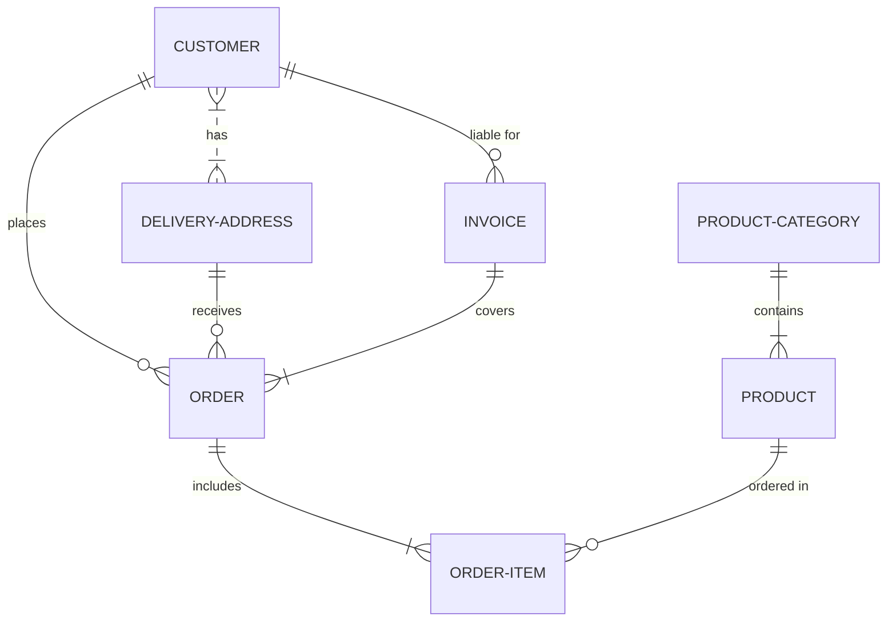
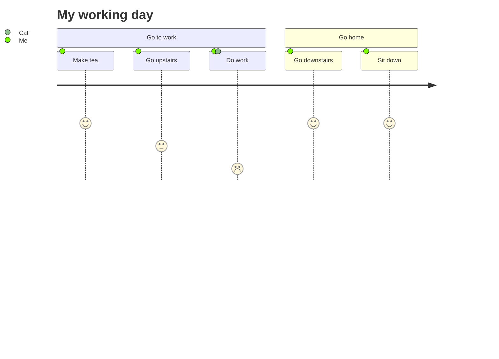

# Theming

Mermaid as a system for theming in place. With it a site integrator can override a vast majority of attributes used when rendering a diagram.

The settings for a theme can be set globally for the site with the initialize call. The example below highlights how that can look:

```
 // example
```

It is also possible to override theme settings locally in a diagram using directives.

```
%%{init: {'theme':'base'}}%%
  graph TD
    a --> b
```

The easiest way to make a custom theme is to start with the base theme, the theme named base and just modify these variables:
* primaryColor   - the base color for the theme

More specific color variables it is possible to change:
* lineColor
* textColor

Here is an example of a showcase flowchart with theme set to base, with the default variables set:


Here is an example of overriding the primary color and giving everything a little different look.

As the theming engine is using color codes to calculate values from the base color/base colors it needs proper color values contrain the actual color data. Aliases like color names is not supported so for instance, the color value 'red' will not work but '#ff0000' will work.

## Showcases

When adjusting a theme it might be helpful to look at the theme with these diagrams to evaluate that everything is visiable and looks good.

### flowchart
```
%%{init: {'securityLevel': 'loose', 'theme':'base'}}%%
        graph TD
          A[Christmas] -->|Get money| B(Go shopping)
          B --> C{Let me think}
          B --> G[/Another/]
          C ==>|One| D[Laptop]
          C -->|Two| E[iPhone]
          C -->|Three| F[fa:fa-car Car]
          subgraph section
            C
            D
            E
            F
            G
          end
```


### flowchart (beta)


### Sequence diagram



### Gantt



### State diagram


### State diagram (beta)



### Entity Relations diagram



### User journet diagram
