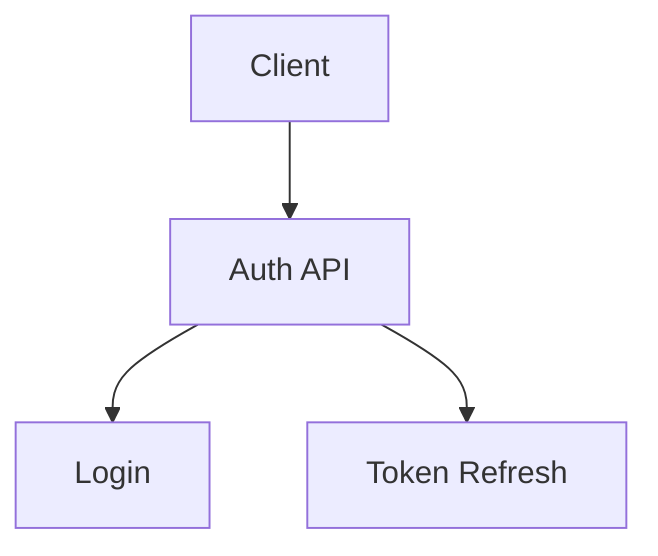

# Extended Mermaid Syntax Specification

## Overview

This document specifies the extended syntax used by `@mermaid-js/mermaid-interactive`.
Extended syntax is a superset of standard Mermaid — any valid Mermaid diagram is also
valid extended syntax. Two new constructs are introduced:

1. **Template blocks** — parameterised, reusable diagram definitions.
2. **Interaction blocks** — declarative runtime behaviour for nodes and edges.

---

## 1. Template Blocks

### Syntax

```text
template <name>(<params>) {
  <mermaid-diagram-body>
}
```

- `<name>` — identifier (alphanumeric + underscore)
- `<params>` — comma-separated parameter list; arrays are suffixed with `[]`
- `<mermaid-diagram-body>` — any valid Mermaid content, possibly referencing params

### Parameter Substitution

| Parameter type | Template reference          | Expands to                |
| -------------- | --------------------------- | ------------------------- |
| Scalar         | `paramName` (word boundary) | The string value provided |
| Array element  | `paramName[N]`              | The Nth provided element  |

Parameter names are substituted using word-boundary matching, so `serviceName`
will replace `B[serviceName]` → `B[Auth API]` without affecting unrelated tokens.

### Example

```text
template service_flow(serviceName, endpoints[]) {
  graph TD
    A[Client] --> B[serviceName]
    B --> C[endpoints[0]]
    B --> D[endpoints[1]]
}
```

---

## 2. Template Invocations

### Syntax

```text
use <name>(
  <key>=<value>,
  <key>=["item0", "item1", ...]
)
```

- Scalar values are quoted strings: `key="value"`
- Array values are JSON-style string arrays: `key=["a", "b"]`
- Whitespace and newlines within the argument list are allowed

### Example

```text
use service_flow(
  serviceName="Auth API",
  endpoints=["Login", "Token Refresh"]
)
```

---

## 3. Interaction Blocks

Interaction blocks define runtime behaviours for a specific node. They can appear:

- **Inside** a template body (will be expanded with each `use`)
- **Outside** a template (applied directly to the diagram)

### Syntax

```text
interaction <nodeId> {
  <property>: <value>
  ...
}
```

- `<nodeId>` — must match a Mermaid node identifier in the same diagram scope
- Properties are `key: value` pairs, one per line

### Supported Properties

| Property       | Type                      | Description                                    |
| -------------- | ------------------------- | ---------------------------------------------- |
| `tooltip`      | string                    | Text shown in a floating tooltip on hover      |
| `collapsible`  | boolean                   | Enables collapse/expand toggle for the node    |
| `defaultState` | `expanded` \| `collapsed` | Initial display state when `collapsible: true` |

### Example

```text
interaction B {
  collapsible: true
  defaultState: collapsed
}

interaction C {
  tooltip: "Handles authentication"
}
```

---

## 4. Preprocessed Output

The preprocessor converts the extended syntax to standard Mermaid by:

1. Removing all `template` blocks (stored internally)
2. Replacing `use` invocations with expanded template bodies
3. Replacing `interaction` blocks with encoded `%%` comments:

```text
%% @interact <nodeId> <JSON props>
```

Example output:



The `%%` comment syntax is the standard Mermaid comment format, so this output
is fully valid Mermaid and renders without errors in any renderer.

---

## 5. Static Fallback Behaviour

When the JS binder is not loaded (static export, GitHub, GitLab), the diagram
renders as standard Mermaid. All `%%` metadata comments are hidden. Nodes
display in their default expanded state with no tooltips. This is the
intended degradation path for documentation-first workflows.

---

## 6. File Extension Convention

Extended Mermaid files use the `.mermid` extension to distinguish them from
preprocessed `.mmd` output. This is a convention only — any extension works.

---

## 7. Constraint Notes

- Template names must be unique within a file
- Array parameter indices must be contiguous from 0
- `nodeId` in interaction blocks must be a simple identifier (no spaces)
- Nested templates are not supported in v0.1
- Interaction blocks must use `}` on its own line to be properly parsed
