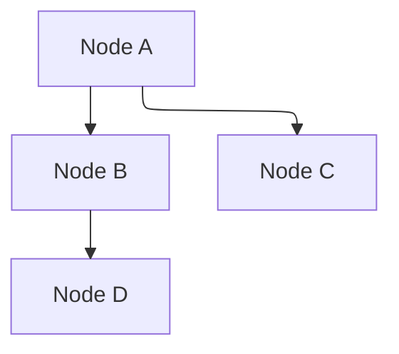

# @mermaid-js/layout-elk

This package provides a layout engine for Mermaid based on the [ELK](https://www.eclipse.org/elk/) layout engine.

> [!NOTE]
> The ELK Layout engine will not be available in all providers that support mermaid by default.
> The websites will have to install the `@mermaid-js/layout-elk` package to use the ELK layout engine.

## Usage

```
flowchart-elk TD
  A --> B
  A --> C
```

```
---
config:
  layout: elk
---

flowchart TD
  A --> B
  A --> C
```

```
---
config:
  layout: elk.stress
---

flowchart TD
  A --> B
  A --> C
```

### With bundlers

```sh
npm install @mermaid-js/layout-elk
```

```ts
import mermaid from 'mermaid';
import elkLayouts from '@mermaid-js/layout-elk';

mermaid.registerLayoutLoaders(elkLayouts);
```

### With CDN

```html
<script type="module">
  import mermaid from 'https://cdn.jsdelivr.net/npm/mermaid@11/dist/mermaid.esm.min.mjs';
  import elkLayouts from 'https://cdn.jsdelivr.net/npm/@mermaid-js/layout-elk@0/dist/mermaid-layout-elk.esm.min.mjs';

  mermaid.registerLayoutLoaders(elkLayouts);
</script>
```

## Supported layouts

- `elk`: The default layout, which is `elk.layered`.
- `elk.layered`: Layered layout
- `elk.stress`: Stress layout
- `elk.force`: Force layout
- `elk.mrtree`: Multi-root tree layout
- `elk.sporeOverlap`: Spore overlap layout

<!-- TODO: Add images for these layouts, as GitHub doesn't support natively. -->

## Layout Algorithms and Configuration

### Layered Layout (`elk.layered`)

The default hierarchical layout algorithm. Best for tree-like and acyclic directed graphs.

**Configuration options:**

```typescript
elk: {
  mergeEdges: boolean; // Merge parallel edges (default: false)
  nodePlacementStrategy: string; // Node placement algorithm
  // Options: SIMPLE, NETWORK_SIMPLEX, LINEAR_SEGMENTS, BRANDES_KOEPF (default)
  nodePlacementAlignment: string; // Alignment strategy for node placement
  // Options: NONE (default), LEFTUP, LEFTDOWN, RIGHTUP, RIGHTDOWN, BALANCED
}
```

### Force Layout (`elk.force`)

Force-directed layout using Fruchterman-Reingold physics simulation. Creates organic, natural-looking layouts ideal for general graphs and network visualizations.

**Configuration options:**

```typescript
elk: {
  algorithm: 'elk.force' | 'force'; // Algorithm identifier
  forceModel: 'FRUCHTERMAN_REINGOLD' | 'EADES'; // Force model variant (default: FRUCHTERMAN_REINGOLD)
  forceIterations: number; // Number of layout iterations (default: 300, minimum: 1)
  forceRepulsion: number; // Repulsive force between nodes (default: 5.0)
  forceTemperature: number; // Initial temperature for node movement (default: 0.001)
}
```

**Example:**



### Stress Layout (`elk.stress`)

Stress-based layout using stress-majorization algorithm. Optimized for balanced, evenly-spaced layouts ideal for meshes and clusters.

**Configuration options:**

```typescript
elk: {
  algorithm: 'elk.stress' | 'stress'; // Algorithm identifier
  stressDesiredEdgeLength: number; // Target edge length (default: 100.0)
  stressIterationLimit: number | null; // Max iterations, null for auto-convergence (default: null)
  stressEpsilon: number; // Convergence threshold (default: 0.0001)
}
```

**Example:**


