# @mermaid-js/mermaid-zenuml

MermaidJS plugin for ZenUML integration - A powerful sequence diagram rendering engine.

> A Sequence diagram is an interaction diagram that shows how processes operate with one another and in what order.

Mermaid can render sequence diagrams with [ZenUML](https://zenuml.com). Note that ZenUML uses a different
syntax than the original Sequence Diagram in mermaid.

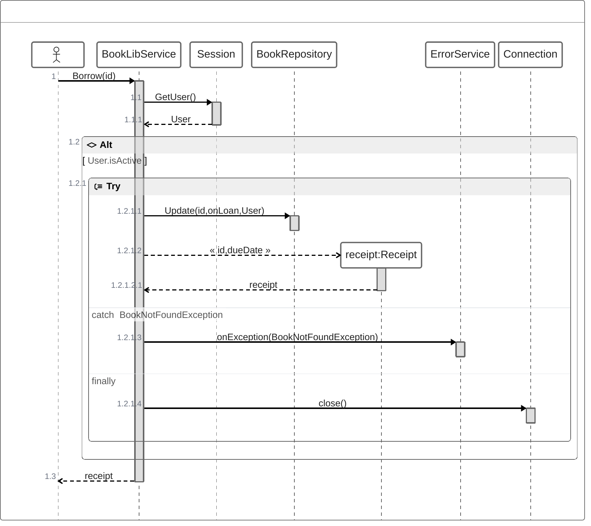

## Installation

### With bundlers

```sh
npm install @mermaid-js/mermaid-zenuml
```

```ts
import mermaid from 'mermaid';
import zenuml from '@mermaid-js/mermaid-zenuml';

await mermaid.registerExternalDiagrams([zenuml]);
```

### With CDN

```html
<script type="module">
  import mermaid from 'https://cdn.jsdelivr.net/npm/mermaid@11/dist/mermaid.esm.min.mjs';
  import zenuml from 'https://cdn.jsdelivr.net/npm/@mermaid-js/mermaid-zenuml@0.2.0/dist/mermaid-zenuml.core.mjs';
  await mermaid.registerExternalDiagrams([zenuml]);
</script>
```

> [!NOTE]  
> ZenUML uses experimental lazy loading & async rendering features which could change in the future.

## Basic Usage

Once the plugin is registered, you can create ZenUML diagrams using the `zenuml` syntax:

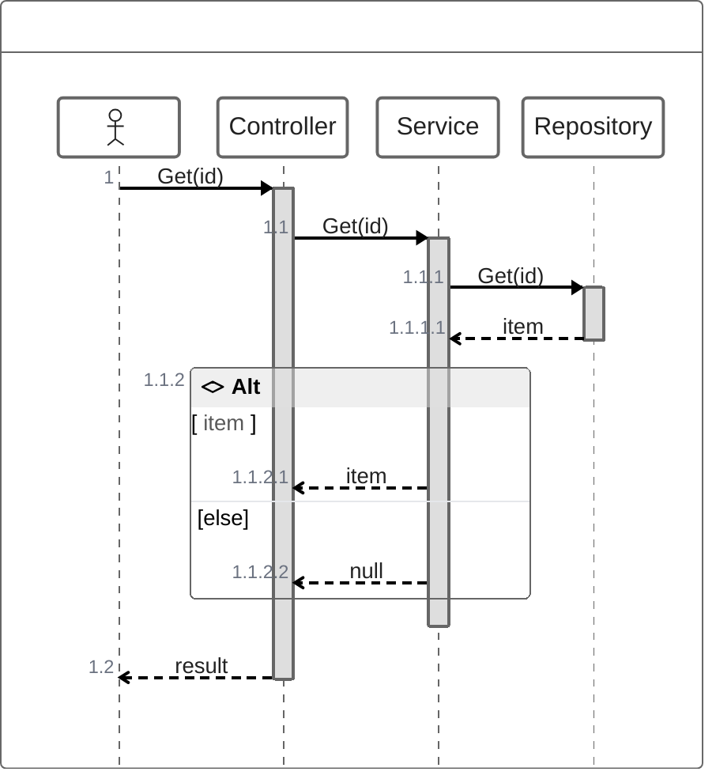

## ZenUML Syntax Reference

### Participants

The participants can be defined implicitly as in the first example on this page. The participants or actors are
rendered in order of appearance in the diagram source text. Sometimes you might want to show the participants in a
different order than how they appear in the first message. It is possible to specify the actor's order of
appearance by doing the following:

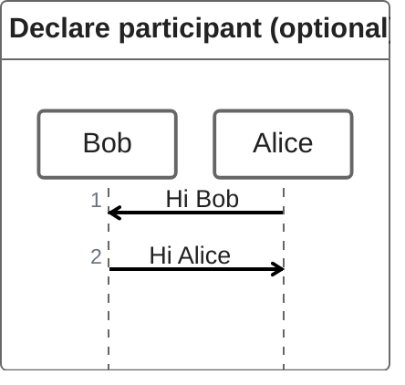

### Annotators

If you specifically want to use symbols instead of just rectangles with text you can do so by using the annotator syntax to declare participants as per below.

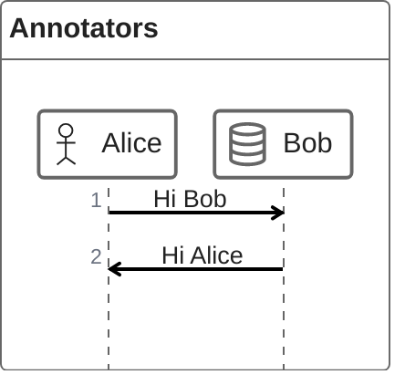

Available annotators include:

- `@Actor` - Human figure
- `@Database` - Database symbol
- `@Boundary` - Boundary symbol
- `@Control` - Control symbol
- `@Entity` - Entity symbol
- `@Queue` - Queue symbol

### Aliases

The participants can have a convenient identifier and a descriptive label.

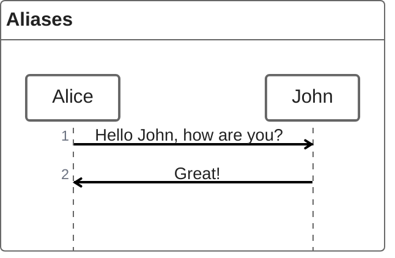

## Messages

Messages can be one of:

1. Sync message
2. Async message
3. Creation message
4. Reply message

### Sync message

You can think of a sync (blocking) method in a programming language.

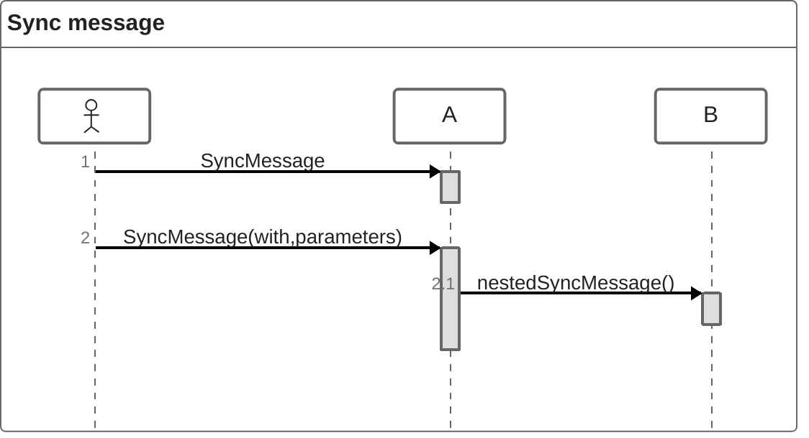

### Async message

You can think of an async (non-blocking) method in a programming language. Fire an event and forget about it.

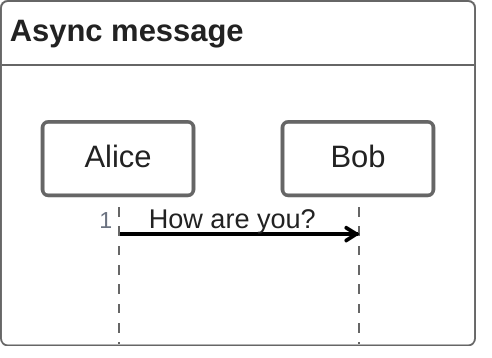

### Creation message

We use `new` keyword to create an object.

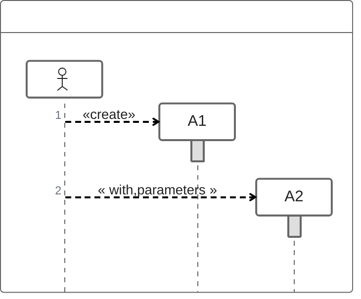

### Reply message

There are three ways to express a reply message:

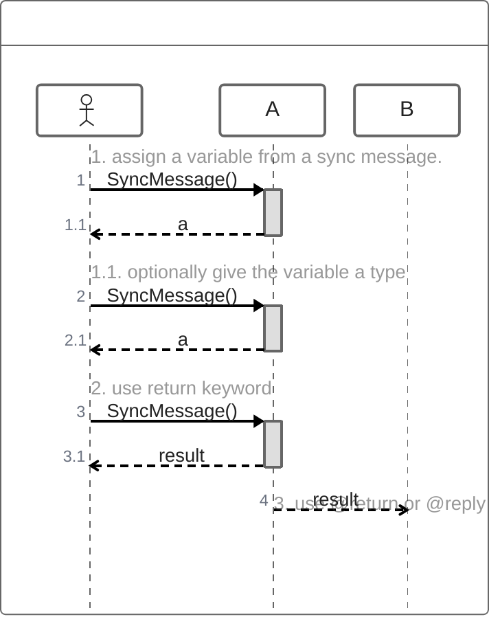

The third way `@return` is rarely used, but it is useful when you want to return to one level up.

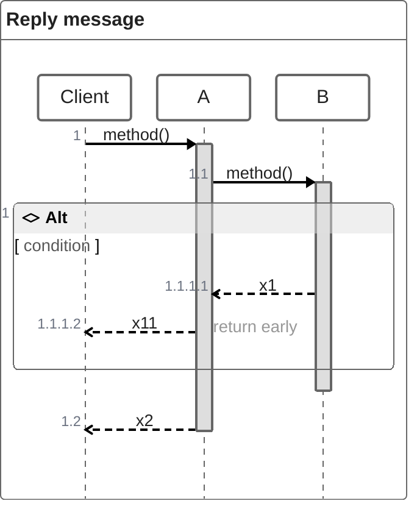

## Advanced Features

### Nesting

Sync messages and Creation messages are naturally nestable with `{}`.

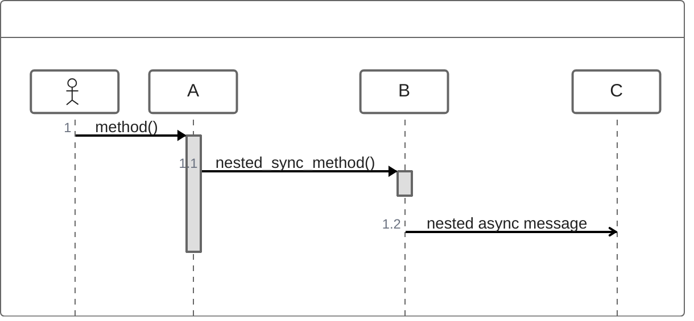

### Comments

It is possible to add comments to a sequence diagram with `// comment` syntax.
Comments will be rendered above the messages or fragments. Comments on other places
are ignored. Markdown is supported.

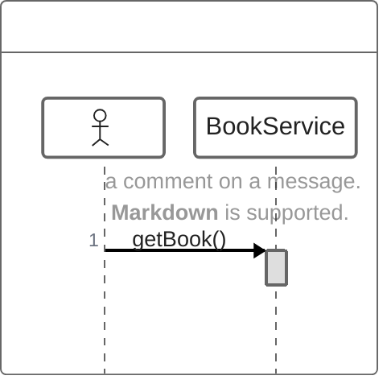

### Loops

It is possible to express loops in a ZenUML diagram. This is done by any of the
following notations:

1. while
2. for
3. forEach, foreach
4. loop

```zenuml
while(condition) {
    ...statements...
}
```

Example:

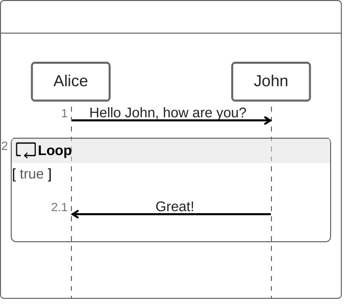

### Alt (Alternative paths)

It is possible to express alternative paths in a sequence diagram. This is done by the notation

```zenuml
if(condition1) {
    ...statements...
} else if(condition2) {
    ...statements...
} else {
    ...statements...
}
```

Example:

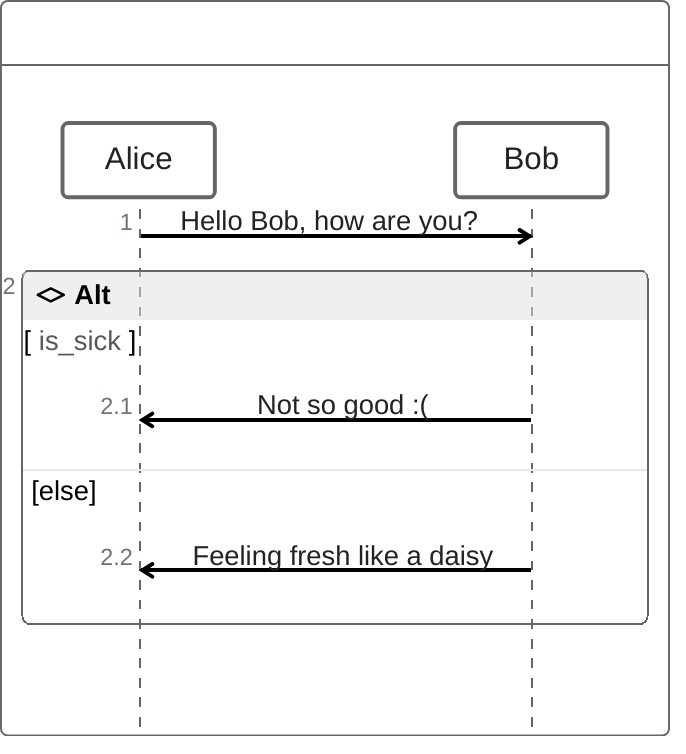

### Opt (Optional)

It is possible to render an `opt` fragment. This is done by the notation

```zenuml
opt {
  ...statements...
}
```

Example:

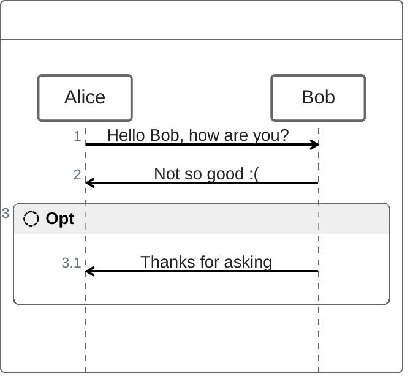

### Parallel

It is possible to show actions that are happening in parallel.

This is done by the notation

```zenuml
par {
  statement1
  statement2
  statement3
}
```

Example:

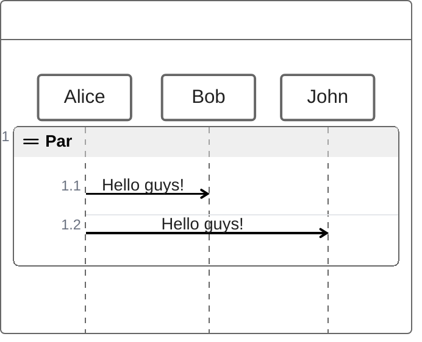

### Try/Catch/Finally (Break)

It is possible to indicate a stop of the sequence within the flow (usually used to model exceptions).

This is done by the notation

```
try {
  ...statements...
} catch {
  ...statements...
} finally {
  ...statements...
}
```

Example:

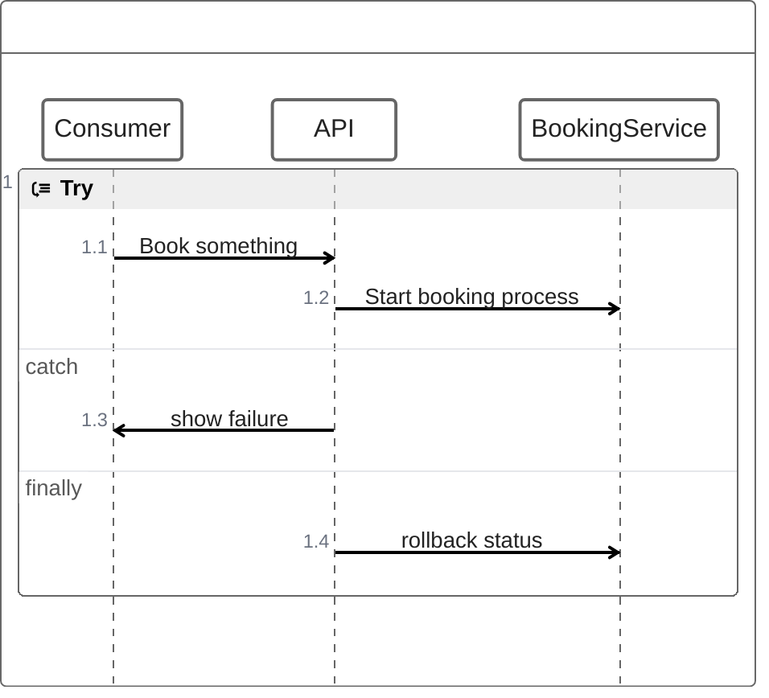

## Contributing

This package is part of the [Mermaid](https://github.com/mermaid-js/mermaid) project. See the main repository for contributing guidelines.

## Contributors

- [Peng Xiao](https://github.com/MrCoder)
- [Sidharth Vinod](https://sidharth.dev)
- [Dong Cai](https://github.com/dontry)

## License

MIT

## Links

- [ZenUML Official Website](https://zenuml.com)
- [Mermaid Documentation](https://mermaid.js.org)
- [GitHub Repository](https://github.com/mermaid-js/mermaid)
