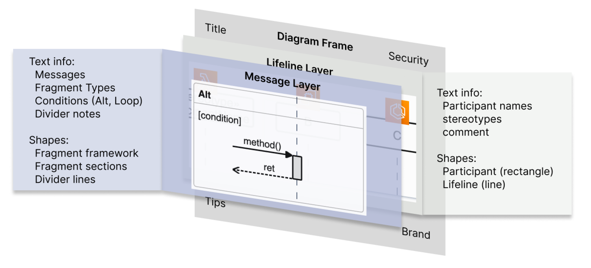
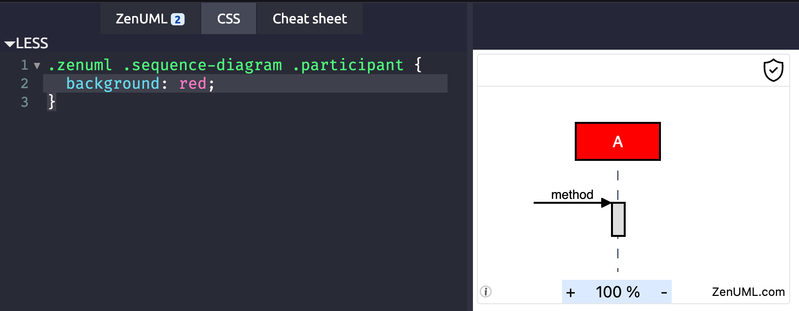

= Creat my own theme

Since the elements on the rendered diagram is based on HTML Dom (and svg), it is simple
to create your own theme. There is a repository on GitHub that have some themes collected
by third party. You may be able to get some inspiration from there. https://github.com/abruzzi/zenuml-css-overrides

== The Information Architecture

The diagram is rendered in two layers. The back layer is the lifeline layer. The front layer
is the message layer.

Key information on the diagram can be grouped in the following structure:

Text messages are internally styled at four levels:

1. text-skin-base: used for all messages
2. text-skin-muted: used for comments
3. text-skin-link: used for links
4. text-skin-secondary: used for everything else, such as title, participant, divider notes, etc.

When it comes to branding, the following elements are the most important:

1. Canvas background, however, it can easily be overwhelming if you use high contrast color to the
overall page background.
2. Title background, participant background and fragment header background are the most attractive
elements to brand. These are where your brand color should be used.
3. The background of the occurrence (message bar) is also a good place to use your brand color, but
less attractive than the above three.
4. The borders of the frame, participant, fragment, occurrence and lifeline can add a bit
of color to the diagram.
5. The color of the message and the arrow  are the most important information on
the diagram. Choose a striking and comfortable color for them. You can use the brand color here, but
they should not be the only elements that reflect your brand color. Same principles apply to the
background and text color for hover state.
6. Then is the color of link and control. They should avoid attracting too much attention

[%autowidth]
|===
|Category | Diagram Frame |Lifeline Layer | Message Layer

h|Text Info
a|* Title
* Brand
a|* Participant name
* Stereotype
* Comment

a|* Message name
* Fragment type
* Fragment condition
* Comment
* Divider name

h|Shapes
a|* Security (icon)
* Tips (icon)
a|* Participant box (rectangle)
* Lifeline (vertical line)
a|* Message arrow (line and head)
* Fragment (rectangle)
* Divider line (left and right)

|===

Each of the elements has a semantic selector that can be used to customize the appearance.

The component has basic styling in itself mostly to support layout and positioning. Then
the core renderer comes with a default theme that defines the appearance of the elements.

[source,css]
----

----

A typical custom theme will be like below:

[source,css]
----
----

== What can a theme change?

A theme can change two aspects of the diagram:

1. colors
2. slightly change the layout (e.g. padding, margin, etc.). For example, you can make the
diagram more compact by reducing the padding.

== where can I apply themes

You can apply themes on the follow products:

. JetBrains plugins (Intellij IDEA, WebStore, PhpStore, etc.)
. https://app.zenuml.com

With https://chrome.google.com/webstore/detail/user-css/okpjlejfhacmgjkmknjhadmkdbcldfcb[User CSS]
browser extension, you can apply themes anywhere (e.g. https://zenuml.cn).

== Principles of creating themes

=== 1. Do not override tailwind classes
The tailwind classes directly applied on the elements are important for layout so
they are NOT meant be overridden.

For example,
[html]
....
// Participant.vue
<div class="participant relative flex flex-col justify-center z-10 h-10"
....

=== 2. Use provided class selectors
Important elements are provided with a semantic class selector. You can use them
to override the style.

For the above example, the class selector is `participant`. You can override the
style by using this selector.

[css]
....
// use `.zenuml .sequence-diagram` to increase specificity
.zenuml .sequence-diagram .participant {
  background-color: #f00;
}
....

=== 3. Debug your theme

You can use the browser extension https://chrome.google.com/webstore/detail/user-css/okpjlejfhacmgjkmknjhadmkdbcldfcb[User CSS]
to debug your theme.

image::user-css.png[User CSS]

Alternatively, you can use our web app https://app.zenuml.com[app.zenuml.com]. Go to the CSS tab
and paste your theme there. You can see the result immediately.

=== JetBrains

=== app.zenuml.com

== Tips

=== Give occurrence a boarder

