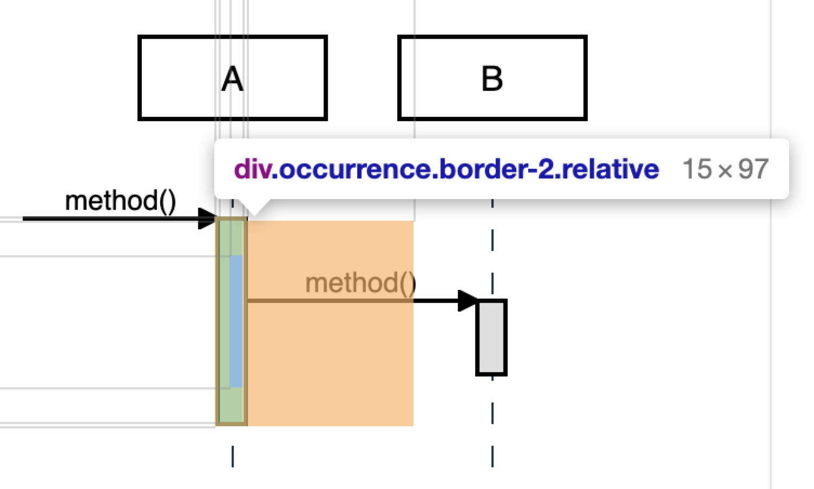
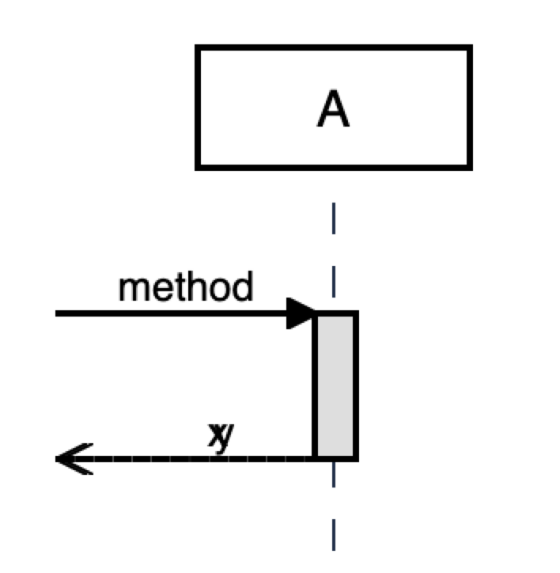
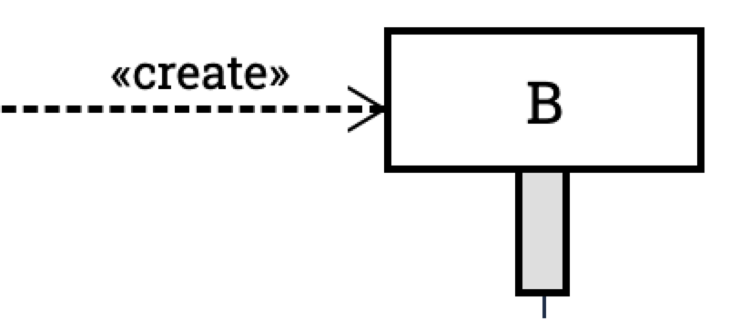
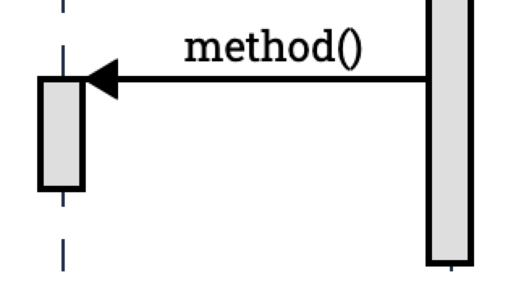
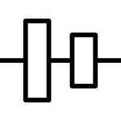
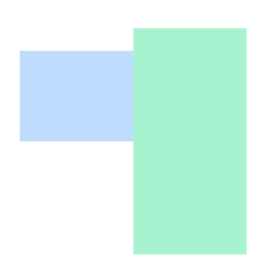
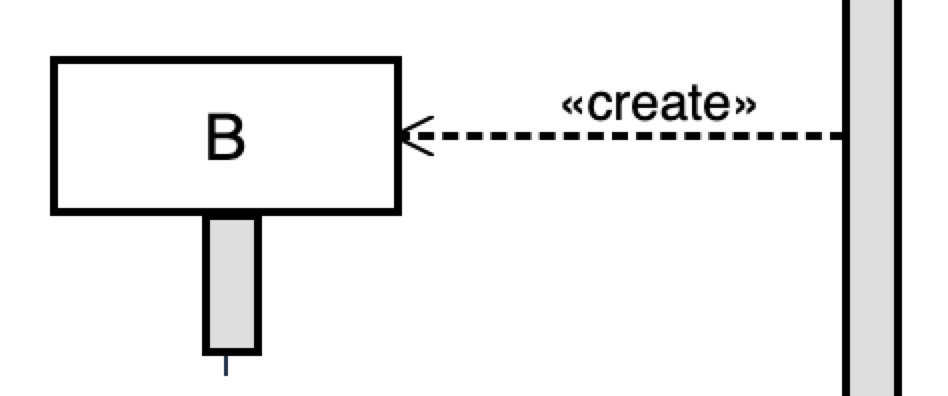

:icons: font

== Font
Font [.underline]#must# be *preloaded*. Font mainly have impact to Creation
rendering. The font will impact the width of the participant box which then
impacts the with of message container for creation.

The following code should help with preloading google fonts. But it is not super
reliable. Specifically, when you disable cache in Chrome. It is not preloaded
where you can see the impact.

....
<link rel='preconnect' href='https://fonts.gstatic.com' crossorigin>
<link rel='preload stylesheet' as='style' href='https://fonts.googleapis.com/css2?family=Roboto+Slab:wght@300;400;500;700&display=swap'>
....

We have to use `setTimeout` to delay the calculation of the width of the
message container.

== The two layer structure
At the highest level, the diagram is rendered in two layers:
the lifeline layer and the message layer.

....

    

    

    

    

....

=== Key classes
==== .absolute
The `absolute` class is used to remove the lifeline layer from the normal
flow of the document.

==== .h-full
The `h-full` class is used to make the lifeline layer as tall as the parent
element. The parent element get the height from the `message-layer`.

== The message layer

=== Occurrence
_TODO_: explain misalignment of the occurrence concept and the spec.

The occurrence is the bar (or invisible bar for async messages) that
represents the execution of a message.

It has a width of 15px and border of 2px. These two values #must not#
be overridden in themes.

It has a padding-left of 5px which pushes the children `interaction` to
the middle of the occurrence.
....
(occurrenceWidth - occurrenceBorderWidth x 2 - lifelineWidth) / 2
= (15 - 2 x 2 - 1) / 2
= 5
....

Because the lifeline has width of 1px, for normal (left to right) `interaction` s
we give it a margin left of 1px to avoid the overlap of the lifeline and the
interaction border. See `interaction` for more details.

=== Interaction
The `interaction` is one of the key conceptual elements. It works with
the `occurrence` to influence high-level layout. The `interaction` is the container
of the message, children interactions and the response.

The `interaction` has a border of 5px. This value #must not# be overridden in themes.
....
(occurrenceWidth - occurrenceBorderWidth x 2 - lifelineWidth) / 2
= (15 - 2 x 2 - 1) / 2
= 5
....

Within Interaction, the DOM structure is like below:

....

    

    <comment/>
    <invocation/> <1>
    <occurrence/>
    <message type="return">

....
<1> SelfInvocation or Message

==== Do not add margin to interaction
It is on purpose that interaction box overlaps source lifeline but not the target
lifeline. Do not add #margin# to interaction components. This margin will cause
interaction's right board overlaps target lifeline and that is accumulative.

==== Debugging
Disable transparency of the interaction borders.

=== Common features among Interaction, Interaction and Creation

All the three work as a container for the message, children interactions and the
response. In the normal direction (left to right), they start with the middle
of the source lifeline and end with the middle of the target lifeline.

=== Return message

The return message is the message that is sent back to the sender of the original
message. It is rendered as a dashed line.

A return message is rendered from three syntax:

* `return x` which matches `RETURN expr? SCOL?`
* `@return A->B: ret` which matches `ANNOTATION_RET asyncMessage EVENT_END?`
* `x=A.m` or `x=new A()` which matches `assignment? ((from ARROW)? to DOT)? func` or `assignment? NEW construct(OPAR parameters? CPAR)?`

==== Statement `return x` or `@return A->B: ret`

`return x` or `@return A->B: ret` is implemented via the `Return` component.
In such cases, it has its own context and can have a comment. Then it
delegates to `SelfInvocation` or `Message`.

===== When do we need `@return A->B: ret`?

....
Browser->BookController.onPost() {
  BookLibService.Borrow(id) {
      receipt = process(id)
      if (receipt != null) {
        return receipt
        @return BookController->Browser: receipt
      } else {
        return null
        @return BookController->Browser: 404
      }
  }
}
....

If the statement is the last statement we set the height of the message to 0px,
so that it does not push the message down further. This is because a return message
does not have children and does not need an occurrence.

....
.statement-container:last-child>.return {
    height: 0;
}
....

==== Return message from `x=A.m` or `x=new A`
This is implemented in Interaction and Creation components.

....
<message class="return transform -translate-y-full"/>
....

==== Conflicting return messages
We provide two ways in DSL to represent `return` messages:

....
// option 1
x = A.method
// option 2
A.method() {
  return y
}
....

If you use both, we will render both with overlapping. This is on purpose to expose
the conflict to the user.

.Return message conflict

=== Message arrow
.Message arrow (the dashed line and arrow head)

This time we focus on how to align the arrow line and the arrow head.
We use a similar approach as pattern #vertically aligning# with pattern
#shift half the height#. Instead of `items-center` we use `items-end`.
Then we use `translate-y-1/2` to shift the arrow head down half the
height of the arrow head. (See Message.vue)
....
  
{{content}}

    <point class="flex-shrink-0 transform translate-y-1/2 -my-px" :fill="fill" :rtl="rtl"/>
  

....

==== Key classes
===== .flex .items-end
The `flex` and `items-end` classes are used to align the arrow line
and the arrow head at the bottom of the message.

===== .flex-grow
The `flex-grow` class is used to make the message name grow to fill
the available space.

===== .flex-shrink-0
The `flex-shrink-0` class is used to make the arrow head not shrink
when the message name is too long.

===== .transform .translate-y-1/2
The `transform` and `translate-y-1/2` classes are used to shift the
arrow head down half the height of the arrow head.

=== Message arrow right to left

....
  

    
{{content}}

    <point class="flex-shrink-0 transform translate-y-1/2 -my-px"/>
  

....

==== Key classes
===== .flex-row-reverse
The `flex-row-reverse` class is used to reverse the order of the name and
the arrow head.

=== Creation

==== Pattern 1: Vertically aligning

....

  

  

....

==== Pattern 2: Shift half the height

The message arrow is supposed to point to the middle of the participant
box. It is not he whole message that is aligned with the participant
box. So we have to shift the message up half the height of the message.
....

  

  

....

This pattern is also used at the arrows. See the image for creation.

=== Creation participant top
While all normal participants have their name boxes at the top of the
diagram, creation participant boxes need to be pushed down to align
with the message arrow.

To implement this, we add a `padding-top` to the containing lifeline
of the corresponding participant.

The padding top is calculated by subtracting the top of message from
the top of participant's original value.

==== Challenge
When the message container is mounted, it does not have the correct
participant box offsetWidth.

=== Creation right to left

On top of normal Creation, we need to flip the participant placeholder
and the message container. We use the `flex-row-reverse` class to flip.
See "Message right to left" for example using `flex-row-reverse`.

