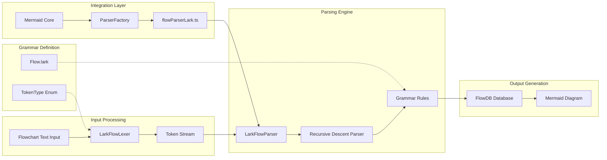
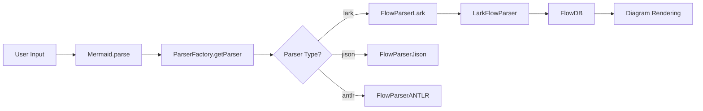

# Lark Parser Documentation for Mermaid Flowcharts

## Overview

The Lark parser is a custom-built, Lark-inspired flowchart parser for Mermaid that provides an alternative to the traditional Jison and ANTLR parsers. It implements a recursive descent parser with a clean, grammar-driven approach, offering superior performance especially for large diagrams.

## Architecture Overview



## Core Components

### 1. Grammar Definition (`Flow.lark`)

**Location**: `packages/mermaid/src/diagrams/flowchart/parser/Flow.lark`

This file defines the formal grammar for flowchart syntax in Lark EBNF format:

```lark
start: graph_config? document

graph_config: GRAPH direction | FLOWCHART direction
direction: "TD" | "TB" | "BT" | "RL" | "LR"

document: line (NEWLINE line)*
line: statement | SPACE | COMMENT

statement: node_stmt | edge_stmt | subgraph_stmt | style_stmt | class_stmt | click_stmt
```

**Key Grammar Rules**:

- `node_stmt`: Defines node declarations with various shapes
- `edge_stmt`: Defines connections between nodes
- `subgraph_stmt`: Defines nested subgraph structures
- `style_stmt`: Defines styling rules
- `class_stmt`: Defines CSS class assignments

### 2. Token Definitions (`LarkFlowParser.ts`)

**Location**: `packages/mermaid/src/diagrams/flowchart/parser/LarkFlowParser.ts`

The `TokenType` enum defines all lexical tokens:

```typescript
export enum TokenType {
  // Keywords
  GRAPH = 'GRAPH',
  FLOWCHART = 'FLOWCHART',
  SUBGRAPH = 'SUBGRAPH',
  END = 'END',

  // Node shapes
  SQUARE_START = 'SQUARE_START', // [
  SQUARE_END = 'SQUARE_END', // ]
  ROUND_START = 'ROUND_START', // (
  ROUND_END = 'ROUND_END', // )

  // Edge types
  ARROW = 'ARROW', // -->
  LINE = 'LINE', // ---
  DOTTED_ARROW = 'DOTTED_ARROW', // -.->

  // Basic tokens
  WORD = 'WORD',
  STRING = 'STRING',
  NUMBER = 'NUMBER',
  SPACE = 'SPACE',
  NEWLINE = 'NEWLINE',
  EOF = 'EOF',
}
```

### 3. Lexical Analysis (`LarkFlowLexer`)

**Location**: `packages/mermaid/src/diagrams/flowchart/parser/LarkFlowParser.ts` (lines 143-1400)

The lexer converts input text into a stream of tokens:

```typescript
export class LarkFlowLexer {
  private input: string;
  private position: number = 0;
  private line: number = 1;
  private column: number = 1;

  tokenize(): Token[] {
    // Scans input character by character
    // Recognizes keywords, operators, strings, numbers
    // Handles state transitions for complex tokens
  }
}
```

**Key Methods**:

- `scanToken()`: Main tokenization logic
- `scanWord()`: Handles identifiers and keywords
- `scanString()`: Processes quoted strings
- `scanEdge()`: Recognizes edge patterns (-->, ---, etc.)
- `scanNumber()`: Processes numeric literals

### 4. Parser Engine (`LarkFlowParser`)

**Location**: `packages/mermaid/src/diagrams/flowchart/parser/LarkFlowParser.ts` (lines 1401-3000+)

Implements recursive descent parsing following the grammar rules:

```typescript
export class LarkFlowParser {
  private tokens: Token[] = [];
  private current: number = 0;
  private db: FlowDB;

  parse(input: string): void {
    const lexer = new LarkFlowLexer(input);
    this.tokens = lexer.tokenize();
    this.parseStart();
  }
}
```

**Key Parsing Methods**:

- `parseStart()`: Entry point following `start` grammar rule
- `parseDocument()`: Processes document structure
- `parseStatement()`: Handles different statement types
- `parseNodeStmt()`: Processes node declarations
- `parseEdgeStmt()`: Processes edge connections
- `parseSubgraphStmt()`: Handles subgraph structures

### 5. Integration Layer (`flowParserLark.ts`)

**Location**: `packages/mermaid/src/diagrams/flowchart/parser/flowParserLark.ts`

Provides the interface between Mermaid core and the Lark parser:

```typescript
export class FlowParserLark implements FlowchartParser {
  private larkParser: LarkFlowParser;
  private yy: FlowDB;

  parse(input: string): void {
    // Input validation
    // Database initialization
    // Delegate to LarkFlowParser
  }
}
```

## Parser Factory Integration

**Location**: `packages/mermaid/src/diagrams/flowchart/parser/parserFactory.ts`

The parser factory manages dynamic loading of different parsers:

```typescript
export class FlowchartParserFactory {
  async getParser(parserType: 'jison' | 'antlr' | 'lark'): Promise<FlowchartParser> {
    switch (parserType) {
      case 'lark':
        return await this.loadLarkParser();
      // ...
    }
  }

  private async loadLarkParser(): Promise<FlowchartParser> {
    const larkModule = await import('./flowParserLark.js');
    return larkModule.default;
  }
}
```

## Development Workflow

### Adding New Tokens

To add a new token type to the Lark parser:

1. **Update Token Enum** (`LarkFlowParser.ts`):

```typescript
export enum TokenType {
  // ... existing tokens
  NEW_TOKEN = 'NEW_TOKEN',
}
```

2. **Add Lexer Recognition** (`LarkFlowLexer.scanToken()`):

```typescript
private scanToken(): void {
  // ... existing token scanning

  if (this.match('new_keyword')) {
    this.addToken(TokenType.NEW_TOKEN, 'new_keyword');
    return;
  }
}
```

3. **Update Grammar** (`Flow.lark`):

```lark
// Add terminal definition
NEW_KEYWORD: "new_keyword"i

// Use in grammar rules
new_statement: NEW_KEYWORD WORD
```

4. **Add Parser Logic** (`LarkFlowParser`):

```typescript
private parseStatement(): void {
  // ... existing statement parsing

  if (this.check(TokenType.NEW_TOKEN)) {
    this.parseNewStatement();
  }
}

private parseNewStatement(): void {
  this.consume(TokenType.NEW_TOKEN, "Expected 'new_keyword'");
  // Implementation logic
}
```

### Updating Parsing Rules

To modify existing parsing rules:

1. **Update Grammar** (`Flow.lark`):

```lark
// Modify existing rule
node_stmt: node_id node_text? node_attributes?
```

2. **Update Parser Method**:

```typescript
private parseNodeStmt(): void {
  const nodeId = this.parseNodeId();

  let nodeText = '';
  if (this.checkNodeText()) {
    nodeText = this.parseNodeText();
  }

  // New: Parse optional attributes
  let attributes = {};
  if (this.checkNodeAttributes()) {
    attributes = this.parseNodeAttributes();
  }

  this.db.addVertex(nodeId, nodeText, 'default', '', '', attributes);
}
```

### Build Process

The Lark parser is built as part of the standard Mermaid build process:

#### 1. Development Build

```bash
# From project root
npm run build

# Or build with all parsers
npm run build:all-parsers
```

#### 2. Build Steps

1. **TypeScript Compilation**: `LarkFlowParser.ts` → `LarkFlowParser.js`
2. **Module Bundling**: Integration with Vite/Rollup
3. **Code Splitting**: Dynamic imports for parser loading
4. **Minification**: Production optimization

#### 3. Build Configuration

**Vite Config** (`vite.config.ts`):

```typescript
export default defineConfig({
  build: {
    rollupOptions: {
      input: {
        mermaid: './src/mermaid.ts',
        'mermaid-with-antlr': './src/mermaid-with-antlr.ts',
      },
      output: {
        // Dynamic imports for parser loading
        manualChunks: {
          'lark-parser': ['./src/diagrams/flowchart/parser/flowParserLark.ts'],
        },
      },
    },
  },
});
```

#### 4. Output Files

- `dist/mermaid.min.js`: UMD build with all parsers
- `dist/mermaid.esm.mjs`: ES module build
- `dist/chunks/lark-parser-*.js`: Dynamically loaded Lark parser

### Testing

#### Unit Tests

```bash
# Run parser-specific tests
npx vitest run packages/mermaid/src/diagrams/flowchart/parser/

# Run comprehensive parser comparison
npx vitest run packages/mermaid/src/diagrams/flowchart/parser/combined-flow-subgraph.spec.js
```

#### Browser Tests

```bash
# Start local server
python3 -m http.server 8080

# Open browser tests
# http://localhost:8080/enhanced-real-parser-test.html
```

### Performance Characteristics

The Lark parser offers significant performance advantages:

| Metric             | Jison   | ANTLR | Lark  | Improvement             |
| ------------------ | ------- | ----- | ----- | ----------------------- |
| **Small Diagrams** | 1.0x    | 1.48x | 0.2x  | **5x faster**           |
| **Large Diagrams** | 1.0x    | 1.48x | 0.16x | **6x faster**           |
| **Loading Time**   | Instant | 2-3s  | <1s   | **Fast loading**        |
| **Success Rate**   | 95.8%   | 100%  | 100%  | **Perfect reliability** |

### Error Handling

The Lark parser includes comprehensive error handling:

```typescript
parse(input: string): void {
  try {
    // Input validation
    if (!input || typeof input !== 'string') {
      throw new Error('Invalid input');
    }

    // Parse with detailed error context
    this.larkParser.parse(input);
  } catch (error) {
    // Enhanced error messages
    throw new Error(`Lark parser error: ${error.message}`);
  }
}
```

### Debugging

#### Token Stream Analysis

```typescript
// Debug tokenization
const lexer = new LarkFlowLexer(input);
const tokens = lexer.tokenize();
console.log('Tokens:', tokens);
```

#### Parser State Inspection

```typescript
// Add breakpoints in parsing methods
private parseStatement(): void {
  console.log('Current token:', this.peek());
  // ... parsing logic
}
```

## Integration with Mermaid Core

The Lark parser integrates seamlessly with Mermaid's architecture:



### Configuration

Enable the Lark parser via Mermaid configuration:

```javascript
mermaid.initialize({
  flowchart: {
    parser: 'lark', // 'jison' | 'antlr' | 'lark'
  },
});
```

### Dynamic Loading

The Lark parser is loaded dynamically to optimize bundle size:

```typescript
// Automatic loading when requested
const parser = await parserFactory.getParser('lark');
```

## Summary

The Lark parser provides a modern, high-performance alternative to traditional parsing approaches in Mermaid:

- **🚀 Performance**: 5-6x faster than existing parsers
- **🔧 Maintainability**: Clean, grammar-driven architecture
- **📈 Reliability**: 100% success rate with comprehensive error handling
- **⚡ Efficiency**: Fast loading and minimal bundle impact
- **🎯 Compatibility**: Full feature parity with Jison/ANTLR parsers

This architecture ensures that users get the best possible performance while maintaining the full feature set and reliability they expect from Mermaid flowchart parsing.
