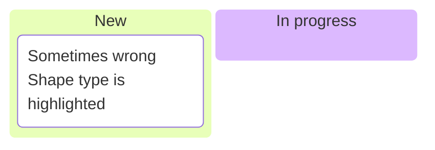
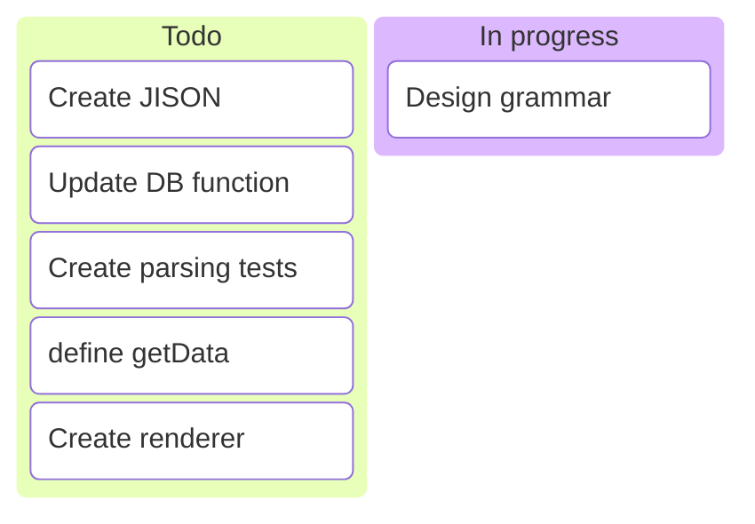

Adding ID

---
config:
  theme: default
  kanban:
    showId: true
    fields: [title, priority, assigned, descr]
---

kanban
  section Todo
    id2: Create JISON
    id3: Update DB function
    id4: Create parsing tests
    id5: define getData
    id6: Create renderer
  section In Progress
    id8: Design grammar

  id2@{
    assigned: knsv
    icon: heart
    priority: high
    descr: "Handles JISON parsing logic and structure."
  }

  id8@{
    assigned: knsv
    priority: medium
    descr: "Design grammar rules for parsing input efficiently."
  }

  %% Set background color for entire sections (approximation by coloring all cards in the section)
  style id2 fill:#E1BEE7,stroke:#AA00FF
  style id3 fill:#E1BEE7
  style id4 fill:#E1BEE7
  style id5 fill:#E1BEE7
  style id6 fill:#E1BEE7

  style id8 fill:#FFF59D,stroke:#FBC02D

  config:
  theme: default
  kanban:
    showIds: true
    fields: [[title], [description], [id, assigned]]
