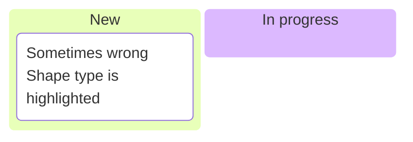
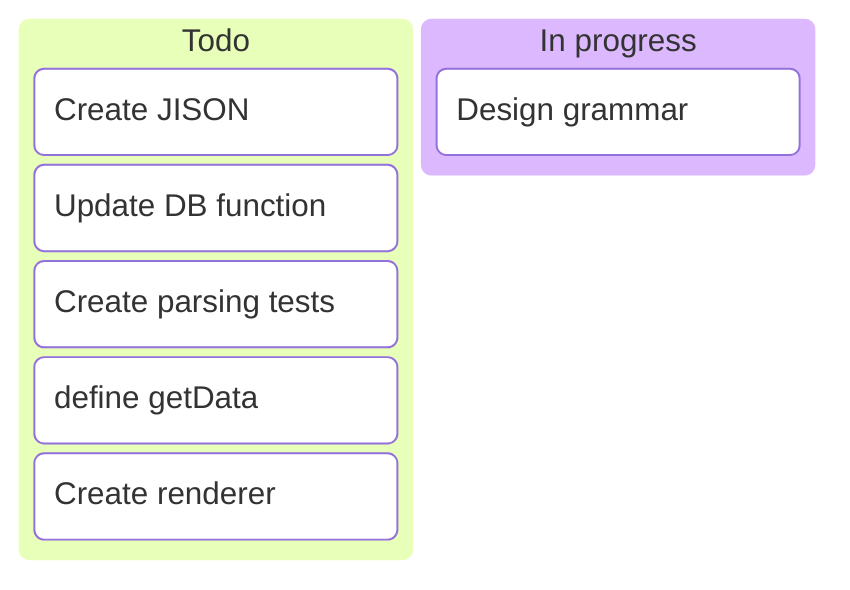

```mermaid
kanban
  New
    Sometimes wrong Shape type is highlighted
  In progress


```

```mermaid
kanban
  Todo
    Create JISON
    Update DB function
    Create parsing tests
    define getData
    Create renderer
  In progress
    Design grammar

```

Adding ID

```mermaid
kanban
  id1[Todo]
    id2[Create JISON]
    id3[Update DB function]
    id4[Create parsing tests]
    id5[define getData]
    id6[Create renderer]
  id7[In progress]
    id8[Design grammar]

```

---
config:
  theme: default
  kanban:
    showId: true
    fields: [title, priority, assigned, descr,]
---

