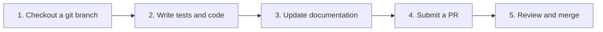

# Contributing Code

The basic steps for contributing code are:



1. **Create** and checkout a git branch and work on your code in the branch
2. Write and update **tests** (unit and perhaps even integration (e2e) tests) (If you do TDD/BDD, the order might be different.)
3. **Let users know** that things have changed or been added in the documents! This is often overlooked, but _critical_
4. **Submit** your code as a _pull request_.
5. Maintainers will **review** your code. If there are no changes necessary, the PR will be merged. Otherwise, make the requested changes and repeat.

## 1. Checkout a git branch

Mermaid uses a [Git Flow](https://guides.github.com/introduction/flow/)–inspired approach to branching.

Development is done in the `develop` branch.

Once development is done we create a `release/vX.X.X` branch from `develop` for testing.

Once the release happens we add a tag to the `release` branch and merge it with `master`. The live product and on-line documentation are what is in the `master` branch.

**All new work should be based on the `develop` branch.**

**When you are ready to do work, always, ALWAYS:**

1. Make sure you have the most up-to-date version of the `develop` branch. (fetch or pull to update it)
2. Check out the `develop` branch
3. Create a new branch for your work. Please name the branch following our naming convention below.

We use the following naming convention for branches:

```txt
   [feature | bug | chore | docs]/[issue number]_[short description using dashes ('-') or underscores ('_') instead of spaces]
```

You can always check current [configuration of labelling and branch prefixes](https://github.com/mermaid-js/mermaid/blob/develop/.github/pr-labeler.yml)

- The first part is the **type** of change: a feature, bug, chore, or documentation change ('docs')
- followed by a _slash_ (which helps to group like types together in many git tools)
- followed by the **issue number**
- followed by an _underscore_ ('\_')
- followed by a short text description (but use dashes ('-') or underscores ('\_') instead of spaces)

If your work is specific to a single diagram type, it is a good idea to put the diagram type at the start of the description. This will help us keep release notes organized: it will help us keep changes for a diagram type together.

**Ex: A new feature described in issue 2945 that adds a new arrow type called 'florbs' to state diagrams**

`feature/2945_state-diagram-new-arrow-florbs`

**Ex: A bug described in issue 1123 that causes random ugly red text in multiple diagram types**
`bug/1123_fix_random_ugly_red_text`

## 2. Write Tests

Tests ensure that each function, module, or part of code does what it says it will do. This is critically
important when other changes are made to ensure that existing code is not broken (no regression).

Just as important, the tests act as _specifications:_ they specify what the code does (or should do).
Whenever someone is new to a section of code, they should be able to read the tests to get a thorough understanding of what it does and why.

If you are fixing a bug, you should add tests to ensure that your code has actually fixed the bug, to specify/describe what the code is doing, and to ensure the bug doesn't happen again.
(If there had been a test for the situation, the bug never would have happened in the first place.)
You may need to change existing tests if they were inaccurate.

If you are adding a feature, you will definitely need to add tests. Depending on the size of your feature, you may need to add integration tests.

### Unit Tests

Unit tests are tests that test a single function or module. They are the easiest to write and the fastest to run.

Unit tests are mandatory all code except the renderers. (The renderers are tested with integration tests.)

We use [Vitest](https://vitest.dev) to run unit tests.

You can use the following command to run the unit tests:

```sh
pnpm test
```

When writing new tests, it's easier to have the tests automatically run as you make changes. You can do this by running the following command:

```sh
pnpm test:watch
```

### Integration/End-to-End (e2e) tests

These test the rendering and visual appearance of the diagrams.
This ensures that the rendering of that feature in the e2e will be reviewed in the release process going forward. Less chance that it breaks!

To start working with the e2e tests:

1. Run `pnpm dev` to start the dev server
2. Start **Cypress** by running `pnpm cypress:open`.

The rendering tests are very straightforward to create. There is a function `imgSnapshotTest`, which takes a diagram in text form and the mermaid options, and it renders that diagram in Cypress.

When running in CI it will take a snapshot of the rendered diagram and compare it with the snapshot from last build and flag it for review if it differs.

This is what a rendering test looks like:

```js
it('should render forks and joins', () => {
  imgSnapshotTest(
    `
    stateDiagram
    state fork_state &lt;&lt;fork&gt;&gt;
      [*] --> fork_state
      fork_state --> State2
      fork_state --> State3

      state join_state &lt;&lt;join&gt;&gt;
      State2 --> join_state
      State3 --> join_state
      join_state --> State4
      State4 --> [*]
    `,
    { logLevel: 0 }
  );
  cy.get('svg');
});
```

**_[TODO - running the tests against what is expected in development. ]_**

**_[TODO - how to generate new screenshots]_**
....

## 3. Update Documentation

If the users have no way to know that things have changed, then you haven't really _fixed_ anything for the users; you've just added to making Mermaid feel broken.
Likewise, if users don't know that there is a new feature that you've implemented, it will forever remain unknown and unused.

The documentation has to be updated to users know that things have changed and added!
If you are adding a new feature, add `(v<MERMAID_RELEASE_VERSION>+)` in the title or description. It will be replaced automatically with the current version number when the release happens.

eg: `# Feature Name (v<MERMAID_RELEASE_VERSION>+)`

We know it can sometimes be hard to code _and_ write user documentation.

Our documentation is managed in `packages/mermaid/src/docs`. Details on how to edit is in the [Contributing Documentation](#contributing-documentation) section.

Create another issue specifically for the documentation.
You will need to help with the PR, but definitely ask for help if you feel stuck.
When it feels hard to write stuff out, explaining it to someone and having that person ask you clarifying questions can often be 80% of the work!

When in doubt, write up and submit what you can. It can be clarified and refined later. (With documentation, something is better than nothing!)

## 4. Submit your pull request

**[TODO - PR titles should start with (fix | feat | ....)]**

We make all changes via Pull Requests (PRs). As we have many Pull Requests from developers new to Mermaid, we have put in place a process wherein _knsv, Knut Sveidqvist_ is in charge of the final release process and the active maintainers are in charge of reviewing and merging most PRs.

- PRs will be reviewed by active maintainers, who will provide feedback and request changes as needed.
- The maintainers will request a review from knsv, if necessary.
- Once the PR is approved, the maintainers will merge the PR into the `develop` branch.
- When a release is ready, the `release/x.x.x` branch will be created, extensively tested and knsv will be in charge of the release process.

**Reminder: Pull Requests should be submitted to the develop branch.**
