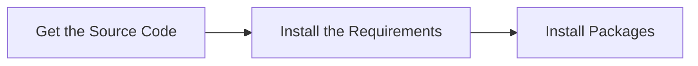
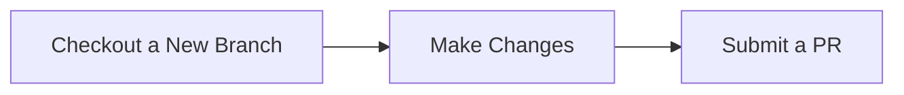
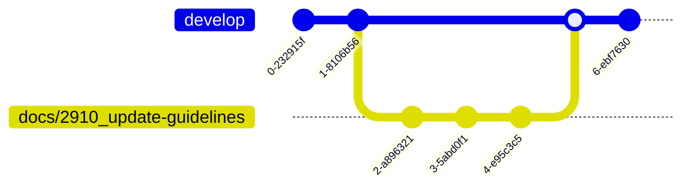
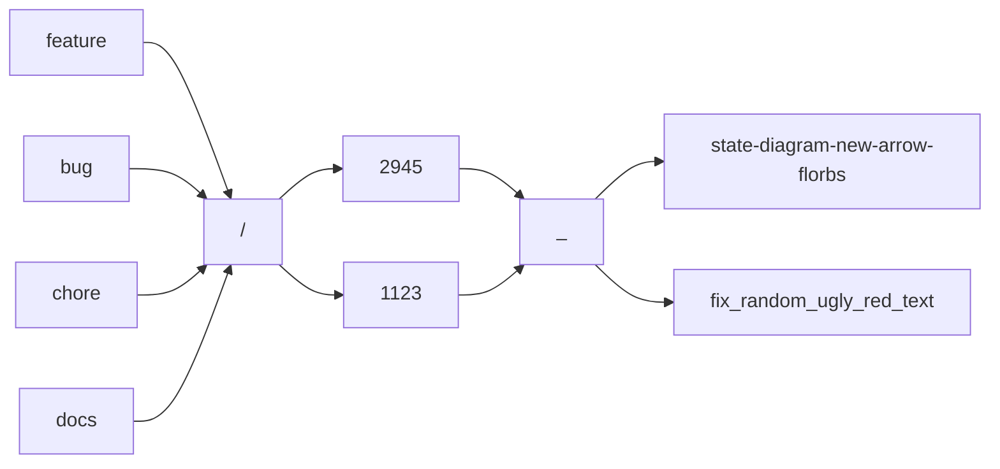
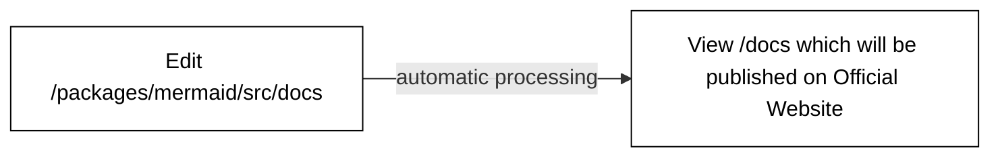

# Mermaid Contributing Guide

You decided to take part in the development? Welcome!

We are trying to make our guidelines for you as explicit and detailed as possible.

## Initial Setup

Initial setup consists of 3 main steps:



### Get the Source Code

In GitHub, you first [**fork a mermaid repository**](https://github.com/mermaid-js/mermaid/fork) when you are going to make changes and submit pull requests.

Then you **clone** a copy to your local development machine (e.g. where you code) to make a copy with all the files to work with.

```tip
[Here is a GitHub document that gives an overview of the process](https://docs.github.com/en/get-started/quickstart/fork-a-repo).
```

```bash
git clone git@github.com/your-fork/mermaid
```

Once you have cloned the repository onto your development machine, change into the `mermaid` project folder (the top level directory of the mermaid project repository)

```bash
cd mermaid
```

### Install Requirements

We support **development within Docker** environment along with **host setup**. You may choose it up to your preferences.

**Host**

These are the tools we use for working with the code and documentation:

- [Node.js](https://nodejs.org/en/).
- [pnpm](https://pnpm.io/) package manager.

The following commands must be sufficient enough to start with:

```bash
curl -fsSL https://get.pnpm.io/install.sh | sh -
pnpm env use --global 20
```

You may also need to reload `.shrc` or `.bashrc` afterwards.

**Docker**

[Install Docker](https://docs.docker.com/engine/install/). And that is pretty much all you need.

Optionally, to run GUI (Cypress) within Docker you will also need an X11 server installed.
You might already have it installed, so check this by running:

```bash
echo $DISPLAY
```

If the `$DISPLAY` variable is not empty, then an X11 server is running. Otherwise you may need to install one.

### Install Packages

**Host**

Install packages:

```bash
pnpm install
```

**Docker**

For development using Docker there is a self-documented `run` bash script, which provides convenient aliases for `docker compose` commands.

Make sure that `./run` script is executable:

```bash
chmod +x run
```

```tip
To get detailed help simply type `./run` or `./run help`.

It also has short _Development quick start guide_ embedded.
```

Then install packages:

```bash
./run pnpm install
```

### Verify Everything Works

This step is optional, but it helps to make sure that everything in development branch was OK before you started making any changes.

You can run the `test` script to verify that pnpm is working _and_ that the repository has been cloned correctly:

**Host**

```bash
pnpm test
```

**Docker**

```bash
./run pnpm test
```

The `test` script and others are in the top-level `package.json` file.

All tests should run successfully without any errors or failures.

```note
You might see _lint_ or _formatting_ warnings. Those are ok during this step.
```

## Workflow

Contributing process is very simple and straightforward:



Mermaid uses a [Git Flow](https://guides.github.com/introduction/flow/)–inspired approach to branching.

Development is done in the `develop` branch.



To prepare a new version for release the maintainers create a `release/vX.X.X` branch from `develop` for testing. Once the release happens we add a tag to the `release` branch and merge it with `master`. The live product and on-line documentation are what is in the `master` branch.

## Checkout a New Branch

```tip
All new work should be based on the `develop` branch.
```

Make sure you have the most up-to-date version of the `develop` branch.

Check out the `develop` branch, then `fetch` or `pull` to update it:

```bash
git checkout develop
git fetch # or `git pull`
```

Create a new branch for your work:

```bash
git checkout -b docs/2910_update-contributing-guidelines
```

We use the following naming convention for branches:

```txt
[feature | bug | chore | docs]/[issue number]_[short-description]
```

You can always check current [configuration of labelling and branch prefixes](https://github.com/mermaid-js/mermaid/blob/develop/.github/pr-labeler.yml)

- The first part is the **type** of change: a `feature`, `bug`, `chore`, `docs`
- followed by a **slash** (`/`),which helps to group like types together in many git tools
- followed by the **issue number**, e.g. `2910`
- followed by an **underscore** (`_`)
- followed by a **short description** with dashes (`-`) or underscores (`_`) instead of spaces



If your work is specific to a single diagram type, it is a good idea to put the diagram type at the start of the description. This will help us keep release notes organized by a diagram type.

```note
A new feature described in issue 2945 that adds a new arrow type called 'florbs' to state diagrams

`feature/2945_state-diagram-new-arrow-florbs`
```

```tip
A bug described in issue 1123 that causes random ugly red text in multiple diagram types

`bug/1123_fix_random_ugly_red_text`
```

## Contributing Code

Code is the heart of every software project. We strive to make it better. Who if not us?

### Where is the Code Located?

The core of Mermaid is located under `packages/mermaid/src`.

### Running Mermaid Locally

**Host**

```bash
pnpm run dev
```

**Docker**

```bash
./run dev
```

After starting the dev server open <http://localhost:9000> in your browser.

Now you are ready to make your changes!

### Make Changes

Have a look at <http://localhost:9000>. There is a list of demos that can be used to see and test your changes.

If you need a specific diagram, you can duplicate the `example.html` file in `/demos/dev` and add your own mermaid code to your copy.

That will be served at <http://localhost:9000/dev/your-file-name.html>.
After making code changes, the dev server will rebuild the mermaid library and automatically reload the page.

Edit files in `packages/mermaid/src` as required.

### Write Tests

Tests ensure that each function, module, or part of code does what it says it will do. This is critically important when other changes are made to ensure that existing code is not broken (no regression).

Just as important, the tests act as _specifications:_ they specify what the code does (or should do).
Whenever someone is new to a section of code, they should be able to read the tests to get a thorough understanding of what it does and why.

If you are fixing a bug, you should add tests to ensure that your code has actually fixed the bug, to specify/describe what the code is doing, and to ensure the bug doesn't happen again.
(If there had been a test for the situation, the bug never would have happened in the first place.)
You may need to change existing tests if they were inaccurate.

If you are adding a feature, you will definitely need to add tests. Depending on the size of your feature, you may need to add integration tests.

#### Unit Tests

Unit tests are tests that test a single function or module. They are the easiest to write and the fastest to run.

Unit tests are mandatory for all code except the renderers. (The renderers are tested with integration tests.)

We use [Vitest](https://vitest.dev) to run unit tests.

**Host**

You can use the following command to run the unit tests:

```sh
pnpm test
```

When writing new tests, it's easier to have the tests automatically run as you make changes. You can do this by running the following command:

```sh
pnpm test:watch
```

**Docker**

When using Docker prepend your command with `./run`:

```sh
./run pnpm test
```

#### Integration / End-to-End (E2E) Tests

These test the rendering and visual appearance of the diagrams.

This ensures that the rendering of that feature in the E2E will be reviewed in the release process going forward. Less chance that it breaks!

To start working with the E2E tests:

**Host**

- Run `pnpm dev` to start the dev server
- Start **Cypress** by running `pnpm cypress:open`

**Docker**

- Enable local connections for x11 server `xhost +local:`
- Run `./run pnpm dev` to start the dev server
- Start **Cypress** by running `./run pnpm cypress:open --project .`

The rendering tests are very straightforward to create. There is a function `imgSnapshotTest`, which takes a diagram in text form and the mermaid options, and it renders that diagram in Cypress.

When running in CI it will take a snapshot of the rendered diagram and compare it with the snapshot from last build and flag it for review if it differs.

This is what a rendering test looks like:

```js
it('should render forks and joins', () => {
  imgSnapshotTest(
    `
    stateDiagram
    state fork_state &lt;&lt;fork&gt;&gt;
      [*] --> fork_state
      fork_state --> State2
      fork_state --> State3

      state join_state &lt;&lt;join&gt;&gt;
      State2 --> join_state
      State3 --> join_state
      join_state --> State4
      State4 --> [*]
    `,
    { logLevel: 0 }
  );
});
```

<!-- **_[TODO - running the tests against what is expected in development. ]_** -->
<!-- **_[TODO - how to generate new screenshots]_** -->

### Update Documentation

```tip
Our documentation is managed in `packages/mermaid/src/docs`. Details on how to edit is in the [documentation section](#contributing-documentation)
```

If the users have no way to know that things have changed, then you haven't really _fixed_ anything for the users; you've just added to making Mermaid feel broken.
Likewise, if users don't know that there is a new feature that you've implemented, it will forever remain unknown and unused.

The documentation has to be updated for users to know that things have been changed and added!
If you are adding a new feature, add `(v<MERMAID_RELEASE_VERSION>+)` in the title or description. It will be replaced automatically with the current version number when the release happens.

eg: `# Feature Name (v<MERMAID_RELEASE_VERSION>+)`

We know it can sometimes be hard to code _and_ write user documentation.

Create another issue specifically for the documentation.
You will need to help with the PR, but definitely ask for help if you feel stuck.
When it feels hard to write stuff out, explaining it to someone and having that person ask you clarifying questions can often be 80% of the work!

When in doubt, write up and submit what you can. It can be clarified and refined later. (With documentation, something is better than nothing!)

## Contributing Documentation

If it is not in the documentation, it's like it never happened. Wouldn't that be sad? With all the effort that was put into the feature?

### Where is the Documentation Located?

```warning
DO NOT CHANGE FILES IN `/docs`

The `docs` folder will be automatically generated when committing to `packages/mermaid/src/docs` and **should not** be edited manually.
```

Documentation is located in the [`packages/mermaid/src/docs`](https://github.com/mermaid-js/mermaid/tree/develop/packages/mermaid/src/docs) folder. Just pick the right section and start typing.

The contents of [mermaid.js.org](https://mermaid.js.org/) are based on the docs from the `master` branch. Updates committed to the `master` branch are reflected in the [Mermaid Docs](https://mermaid.js.org/) once published.



### Running the Documentation Website Locally

**[The mermaid documentation site](https://mermaid.js.org/) is powered by [Vitepress](https://vitepress.vuejs.org/).**

Start development server for the documentation site

**Host**

```bash
pnpm --filter mermaid run docs:dev
```

or

```bash
cd packages/mermaid
pnpm docs:dev
```

**Docker**

```bash
./run docs:dev
```

Open [http://localhost:3333/](http://localhost:3333/) in your browser.

### Formatting

The documentation is written in Markdown. To get acquainted with its syntax [see the GitHub Markdown help page](https://help.github.com/en/github/writing-on-github/basic-writing-and-formatting-syntax).

You can use `note`, `tip`, `warning` and `danger` in triple backticks to add a note, tip, warning or danger box.

```danger
Do not use vitepress specific markdown syntax `::: warning` as it will not be processed correctly.
```

Here are a few examples:

````markdown
```note
This is a note
```

```tip
This is a tip
```

```warning
This is a warning
```

```danger
This is a danger alert
```
````

```note
This is a note
```

```tip
This is a tip
```

```warning
This is a warning
```

```danger
This is a danger alert
```

### Navigation

If you want to propose changes to how the documentation is _organized_, such as adding a new section or re-arranging or renaming a section, you must update the **sidebar navigation**, which is defined in [the vitepress config](../.vitepress/config.ts). The same goes to **topbar**.

### Build Docs

The content of `/docs` folder is built with Github Actions.

```warning
So as to allow automatic compilation of documentation pages you have to enable Github Actions on your fork first
```

## Submit your pull request

````note
Do not forget to push your changes

```bash
git push -u origin docs/2910_update-guidelines
```
````

We make all changes via Pull Requests (PRs). Open a new one.

Right now we are not following any strict rules about naming PRs. Give it a representative title and short description. There is also a [pull request template](https://github.com/mermaid-js/mermaid/blob/develop/.github/pull_request_template.md) which will help you with it.

In case in its description contains a [magic comment](https://docs.github.com/en/issues/tracking-your-work-with-issues/linking-a-pull-request-to-an-issue) your PR will be automatically attached to the issue:

```markdown
Resolves #<your issue ID here>
```

## Congratulations

You have successfully submitted your improvements! What is next?

- PRs will be reviewed by active maintainers, who will provide feedback and request changes as needed.
- The maintainers will request a review from _knsv_, if necessary.
- Once the PR is approved, the maintainers will merge the PR into the `develop` branch.
- When a release is ready, the `release/x.x.x` branch will be created, extensively tested and knsv will be in charge of the release process.

Thanks for you help!

<!--- cspell:ignore florbs --->
