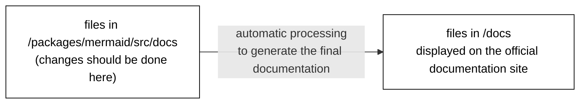

# Contributing Documentation

If it is not in the documentation, it's like it never happened. Wouldn't that be sad? With all the effort that was put into the feature?

The documentation is written in Markdown. It is located in the [`packages/mermaid/src/docs`](https://github.com/mermaid-js/mermaid/tree/develop/packages/mermaid/src/docs) folder and organized according to relevant subfolder. Just pick the right section and start typing.

The contents of [mermaid.js.org](https://mermaid.js.org/) are based on the docs from the `master` branch. Updates committed to the `master` branch are reflected in the [Mermaid Docs](https://mermaid.js.org/) once published.

## How to Contribute to Documentation

```warning
DO NOT CHANGE FILES IN `/docs`

The `docs` folder will be automatically generated when committing to `packages/mermaid/src/docs` and **should not** be edited manually.
```



It is OK to commit directly in the `develop` branch if you are a collaborator.

```tip
If the change is **only** to the documentation, you can get your changes published to the site quicker by making a PR to the `master` branch. In that case, your branch should be based on master, not develop.
```

You can use `note`, `tip`, `warning` and `danger` in triple backticks to add a note, tip, warning or danger box.
Do not use vitepress specific markdown syntax `::: warning` as it will not be processed correctly.

````markdown
```note
Note content
```

```tip
Tip content
```

```warning
Warning content
```

```danger
Danger content
```
````

## The official documentation site

**[The mermaid documentation site](https://mermaid.js.org/) is powered by [Vitepress](https://vitepress.vuejs.org/).**

To run the documentation site locally:

1.  Run `pnpm --filter mermaid run docs:dev` to start the dev server. (Or `pnpm docs:dev` inside the `packages/mermaid` directory.)
2.  Open [http://localhost:3333/](http://localhost:3333/) in your browser.

Markdown is used to format the text, for more information about Markdown [see the GitHub Markdown help page](https://help.github.com/en/github/writing-on-github/basic-writing-and-formatting-syntax).

To edit Docs on your computer:

_[TODO: need to keep this in sync with [check out a git branch in Contributing Code above](#1-checkout-a-git-branch) ]_

1.  Create a fork of the develop branch to work on.
2.  Find the Markdown file (.md) to edit in the `packages/mermaid/src/docs` directory.
3.  Make changes or add new documentation.
4.  Commit changes to your branch and push it to GitHub (which should create a new branch).
5.  Create a Pull Request from the branch of your fork.

To edit Docs on GitHub:

1.  Login to [GitHub.com](https://www.github.com).
2.  Navigate to [packages/mermaid/src/docs](https://github.com/mermaid-js/mermaid/tree/develop/packages/mermaid/src/docs) in the mermaid-js repository.
3.  To edit a file, click the pencil icon at the top-right of the file contents panel.
4.  Describe what you changed in the **Propose file change** section, located at the bottom of the page.
5.  Submit your changes by clicking the button **Propose file change** at the bottom (by automatic creation of a fork and a new branch).
6.  Visit the Actions tab in Github, `https://github.com/<Your Username>/mermaid/actions` and enable the actions for your fork. This will ensure that the documentation is built and updated in your fork.
7.  Create a Pull Request of your newly forked branch by clicking the green **Create Pull Request** button.

## Documentation organization: Sidebar navigation

If you want to propose changes to how the documentation is _organized_, such as adding a new section or re-arranging or renaming a section, you must update the **sidebar navigation.**

The sidebar navigation is defined in [the vitepress configuration file config.ts](../.vitepress/config.ts).
