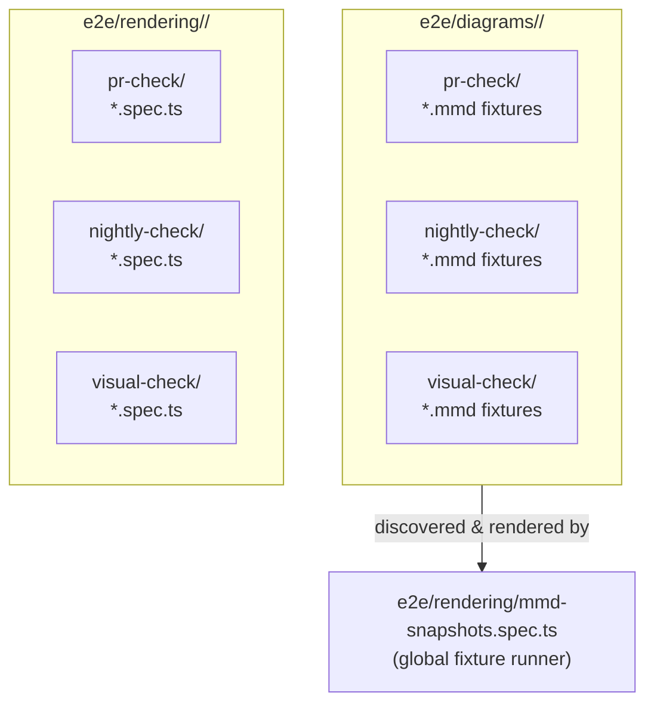
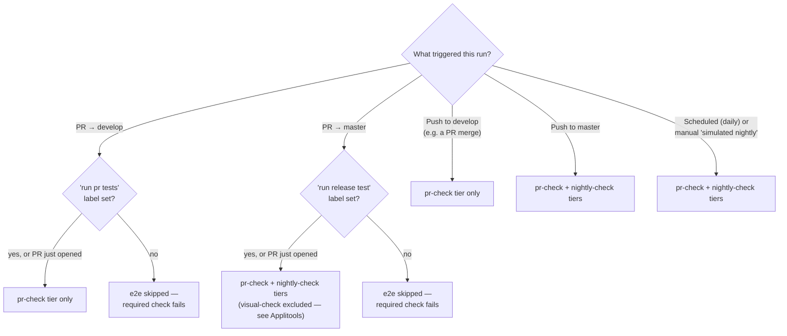
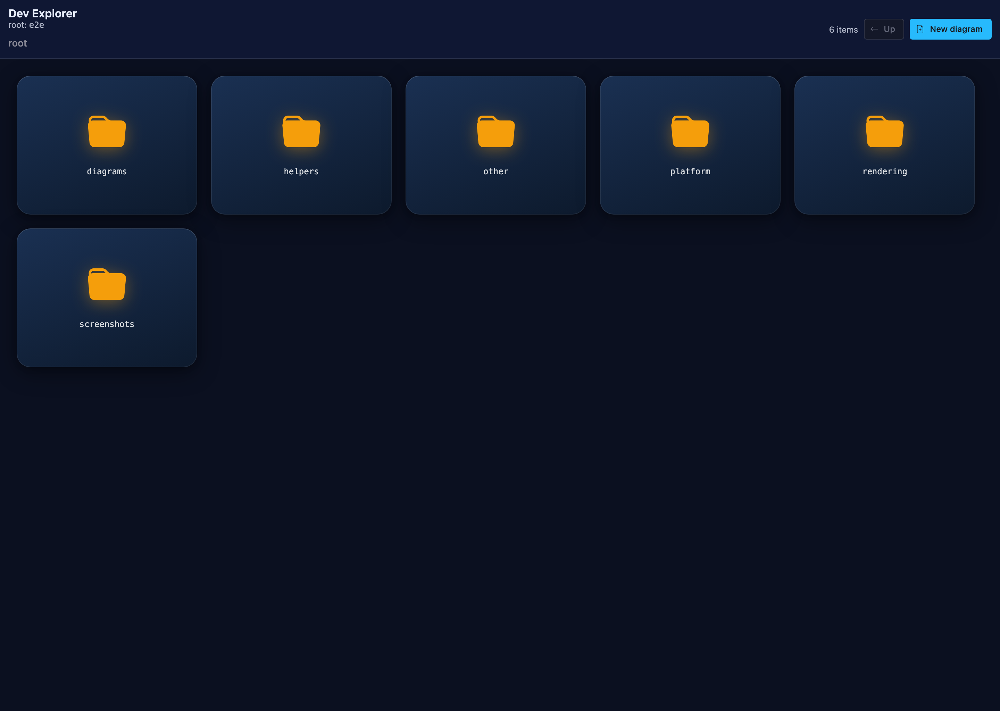

# E2E Test Suite: Tiers, Folders, and CI

This is a contributor-facing manual for the `e2e/` test suite's tier structure — why it exists, how it's organized, which flags/labels control it, and how to work with it locally.

## Why this exists

Before this restructuring, every PR ran the entire e2e suite — every diagram, every theme variant, every look/handdrawn combination — on every push. That's thorough, but it's expensive in two ways that scale badly as the suite grows:

- **CI time.** A full run takes significantly longer than most PRs actually need. Most changes touch one diagram type; waiting on a full 8-shard run to validate a one-line fix is slow feedback for no real benefit.
- **Argos quota.** Every full run captures and uploads a screenshot for every diagram fixture, whether or not that fixture has anything to do with the change under review. Visual-regression services bill (or rate-limit) by build/screenshot volume, so an oversized "safety net" run on every push burns through quota fast.

The fix is to split fixtures and specs into **tiers** — a small, fast, curated set that runs on every PR by default, and larger, slower sets reserved for less frequent, higher-confidence checks (nightly, and before a release-bound merge).

**Measured impact** (from a real before/after comparison on this fork, on 2026-09-24 — pulled directly from GitHub Actions run history for PR #7; treat this as a dated example, not a live-updating stat):

|                               | Full suite (pre-tiering) | `pr-check`-tier only |
| ----------------------------- | ------------------------ | -------------------- |
| Shards                        | 8                        | 2                    |
| Per-shard time                | ~15–18 min               | ~6–8 min             |
| Total wall-clock              | ~31 min                  | ~8 min               |
| Total compute (shard-minutes) | ~128                     | ~14                  |

Roughly a **4x reduction in wall-clock time** and **~90% less total CI compute** for the common case — a PR that only needs the `pr-check` tier to validate its change. That tracks with the underlying fixture split: as of 2026-09-24, `pr-check` covered about 15% of all `.mmd` fixtures (312 of 2,136 — `nightly-check` held 1,375, `visual-check` held 449). These counts will grow over time; the proportions are the durable part.

## Directory layout

Two parallel trees hold the suite's content:



- **`e2e/diagrams/<diagram-type>/<tier>/*.mmd`** — static Mermaid source fixtures. Each one is just a diagram (optionally with YAML frontmatter setting `config`/`title`/a `description`). They aren't run directly; a single global spec, `e2e/rendering/mmd-snapshots.spec.ts`, discovers every `.mmd` file under `e2e/diagrams/`, registers one Playwright test per fixture (grouped into `describe` blocks mirroring the folder path), and renders it. This is where the large majority of diagram-rendering coverage lives — no test-writing required, just add a `.mmd` file in the right tier folder.
- **`e2e/rendering/<diagram-type>/<tier>/*.spec.{js,ts}`** — hand-written Playwright specs, for anything a static fixture can't express: DOM/CSS assertions, `.click()` interactions, directive-vs-`initialize()` precedence checks, multi-diagram array tests, custom `mermaid.initialize()` config, and similar. If your test needs to assert on rendered output beyond "did it render without erroring," it belongs here instead of as a fixture.
- **`e2e/other/<tier>/*.spec.{js,ts}`** — cross-cutting specs that aren't about any single diagram type (XSS/security tests, GHSA regression tests, `iife`/embed tests, page-interaction tests, external-diagram loading). Only `pr-check/` is populated today.
- **`e2e/helpers/`** — shared test infrastructure: `util.ts` (the `imgSnapshotTest`/`renderGraph`/`verifyScreenshot` helpers every spec uses) and `mmd-snapshots.ts` (fixture discovery/metadata for the global runner).

Not every `<diagram-type>/<tier>/` directory has content yet — some are intentionally empty, left in place as containers for tests that haven't been written. An empty tier folder isn't stray or safe to delete; it's scaffolding for the layout above, matching a diagram type or tier that's expected to gain coverage later.

### The three tiers

| Tier            | Intent                                                                                                                                                                     | Runs on                                                                                                                                         |
| --------------- | -------------------------------------------------------------------------------------------------------------------------------------------------------------------------- | ----------------------------------------------------------------------------------------------------------------------------------------------- |
| `pr-check`      | Small, curated, fast smoke set — one or two representative fixtures per feature, not an exhaustive sweep.                                                                  | Every PR (see below), plus a `develop` merge, plus every nightly run.                                                                           |
| `nightly-check` | Bulk/comprehensive coverage — most of the fixture volume lives here.                                                                                                       | Once every 24h, plus a `master`-bound PR/merge (alongside `pr-check`).                                                                          |
| `visual-check`  | Theme/look (`classic`/`neo`/`handDrawn`)/layout/direction combinatorial sweeps — the same diagram rendered across every variant. Pixel/appearance content, not parse-only. | Not part of any automated CI gate. Reviewed manually via Applitools as a release-process step (`e2e-applitools.yml`, `workflow_dispatch`-only). |

A fixture or spec's tier is purely a function of which subfolder it lives in — there's no separate registry or config file to update.

If you're new to this structure, here's how to decide where a new test belongs:

- **Adding a new diagram feature or syntax?** Add one small `pr-check` fixture covering the happy path — this is what every PR runs, so it catches an obvious regression immediately. If the feature has several meaningfully different shapes/variants/edge cases worth covering, add those as additional fixtures under `nightly-check` instead of piling them all into `pr-check` — `pr-check` is meant to stay small and fast, not become exhaustive.
- **Fixing a rendering bug?** Add a `pr-check` fixture that reproduces the bug (the minimal diagram that triggered it), so this exact regression is caught on every future PR. Only drop it into `nightly-check` instead if it's a narrow, rarely-hit edge case where running it on every PR isn't worth the extra time.
- **Backfilling broad coverage for something that already works** (e.g. every node-shape × edge-type combination, a sweep of config options)? That bulk volume belongs in `nightly-check` — it's comprehensive by design and only needs to run once a day, not on every push.
- **Testing a purely visual/appearance difference** — how a diagram looks under a different theme, `handDrawn` look, layout direction, or similar, where the underlying structure/parsing is unaffected? That's `visual-check`. It's pixel/appearance content reviewed by a human via Applitools, not something an automated parse-only assertion can usefully judge.
- **Does your test need to assert on something beyond "did it render without erroring"?** — a DOM/CSS assertion, a `.click()` interaction, directive-vs-`initialize()` precedence, a multi-diagram array, custom `mermaid.initialize()` config — that can't be expressed as a static `.mmd` fixture. Write a hand-written spec instead, under `e2e/rendering/<diagram-type>/<tier>/*.spec.{js,ts}` if it's about one specific diagram type, or `e2e/other/<tier>/*.spec.{js,ts}` if it's cross-cutting (security/XSS, embed/`iife`, page interactions, external-diagram loading, and similar). The same tier logic above still applies to these — a fast smoke-test spec goes in `pr-check`, a more exhaustive one in `nightly-check`.

When in doubt, default to `pr-check` for anything a feature's author would want caught immediately, and move broader/slower coverage to `nightly-check`.

## How CI decides what to run



Both labels — `run pr tests` and `run release test` — default to **on**: a small automation job adds them to every freshly-opened PR (targeting `develop` and `master` respectively). Removing the label before a later push causes e2e to be skipped for that push, which is treated as a **failure** of the required status check (not a silent pass) — merging is still possible via a repo admin's branch-protection bypass, but it's not a default-open door.

Note that `run release test` — despite its name — does **not** gate the `visual-check` tier. `visual-check` is theme/look/layout/direction combinatorial sweeps: pixel/appearance content that's better judged by a human during the manual Applitools pass (`e2e-applitools.yml`) than by an automated parse-only check here. The label name is a holdover from before this tier split; renaming it is tracked separately and out of scope for this doc.

This label-gating logic, and the nightly/scheduled workflow, are **upstream-only** — every branch of this logic is guarded by a check that it's running on `mermaid-js/mermaid`, not a fork. On a fork, e2e.yml falls back to its original full-suite/diff-based-scoping behavior, and the nightly workflow's own job is a no-op (there's no Argos project/credentials there to make screenshot capture worthwhile).

## Flags and environment variables

| Name                                        | Where                                           | Effect                                                                                                                                                                                                                  |
| ------------------------------------------- | ----------------------------------------------- | ----------------------------------------------------------------------------------------------------------------------------------------------------------------------------------------------------------------------- |
| `MERMAID_E2E_FIXTURE_TIER`                  | env var, read by `mmd-snapshots.spec.ts`        | Comma-separated tier list (e.g. `pr-check`, or `pr-check,nightly-check`) that narrows which `.mmd` fixtures get registered. Unset = every tier.                                                                         |
| `run pr tests`                              | GitHub PR label                                 | Gates whether a `develop`-bound PR's e2e run happens at all (scoped to `pr-check` tier when present). Defaults on for new PRs.                                                                                          |
| `run release test`                          | GitHub PR label                                 | Same, for `master`-bound PRs (scoped to `pr-check`+`nightly-check` — `visual-check` excluded, see above). Defaults on for new PRs.                                                                                      |
| `E2E_SCOPE_BY_DIAGRAM`                      | repo variable                                   | Kill-switch for the (separate, older) diagram-diff-based scoping used outside the tier-gating paths. Set to `'false'` to force the full suite unconditionally.                                                          |
| `RUN_VISUAL_TEST`                           | computed CI env var                             | Controls whether screenshots get captured for Argos upload. Only ever true on the real upstream repo — never on this fork.                                                                                              |
| `USE_APPLI`                                 | env var                                         | Switches screenshot verification to Applitools instead of the Argos/local-snapshot path. Common in personal dev shells — remember to override it (`USE_APPLI=`) when you specifically want the Argos code path locally. |
| `SCREENSHOT_DIR`                            | env var                                         | Overrides where Argos-mode screenshots get written locally. Defaults to `e2e/screenshots`.                                                                                                                              |
| `GROUP_ARGOS_IMAGES` / `group_argos_images` | computed CI env var / `workflow_dispatch` input | Whether screenshots get composited into per-folder "sheets" before Argos upload, versus uploaded individually.                                                                                                          |
| `MERMAID_DEV_EXPLORER_ROOT`                 | env var, read by `.esbuild/server.ts`           | Which `.mmd` root the local Dev Explorer (`/dev` route) serves. Defaults to `e2e` (the whole tree — fixtures, platform diagrams, everything).                                                                           |
| `MERMAID_PORT` / `MERMAID_DEV_PORT`         | env var                                         | Overrides the dev server port Playwright/the dev server use.                                                                                                                                                            |
| `E2E_COVERAGE`                              | env var                                         | Switches the dev server to the coverage-instrumented build, and enables native V8 coverage collection during a Playwright run.                                                                                          |

## Working with tiers locally

**Run only the `pr-check` tier** (mirrors what a PR's CI actually runs):

```bash
MERMAID_E2E_FIXTURE_TIER=pr-check pnpm exec playwright test e2e/rendering/mmd-snapshots.spec.ts $(node scripts/e2e-tier-scope.mjs pr-check | tr ',' ' ')
```

**Run a "simulated nightly" (`pr-check`+`nightly-check`)** without waiting for the schedule:

```bash
gh workflow run "Nightly E2E" --repo mermaid-js/mermaid
# or purely locally, no CI involved:
MERMAID_E2E_FIXTURE_TIER=pr-check,nightly-check pnpm exec playwright test e2e/rendering/mmd-snapshots.spec.ts $(node scripts/e2e-tier-scope.mjs pr-check nightly-check | tr ',' ' ')
```

**See what a fixture would look like in Argos**, without needing real Argos credentials or touching any baseline: capture screenshots locally with `RUN_VISUAL_TEST=true` (remembering to clear `USE_APPLI` if it's set in your shell), then either browse `e2e/screenshots/` directly, or run `pnpm run screenshots:sheets` to composite them the same way CI does before upload.

**Run the `visual-check` tier**: start the local dev server first (`pnpm dev`, in its own terminal) — the suite is large enough (900+ tests) that it's worth having it already warm rather than waiting on Playwright's own `webServer` auto-start/cold build on the first request:

```bash
pnpm playwright:visual-check
```

This isn't something you'd run as part of routine local development — it's only used when preparing a release, alongside the manual Applitools pass described in the tier table above. It runs both halves of the tier unconditionally (one does not get skipped if the other has a failure): the `.mmd` fixtures under every `e2e/diagrams/<diagram-type>/visual-check/` folder (via the global `mmd-snapshots.spec.ts` runner, selected by test title) and the hand-written specs under `e2e/rendering/<diagram-type>/visual-check/*.spec.ts` (selected by file path; currently only populated under `common-tests/`).

## Diagrams and screenshots

The Dev Explorer (`/dev` route) — browse `.mmd` fixtures under the configured `MERMAID_DEV_EXPLORER_ROOT` and preview them rendered:



> 📸 **Placeholder — add screenshots here:**
>
> - The GitHub PR "Checks" tab, side by side: a `develop`-bound PR showing the scoped 2-shard `pr-check`-tier run, versus a `master`-bound PR showing the scoped 4-shard `pr-check`+`nightly-check` run (`visual-check` excluded).
> - The "Nightly E2E" entry in the Actions tab, filtered, showing a recent scheduled run's result.

The flowcharts above (directory layout, CI decision flow) are Mermaid diagrams — edit them the same way you'd edit any diagram in this repo. If you add more diagrams to this doc, prefer Mermaid over static images where the content is structural/flow-based (it stays accurate as the suite evolves, and — fittingly for this repo — is easy for any contributor to update in a plain-text diff).
