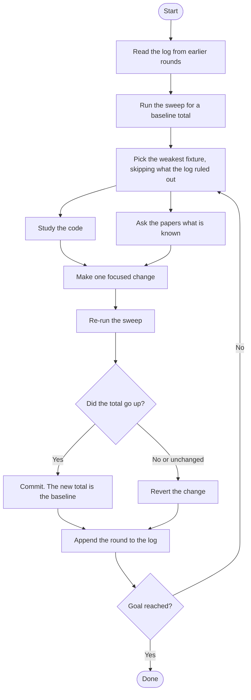

# The Layout Maker's Guide 🗺️

A layout algorithm decides where nodes sit and how edges get from one to the next. Shapes, themes, markers, and labels are already handled by the shared rendering code. Your job is coordinates.

This guide covers layouts that live inside the Mermaid package, next to `dagre` and the others. The last section explains how to ship the same code as a standalone npm package instead.

## What a layout receives and what it must produce

Every layout is handed the same structure, `LayoutData`, regardless of which diagram type produced it:

```ts
interface LayoutData {
  nodes: Node[];
  edges: Edge[];
  config: MermaidConfig;
  diagramId?: string;
}
```

You must fill in these fields and nothing else:

| Field                       | On   | Meaning                                                             |
| --------------------------- | ---- | ------------------------------------------------------------------- |
| `node.x`, `node.y`          | Node | Center of the node, not its top-left corner                         |
| `node.width`, `node.height` | Node | Already measured for leaf nodes; you set them for groups            |
| `edge.points`               | Edge | Polyline from source boundary to target boundary, at least 2 points |
| `edge.x`, `edge.y`          | Edge | Anchor for the edge label, when the edge has one                    |

Two structural fields are your input, not your output. `node.isGroup` marks a subgraph container, and `node.parentId` names the group a node belongs to. Read them, never rewrite them.

Sizes arrive already measured. The renderer inserts every node into the SVG, calls `getBBox()`, and writes the result back before your algorithm runs. That measurement is the only step that touches the DOM, which is what makes the rest testable.

## The five stages

Layouts are built by calling `createCommonLayoutRenderer` from `rendering-util/layout-algorithms/common/index.ts`. It gives you five hooks, runs them in order, and handles painting:

```ts
export const render = createCommonLayoutRenderer({
  prepareLayout, // reshape LayoutData before measuring
  measureLayout, // DOM: insert elements, read sizes (has a default)
  runLayoutCore, // your algorithm, no DOM allowed
  paintLayout, // escape hatch: take over painting entirely
  afterPaint, // touch up after paths exist
  paintOptions, // tweak the standard painter
});
```

Only `runLayoutCore` is required. The swimlanes layout is a complete example in twenty lines:

```ts
import { createCommonLayoutRenderer } from '../common/index.js';
import { applySwimlaneLineJumps } from './adjustLayout.js';
import { prepareLayoutForSwimlanes } from './helpers.js';
import { createEdgeLabelNodes } from './edgeLabelNodes.js';
import { runSwimlaneLayoutCore } from './layoutCore.js';

function prepareSwimlaneLayout(data4Layout: LayoutData): void {
  prepareLayoutForSwimlanes(data4Layout);

  const transformedData = createEdgeLabelNodes(data4Layout);
  data4Layout.nodes = transformedData.nodes;
  data4Layout.edges = transformedData.edges;
}

export const render = createCommonLayoutRenderer({
  prepareLayout: prepareSwimlaneLayout,
  runLayoutCore: runSwimlaneLayoutCore,
  afterPaint: applySwimlaneLineJumps,
});
```

### Keep the core free of the DOM

`runLayoutCore` must be a pure function of `LayoutData`. No `document`, no `getBBox`, no d3 selections.

The reason is testing. Node sizes get measured in a browser once and saved to a file. A test then loads those sizes, hands them to `runLayoutCore`, and gets back the same coordinates the browser would have produced, without opening a browser at all. That only holds while the core stays free of the DOM. The moment it reaches for `document`, it can only run inside a real page, and any test around it is exercising a different code path than the one your users hit.

So write the core as one exported function, and have both the browser and your tests call that same function.

## A minimal layout

The examples from here on build a layout called `grid`. No such layout ships with Mermaid. It stands in for whatever you are writing, and the code below is what you would write to create it.

Put the algorithm in `packages/mermaid/src/rendering-util/layout-algorithms/<name>/`. This one arranges leaf nodes in a grid and connects them with straight lines:

```ts
// layout-algorithms/grid/layoutCore.ts
import type { LayoutData } from '../../types.js';

const GAP = 60;

/** DOM-free: positions come from measured sizes only. */
export function runGridLayoutCore(data4Layout: LayoutData): void {
  const leaves = data4Layout.nodes.filter((node) => !node.isGroup);
  const columns = Math.ceil(Math.sqrt(leaves.length));
  const cell = Math.max(...leaves.map((n) => Math.max(n.width ?? 0, n.height ?? 0))) + GAP;

  leaves.forEach((node, i) => {
    node.x = (i % columns) * cell;
    node.y = Math.floor(i / columns) * cell;
  });

  const byId = new Map(data4Layout.nodes.map((node) => [node.id, node]));
  for (const edge of data4Layout.edges) {
    const from = byId.get(edge.start ?? '');
    const to = byId.get(edge.end ?? '');
    if (!from || !to) {
      continue;
    }
    edge.points = [
      { x: from.x ?? 0, y: from.y ?? 0 },
      { x: to.x ?? 0, y: to.y ?? 0 },
    ];
  }
}
```

```ts
// layout-algorithms/grid/index.ts
import { createCommonLayoutRenderer } from '../common/index.js';
import { runGridLayoutCore } from './layoutCore.js';

export const render = createCommonLayoutRenderer({ runLayoutCore: runGridLayoutCore });
```

That renders. It is also wrong in most of the ways a layout can be wrong.

## Registering the layout

The layouts that ship with Mermaid are listed in `registerDefaultLayoutLoaders()` in `packages/mermaid/src/rendering-util/render.ts`. Add one entry for yours:

```ts
registerLayoutLoaders([
  { name: 'dagre', loader: async () => await import('./layout-algorithms/dagre/index.js') },
  { name: 'swimlane', loader: async () => await import('./layout-algorithms/swimlanes/index.js') },
  { name: 'domus', loader: async () => await import('./layout-algorithms/domus/index.js') },
  { name: 'hola', loader: async () => await import('./layout-algorithms/hola/index.js') },
  // your new layout
  { name: 'grid', loader: async () => await import('./layout-algorithms/grid/index.js') },
]);
```

The loader is lazy, so the code only downloads when a diagram asks for it. Users then select the layout by the name you registered:

```text
---
config:
  layout: grid
---
flowchart TB
  A --> B
```

## Groups, labels, and edges

### Groups

A group node carries `isGroup: true`, and its members carry `parentId` pointing at it. Groups nest. Your algorithm owns the group's `x`, `y`, `width`, and `height`, and the frame must enclose every descendant with room for the title. Groups also have an optional `groupTitleRect` describing the header band. Edges routed through that band collide with the title text.

The standard painter draws a group as a cluster and everything else as a node. Override that with `paintOptions.isCluster` when your layout has its own idea of which nodes are containers.

### Edge labels

Labels need space reserved before positions are decided, otherwise they land on top of edges and nodes. Both in-tree layouts solve this the same way: split each labelled edge into `start → label → end` around a temporary node, let the algorithm place that node like any other, then fold it back into an overlay label.

The DOMUS pipeline calls `injectDomusEdgeLabelNodes` before measuring, so the dummy is measured as real text, and `finalizeDummyLabelNodesToOverlayLabels` after routing. Swimlanes does the same through `createEdgeLabelNodes`. If you invent a third mechanism, your labels will not be checked by the validator, because the validator reads the label geometry these produce.

### Edge endpoints and markers

Edge paths must start and end on the boundary of their nodes, not at the center and not floating in space. By default the painter recomputes the endpoint by intersecting the path with the node shape, which will quietly bend the last segment of a carefully routed edge. Layouts that route to exact ports should turn that off with `paintOptions.skipIntersect`.

Arrowheads occupy roughly ten pixels of the final segment. A bend inside that stretch puts a corner underneath the arrowhead.

### Self-loops and parallel edges

An edge with `start === end` has no direction to follow and needs its own route, usually a small rectangle off one side of the node. Parallel edges between the same pair need to be separated by hand, or they render as one line. Fixtures for both live in `cypress/platform/dev-diagrams/layout-tests/` as `self-loop-2.mmd`, `self-loop-multi.mmd`, and `identical-edges.mmd`.

## Validating the result

`validateLayout` in `layout-algorithms/layout-utils/validateLayout.ts` is the shared judge of layout quality. It takes finished `LayoutData` and returns a verdict plus a score:

```ts
import { validateLayout } from '../layout-utils/validateLayout.js';

const result = validateLayout(layout);
// result.ok        → boolean, false when any hard constraint is broken
// result.issues    → what broke, with node/edge ids and details
// result.score     → 0 to 1000; exactly 0 whenever ok is false
// result.breakdown → crossings, per-edge bend penalties, point histogram
```

### Hard constraints

`ok` is false if any issue is present, and the score drops to zero. These are the failures worth knowing about before you write your router:

| Issue                                                           | What it means                                         |
| --------------------------------------------------------------- | ----------------------------------------------------- |
| `node-overlap`                                                  | Two nodes occupy the same space                       |
| `edge-intersects-node`, `edge-intersects-obstacle`              | A path crosses a node it does not connect to          |
| `edge-intersects-group-title`                                   | A path runs through a subgraph's title band           |
| `edge-endpoint-detached-from-node`, `edge-endpoint-inside-node` | An endpoint misses the boundary                       |
| `edge-non-orthogonal`                                           | A segment is neither horizontal nor vertical          |
| `edge-missing-points`                                           | Fewer than two points on an edge                      |
| `edge-shared-subpath`, `edge-parallel-segment-too-close`        | Two edges overlap or run too close to tell apart      |
| `edge-shared-attachment-point`, `edge-same-port-departure`      | Two edges leave a node from the same spot             |
| `edge-bend-near-endpoint`, `edge-bend-overlaps-arrowhead`       | A corner sits under the arrowhead or against the node |
| `edge-border-hugging`, `node-border-hugging`                    | Geometry runs along a border instead of clear of it   |
| `edge-label-overlaps-node`, `edge-label-overlaps-foreign-edge`  | A label lands on top of something else                |
| `edge-label-off-edge`                                           | A label sits away from the edge it belongs to         |

Some checks assume orthogonal routing. A layout with curved or diagonal edges will trip `edge-non-orthogonal` on every edge, so either route orthogonally or work out which subset of the validator applies to you before treating its score as a target.

### The score

When `ok` is true the score starts at 1000 and comes down. Bends are counted per edge from the polyline point count, and crossings are counted once globally:

| Polyline points | Bends | Penalty             |
| --------------- | ----- | ------------------- |
| 2               | 0     | 0                   |
| 3               | 1     | 0                   |
| 4               | 2     | 5                   |
| 5               | 3     | 12                  |
| 6               | 4     | 30                  |
| 7 or more       | 5+    | 30 × 2^(points − 6) |

Each crossing costs 3. The curve is deliberately steep at the top end: one seven-bend edge costs more than twenty crossings, because a path nobody can follow is worse than a tidy diagram with intersections.

`result.breakdown.edges` is sorted worst-first, which makes it the fastest way to find what is dragging a layout down.

### One thing that looks useful and is not

`layout-utils` also holds `scoreLayout`, which computes softer metrics: aspect ratio, average bends per edge, rank faithfulness, neighborhood preservation, straight-edge ratio. Sitting next to `validateLayout`, it looks like the quality half of a matched pair.

It is not wired into anything. Nothing in the layout pipeline calls it, no fixture spec calls it, and its only caller is its own unit test. Its `symmetryScore` is an unfinished placeholder that always returns `NaN`. Treat `validateLayout` as the only judge, and leave `scoreLayout` alone unless you are deliberately picking up that unfinished work.

## Testing with DDLT

DOM-Decoupled Layout Testing runs your algorithm in Node against sizes captured once from a real browser. Tests come back in seconds and give the same answer every time, and because the browser and the tests call the same core function, a fix in one is a fix in the other.

### Tests must run the browser's code path

The model is `parse → measure → run layout → paint`, and the third step has to be a single function. Tests swap out the measuring; the browser does it for real. What runs in between must be identical.

That sounds obvious, and it is where this gets broken most often. A test-only layout entry point sitting alongside the browser's is a bug even when the two look like they do the same thing. This has bitten this repo more than once, and the shape is always the same. The browser entry wrapped the edge pipeline in a degeneracy check and a direction-violation check, with a fallback and a reroute branch hanging off them. The test backend called the pipeline directly and skipped all of that. Fixtures came back valid, the browser took the fallback, and the fallback drew a polyline straight through the interior of a node. The validator would have caught it. The test harness never saw it.

So when you wire up a test backend, find the function the browser actually calls and trace it end to end. If it needs the DOM, lift its DOM-free body into a helper and call that helper from both sides rather than reimplementing the sequence. Never point the test at a primitive that the browser wraps in checks, fallbacks, mirror branches, or second passes: the test has to include all of it.

There is a cheap way to prove the seam is real. Change the browser orchestration, add a fallback or switch a default, and the test result for the same fixture should move. If it does not, the test is running around your change. Fix the seam rather than relaxing the test.

When a fixture passes in Node but looks broken on screen, run `validateLayout` on both, on the same fixture, and compare the issues. Different issues mean different pipelines. Put the two call chains side by side, look for pre-passes, the main call, and post-passes, and the first place they diverge is the seam.

### Fixtures

A fixture is a pair of files under `cypress/platform/dev-diagrams/layout-tests/`:

```
layout-tests/
  simple-graph.mmd          ← real Mermaid source, parsed by the real parser
  simple-graph.sizes.json   ← node dimensions captured from a browser render
  ddlt-manifest.json        ← per-fixture overrides
```

The `.mmd` file goes through the actual parser, so fixtures exercise the same `LayoutData` a user's diagram produces. The `.sizes.json` file holds one entry per leaf node and one per edge label, plus freshness metadata:

```json
{
  "metadata": {
    "captureVersion": 1,
    "sourceSha256": "…",
    "capturedAt": "2026-02-09T10:00:00Z",
    "capturedFrom": "theme=default&look=classic"
  },
  "nodes": [{ "id": "A", "width": 62, "height": 39 }]
}
```

`sourceSha256` is a hash of the `.mmd` file. Edit the diagram without recapturing and the test fails with a stale-fixture error instead of silently laying out with wrong sizes.

### Capturing sizes

There is a button for this. Start the dev server with `pnpm dev`, open the explorer at `/dev/`, and pick your diagram out of the file tree, which is rooted at the same `dev-diagrams` folder the fixtures live in. Switch to the Code tab and click **Save sizes**, sitting next to Save.

It does the whole job. Unsaved edits to the diagram are written first, the diagram re-renders with size capture switched on, and the measurements go to `<name>.sizes.json` beside the `.mmd`. The hash and the capture version are filled in for you, so the fixture passes the freshness check the moment it lands.

The button is only enabled for layouts that can produce capture data, and it explains itself through a tooltip when it is greyed out.

If you need to capture from somewhere other than the explorer, the same machinery is reachable from the console:

```js
window.mermaidCaptureSizes = true;
// render the diagram, then:
copy(JSON.stringify(window.mermaidLastCapturedSizes.sizes, null, 2));
```

Written by hand this way, the metadata block is yours to fill in. The capture module is dynamically imported only when that flag is set, so it never reaches a production bundle either way.

Recapture when the diagram source changes or when a shape's real dimensions change. Do not recapture to make a failing test pass. The fixture is the before-picture, and rewriting it erases the regression you were trying to catch.

### Parse the diagram, do not hand-build the graph

It is tempting to skip the parser and write the `LayoutData` for a test by hand. Resist it. Hand-built graphs drift from what the parser emits, usually in the identifiers, and once the ids differ the test is scoring a graph the browser never lays out.

The ids follow rules worth knowing, because fixture entries are matched against them:

| Entity            | Id                                                                 |
| ----------------- | ------------------------------------------------------------------ |
| Content node      | The unquoted name from the diagram source, such as `A` or `E`      |
| Unquoted subgraph | The subgraph text, kept as written                                 |
| Quoted subgraph   | `subGraph<N>`, numbered by a counter that ticks on every subgraph  |
| Edge              | `L_<start>_<end>_<counter>`, the counter separating parallel edges |
| Edge label node   | `edge-label-<start>-<end>-<edgeId>`                                |

The harness does the parsing for you. `parseMmdFileToLayoutData` strips frontmatter and directives, runs the real detector and parser, and stamps the direction the way the flowchart renderer does. `parseApplySizesAndLayout` goes further and applies the captured sizes and runs a backend. Reach for those before writing your own.

Whichever route you take, fail loudly when a fixture entry has no matching parser-produced node. A silent miss leaves a node at its default size, and the layout you then measure is not the layout anyone will see.

### Writing a spec

For the universal invariants, one line is enough:

```ts
import { baselineDdltSpec } from '../ddlt/index.js';

baselineDdltSpec('simple-graph');
```

That asserts nodes have finite coordinates, every edge has at least two points, no segment cuts through an unrelated node, and endpoints land on boundaries.

For anything specific to your algorithm, load the fixture and assert directly:

```ts
import { describe, it, expect, beforeAll } from 'vitest';
import { loadDdltFixture } from '../ddlt/index.js';
import { validateLayout } from '../layout-utils/validateLayout.js';

describe('grid layout, simple-graph', () => {
  let layout: LayoutData;
  beforeAll(async () => {
    layout = await loadDdltFixture('simple-graph');
  });

  it('produces a valid layout', () => {
    const result = validateLayout(layout);
    expect(result.issues.map((i) => i.type)).toEqual([]);
    expect(result.score).toBeGreaterThan(900);
  });
});
```

### The sweep

`ddlt/layout-fixtures.ddlt.spec.ts` discovers every fixture pair, runs the right backend for each, and asserts validity across the board. It also emits an aggregate report, the number that tells you whether a change helped overall rather than on the one diagram you were staring at:

```bash
# Every fixture, plus the aggregate
pnpm exec vitest run \
  packages/mermaid/src/rendering-util/layout-algorithms/ddlt/layout-fixtures.ddlt.spec.ts

# With the per-fixture score table
ORTHO_TEST_DEBUG=1 pnpm exec vitest run \
  packages/mermaid/src/rendering-util/layout-algorithms/ddlt/layout-fixtures.ddlt.spec.ts \
  2>&1 | grep 'DDLT-AGG'

# One fixture while iterating
pnpm exec vitest run -t "simple-graph" \
  packages/mermaid/src/rendering-util/layout-algorithms/ddlt/
```

The report gives `total`, `avg`, `min`, and `invalid`, then one row per fixture with its score and issue types. Read it as a work queue: the lowest row is where the next improvement is.

`ddlt-manifest.json` sets a fixture's profile and can mark it `allowLevel1Failure` when a known failure is tracked in its own dedicated spec.

## The cases that break layouts

A layout that handles a chain of boxes tells you almost nothing. The cases below are where engines actually fail, roughly in the order yours will fail them. Every one has a diagram in `layout-tests` already, so there is nothing to write before you can find out.

Several of them are source only. The sweep discovers fixtures by looking for `.sizes.json` files and pairing each with its sibling `.mmd`, so a diagram with no captured sizes is not being tested by anything, however tricky it looks. Check for the sizes file before assuming a case is covered, and if it is missing, open the diagram in the explorer and press Save sizes. That one click is the difference between a diagram sitting in a folder and a case the sweep will defend.

### Self-loops

An edge whose source and target are the same node has no direction to travel in, and code that computes a route from two distinct positions tends to produce a zero-length path, a division by zero, or a dot. The route has to be manufactured: a small loop off one side, clear of the node and of anything the node's other edges are doing.

`domus/self-loop.mmd` is the single-node case. `self-loop-2.mmd` and `self-loop-multi.mmd` are harsher, putting a self-loop on all four nodes of a cycle, so every loop competes for space with real edges already using those sides.

### Subgraphs

This is the long tail, and it is where most of the work is. A subgraph is a node that contains other nodes, so every edge endpoint now has two possible meanings and every frame is an obstacle that also has to move as its contents move.

| Case                                   | Fixture                                                   |
| -------------------------------------- | --------------------------------------------------------- |
| A subgraph standing on its own         | `domus/decoupled-subgraph.mmd`                            |
| Edge into a subgraph                   | `edge-to-subgraph.mmd`                                    |
| Edge into a node inside a subgraph     | `edge-to-node-in-subgraph.mmd`                            |
| Edge out of a subgraph                 | `domus/edge-from-subgraph.mmd`                            |
| Edge from inside out to a plain node   | `domus/subgraph-variation.mmd`                            |
| Between two sibling subgraphs          | `nested-sg-outgoing-2.mmd`, `nested-incoming.mmd`         |
| Inside one subgraph to inside another  | `nested-sg-outgoing-2.mmd`, `nested-subgraphs-2.mmd`      |
| Nested subgraphs                       | `nested-subgraphs.mmd`, `nested-subgraphs-3.mmd`          |
| Edges crossing several nesting levels  | `nested-sb-edges-in-out.mmd`, `nested-outgoing-edges.mmd` |
| All of it at once, several levels deep | `domus/architecture.mmd`                                  |

Work down that list in order. Each row assumes the ones above it.

Two failures recur. An edge that ends on a subgraph should stop at the frame rather than diving through to a member, and an edge that ends on a member has to cross the frame without clipping the title band. The other is sizing: a frame has to enclose everything inside it including the labels, and it has to keep doing so after a later pass nudges a member.

### Parallel edges

Two edges between the same pair of nodes are one edge as far as most routing code is concerned, because both get the same endpoints and the same optimal path, so they land exactly on top of each other and the diagram silently loses information. They have to be separated deliberately.

`identical-edges.mmd` is the minimal case. `domus/multiple-edges.mmd` adds a reverse edge to the bundle, so the fix cannot just fan edges out by index and ignore direction. `identical-edges-in-subgraph.mmd` puts a bundle in each direction inside a frame, where the room to fan out is bounded.

### Busy nodes

A node with more than four edges cannot give each one its own side. Ports have to share sides, share sides in an order that does not cross, and stay far enough apart to be told apart. Engines that assign one edge per side degrade sharply here, usually into a knot right against the node.

`domus/architecture.mmd` has a node with six edges leaving it, `domus/edge-types.mmd` another with six, and `mermaid-work.mmd` and `domus/Company.mmd` sit around five.

### Combinations, and both directions

These interact, and the combinations are worse than the parts. A self-loop on a busy node inside a nested subgraph exercises all four at once, which is why the larger fixtures are worth keeping even though a failure in one is harder to diagnose.

Run the ones that matter in `TB` and `LR` both. Layout code tends to grow an implicit assumption about which way the graph flows, and the second direction is where that assumption surfaces.

## Checking the literature before you invent something

Graph drawing has a long research record, and most of what a layout engine needs has been studied for decades. Orthogonal routing, compaction, port and side constraints, layered pipelines, crossing minimisation: none of these are new problems. Reaching for the papers first is usually faster than deriving a heuristic and discovering its failure modes one fixture at a time.

The papers are kept as a local corpus of around forty works, roughly a thousand pages, indexed for retrieval. Do not read it directly. It runs to a few hundred thousand tokens and a single dissertation in it is over a hundred thousand, so pulling it into a working session buries everything else. Query it instead through the retrieval agent, which reads only the sections it needs and answers in about five hundred tokens.

What comes back is deliberately partitioned:

| Field       | What it holds                                                              |
| ----------- | -------------------------------------------------------------------------- |
| `supported` | A claim plus the verbatim quote backing it, with paper, section, and lines |
| `inferred`  | What that might imply for Mermaid, which is the agent talking, not a paper |
| `gaps`      | What the corpus does not answer                                            |
| `conflicts` | Where the papers disagree with each other                                  |

The split is the whole point, so keep it. Only a `supported` claim should back a code change. An `inferred` line is a suggestion wearing a citation's clothes. When the retrieval reports that the corpus does not cover your question, the honest answer is that it does not cover your question. Filling that hole from memory produces confident text and unreliable code.

`conflicts` is the field people skip and shouldn't. This literature genuinely disagrees with itself, and one of the live disputes sits directly under how a shape-based orthogonal layout is built. A retrieval layer that quietly returns whichever side it happened to read first will keep agreeing with whatever the code already does, which is the opposite of useful.

Two traps are worth naming. Claims resting on a figure cannot count as supported, because the figure descriptions in the corpus have been checked for completeness but not for accuracy. And a few entries are secondary sources standing in for primary ones: a later thesis is not the original 1981 paper, lecture notes are not the article they summarise, and one paper in the corpus has a published erratum that fixes two known bugs. Citing the original without the erratum hands the reader both.

Ask in your own words. The retrieval bridges vocabulary, and the papers rarely use the words this codebase does. What the code calls a jog, the papers call a bend. A port window is a pin or a side constraint. A rail is a track or a channel. A group is a compound vertex.

If the corpus and the code disagree, that is something to investigate, not a licence to pick whichever you prefer. When you knowingly diverge from what a paper recommends, write down why in the pull request, along with how you checked that the divergence works.

## The improvement loop

Getting a layout valid is the first milestone. Making it good is a long tail of small changes, and the danger there is that most of them help one diagram while quietly hurting another. The improvement loop exists to stop that happening. It hill-climbs one number, the aggregate score from the fixture sweep, and throws away anything that does not raise it.



The sweep command from the previous section gives you both the score to climb and the list of what to work on next:

```bash
ORTHO_TEST_DEBUG=1 pnpm exec vitest run \
  packages/mermaid/src/rendering-util/layout-algorithms/ddlt/layout-fixtures.ddlt.spec.ts \
  2>&1 | grep 'DDLT-AGG'
```

`total` is the number being climbed. The per-fixture rows underneath it, sorted low to high, are the queue of candidates.

### Working out what to change

Once you have picked a fixture, two things inform the change, and they are worth doing side by side.

Read the code that produces the bad geometry. Trace the failing edge or the misplaced node back to the pass that emitted it, because tuning a later pass that the offending edge never reaches is a common way to burn a round on a change that cannot possibly do anything.

Then ask the papers. The retrieval agent described in the previous section is part of this loop, not an optional extra, and the reason is that most of these problems have known treatments. Ask in your own vocabulary and let the agent bridge the terminology.

Only a `supported` claim, one with a quote behind it, should shape the change you write. An `inferred` line is the agent's reasoning about Mermaid, and it carries no more weight than your own. When the corpus turns out not to cover the question, proceed on what the code tells you and say so in the commit message, so the next person knows the change rests on observation rather than literature.

### The verdict

Keep a change only when all three hold: the sweep passes, `total` is strictly higher than the baseline, and `invalid` has not gone up. Anything else gets reverted, including a change that leaves the score exactly where it was. Neutral churn makes later rounds harder to judge and buys nothing.

This is mechanical on purpose. A change you believe in but that does not move the number still goes, because the alternative is a codebase full of passes nobody can justify.

### The round log

The loop's memory lives in an append-only log, `.tmp/domus-improve/LOOP_LOG.md` for the DOMUS side. It sits in the repo's untracked `.tmp`, which is the point: it survives `git reset --hard` and branch switches, so the record outlives every revert it describes. Nothing in the loop deletes it.

Read it before you start. Write to it immediately after every verdict, and write the reverts especially. A kept commit explains itself through the diff and the score. A revert leaves no trace anywhere else, so without the log the same idea gets tried again in three weeks by someone who has forgotten trying it the first time, or by you.

Six lines is enough:

```markdown
## 2026-06-09 14:32 — round 3

- target: domus/deploy-pipeline (score 412, issues: edge-crossing, label-overlap)
- approach: prefer label-free corridors when choosing channels in the bend pass
- files: domus/edgePaths.ts
- result: reverted, total 26724 → 26690 (fixed the overlap, added 2 crossings elsewhere)
- lesson: corridor preference has to be scoped to label edges; global preference hurts dense fixtures
```

The lesson line is the one that earns its keep. The rest is bookkeeping.

Two rules fall out of having a log. An approach the log records as reverted does not get retried as written, and only becomes eligible again when something material has changed, such as a later kept commit touching the same code path or a paper suggesting a concretely different variant. And when the log shows one fixture has absorbed three or more reverted rounds without a single keep, stop aiming at it. That fixture is telling you it needs structural work under supervision, not another round of the same treatment.

Open a run with a header carrying the date, the branch, the starting total, and the goal, and close it with the stop condition and the final total. A run whose header is still open is a run somebody can pick up and continue.

### Rules that keep the number honest

Work on a scratch branch. The loop reverts with `git reset --hard`, which is only safe when the branch belongs to it.

Leave the instruments alone. `validateLayout.ts`, `scoreLayout.ts`, the spec files, the fixture `.mmd` and `.sizes.json` files, and `ddlt-manifest.json` are all off-limits while looping. If the score rises because a check got weaker or a fixture got easier, you have moved the ruler instead of the layout. When a check does look wrong, fix it as a separate piece of work with its own reasoning, then re-baseline.

One focused change per round, aimed at the one fixture you picked. Bundle two ideas together and a positive verdict tells you nothing about which one earned it.

### When to stop

Stop when you hit the score you were aiming for, when several rounds in a row revert (the obvious ideas are used up and what remains needs structural work), or when the baseline sweep fails before you have changed anything. A broken baseline is not something to fix from inside the loop.

### Running it automatically

Maintainers drive this loop with an agent skill that performs the cycle unattended: read the round log, sweep, pick a target, consult the literature, implement, re-sweep, keep or revert, append to the log, and go again until a stop condition fires. There are two of them, one per layout, and they share the contract described above. The DOMUS one keeps its log at `.tmp/domus-improve/LOOP_LOG.md`, works on a throwaway `domus-loop/` branch, and leaves you to merge, cherry-pick, or drop the result. The swimlanes one has the same skeleton with a tighter leash: an explicit list of files it may touch, a formal verdict function, and a check that the test pipeline and the browser pipeline have not drifted apart, which is "Tests must run the browser's code path" turned into an assertion that runs before every commit.

Everything they enforce works the same when you drive the loop by hand. The automation buys you patience and record-keeping, not permission to skip the rules.

### How the pieces fit

The three practices in this guide chain in one direction, and the order is what makes them work:

```text
literature  →  code  →  test  →  loop
```

Ask the papers what is known about the problem. Find where that lives in the layout pipeline. Turn the invariant into a fixture test so the answer stays answered. Then let the loop grind on the score, with the test suite deciding what survives.

Run it backwards and each step loses its footing. A loop with no tests optimises a number nobody trusts. A test with no grounding pins whatever the code happened to do the day it was written.

## Watching it in the browser while the tests run

The sweep tells you a score dropped. It does not tell you the diagram now looks like a plate of spaghetti. Keep a browser open next to the test run.

```bash
pnpm dev
```

Do not assume the address. The port is derived from the path of the checkout, so every worktree and every clone gets its own and you can run several dev servers side by side without them fighting over 9000. The server prints its URL as it starts, before the build output scrolls past. `MERMAID_DEV_PORT` pins it if you want a fixed one.

Open `/dev/` and you get the explorer: the fixture tree on one side, the diagram on the other, a code tab for editing the source, and a layout picker for comparing your algorithm against the others on the same input. It reloads when you change the source, so an edit to your algorithm redraws the diagram without you touching the browser.

For a diagram that is not in the fixture tree, copy the standalone page template instead:

```bash
cp demos/dev/example.html demos/dev/grid.html
```

That lands at `/dev/grid.html` on the same server. Put the diagram in the page and name your layout in the frontmatter:

```html
<pre class="mermaid">
---
config:
  layout: grid
---
flowchart TB
  A --> B
  B --> C
</pre>
```

A workflow that holds up over a long session:

1. Run the sweep in one terminal, filtered to the fixture you are working on.
2. Keep that same fixture open in the browser.
3. Make one change and watch both. The score says whether it helped, and the picture says whether the score was measuring the right thing.
4. Before committing, run the full sweep and confirm the aggregate did not drop.

The two disagree more often than you would expect, and the disagreement is informative. A score that improves while the diagram gets worse means the validator is blind to something, and that gap is worth writing down.

Use the browser to check what the tests cannot see: text that overflows its shape, arrowheads pointing the wrong way, subgraph frames cutting through labels.

## Shipping as a separate package

An external layout uses the same `render` signature and the same `createCommonLayoutRenderer`. Instead of editing the built-in registry, export a loader array and let the consumer register it:

```ts
import type { LayoutLoaderDefinition } from 'mermaid';

const loader = async () => await import('./render.js');

const layouts: LayoutLoaderDefinition[] = [{ name: 'grid', loader, algorithm: 'grid.compact' }];

export default layouts;
```

```js
import mermaid from 'mermaid';
import layouts from 'my-mermaid-layout';

mermaid.registerLayoutLoaders(layouts);
```

The `algorithm` field is passed back to your renderer through `options`, which lets one package register several named variants that share an implementation. `packages/mermaid-layout-elk` does exactly this.

Package it separately when the layout pulls in a large dependency. Everything else belongs in the main package, where it gets covered by the fixture sweep.

## Checklist

- [ ] `runLayoutCore` is one exported function with no DOM access
- [ ] The browser and the tests call that same function
- [ ] Group frames enclose their members and leave the title band clear
- [ ] Edge labels reserve space before positions are decided
- [ ] Edge endpoints land on node boundaries
- [ ] Self-loops and parallel edges have routes
- [ ] `validateLayout` returns `ok: true` on your fixtures
- [ ] Fixtures exist for the cases the algorithm was written to handle
- [ ] The full sweep passes and the aggregate score has not dropped
- [ ] Cypress visual tests cover the layout, since layout changes are rendering changes
