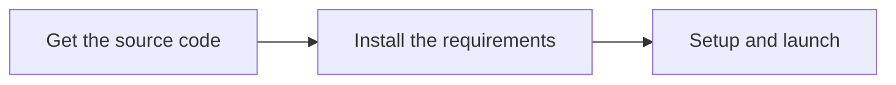

# Initial setup

> The following documentation describes how to work with Mermaid in your host environment.
> There's also a [Docker installation guide](../community/docker-setup.md)
> if you prefer to work in a Docker environment.

Initial setup consists of 3 main steps:



## Get the Source Code

In GitHub, you first **fork** a repository when you are going to make changes and submit pull requests.

Then you **clone** a copy to your local development machine (e.g. where you code) to make a copy with all the files to work with.

[Fork mermaid](https://github.com/mermaid-js/mermaid/fork) to start contributing to the main project and its documentation, or [search for other repositories](https://github.com/orgs/mermaid-js/repositories).

[Here is a GitHub document that gives an overview of the process](https://docs.github.com/en/get-started/quickstart/fork-a-repo).

## Technical Requirements

> The following documentation describes how to work with Mermaid in your host environment.
> There's also a [Docker installation guide](../community/docker-setup.md)
> if you prefer to work in a Docker environment.

These are the tools we use for working with the code and documentation:

- [volta](https://volta.sh/) to manage node versions.
- [Node.js](https://nodejs.org/en/). `volta install node`
- [pnpm](https://pnpm.io/) package manager. `volta install pnpm`
- [npx](https://docs.npmjs.com/cli/v8/commands/npx) the packaged executor in npm. This is needed [to install pnpm.](#install-packages)

Follow the setup steps below to start the development.

## Setup and Launch

### Switch to project

Once you have cloned the repository onto your development machine, change into the `mermaid` project folder (the top level directory of the mermaid project repository)

```bash
cd mermaid
```

### Install packages

Run `npx pnpm install`. You will need `npx` for this because volta doesn't support it yet.

```bash
npx pnpm install # npx is required for first install
```

### Launch Mermaid

```bash
npx pnpm run dev
```

Now you are ready to make your changes! Edit whichever files in `src` as required.

Open <http://localhost:9000> in your browser, after starting the dev server.
There is a list of demos that can be used to see and test your changes.

If you need a specific diagram, you can duplicate the `example.html` file in `/demos/dev` and add your own mermaid code to your copy.

That will be served at <http://localhost:9000/dev/your-file-name.html>.
After making code changes, the dev server will rebuild the mermaid library. You will need to reload the browser page yourself to see the changes. (PRs for auto reload are welcome!)

### Launch Documentaion Website


## Verify Everything is Working

This step is optional, but it helps to make sure that everything in development branch was OK before you started making any changes.

You can run the `test` script to verify that pnpm is working _and_ that the repository has been cloned correctly:

```bash
pnpm test
```

The `test` script and others are in the top-level `package.json` file.

All tests should run successfully without any errors or failures. (You might see _lint_ or _formatting_ warnings; those are ok during this step.)
