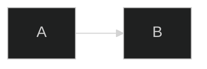
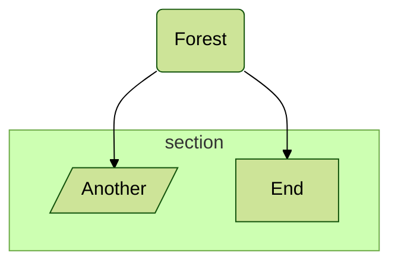
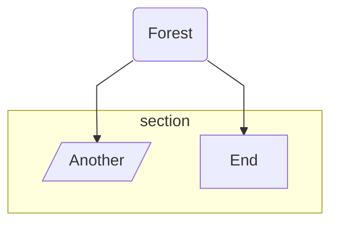
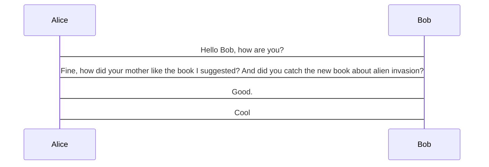
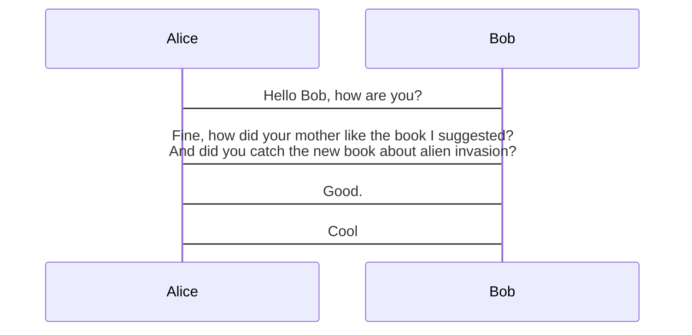

# Directives

```warning
Directives are deprecated from v10.5.0. Please use the `config` key in frontmatter to pass configuration. See [Configuration](./configuration.md) for more details.
```

## Directives

Directives give a diagram author the capability to alter the appearance of a diagram before rendering by changing the applied configuration.

The significance of having directives is that you have them available while writing the diagram, and can modify the default global and diagram-specific configurations. So, directives are applied on top of the default configuration. The beauty of directives is that you can use them to alter configuration settings for a specific diagram, i.e. at an individual level.

While directives allow you to change most of the default configuration settings, there are some that are not available, for security reasons. Also, you have the _option to define the set of configurations_ that you wish to allow diagram authors to override with directives.

## Types of Directives options

Mermaid basically supports two types of configuration options to be overridden by directives.

1. _General/Top Level configurations_ : These are the configurations that are available and applied to all the diagram. **Some of the most important top-level** configurations are:

   - theme
   - fontFamily
   - logLevel
   - securityLevel
   - startOnLoad
   - secure

2. _Diagram-specific configurations_ : These are the configurations that are available and applied to a specific diagram. For each diagram there are specific configuration that will alter how that particular diagram looks and behaves.
   For example, `mirrorActors` is a configuration that is specific to the `SequenceDiagram` and alters whether the actors are mirrored or not. So this config is available only for the `SequenceDiagram` type.

**NOTE:** Not all configuration options are listed here. To get hold of all the configuration options, please refer to the [defaultConfig.ts](https://github.com/mermaid-js/mermaid/blob/develop/packages/mermaid/src/defaultConfig.ts) in the source code.

```note
We plan to publish a complete list of top-level configurations & diagram-specific configurations with their possible values in the docs soon.
```

## Declaring directives

Now that we have defined the types of configurations that are available, we can learn how to declare directives.
A directive always starts and ends with `%%` signs with directive text in between, like `%% {directive_text} %%`.

Here the structure of a directive text is like a nested key-value pair map or a JSON object with root being _init_. Where all the general configurations are defined in the top level, and all the diagram specific configurations are defined one level deeper with diagram type as key/root for that section.

The following code snippet shows the structure of a directive:

```
%%{
  init: {
    "theme": "dark",
    "fontFamily": "monospace",
    "logLevel": "info",
    "flowchart": {
      "htmlLabels": true,
      "curve": "linear"
    },
    "sequence": {
      "mirrorActors": true
    }
  }
}%%
```

You can also define the directives in a single line, like this:

```
%%{init: { **insert configuration options here** } }%%
```

For example, the following code snippet:

```
%%{init: { "sequence": { "mirrorActors":false }}}%%
```

**Notes:**
The JSON object that is passed as {**argument**} must be valid key value pairs and encased in quotation marks or it will be ignored.
Valid Key Value pairs can be found in config.

Example with a simple graph:



Here the directive declaration will set the `logLevel` to `debug` and the `theme` to `dark` for a rendered mermaid diagram, changing the appearance of the diagram itself.

Note: You can use 'init' or 'initialize' as both are acceptable as init directives. Also note that `%%init%%` and `%%initialize%%` directives will be grouped together after they are parsed.

```mermaid
%%{init: { 'logLevel': 'debug', 'theme': 'forest' } }%%
%%{initialize: { 'logLevel': 'fatal', "theme":'dark', 'startOnLoad': true } }%%
...
```

For example, parsing the above generates a single `%%init%%` JSON object below, combining the two directives and carrying over the last value given for `loglevel`:

```json
{
  "logLevel": "fatal",
  "theme": "dark",
  "startOnLoad": true
}
```

This will then be sent to `mermaid.initialize(...)` for rendering.

## Directive Examples

Now that the concept of directives has been explained, let us see some more examples of directive usage:

### Changing theme via directive

The following code snippet changes `theme` to `forest`:

`%%{init: { "theme": "forest" } }%%`

Possible theme values are: `default`, `base`, `dark`, `forest` and `neutral`.
Default Value is `default`.

Example:



### Changing fontFamily via directive

The following code snippet changes fontFamily to Trebuchet MS, Verdana, Arial, Sans-Serif:

`%%{init: { "fontFamily": "Trebuchet MS, Verdana, Arial, Sans-Serif" } }%%`

Example:


### Changing logLevel via directive

The following code snippet changes `logLevel` to `2`:

`%%{init: { "logLevel": 2 } }%%`

Possible `logLevel` values are:

- `1` for _debug_,
- `2` for _info_
- `3` for _warn_
- `4` for _error_
- `5` for _only fatal errors_

Default Value is `5`.

Example:


### Changing flowchart config via directive

Some common flowchart configurations are:

- _htmlLabels_: true/false
- _curve_: linear/curve
- _diagramPadding_: number
- _useMaxWidth_: number

For a complete list of flowchart configurations, see [defaultConfig.ts](https://github.com/mermaid-js/mermaid/blob/develop/packages/mermaid/src/defaultConfig.ts) in the source code.
_Soon we plan to publish a complete list of all diagram-specific configurations updated in the docs._

The following code snippet changes flowchart config:

`%%{init: { "flowchart": { "htmlLabels": true, "curve": "linear" } } }%%`

Here we are overriding only the flowchart config, and not the general config, setting `htmlLabels` to `true` and `curve` to `linear`.



### Changing Sequence diagram config via directive

Some common sequence diagram configurations are:

- _width_: number
- _height_: number
- _messageAlign_: left, center, right
- _mirrorActors_: boolean
- _useMaxWidth_: boolean
- _rightAngles_: boolean
- _showSequenceNumbers_: boolean
- _wrap_: boolean

For a complete list of sequence diagram configurations, see [defaultConfig.ts](https://github.com/mermaid-js/mermaid/blob/develop/packages/mermaid/src/defaultConfig.ts) in the source code.
_Soon we plan to publish a complete list of all diagram-specific configurations updated in the docs._

So, `wrap` by default has a value of `false` for sequence diagrams.

Let us see an example:



Now let us enable wrap for sequence diagrams.

The following code snippet changes sequence diagram config for `wrap` to `true`:

`%%{init: { "sequence": { "wrap": true} } }%%`

By applying that snippet to the diagram above, `wrap` will be enabled:


