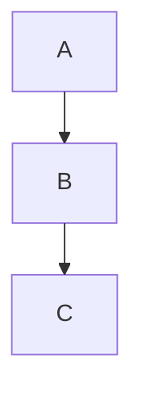
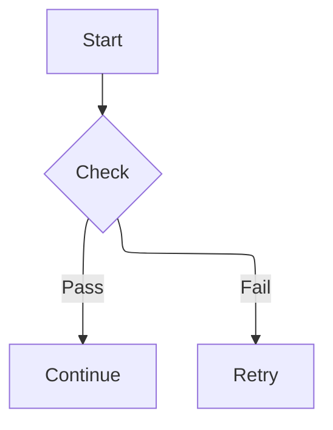
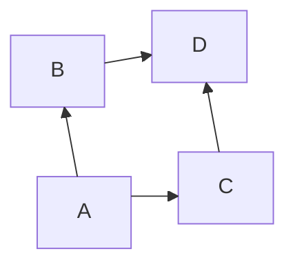
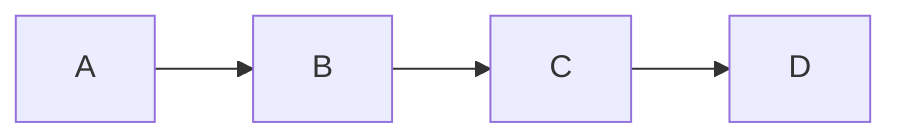

# Layouts

Layout algorithms control how nodes and edges are visually arranged in Mermaid diagrams. Different layouts produce different organizational patterns, from layered hierarchies to force-directed graphs.

## Available Layouts

| Layout | Description |
|--------|-------------|
| **dagre** | Layered (top-to-bottom) layout for directed graphs. Default for most diagram types. |
| **elk** | Advanced layout algorithms from the [Eclipse Layout Kernel](https://www.eclipse.org/elk/). Supports layered, force, tree, and stress layouts. |
| **tidy-tree** | Compact tree layout for hierarchical diagrams. See [Tidy Tree Configuration](/config/tidy-tree). |
| **cose-bilkent** | Force-directed layout based on the CoSE (Compound Spring Embedder) algorithm from Bilkent University. |

## How to Use

Specify the layout in your diagram's frontmatter config:



You can also set the layout when initializing Mermaid:

```javascript
mermaid.initialize({
  layout: 'elk',
});
```

---

## ELK (Eclipse Layout Kernel)

[ELK](https://www.eclipse.org/elk/) provides sophisticated, automatic graph layout algorithms. It is especially beneficial for large or complex diagrams where the default dagre layout produces overlapping or suboptimal arrangements.

### Installing ELK

ELK is distributed as a separate package `@mermaid-js/layout-elk` and is **not** included in the default mermaid bundle.

#### With a Bundler

```bash
npm install @mermaid-js/layout-elk
```

Then register it with Mermaid:

```javascript
import mermaid from 'mermaid';
import elkLayouts from '@mermaid-js/layout-elk';

mermaid.registerLayoutLoaders(elkLayouts);
```

#### With a CDN

```html
<script type="module">
  import mermaid from 'https://cdn.jsdelivr.net/npm/mermaid@11/dist/mermaid.esm.min.mjs';
  import elkLayouts from 'https://cdn.jsdelivr.net/npm/@mermaid-js/layout-elk@0/dist/mermaid-layout-elk.esm.min.mjs';

  mermaid.registerLayoutLoaders(elkLayouts);
</script>
```

### Usage

Once registered, ELK can be used in two ways:

**1. Via the `layout` config key** (works with `graph`/`flowchart` and `stateDiagram`):



**2. Using the `flowchart-elk` diagram type** (flowcharts only):


### Supported Sub-Layouts

ELK provides several layout algorithms accessible via the `layout` config:

| Config Value | Algorithm | Best For |
|---|---|---|
| `elk` or `elk.layered` | Layered (default) | General-purpose hierarchical diagrams |
| `elk.stress` | Stress minimization | Emphasizing path lengths between nodes |
| `elk.force` | Force-directed | Organic-looking graphs with no clear hierarchy |
| `elk.mrtree` | Multi-root tree | Tree structures with multiple roots |
| `elk.sporeOverlap` | Spore overlap | Reducing node overlap in dense diagrams |

Example:



### Customizing ELK Layout

ELK behavior can be fine-tuned via the `elk` config key:

```yaml
---
config:
  layout: elk
  elk:
    mergeEdges: true
    nodePlacementStrategy: LINEAR_SEGMENTS
    nodePlacementAlignment: BALANCED
---
```

#### Options

| Option | Type | Default | Description |
|---|---|---|---|
| `mergeEdges` | boolean | `false` | Combine parallel edges into a single edge. Useful for reducing visual clutter. |
| `nodePlacementStrategy` | string | `BRANDES_KOEPF` | Algorithm for placing nodes. One of: `SIMPLE`, `NETWORK_SIMPLEX`, `LINEAR_SEGMENTS`, `BRANDES_KOEPF`. |
| `nodePlacementAlignment` | string | `NONE` | Alignment strategy for Brandes-Koepf placement. One of: `NONE`, `LEFTUP`, `LEFTDOWN`, `RIGHTUP`, `RIGHTDOWN`, `BALANCED`. |

---

## Dagre

[Dagre](https://github.com/dagrejs/dagre) is the default layout engine in Mermaid. It produces clean layered (top-to-bottom) diagrams and works without any additional installation.



---

## Tidy Tree

The tidy tree layout arranges nodes in a compact hierarchical tree structure. It is ideal for tree-like diagrams such as organization charts or syntax trees.

See the dedicated [Tidy Tree Configuration](/config/tidy-tree) page for details.

---

## CoSE Bilkent

[CoSE Bilkent](https://github.com/bilkent-CG) applies a force-directed layout algorithm. Nodes repel each other while connected edges act as springs, producing organic-looking layouts suitable for network-like diagrams.

```mermaid-example
---
config:
  layout: cose-bilkent
---
graph TD
  A --> B
  A --> C
  B --> D
  C --> D
  D --> E
```
