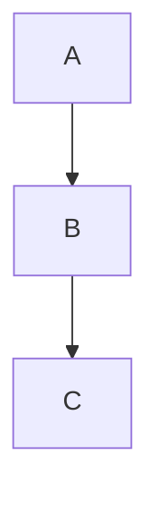

# Layouts

This page lists the available layout algorithms supported in Mermaid diagrams.

## ELK is bundled and default from v12.0.0

Before v12.0.0, ELK shipped as a separate `@mermaid-js/layout-elk` package that
each site had to install and register. It is now part of `mermaid` itself and
registered automatically, so `layout: elk` works with no setup — and it is the
**default**, replacing Dagre.

`elk` is the new default layout for these diagrams:

- Flowchart
- State
- Class
- Entity relationship
- Requirement
- Use case
- Agentflow

To go back to the previous layout, use `layout: dagre`.

The main `mermaid` package always includes ELK. If you want Mermaid without it,
use the [tiny build](./usage.md#elk-and-the-tiny-build), which omits ELK along
with some diagram types. `@mermaid-js/layout-elk` is still published so the tiny
build can opt back in.

## Supported Layouts

- **elk** (default): [ELK (Eclipse Layout Kernel)](https://www.eclipse.org/elk/). Bundled with Mermaid; no setup required. Specific ELK algorithms can be selected as `elk.stress`, `elk.force`, `elk.mrtree`, `elk.sporeOverlap`, `elk.box`, and `elk.rectpacking`.
- **dagre**: Dagre layout for layered graphs
- **cose-bilkent**: Cose Bilkent layout for force-directed graphs
- **tidy-tree**: Tidy tree layout for hierarchical diagrams, from the [`@mermaid-js/layout-tidy-tree`](https://www.npmjs.com/package/@mermaid-js/layout-tidy-tree) package [Tidy Tree Configuration](/config/tidy-tree)

Mindmaps are the one diagram type not laid out with ELK by default; they use
cose-bilkent unless you ask for something else.

The **tiny** build omits ELK to stay small, and falls back to Dagre for
diagrams that request it. See
[ELK and the tiny build](./usage.md#elk-and-the-tiny-build) for how to register
`@mermaid-js/layout-elk` there if you want ELK anyway.

## How to Use

Since `elk` is the default, a diagram needs no configuration to use it. To pick
a different layout, set it in your diagram's YAML config or initialization
options. For example:

