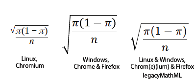

# Math Configuration (v10.9.0+)

Mermaid supports rendering mathematical expressions through the [KaTeX](https://katex.org/) typesetter.

## Usage

To render math within a diagram, surround the mathematical expression with the `$$` delimiter.

Note that at the moment, the only supported diagrams are below:

### Flowcharts

```mermaid-example
 graph LR
      A["$$x^2$$"] -->|"$$\sqrt{x+3}$$"| B("$$\frac{1}{2}$$")
      A -->|"$$\overbrace{a+b+c}^{\text{note}}$$"| C("$$\pi r^2$$")
      B --> D("$$x = \begin{cases} a &\text{if } b \\ c &\text{if } d \end{cases}$$")
      C --> E("$$x(t)=c_1\begin{bmatrix}-\cos{t}+\sin{t}\\ 2\cos{t} \end{bmatrix}e^{2t}$$")
```

### Sequence

```mermaid-example
sequenceDiagram
    autonumber
    participant 1 as $$\alpha$$
    participant 2 as $$\beta$$
    1->>2: Solve: $$\sqrt{2+2}$$
    2-->>1: Answer: $$2$$
    Note right of 2: $$\sqrt{2+2}=\sqrt{4}=2$$
```

## Legacy Support

By default, MathML is used for rendering mathematical expressions. If you have users on [unsupported browsers](https://caniuse.com/?search=mathml), `legacyMathML` can be set in the config to fall back to CSS rendering. Note that **you must provide KaTeX's stylesheets on your own** as they do not come bundled with Mermaid.

Example with legacy mode enabled (the latest version of KaTeX's stylesheet can be found on their [docs](https://katex.org/docs/browser.html)):

```html
<!doctype html>
<!-- KaTeX requires the use of the HTML5 doctype. Without it, KaTeX may not render properly -->
<html lang="en">
  <head>
    <!-- Please ensure the stylesheet's version matches with the KaTeX version in your package-lock -->
    <link
      rel="stylesheet"
      href="https://cdn.jsdelivr.net/npm/katex@{version_number}/dist/katex.min.css"
      integrity="sha384-{hash}"
      crossorigin="anonymous"
    />
  </head>

  <body>
    <script type="module">
      import mermaid from './mermaid.esm.mjs';
      mermaid.initialize({
        legacyMathML: true,
      });
    </script>
  </body>
</html>
```

## Handling Rendering Differences

Due to differences between default fonts across operating systems and browser's MathML implementations, inconsistent results can be seen across platforms. If having consistent results are important, or the most optimal rendered results are desired, `forceLegacyMathML` can be enabled in the config.

This option will always use KaTeX's stylesheet instead of only when MathML is not supported (as with `legacyMathML`). Note that only `forceLegacyMathML` needs to be set.

If including KaTeX's stylesheet is not a concern, enabling this option is recommended to avoid scenarios where no MathML implementation within a browser provides the desired output (as seen below).


