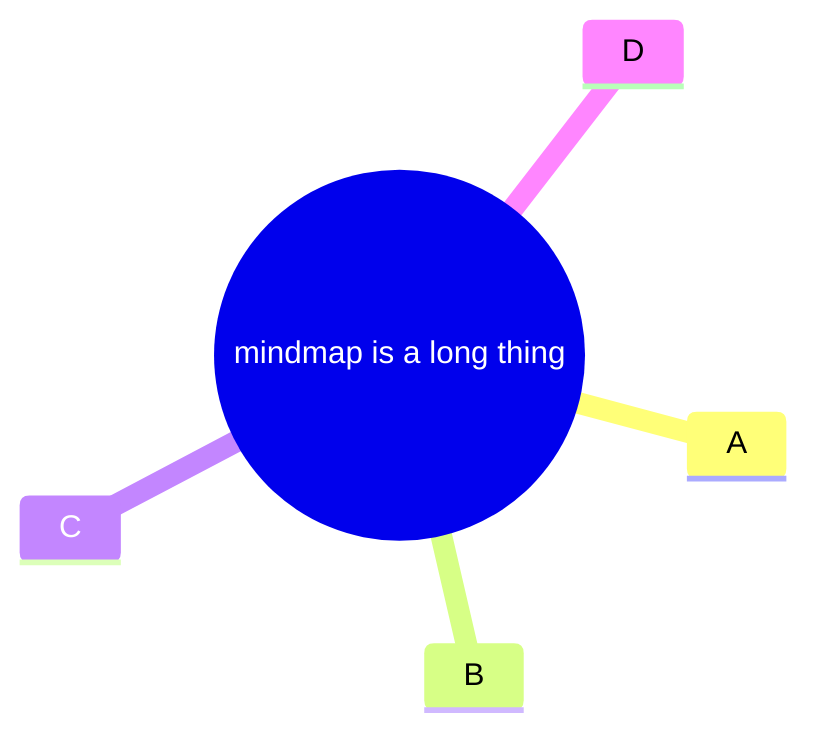
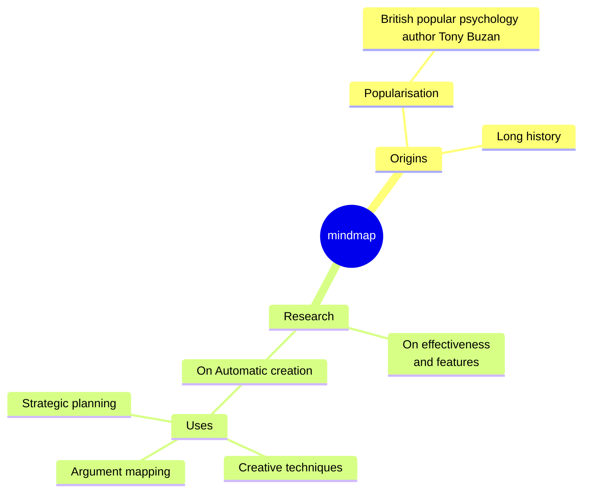

# Tidy-tree Layout

The **tidy-tree** layout arranges nodes in a hierarchical, tree-like structure. It is especially useful for diagrams where parent-child relationships are important, such as mindmaps.

## Features

- Organizes nodes in a tidy, non-overlapping tree
- Ideal for mindmaps and hierarchical data
- Automatically adjusts spacing for readability

## Example Usage

## Note

- Currently, tidy-tree is primarily supported for mindmap diagrams.
