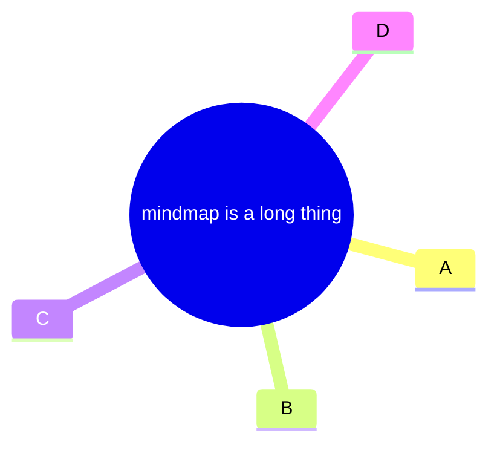
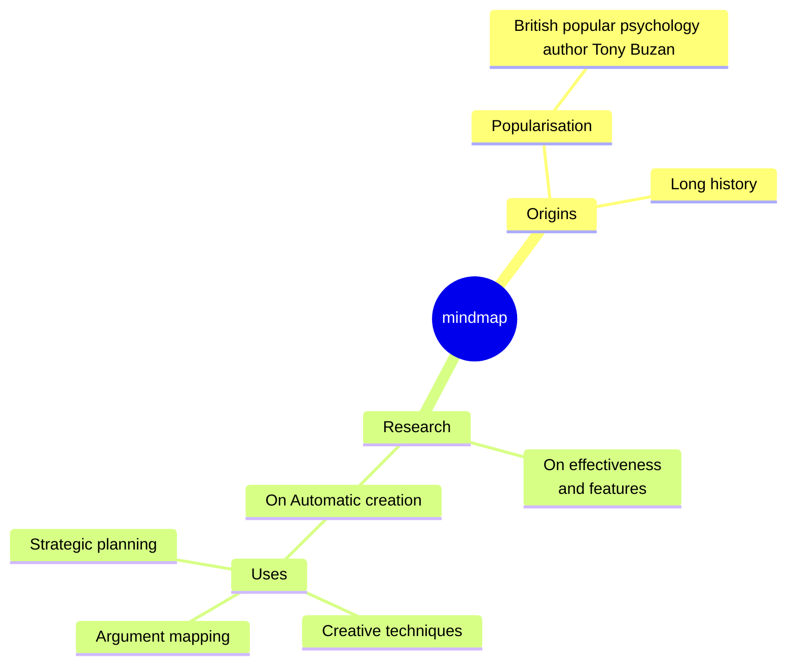

# Tidy-tree Layout

The **tidy-tree** layout provides a bidirectional tidy tree layout engine for Mermaid based on the non-layered-tidy-tree-layout algorithm.

> **Note:** The Tidy Tree Layout engine will not be available in all providers that support mermaid by default. Websites will need to install the `@mermaid-js/layout-tidy-tree` package to use the Tidy Tree layout engine.

## Installation and Setup

The tidy-tree layout must be installed and registered before use.

### With bundlers

```sh
npm install @mermaid-js/layout-tidy-tree
```

```ts
import mermaid from 'mermaid';
import tidyTreeLayouts from '@mermaid-js/layout-tidy-tree';

mermaid.registerLayoutLoaders(tidyTreeLayouts);
```

### With CDN

```html
<script type="module">
  import mermaid from 'https://cdn.jsdelivr.net/npm/mermaid@11/dist/mermaid.esm.min.mjs';
  import tidyTreeLayouts from 'https://cdn.jsdelivr.net/npm/@mermaid-js/layout-tidy-tree@0/dist/mermaid-layout-tidy-tree.esm.min.mjs';

  mermaid.registerLayoutLoaders(tidyTreeLayouts);
</script>
```

### Registering Multiple Layouts

You can register multiple layout engines by calling `registerLayoutLoaders` multiple times:

```ts
import mermaid from 'mermaid';
import tidyTreeLayouts from '@mermaid-js/layout-tidy-tree';
import elkLayouts from '@mermaid-js/layout-elk';

mermaid.registerLayoutLoaders(tidyTreeLayouts);
mermaid.registerLayoutLoaders(elkLayouts);
```

Or with CDN:

```html
<script type="module">
  import mermaid from 'https://cdn.jsdelivr.net/npm/mermaid@11/dist/mermaid.esm.min.mjs';
  import tidyTreeLayouts from 'https://cdn.jsdelivr.net/npm/@mermaid-js/layout-tidy-tree@0/dist/mermaid-layout-tidy-tree.esm.min.mjs';
  import elkLayouts from 'https://cdn.jsdelivr.net/npm/@mermaid-js/layout-elk@0/dist/mermaid-layout-elk.esm.min.mjs';

  mermaid.registerLayoutLoaders(tidyTreeLayouts);
  mermaid.registerLayoutLoaders(elkLayouts);
</script>
```

## Usage

After registering the layout, add a configuration block at the top of your diagram:

```
---
config:
  layout: tidy-tree
---
mindmap
root((mindmap))
  A
  B
```

## Example Usage





## Note

- Currently, tidy-tree is primarily supported for mindmap diagrams.
