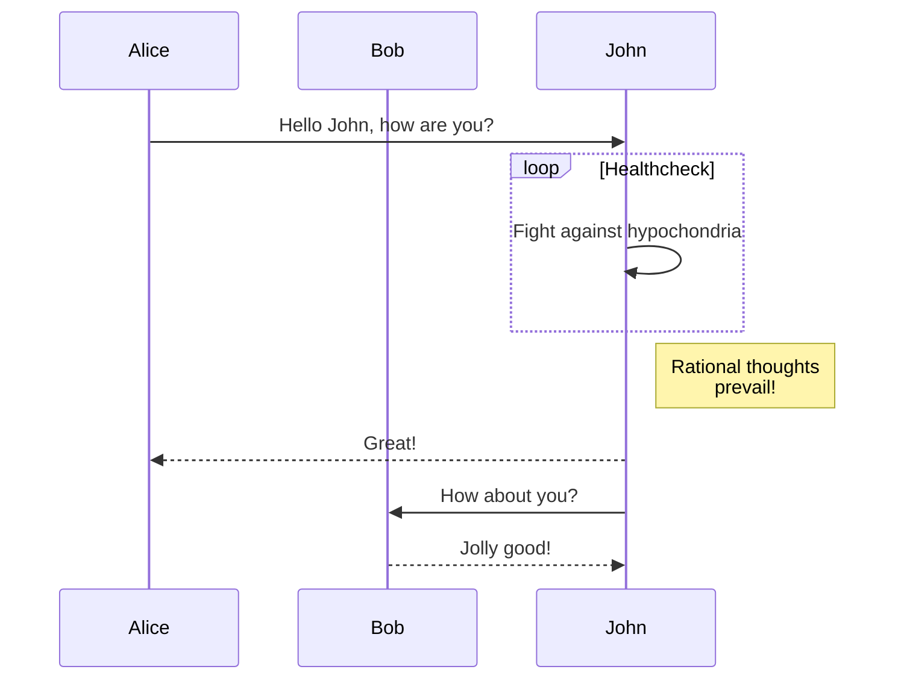
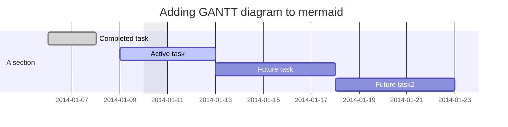
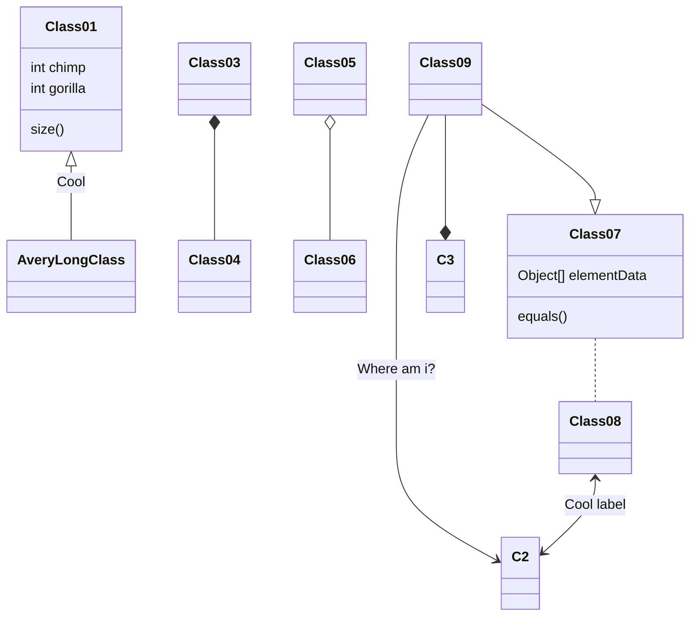
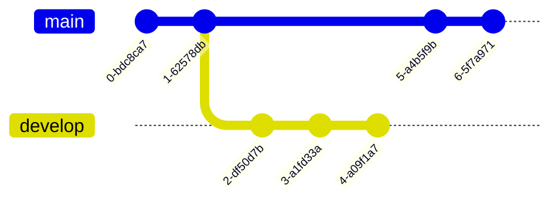
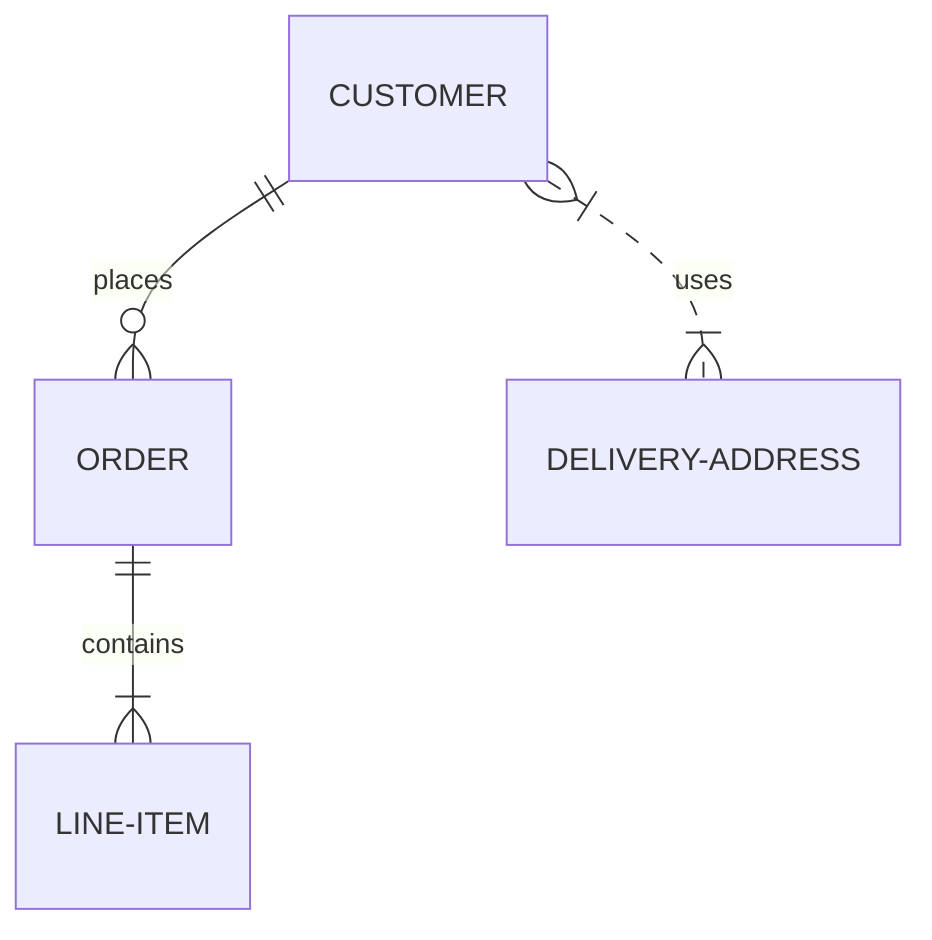
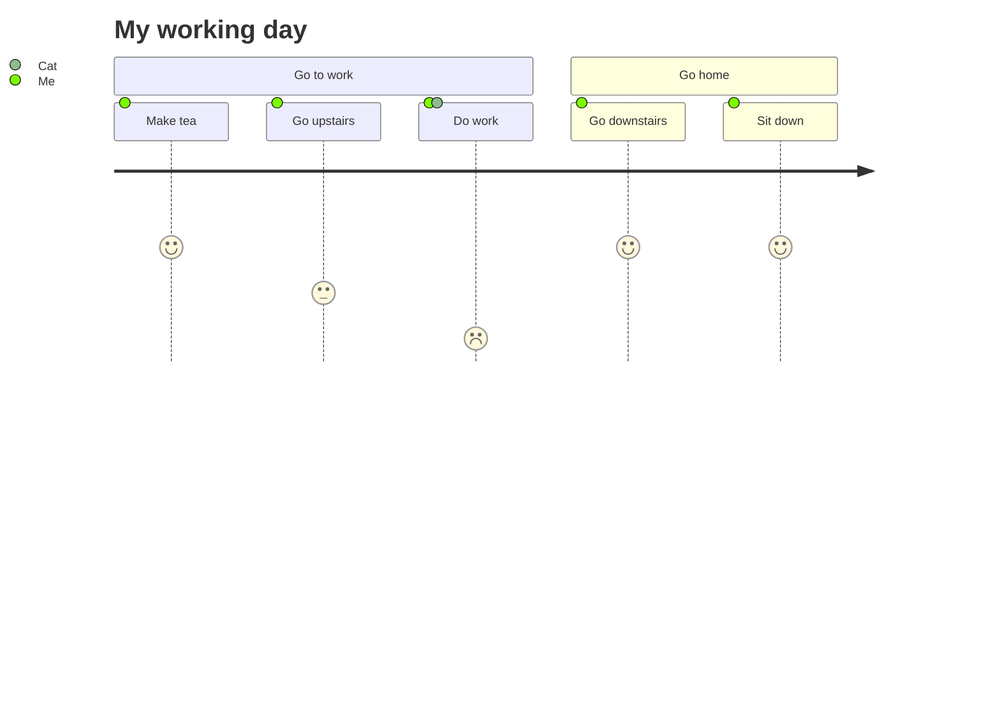

## Diagram Types

### [Flowchart](../syntax/flowchart.md?id=flowcharts-basic-syntax)

### [Sequence diagram](../syntax/sequenceDiagram.md)

### [Gantt diagram](../syntax/gantt.md)

### [Class diagram](../syntax/classDiagram.md)

### [Git graph](../syntax/gitgraph.md)

### [Entity Relationship Diagram - :exclamation: experimental](../syntax/entityRelationshipDiagram.md)

### [User Journey Diagram](../syntax/userJourney.md)

