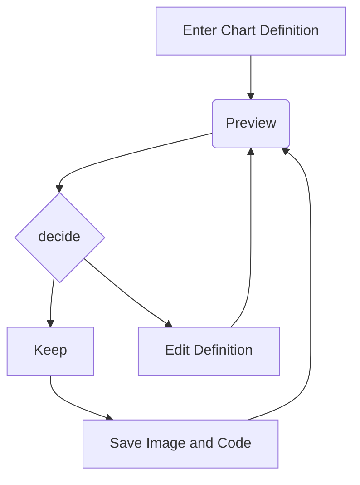

# A Mermaid User-Guide for Beginners

Mermaid is composed of three parts: Deployment, Syntax and Configuration.

This section talks about the different ways to deploy Mermaid. Learning the [Syntax](syntax-reference.md) would be of great help to the beginner.

> Generally the live editor is enough for most general uses of mermaid, and is a good place to start learning.

**Absolute beginners are advised to view the Video [Tutorials](../config/Tutorials.md) on the Live Editor, to gain a better understanding of mermaid.**

## Four ways of using mermaid:

1. Using the Mermaid Live Editor at [mermaid.live](https://mermaid.live).
2. Using [mermaid plugins](../ecosystem/integrations-community.md) with programs you are familiar with.
3. Calling the Mermaid JavaScript API.
4. Deploying Mermaid as a dependency.

**Note: It is our recommendation that you review all approaches, and choose the one that is best for your project.**

> More in depth information can be found at [Usage](../config/usage.md).

## 1. Using the Live Editor

Available at [mermaid.live](https://mermaid.live)



In the `Code` section one can write or edit raw mermaid code, and instantly `Preview` the rendered result on the panel beside it.

The `Configuration` Section is for changing the appearance and behavior of mermaid diagrams. An easy introduction to mermaid configuration is found in the [Advanced usage](../config/advanced.md) section. A complete configuration reference cataloging the default values can be found on the [mermaidAPI](../config/setup/README.md) page.


### Editing History

Your code will be autosaved every minute into the Timeline tab of History which shows the most recent 30 items.

You can manually save code by clicking the Save icon in the History section. It can also be accessed in the Saved tab. This is stored in the browser storage only.

### Saving a Diagram:

You may choose any of the methods below, to save it

**We recommend that you save your diagram code on top of any method you choose, in order to make edits and modifications further down the line.**


### Editing your diagrams

Editing is as easy as pasting your **Diagram code**, into the `code` section of the `Live Editor`.

### Loading from Gists

The Gist you create should have a code.mmd file and optionally a config.json. [Example](https://gist.github.com/sidharthv96/6268a23e673a533dcb198f241fd7012a)

To load a gist into the Editor, you can use https://mermaid.live/edit?gist=https://gist.github.com/sidharthv96/6268a23e673a533dcb198f241fd7012a

and to View, https://mermaid.live/view?gist=https://gist.github.com/sidharthv96/6268a23e673a533dcb198f241fd7012a

## 2. Using Mermaid Plugins:

You can generate mermaid diagrams from within popular applications using plug-ins. It can be done in the same way, you would use the Live Editor. Here's a list of [Mermaid Plugins](../ecosystem/integrations-community.md).

**This is covered in greater detail in the [Usage section](../config/usage.md)**

## 3. Calling the JavaScript API

This method can be used with any common web server like Apache, IIS, nginx, node express.

You will also need a text editing tool like Notepad++ to generate a .html file. It is then deployed by a web browser (such as Firefox, Chrome, Safari, but not Internet Explorer).

The API works by pulling rendering instructions from the source `mermaid.js` in order to render diagrams on the page.

### Requirements for the Mermaid API.

When writing the .html file, we give two instructions inside the html code to the web browser:

a. The mermaid code for the diagram we want to create.

b. The importing of mermaid library through the `mermaid.esm.mjs` or `mermaid.esm.min.mjs` and the `mermaid.initialize()` call, which dictates the appearance of diagrams and also starts the rendering process.

**a. The embedded mermaid diagram definition inside a `<pre class="mermaid">`:**

```html
<body>
  Here is a mermaid diagram:
  <pre class="mermaid">
        graph TD 
        A[Client] --> B[Load Balancer] 
        B --> C[Server01] 
        B --> D[Server02]
  </pre>
</body>
```

**Notes**: Every Mermaid chart/graph/diagram definition, should have separate `<pre>` tags.

**b. The import of mermaid and the `mermaid.initialize()` call.**

`mermaid.initialize()` call takes all the definitions contained in all the `<pre class="mermaid">` tags that it finds in the html body and renders them into diagrams. Example:

```html
<body>
  <script type="module">
    import mermaid from '<CDN_URL>/mermaid@<MERMAID_VERSION>/dist/mermaid.esm.min.mjs';
    mermaid.initialize({ startOnLoad: true });
  </script>
</body>
```

**Notes**:
Rendering in Mermaid is initialized by `mermaid.initialize()` call. However, doing the opposite lets you control when it starts looking for `<pre>` tags inside the web page with `mermaid.initialize()`. This is useful when you think that not all `<pre>` tags may have loaded on the execution of `mermaid.esm.min.mjs` file.

`startOnLoad` is one of the parameters that can be defined by `mermaid.initialize()`

| Parameter   | Description                       | Type    | Values      |
| ----------- | --------------------------------- | ------- | ----------- |
| startOnLoad | Toggle for Rendering upon loading | Boolean | true, false |

### Working Examples

**Here is a full working example of the mermaidAPI being called through the CDN:**

```html
<html>
  <body>
    Here is one mermaid diagram:
    <pre class="mermaid">
            graph TD 
            A[Client] --> B[Load Balancer] 
            B --> C[Server1] 
            B --> D[Server2]
    </pre>

    And here is another:
    <pre class="mermaid">
            graph TD 
            A[Client] -->|tcp_123| B
            B(Load Balancer) 
            B -->|tcp_456| C[Server1] 
            B -->|tcp_456| D[Server2]
    </pre>

    <script type="module">
      import mermaid from '<CDN_URL>/mermaid@<MERMAID_VERSION>/dist/mermaid.esm.min.mjs';
      mermaid.initialize({ startOnLoad: true });
    </script>
  </body>
</html>
```

**Another Option:**
In this example mermaid.js is referenced in `src` as a separate JavaScript file, in an example Path.

```html
<html lang="en">
  <head>
    <meta charset="utf-8" />
  </head>
  <body>
    <pre class="mermaid">
            graph LR 
            A --- B 
            B-->C[fa:fa-ban forbidden] 
            B-->D(fa:fa-spinner);
    </pre>
    <pre class="mermaid">
            graph TD 
            A[Client] --> B[Load Balancer] 
            B --> C[Server1] 
            B --> D[Server2]
    </pre>
    <script type="module">
      import mermaid from 'The/Path/In/Your/Package/mermaid.esm.mjs';
      mermaid.initialize({ startOnLoad: true });
    </script>
  </body>
</html>
```

---

## 4. Adding Mermaid as a dependency.

1. install node v16, which would have npm

2. download yarn using npm by entering the command below:
   npm install -g yarn

3. After yarn installs, enter the following command:
   yarn add mermaid

4. To add Mermaid as a Dev Dependency
   yarn add --dev mermaid

**Comments from Knut Sveidqvist, creator of mermaid:**

- In early versions of mermaid, the `<script>` tag was invoked in the `<head>` part of the web page. Nowadays we can place it in the `<body>` as seen above. Older parts of the documentation frequently reflect the previous way which still works.
