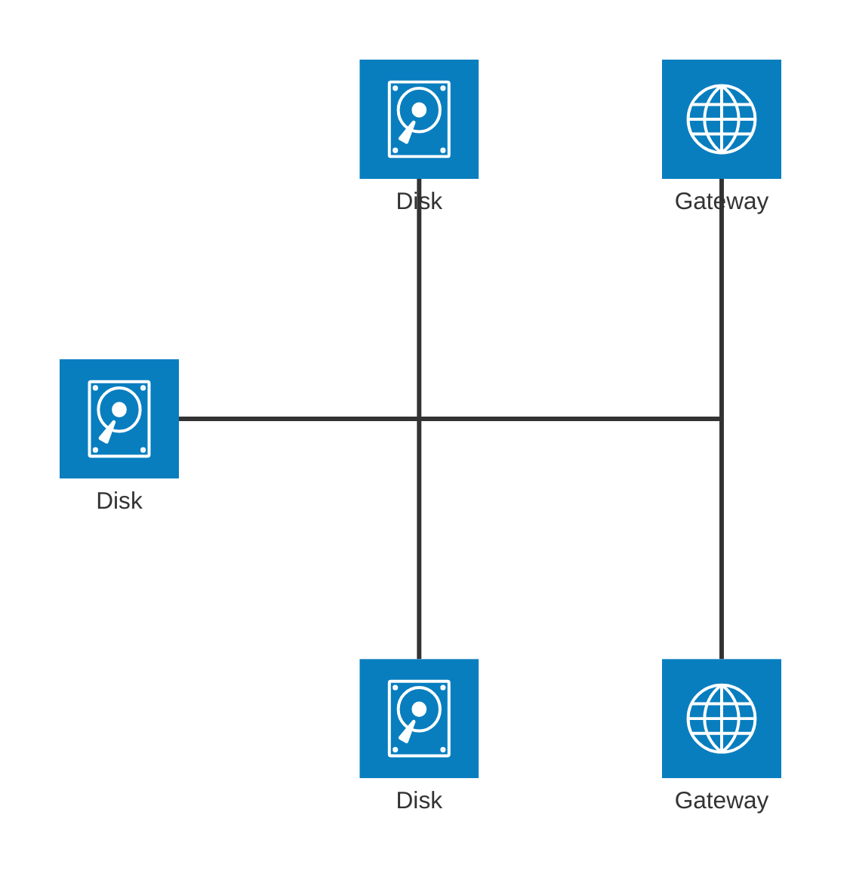

# Architecture Diagrams Documentation (v11.1.0+)

> In the context of mermaid-js, the architecture diagram is used to show the relationship between services and resources commonly found within the Cloud or CI/CD deployments. In an architecture diagram, services (nodes) are connected by edges. Related services can be placed within groups to better illustrate how they are organized.

## Example


## Syntax

The building blocks of an architecture are `groups`, `services`, `edges`, and `junctions`.

For supporting components, icons are declared by surrounding the icon name with `()`, while labels are declared by surrounding the text with `[]`.

To begin an architecture diagram, use the keyword `architecture-beta`, followed by your groups, services, edges, and junctions. While each of the 3 building blocks can be declared in any order, care must be taken to ensure the identifier was previously declared by another component.

### Groups

The syntax for declaring a group is:

```
group {group id}({icon name})[{title}] (in {parent id})?
```

Put together:

```
group public_api(cloud)[Public API]
```

creates a group identified as `public_api`, uses the icon `cloud`, and has the label `Public API`.

Additionally, groups can be placed within a group using the optional `in` keyword

```
group private_api(cloud)[Private API] in public_api
```

### Services

The syntax for declaring a service is:

```
service {service id}({icon name})[{title}] (in {parent id})?
```

Put together:

```
service database1(database)[My Database]
```

creates the service identified as `database1`, using the icon `database`, with the label `My Database`.

If the service belongs to a group, it can be placed inside it through the optional `in` keyword

```
service database1(database)[My Database] in private_api
```

### Edges

The syntax for declaring an edge is:

```
{serviceId}{{group}}?:{T|B|L|R} {<}?--{>}? {T|B|L|R}:{serviceId}{{group}}?
```

#### Edge Direction

The side of the service the edge comes out of is specified by adding a colon (`:`) to the side of the service connecting to the arrow and adding `L|R|T|B`

For example:

```
db:R -- L:server
```

creates an edge between the services `db` and `server`, with the edge coming out of the right of `db` and the left of `server`.

```
db:T -- L:server
```

creates a 90 degree edge between the services `db` and `server`, with the edge coming out of the top of `db` and the left of `server`.

#### Arrows

Arrows can be added to each side of an edge by adding `<` before the direction on the left, and/or `>` after the direction on the right.

For example:

```
subnet:R --> L:gateway
```

creates an edge with the arrow going into the `gateway` service

#### Edges out of Groups

To have an edge go from a group to another group or service within another group, the `{group}` modifier can be added after the `serviceId`.

For example:

```
service server[Server] in groupOne
service subnet[Subnet] in groupTwo

server{group}:B --> T:subnet{group}
```

creates an edge going out of `groupOne`, adjacent to `server`, and into `groupTwo`, adjacent to `subnet`.

It's important to note that `groupId`s cannot be used for specifying edges and the `{group}` modifier can only be used for services within a group.

### Junctions

Junctions are a special type of node which acts as a potential 4-way split between edges.

The syntax for declaring a junction is:

```
junction {junction id} (in {parent id})?
```



## Icons

By default, architecture diagram supports the following icons: `cloud`, `database`, `disk`, `internet`, `server`.
Users can use any of the 200,000+ icons available in iconify.design, or add their own custom icons, by following the steps [here](../config/icons.md).

After the icons are installed, they can be used in the architecture diagram by using the format "name:icon-name", where name is the value used when registering the icon pack.

```mermaid-example
architecture-beta
    group api(logos:aws-lambda)[API]

    service db(logos:aws-aurora)[Database] in api
    service disk1(logos:aws-glacier)[Storage] in api
    service disk2(logos:aws-s3)[Storage] in api
    service server(logos:aws-ec2)[Server] in api

    db:L -- R:server
    disk1:T -- B:server
    disk2:T -- B:db
```


