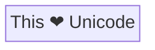
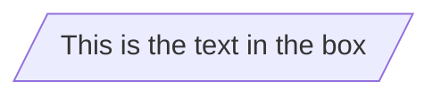
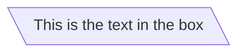
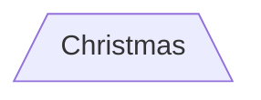
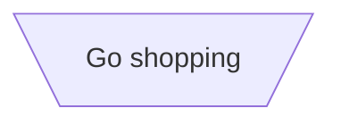
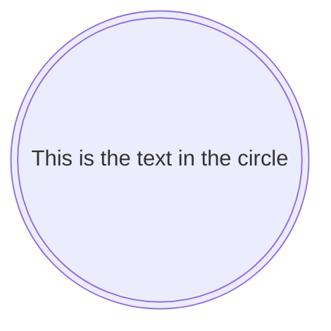
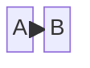
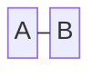

# Block Diagrams - Basic Syntax

Block diagrams are a fundamental tool in technical and engineering documentation, offering a straightforward way to represent complex systems and processes.

A block diagram, at its core, is a graphical representation of a system that uses blocks to depict different components or functions and arrows to show the relationship or flow between them. This form of diagram is invaluable in simplifying the understanding of large-scale systems, breaking them down into individual, easily digestible components.

With block diagrams you can create clear, concise, and visually appealing representations of systems. This is particularly beneficial for technical teams and stakeholders who need to document, analyze, or communicate complex processes without getting entangled in the intricacies of detailed schematics. Whether it's for software architecture, network systems, or process management, Mermaid's block diagrams offer an accessible and efficient way to visualize and convey crucial information.

```warning
If you are using the word "end" in a Flowchart block, capitalize the entire word or any of the letters (e.g., "End" or "END"), or apply this [workaround](https://github.com/mermaid-js/mermaid/issues/1444#issuecomment-639528897). Typing "end" in all lowercase letters will break the Flowchart.
```

### A block (default)

```mermaid-example
---
title: Block
---
block-beta
    id
```



```note
The id is what is displayed in the box.
```

### A block with text

It is also possible to set text in the box that differs from the id. If this is done several times, it is the last text
found for the block that will be used. Also if you define edges for the block later on, you can omit text definitions. The
one previously defined will be used when rendering the box.

```mermaid-example
---
title: Node with text
---
block-beta
    id1[This is the text in the box]
```

#### Unicode text

Use `"` to enclose the unicode text.



#### Markdown formatting

Use double quotes and backticks "\` text \`" to enclose the markdown text.

```mermaid-example
%%{init: {"flowchart": {"htmlLabels": false}} }%%
block-beta
    markdown["`This **is** _Markdown_`"]
    newLines["`Line1
    Line 2
    Line 3`"]
    markdown --> newLines
```

## Block shapes

### A block with round edges

```mermaid-example
block-beta
    id1(This is the text in the box)
```

### A stadium-shaped block

```mermaid-example
block-beta
    id1([This is the text in the box])
```

### A block in a subroutine shape

```mermaid-example
block-beta
    id1[[This is the text in the box]]
```

### A block in a cylindrical shape

```mermaid-example
block-beta
    id1[(Database)]
```

### A block in the form of a circle

```mermaid-example
block-beta
    id1((This is the text in the circle))
```

### A block in an asymmetric shape

```mermaid-example
block-beta
    id1>This is the text in the box]
```

### A block (rhombus)

```mermaid-example
block-beta
    id1{This is the text in the box}
```

### A hexagon block

```mermaid-example
block-beta
    id1{{This is the text in the box}}
```

### Parallelogram



### Parallelogram alt



### Trapezoid



### Trapezoid alt



### Double circle



## Links between blocks

Blocks can be connected with links/edges. It is possible to have different types of links or attach a text string to a link.

### A link with arrow head



### An open link



### Text on links

```mermaid-example
block-beta
    A-- This is the text! ---B
```

or

```mermaid-example
block-beta
    A---|This is the text|B
```

### A link with arrow head and text

```mermaid-example
block-beta
    A-->|text|B
```

or

```mermaid-example
block-beta
    A-- text -->B
```

### Dotted link

```mermaid-example
block-beta
   A-.->B;
```

### Dotted link with text

```mermaid-example
block-beta
   A-. text .-> B
```

### Thick link

```mermaid-example
block-beta
   A ==> B
```

### Thick link with text

```mermaid-example
block-beta
   A == text ==> B
```

### Different types of links

There are new types of arrows supported as per below:

```mermaid-example
block-beta
    A --o B
    B --x C
```

### Multi directional arrows

There is the possibility to use multidirectional arrows.

```mermaid-example
block-beta
    A o--o B
    B <--> C
    C x--x D
```

## Special characters that break syntax

It is possible to put text within quotes in order to render more troublesome characters. As in the example below:

```mermaid-example
block-beta
    id1["This is the (text) in the box"]
```

### Entity codes to escape characters

It is possible to escape characters using the syntax exemplified here.

```mermaid-example
    block-beta
        A["A double quote:#quot;"] -->B["A dec char:#9829;"]
```

Numbers given are base 10, so `#` can be encoded as `#35;`. It is also supported to use HTML character names.

## Blocks in blocks

```
block-beta
    block definition
end
```

An example below:

```mermaid-example
block-beta
    block
        A["square"]
        B("rounded")
    end
    C(("circle"))
```

You can also set an explicit id for the subgraph.

```mermaid-example
flowchart TB
    c1-->a2
    subgraph ide1 [one]
    a1-->a2
    end
```

### flowcharts

With the graphtype flowchart it is also possible to set edges to and from subgraphs as in the flowchart below.

```mermaid-example
flowchart TB
    c1-->a2
    subgraph one
    a1-->a2
    end
    subgraph two
    b1-->b2
    end
    subgraph three
    c1-->c2
    end
    one --> two
    three --> two
    two --> c2
```

### Direction in subgraphs

With the graphtype flowcharts you can use the direction statement to set the direction which the subgraph will render like in this example.

```mermaid-example
block-beta
  subgraph TOP
    direction TB
    subgraph B1
        direction RL
        i1 -->f1
    end
    subgraph B2
        direction BT
        i2 -->f2
    end
  end
  A --> TOP --> B
  B1 --> B2
```

## Markdown Strings

The "Markdown Strings" feature enhances flowcharts and mind maps by offering a more versatile string type, which supports text formatting options such as bold and italics, and automatically wraps text within labels.

```mermaid-example
%%{init: {"flowchart": {"htmlLabels": false}} }%%
block-beta
subgraph "One"
  a("`The **cat**
  in the hat`") -- "edge label" --> b{{"`The **dog** in the hog`"}}
end
subgraph "`**Two**`"
  c("`The **cat**
  in the hat`") -- "`Bold **edge label**`" --> d("The dog in the hog")
end
```

Formatting:

- For bold text, use double asterisks (`**`) before and after the text.
- For italics, use single asterisks (`*`) before and after the text.
- With traditional strings, you needed to add `<br>` tags for text to wrap in blocks. However, markdown strings automatically wrap text when it becomes too long and allows you to start a new line by simply using a newline character instead of a `<br>` tag.

This feature is applicable to block labels, edge labels, and subgraph labels.

## Interaction

It is possible to bind a click event to a block, the click can lead to either a javascript callback or to a link which will be opened in a new browser tab.

```note
This functionality is disabled when using `securityLevel='strict'` and enabled when using `securityLevel='loose'`.
```

```
click blockId callback
click blockId call callback()
```

- blockId is the id of the block
- callback is the name of a javascript function defined on the page displaying the graph, the function will be called with the blockId as parameter.

Examples of tooltip usage below:

```html
<script>
  const callback = function () {
    alert('A callback was triggered');
  };
</script>
```

The tooltip text is surrounded in double quotes. The styles of the tooltip are set by the class `.mermaidTooltip`.

```mermaid-example
block-beta
    A-->B
    B-->C
    C-->D
    click A callback "Tooltip for a callback"
    click B "https://www.github.com" "This is a tooltip for a link"
    click A call callback() "Tooltip for a callback"
    click B href "https://www.github.com" "This is a tooltip for a link"
```

> **Success** The tooltip functionality and the ability to link to urls are available from version 0.5.2.

?> Due to limitations with how Docsify handles JavaScript callback functions, an alternate working demo for the above code can be viewed at [this jsfiddle](https://jsfiddle.net/s37cjoau/3/).

Links are opened in the same browser tab/window by default. It is possible to change this by adding a link target to the click definition (`_self`, `_blank`, `_parent` and `_top` are supported):

```mermaid-example
block-beta
    A-->B
    B-->C
    C-->D
    D-->E
    click A "https://www.github.com" _blank
    click B "https://www.github.com" "Open this in a new tab" _blank
    click C href "https://www.github.com" _blank
    click D href "https://www.github.com" "Open this in a new tab" _blank
```

Beginner's tip—a full example using interactive links in a html context:

```html
<body>
  <pre class="mermaid">
    block-beta
        A-->B
        B-->C
        C-->D
        click A callback "Tooltip"
        click B "https://www.github.com" "This is a link"
        click C call callback() "Tooltip"
        click D href "https://www.github.com" "This is a link"
  </pre>

  <script>
    const callback = function () {
      alert('A callback was triggered');
    };
    const config = {
      startOnLoad: true,
      flowchart: { useMaxWidth: true, htmlLabels: true, curve: 'cardinal' },
      securityLevel: 'loose',
    };
    mermaid.initialize(config);
  </script>
</body>
```

### Comments

Comments can be entered within a flow diagram, which will be ignored by the parser. Comments need to be on their own line, and must be prefaced with `%%` (double percent signs). Any text after the start of the comment to the next newline will be treated as a comment, including any flow syntax

```mermaid
block-beta
%% this is a comment A -- text --> B{block}
   A -- text --> B -- text2 --> C
```

## Styling and classes

### Styling links

It is possible to style links. For instance, you might want to style a link that is going backwards in the flow. As links
have no ids in the same way as blocks, some other way of deciding what style the links should be attached to is required.
Instead of ids, the order number of when the link was defined in the graph is used, or use default to apply to all links.
In the example below the style defined in the linkStyle statement will belong to the fourth link in the graph:

```
linkStyle 3 stroke:#ff3,stroke-width:4px,color:red;
```

It is also possible to add style to multiple links in a single statement, by separating link numbers with commas:

```
linkStyle 1,2,7 color:blue;
```

### Styling line curves

It is possible to style the type of curve used for lines between items, if the default method does not meet your needs.
Available curve styles include `basis`, `bumpX`, `bumpY`, `cardinal`, `catmullRom`, `linear`, `monotoneX`, `monotoneY`,
`natural`, `step`, `stepAfter`, and `stepBefore`.

In this example, a left-to-right graph uses the `stepBefore` curve style:

```
%%{ init: { 'flowchart': { 'curve': 'stepBefore' } } }%%
graph LR
```

For a full list of available curves, including an explanation of custom curves, refer to
the [Shapes](https://github.com/d3/d3-shape/blob/main/README.md#curves) documentation in the
[d3-shape](https://github.com/d3/d3-shape/) project.

### Styling a block

It is possible to apply specific styles such as a thicker border or a different background color to a block.

```mermaid-example
block-beta
    id1(Start)-->id2(Stop)
    style id1 fill:#f9f,stroke:#333,stroke-width:4px
    style id2 fill:#bbf,stroke:#f66,stroke-width:2px,color:#fff,stroke-dasharray: 5 5
```

#### Classes

More convenient than defining the style every time is to define a class of styles and attach this class to the blocks that
should have a different look.

A class definition looks like the example below:

```
    classDef className fill:#f9f,stroke:#333,stroke-width:4px;
```

Also, it is possible to define style to multiple classes in one statement:

```
    classDef firstClassName,secondClassName font-size:12pt;
```

Attachment of a class to a block is done as per below:

```
    class blockId1 className;
```

It is also possible to attach a class to a list of blocks in one statement:

```
    class blockId1,blockId2 className;
```

A shorter form of adding a class is to attach the classname to the block using the `:::`operator as per below:

```mermaid-example
block-beta
    A:::someclass --> B
    classDef someclass fill:#f96
```

This form can be used when declaring multiple links between blocks:

```mermaid-example
block-beta
    A:::foo & B:::bar --> C:::foobar
    classDef foo stroke:#f00
    classDef bar stroke:#0f0
    classDef foobar stroke:#00f
```

### Css classes

It is also possible to predefine classes in css styles that can be applied from the graph definition as in the example
below:

**Example style**

```html
<style>
  .cssClass > rect {
    fill: #ff0000;
    stroke: #ffff00;
    stroke-width: 4px;
  }
</style>
```

**Example definition**

```mermaid-example
block-beta
    A-->B[AAA<span>BBB</span>]
    B-->D
    class A cssClass
```

### Default class

If a class is named default it will be assigned to all classes without specific class definitions.

```
    classDef default fill:#f9f,stroke:#333,stroke-width:4px;
```

## Basic support for fontawesome

It is possible to add icons from fontawesome.

The icons are accessed via the syntax fa:#icon class name#.

```mermaid-example
flowchart TD
    B["fab:fa-twitter for peace"]
    B-->C[fa:fa-ban forbidden]
    B-->D(fa:fa-spinner)
    B-->E(A fa:fa-camera-retro perhaps?)
```

Mermaid is compatible with Font Awesome up to verion 5, Free icons only. Check that the icons you use are from the [supported set of icons](https://fontawesome.com/v5/search?o=r&m=free).

## Graph declarations with spaces between vertices and link and without semicolon

- In graph declarations, the statements also can now end without a semicolon. After release 0.2.16, ending a graph statement with semicolon is just optional. So the below graph declaration is also valid along with the old declarations of the graph.

- A single space is allowed between vertices and the link. However there should not be any space between a vertex and its text and a link and its text. The old syntax of graph declaration will also work and hence this new feature is optional and is introduced to improve readability.

Below is the new declaration of the graph edges which is also valid along with the old declaration of the graph edges.

```mermaid-example
block-beta
    A[Hard edge] -->|Link text| B(Round edge)
    B --> C{Decision}
    C -->|One| D[Result one]
    C -->|Two| E[Result two]
```

## Configuration

### Renderer

The layout of the diagram is done with the renderer. The default renderer is dagre.

Starting with Mermaid version 9.4, you can use an alternate renderer named elk. The elk renderer is better for larger and/or more complex diagrams.

The _elk_ renderer is an experimenal feature.
You can change the renderer to elk by adding this directive:

```
%%{init: {"flowchart": {"defaultRenderer": "elk"}} }%%
```

```note
Note that the site needs to use mermaid version 9.4+ for this to work and have this featured enabled in the lazy-loading configuration.
```

### Width

It is possible to adjust the width of the rendered flowchart.

This is done by defining **mermaid.flowchartConfig** or by the CLI to use a JSON file with the configuration. How to use the CLI is described in the mermaidCLI page.
mermaid.flowchartConfig can be set to a JSON string with config parameters or the corresponding object.

```javascript
mermaid.flowchartConfig = {
    width: 100%
}
```
