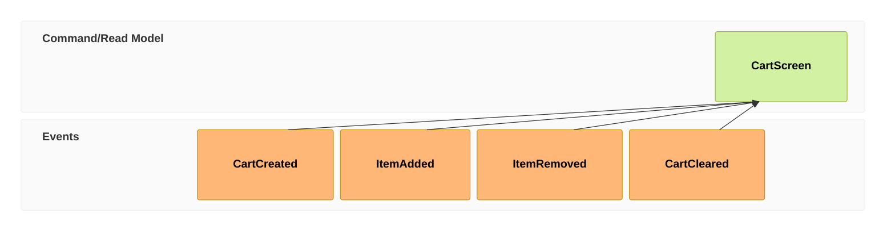
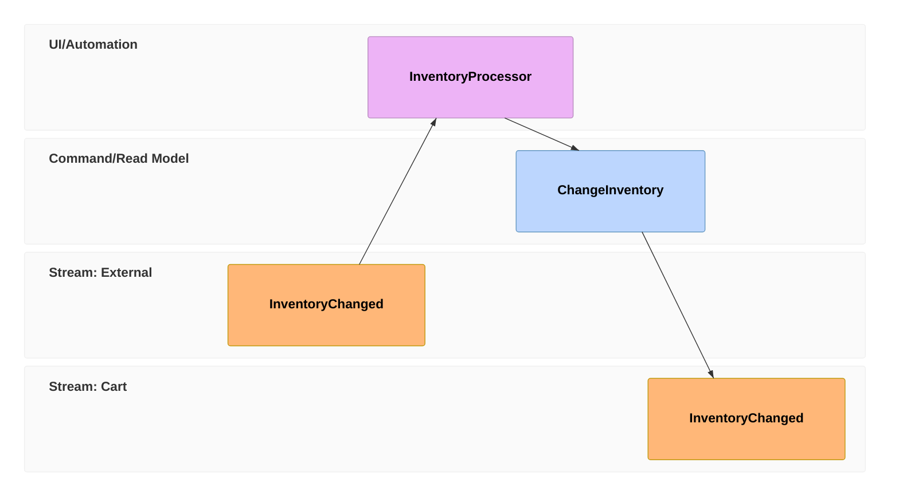
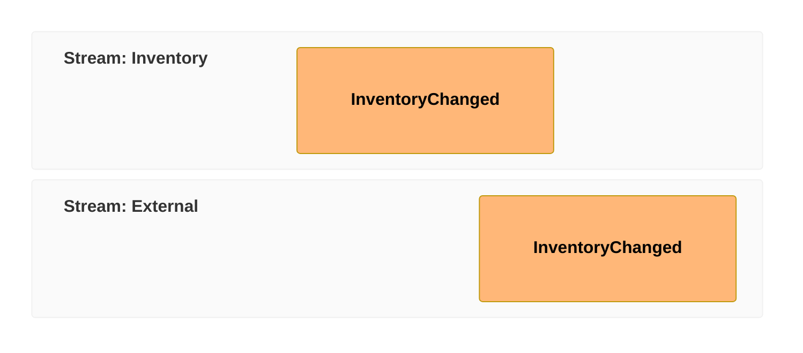

# Event Modeling Diagram (v<MERMAID_RELEASE_VERSION>+)

## Introduction

> **Event Modeling** (EM) is a method of describing systems using an example of how information has changed within them over time. Event Modeling specifically omits transient details and looks at what the information flow is and what the user sees at any particular point in time.

You can read more at [Event Modeling web page](https://eventmodeling.org/).

Event Modeling diagram is composed of a few main entities:

- Trigger - Screen and Processor
- Command
- View / Read Model
- Event

Entities are organized in swimlanes forming a timeline usually based on the following patterns:

- State View
- State Change
- Translation
- Automation

You can find more details in the [cheat sheet](https://eventmodeling.org/posts/event-modeling-cheatsheet/).

The purpose of the Domain Specific Language (DSL) supporting the drawing of the Event Modeling diagram is the rapid creation. Relations among the entities are inferred by default, so the distraction while you design is limited. Further detail to the entities can be added gradually.

The grammar for the DSL is also maintained in a [separate project](https://github.com/lgazo/event-modeling-dsl) with the intention to provide also different types of output, VS Code (and potentially other) IDEs, etc.

## Basic Syntax

The DSL supports two types of syntaxes - compact and relaxed one. Both will be mentioned in the examples and both can be used interchangeably.

### Timeline

The timeline is the key part of the diagram and it is composed of **Time Frame** definitions. Speedy Time Frame typing is the key of the compact notation. For compact notation you type the `tf` token. For the relaxed notation you type `timeframe` token.

```md
eventmodeling

tf 01 scn CartScreen
tf 02 cmd AddItem
tf 03 evt ItemAdded
```

rendering to


Each Time Frame is referenced by a **unique number** in order to distinguish one from another and also to be able to reference it when needed. Depending on the complexity of the diagram it should be enough to have just two digit number or more. Imagine you are typing a BASIC program on your ZX Spectrum always starting with a two digit number, but the order of the numbers does not matter, just the uniqueness in the whole timeline.

The Time Frame also contains an **Entity Identifier**, e.g. in case of `01` Time Frame it is `CartScreen`. One Entity Identifier can be used multiple times in the timeline for example when you want to express invocations of the same event in different points in time.

Relaxed notation would look like this:

```md
eventmodeling

timeframe 01 screen CartScreen
timeframe 02 command AddItem
timeframe 03 event ItemAdded
```

### Inline data

It is possible to provide data examples for individual Time Frames. An Inline Data is wrapped in curly brackets on the same line as the Time Frame.

Compact version:


Relaxed version:


### Data block

If you need to provide more complex data description, you can define the **Data Block** separately. Data Block is referenced from a Time Frame by providing the identifier inside of double-square brackets `[[identifier]]`, similar to wiki links convention in Markdown.

In case the same entity is repeated you need to uniquely identify the data blocks, therefore the Data Block identifier is suffixed with a number.

Compact version:


Relaxed version:


### Resetting the flow

By default the diagram builds the relations based on the inference. But modeling a more complex business flow requires to break such inference from time to time. For that you can use a different type of Time Frame called **Reset Frame**. It is represented by a `rf` / `resetframe` token.

Compact version:


Relaxed version:


### Multiple relations

There are situations where you need to specify multiple relations for an entity. For example when a **Read Model** is built of multiple **Events**. You can use `->>` token for that.



## Event Modeling patterns

This chapter briefly summarizes each Event Modeling pattern.

### State Change


### State View


### Translation



## Details of the Syntax

### Entity types

Entity type is determined by the third column in the Time Frame grammar.

Compact version:

```md
tf 01 pcr InventoryProcessor
```

Relaxed version:

```md
timeframe 01 processor InventoryProcessor
```

Entities are assigned to default swimlanes unless a **Namespace** is specified in the Entity Identifier.

There are the following types available:

- `scn` / `screen`: Screen - belongs to UI/Automation swimlane
- `pcr` / `processor`: Processor - belongs to UI/Automation swimlane
- `cmd` / `command`: Command - belongs to Command/Read Model swimlane
- `rmo` / `readmodel`: Read Model - belongs to Command/Read Model swimlane
- `evt` / `event`: Event - belongs to Events swimlane

### Swimlanes and Namespaces

There are three basic **Swimlanes** inferred from the Entity Type.

- UI/Automation
- Command/Read Model
- Events

As your diagram grows and you explore the depths of a particular software system, you want to categorize your Entities as well. In order to do that, you can use **Namespace** identifier as part of the Entity Identifier.

```md
Inventory.InventoryChanged
```

**Namespace** is the first part before the `.` of the Entity Identifier. Each combination of the Namespace and Entity type forms new Swimlane. The order how they are specified in the text definition specifies the order of the Swimlanes in the diagram.



### Data block data types

A **Data** is always wrapped in curly brackets. It can be prepended by a data type in backticks. The pattern applies for **Inline Data** as well as for **Data Block**.

```md
tf 01 rmo UserAdded `json`{ "name": "foo" }
```

or for Data Block

```md
data UserAdded01 `json`{
"name": "foo"
}
```

```warning
There is no special treatment in the diagram renderer at the moment for a specific data type.
```

Supported types are:

- `json`
- `jsobj`
- `figma`
- `salt`
- `uri`
- `md`
- `html`
- `text`
