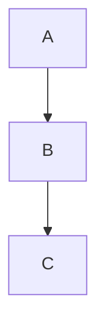
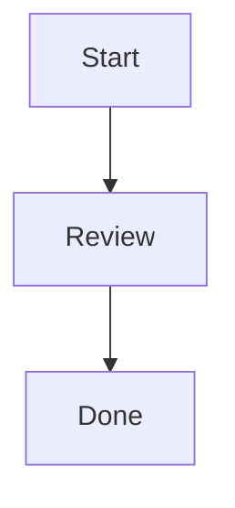
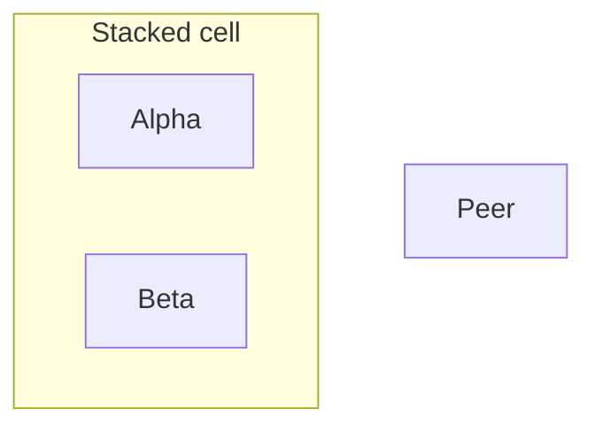

# Grid Layout

## Introduction

`layout: grid` is a built-in, opt-in layout for Mermaid diagrams that use the unified `LayoutData` renderer. Instead of letting the layout infer all structure from edge direction alone, you place nodes and subgraphs into logical rows and columns and Mermaid derives the final pixel geometry from measured content.

Grid layout is available to flowchart and agentflow through inline `@{ ... }` metadata, and to every unified renderer through `config.grid.placements`.

## Enable the layout

## Placement metadata

Flowchart and agentflow nodes and expanded subgraphs accept four grid-specific metadata keys:

- `row`
- `column`
- `horizontalAlign`
- `verticalAlign`

Coordinates are:

- one-based
- local to the direct parent group
- sparse but collapsed (rows `1` and `100` render as adjacent occupied tracks)

## Placement maps

Every unified renderer can use the global placement map:

The placement-map keys are the emitted node ids from the diagram database. Flowchart and agentflow ids are usually the ids you author directly. Other unified diagrams should use the ids produced by that diagram type.

## Automatic placement

If either coordinate is omitted, Mermaid fills it deterministically:

- explicit `(row, column)` cells are reserved first
- `row` only picks the first free column in that row
- `column` only picks the first free row in that column
- when both are omitted, Mermaid scans row-major using `grid.columns` if set, otherwise `ceil(sqrt(itemCount))`

Two or more direct siblings with the same explicit `(row, column)` share one cell as a vertical stack in declaration order.

## Alignment and stacking

- `horizontalAlign`: `left`, `center`, `right`
- `verticalAlign`: `top`, `center`, `bottom`

Horizontal alignment is per item. Vertical alignment is per explicit shared cell stack. If items in the same explicit cell resolve to different vertical alignments, Mermaid throws `GRID_CELL_ALIGNMENT_CONFLICT`.

## Nested groups

Groups are laid out recursively from the inside out. Child coordinates are always local to the immediate parent group; diagram direction (`TB`, `BT`, `LR`, `RL`) does not rotate or mirror the authored grid.

## Configuration

`grid` supports:

- `placements`
- `columns`
- `rowGap`
- `columnGap`
- `cellGap`
- `containerPadding`
- `titleGap`
- `horizontalAlign`
- `verticalAlign`
- `curve`
- `edgeCornerRadius`

See the generated configuration reference for the exact schema and defaults.

## Edge curves

Grid edges use `rounded` rendering by default. Set `grid.curve` to any Mermaid
flowchart curve style, including `basis`, `cardinal`, `catmullRom`, `step`, or
`rounded`.

`edgeCornerRadius` controls the corner radius for `rounded` edges. It is ignored
by other curve styles, and each corner is automatically limited by the adjacent
segment lengths.

Curves other than `linear` and `rounded` interpolate between the obstacle-aware
route points and can move away from the calculated orthogonal corridor.

## Current limits

Grid layout does **not** support:

- row or column spanning
- alternate in-cell layouts beyond vertical stacking
- track-level row/column alignment declarations
- manual absolute coordinates or manual edge waypoints
