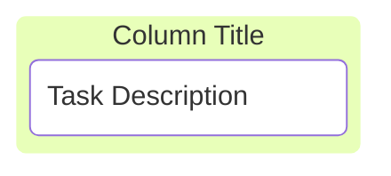
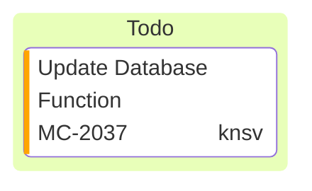
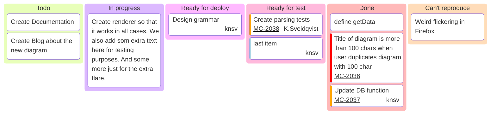

# Mermaid Kanban Diagram Documentation

Mermaid’s Kanban diagram allows you to create visual representations of tasks moving through different stages of a workflow. This guide explains how to use the Kanban diagram syntax, based on the provided example.

## Overview

A Kanban diagram in Mermaid starts with the kanban keyword, followed by the definition of columns (stages) and tasks within those columns.



## Defining Columns

Columns represent the different stages in your workflow, such as “Todo,” “In Progress,” “Done,” etc. Each column is defined using a unique identifier and a title enclosed in square brackets.

**Syntax:**

```
columnId[Column Title]
```

- columnId: A unique identifier for the column.
- [Column Title]: The title displayed on the column header.

Like this `id1[Todo]`

## Adding Tasks to Columns

Tasks are listed under their respective columns with an indentation. Each task also has a unique identifier and a description enclosed in square brackets.

**Syntax:**

```
taskId[Task Description]
```

    •	taskId: A unique identifier for the task.
    •	[Task Description]: The description of the task.

**Example:**

```
docs[Create Documentation]
```

## Adding Metadata to Tasks

You can include additional metadata for each task using the @{ ... } syntax. Metadata can contain key-value pairs like assigned, ticket, priority, etc. This will be rendered added to the rendering of the node.

## Supported Metadata Keys

    •	assigned: Specifies who is responsible for the task.
    •	ticket: Links the task to a ticket or issue number.
    •	priority: Indicates the urgency of the task. Allowed values: 'Very High', 'High', 'Low' and 'Very Low'



## Configuration Options

You can customize the Kanban diagram using a configuration block at the beginning of your markdown file. This is useful for setting global settings like a base URL for tickets. Currently there is one configuration option for kanban diagrams `ticketBaseUrl`. This can be set as in the the following example:

```yaml
---
config:
  kanban:
    ticketBaseUrl: 'https://yourproject.atlassian.net/browse/#TICKET#'
---
```

When the kanban item has an assigned ticket number the ticket number in the diagram will have a link to an external system where the ticket is defined. The `ticketBaseUrl` sets the base URL to the external system and #TICKET# is replaced with the ticket value from task metadata to create a valid link.

## Full Example

Below is the full Kanban diagram based on the provided example:



In conclusion, creating a Kanban diagram in Mermaid is a straightforward process that effectively visualizes your workflow. Start by using the kanban keyword to initiate the diagram. Define your columns with unique identifiers and titles to represent different stages of your project. Under each column, list your tasks—also with unique identifiers—and provide detailed descriptions as needed. Remember that proper indentation is crucial; tasks must be indented under their parent columns to maintain the correct structure.

You can enhance your diagram by adding optional metadata to tasks using the @{ ... } syntax, which allows you to include additional context such as assignee, ticket numbers, and priority levels. For further customization, utilize the configuration block at the top of your file to set global options like ticketBaseUrl for linking tickets directly from your diagram.

By adhering to these guidelines—ensuring unique identifiers, proper indentation, and utilizing metadata and configuration options—you can create a comprehensive and customized Kanban board that effectively maps out your project’s workflow using Mermaid.
