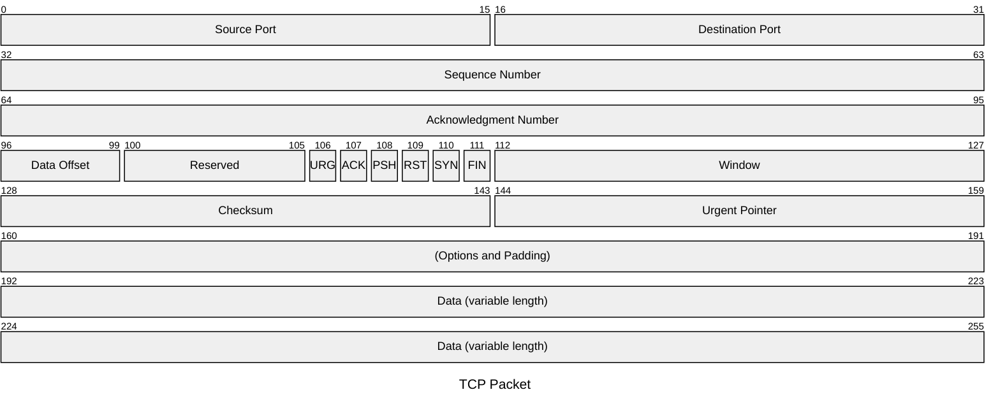
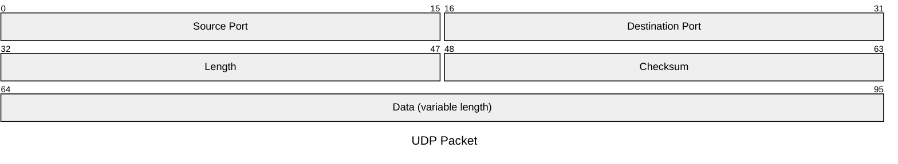
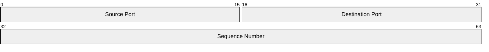

# Packet Diagram (v11.0.0+)

## Introduction

A packet diagram is a visual representation used to illustrate the structure and contents of a network packet. Network packets are the fundamental units of data transferred over a network.

## Usage

This diagram type is particularly useful for developers, network engineers, educators, and students who require a clear and concise way to represent the structure of network packets.

## Syntax

```md
packet-beta
start: "Block name" %% Single-bit block
start-end: "Block name" %% Multi-bit blocks
... More Fields ...
```

## Examples





## Details of Syntax

- **Ranges**: Each line after the title represents a different field in the packet. The range (e.g., `0-15`) indicates the bit positions in the packet.
- **Field Description**: A brief description of what the field represents, enclosed in quotes.

## Configuration

Please refer to the [configuration](/config/schema-docs/config-defs-packet-diagram-config.html) guide for details.

<!--

Theme variables are not currently working due to a mermaid bug. The passed values are not being propagated into styles function.

## Theme Variables

| Property         | Description                | Default Value |
| ---------------- | -------------------------- | ------------- |
| byteFontSize     | Font size of the bytes     | '10px'        |
| startByteColor   | Color of the starting byte | 'black'       |
| endByteColor     | Color of the ending byte   | 'black'       |
| labelColor       | Color of the labels        | 'black'       |
| labelFontSize    | Font size of the labels    | '12px'        |
| titleColor       | Color of the title         | 'black'       |
| titleFontSize    | Font size of the title     | '14px'        |
| blockStrokeColor | Color of the block stroke  | 'black'       |
| blockStrokeWidth | Width of the block stroke  | '1'           |
| blockFillColor   | Fill color of the block    | '#efefef'     |

## Example on config and theme



-->
